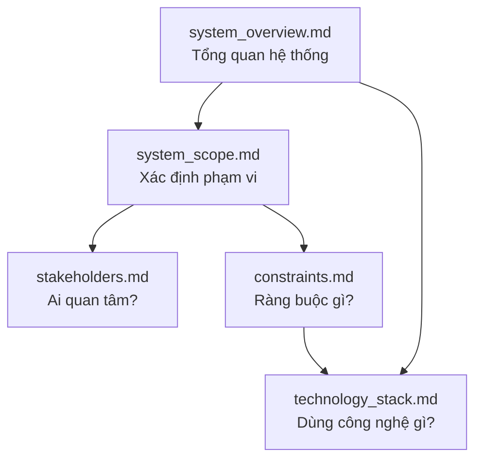

# Tài Liệu Tổng Hợp - Đặc Tả Module Quản Lý Bài Báo Khoa Học

## 📚 Mục Đích Folder Này

Folder `01_System_Specification` chứa **đặc tả chi tiết** cho module quản lý bài báo khoa học của giảng viên trong trường đại học.

---

## 🎯 Phạm Vi Đồ Án

```
┌──────────────────────────────────────────────────────┐
│  CHỈ quản lý: BÀI BÁO KHOA HỌC                      │
│  CHỈ cho: GIẢNG VIÊN                                 │
│  CHỈ trong: 1 TRƯỜNG ĐẠI HỌC                        │
└──────────────────────────────────────────────────────┘
```

**Không bao gồm**: Sách, Sáng chế, Phần mềm, Thiết bị kỹ thuật... (xem đầy đủ tại [folder 00](../00_Problem_Context/README.md))

---

## 📑 Danh Sách Tài Liệu

### 🆕 0. [glossary.md](./glossary.md)
**Bảng thuật ngữ** (MỚI thêm - Khắc phục terminology inconsistency)
- Phân biệt: **Tài khoản** (Account) vs **Vai trò** (Role) vs **Quyền hạn** (Permission)
- Giải thích cơ chế **Account-Based Approval** (Phê duyệt theo tài khoản chung)
- Định nghĩa các thuật ngữ nghiệp vụ: Publication, Workflow, State, Reporting
- **Rất khuyến khích đọc trước** để tránh nhầm lẫn khi đọc tài liệu khác

---

### 1. [system_overview.md](./system_overview.md)
**Tổng quan hệ thống**
- Tên hệ thống: University Faculty Publication Management System (UFPMS)
- Vấn đề giải quyết: Quản lý phân tán, báo cáo thủ công, khó tra cứu, thiếu quy trình phê duyệt
- Mục đích: Quản lý tập trung bài báo, quy trình phê duyệt 2 cấp, tạo báo cáo nhanh, profile giảng viên
- **6 module chính**: Quản lý bài báo, Tìm kiếm, Profile, Báo cáo, Admin, **Approval Workflow**
- Tiêu chí thành công: 80% giảng viên sử dụng, giảm thời gian báo cáo từ 3 ngày → 30 phút
- **Dual-Mode System**: Private (Internal workflow) + Public (Portfolio công khai)

---

### 2. [system_scope.md](./system_scope.md)
**Phạm vi và ranh giới**
- ✅ TRONG phạm vi: CRUD bài báo, tìm kiếm, profile, báo cáo, phân quyền, **quy trình phê duyệt 2 cấp (Khoa → Trường)**
- ❌ NGOÀI phạm vi: Quản lý đề tài, peer review khoa học, thanh toán APC, các loại công trình khác
- Ranh giới dữ liệu: Metadata bài báo, PDF, lịch sử xét duyệt (owned) vs Thông tin giảng viên (integrated)
- Ranh giới người dùng: Giảng viên, CB Khoa, CB Trường, Admin, Viewer (primary) vs Cán bộ tài chính (non-user)
- Ranh giới thời gian: MVP 3 tháng, Phase 2 sau 6 tháng, Phase 3 tương lai

---

### 3. [stakeholders.md](./stakeholders.md)
**Các bên liên quan**
- **Primary**: Giảng viên (300-500), **Cán bộ Khoa (10-20)**, **Cán bộ Trường (2-5)**, Lãnh đạo (10-20)
- **Secondary**: Sinh viên (5K-20K), Phòng HR, Phòng IT
- **External**: Cộng đồng nghiên cứu, Cơ quan kiểm định (AUN-QA), Bộ GD&ĐT
- **Roles**: 5 vai trò (SuperAdmin, Researcher, Faculty Reviewer, University Reviewer, Viewer)
- Ma trận phân tích: Mức độ quan tâm × Mức độ ảnh hưởng
- Kế hoạch giao tiếp: Tần suất, phương thức, nội dung cho từng nhóm
- Quản lý rủi ro: Kháng cự thay đổi, mất cam kết, quá tải

---

### 4. [constraints.md](./constraints.md)
**Ràng buộc và giả định**

**Ràng buộc:**
- Pháp lý: Bảo vệ dữ liệu cá nhân (Nghị định 13/2023), Quyền tác giả
- Kỹ thuật: Tương thích Windows Server, AD/LDAP; < 3s tải trang; 100 users đồng thời
- Tài nguyên: Ngân sách < 100tr phát triển, < 30tr/năm vận hành; 1-2 dev; 3 tháng MVP
- Dữ liệu: Import Excel cũ, file PDF < 10MB
- Trình duyệt: Chrome 90+, Firefox 88+, Edge 90+, Safari 14+

**Giả định:**
- Giảng viên biết dùng Word/Excel, có Internet ổn định
- 80% nhập liệu trung thực, workflow phê duyệt 2 cấp kiểm soát chất lượng
- Quy trình phê duyệt đã được lãnh đạo phê chuẩn, thời gian xét duyệt: 3-7 ngày/cấp
- Lãnh đạo cam kết, Phòng IT hỗ trợ
- Có AD/LDAP sẵn, backup tự động hàng ngày

**Rủi ro:** Internet không ổn định, lãnh đạo mất cam kết, Phòng IT từ chối hỗ trợ

---

### 5. [technology_stack.md](./technology_stack.md)
**Công nghệ và kiến trúc**

**Quyết định chính:**
- Frontend: **React 18 + TypeScript + Material-UI**
- Backend: **Java Spring Boot 3.x** - Phổ biến nhất tại VN, ecosystem mạnh
- Database: **MySQL 8.0+** - Dễ setup, mã nguồn mở, phổ biến
- Storage: **Local File System** (MVP) với khả năng mở rộng lên Cloud
- Auth: **LDAP/AD + JWT** (Spring Security)

**Lý do chọn:**
- Java Spring Boot: Phổ biến nhất VN, dễ tuyển nhân lực, ecosystem JVM mạnh mẽ, documentation đầy đủ
- MySQL: Free, ACID compliance, dễ bảo trì, community support mạnh tại VN
- Local File System: Đơn giản cho MVP, đủ dùng < 10,000 files, không phí phát sinh
- React: Ecosystem lớn, dễ tìm developer

**Phương án thay thế:**
- Backend: ASP.NET Core (C#), NestJS (Node.js)
- Database: PostgreSQL, SQL Server
- Storage: Cloud (AWS S3, Azure Blob), MinIO (S3-compatible)

**DevOps:** Docker, GitHub Actions, Prometheus + Grafana

---

## 🔗 Mối Quan Hệ Giữa Các Tài Liệu



**Thứ tự đọc khuyến nghị:**
1. `system_overview.md` - Hiểu tổng quan
2. `system_scope.md` - Biết làm gì, không làm gì
3. `stakeholders.md` - Biết phục vụ ai
4. `constraints.md` - Biết hạn chế là gì
5. `technology_stack.md` - Biết xây dựng như thế nào

---

## ✅ Checklist Hoàn Thiện

- [x] **system_overview.md** - Hoàn thiện cho scope hẹp
- [x] **system_ scope.md** - Định nghĩa rõ IN/OUT boundaries
- [x] **stakeholders.md** - Tập trung vào university stakeholders
- [x] **constraints.md** - Ràng buộc thực tế (not national legal framework)
- [x] **technology_stack.md** - Quyết định công nghệ với lý do rõ ràng
- [x] **README.md** (file này) - Tóm tắt và hướng dẫn

---

## 🚀 Bước Tiếp Theo

Sau khi hoàn thiện `01_System_Specification`, chuyển sang:

**📁 02_System_Clarification**
- Business process (As-Is vs To-Be)
- Context diagram
- User analysis

**📁 03_Requirements**
- Functional requirements chi tiết
- Non-functional requirements
- ~~Research output catalog~~ (đã có trong folder 00, không cần lặp lại)

**📁 04_User_Stories**
- User stories cho Giảng viên
- User stories cho Admin
- User stories cho Viewer

**📁 05_Use_Cases**
- High-level use case diagram
- Detailed use case specifications
- Sequence diagrams

---

## 📌 Lưu Ý Quan Trọng

> ⚠️ **Phạm vi đã thu hẹp**: Tất cả tài liệu trong folder này chỉ nói về **bài báo khoa học**, không còn 7 nhóm công trình như trong [folder 00](../00_Problem_Context/README.md).

> ✅ **Nếu muốn hiểu toàn cảnh**: Đọc [folder 00/README.md](../00_Problem_Context/README.md) trước để thấy module này nằm ở đâu trong big picture.

> 🎯 **Mục tiêu**: Xây dựng module **nhỏ nhưng CHẤT LƯỢNG**, có thể mở rộng sau.

---

*Cập nhật lần cuối: 10/02/2026 20:54*
*Phiên bản: v2.0 - Đã tích hợp Approval Workflow + Technology Stack finalized*
