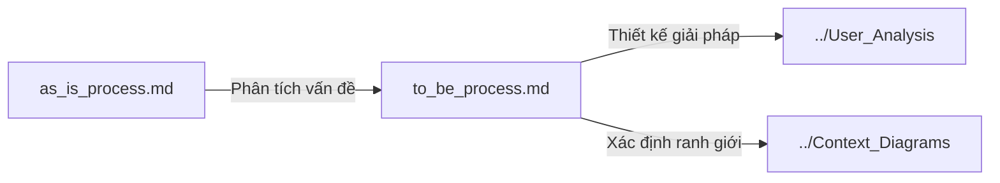

# Business Context - README

> 📁 **Folder**: `02_System_Clarification/Business_Context`  
> 📅 **Cập nhật**: 10/02/2026  
> 🎯 **Mục đích**: Phân tích bối cảnh nghiệp vụ, so sánh quy trình hiện tại và tương lai

---

## 📚 Tài Liệu Trong Folder Này

### 1. [as_is_process.md](./as_is_process.md) - Quy Trình Hiện Tại

**Nội dung chính**:
- Quy trình quản lý bài báo **TRƯỚC KHI** có hệ thống UFPMS
- Phân tích 4 giai đoạn: Tự quản lý → Thu thập → Báo cáo → Công bố (hạn chế)
- Pain points của từng stakeholder
- Metrics baseline để so sánh

**Vấn đề cốt lõi**:
- ❌ Dữ liệu phân tán (300-500 file riêng lẻ)
- ❌ Không có quy trình phê duyệt chính thức
- ❌ Báo cáo mất 2-3 ngày
- ❌ Không có public access

---

### 2. [to_be_process.md](./to_be_process.md) - Quy Trình Tương Lai

**Nội dung chính**:
- Quy trình **SAU KHI** triển khai hệ thống UFPMS
- **Quy trình phê duyệt 2 cấp**: Khoa → Trường
- **State Machine** với 9 trạng thái
- Sequence diagrams cho từng workflow
- Metrics kỳ vọng sau 6 tháng

**Cải thiện chính**:
- ✅ Thời gian báo cáo: 2-3 ngày → **5 phút** (giảm 99%)
- ✅ Tỷ lệ trùng lặp: 15-20% → **0%**
- ✅ Profile công khai cho 100% giảng viên
- ✅ Quy trình phê duyệt minh bạch với audit trail

---

## 🔗 Mối Quan Hệ Giữa Các Tài Liệu



**Thứ tự đọc khuyến nghị**:
1. `as_is_process.md` - Hiểu vấn đề hiện tại
2. `to_be_process.md` - Hiểu giải pháp đề xuất

---

## 📊 So Sánh Nhanh As-Is vs To-Be

| Khía cạnh | As-Is | To-Be | Cải thiện |
|-----------|-------|-------|-----------|
| **Lưu trữ** | 300-500 file riêng lẻ | 1 DB tập trung | ⭐⭐⭐⭐⭐ |
| **Phê duyệt** | Không có | 2 cấp (Khoa → Trường) | ⭐⭐⭐⭐⭐ |
| **Báo cáo** | 2-3 ngày | Vài phút | ⭐⭐⭐⭐⭐ |
| **Cập nhật** | 6 tháng/lần | Thời gian thực | ⭐⭐⭐⭐⭐ |
| **Public** | Không có | Profile + Search | ⭐⭐⭐⭐⭐ |

---

## 🎯 Điểm Nổi Bật của To-Be Process

### 1. Dual-Mode System

**Private Mode** (Nội bộ):
- Workflow phê duyệt: DRAFT → SUBMITTED → FACULTY_REVIEWING → FACULTY_APPROVED → UNIVERSITY_REVIEWING → PUBLISHED
- Chỉ giảng viên, CB Khoa, CB Trường, Admin nhìn thấy

**Public Mode** (Công khai):
- CHỈ công trình với trạng thái **PUBLISHED**
- Ai cũng có thể tìm kiếm, xem

---

### 2. State Machine với 9 Trạng Thái

```
DRAFT → SUBMITTED → FACULTY_REVIEWING
         ↓                    ↓
   (có thể sửa)      FACULTY_APPROVED / REVISION_REQUIRED / FACULTY_REJECTED
                              ↓
                     UNIVERSITY_REVIEWING
                              ↓
                PUBLISHED / UNIVERSITY_REJECTED
```

✅ **Audit Trail**: Lưu đầy đủ người duyệt, thời gian, nhận xét  
✅ **Thông báo tự động**: Email khi chuyển trạng thái  
✅ **Dashboard theo vai trò**: Mỗi role có view riêng

---

### 3. Quy Trình Phê Duyệt 2 Cấp

**Cấp 1: Khoa (Faculty Review)**
- Xét duyệt về mặt học thuật
- Kiểm tra DOI, ISSN, chất lượng tạp chí
- Có thể yêu cầu bổ sung (REVISION_REQUIRED)

**Cấp 2: Trường (University Review)**
- Phê duyệt cuối cùng
- Xem xét ý kiến của Khoa
- Quyết định công bố công khai

**Lợi ích**:
- ✅ Kiểm soát chất lượng 2 lớp
- ✅ Minh bạch, có lịch sử
- ✅ Giảm tải cho cấp Trường (Khoa đã lọc sơ bộ)

---

## 🚀 Bước Tiếp Theo

Sau khi hiểu rõ As-Is và To-Be, chuyển sang:

1. **[User Analysis](../User_Analysis/)** - Phân tích nhu cầu 5 nhóm người dùng
2. **[Context Diagrams](../Context_Diagrams/)** - Sơ đồ ranh giới hệ thống

---

## 📌 Lưu Ý Quan Trọng

> ⚠️ **Scope của đồ án**: CHỈ quản lý **bài báo khoa học**, không bao gồm sách, sáng chế, phần mềm...  
> Xem đầy đủ 7 nhóm công trình tại [folder 00](../../00_Problem_Context/README.md)

> ✅ **Quyết định then chốt**: Quy trình phê duyệt 2 cấp là yêu cầu BẮT BUỘC, không phải optional

---

*Xem thêm*:
- [System Overview](../../01_System_Specification/system_overview.md) - Tổng quan hệ thống
- [Stakeholders](../../01_System_Specification/stakeholders.md) - Các bên liên quan
