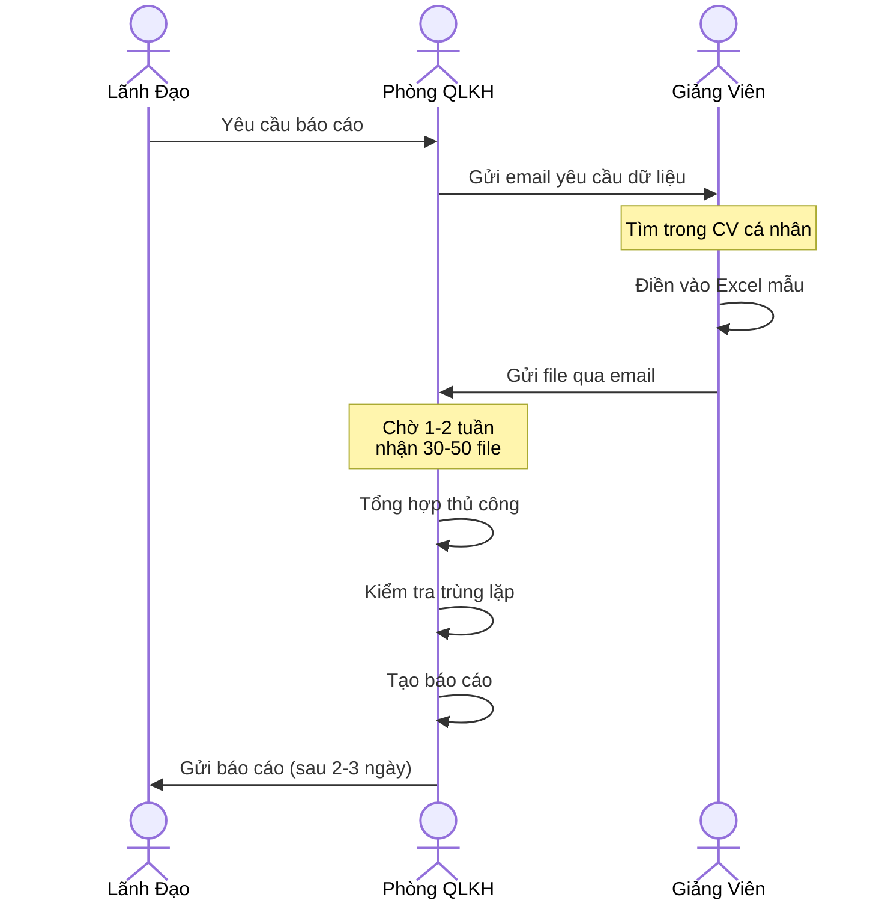
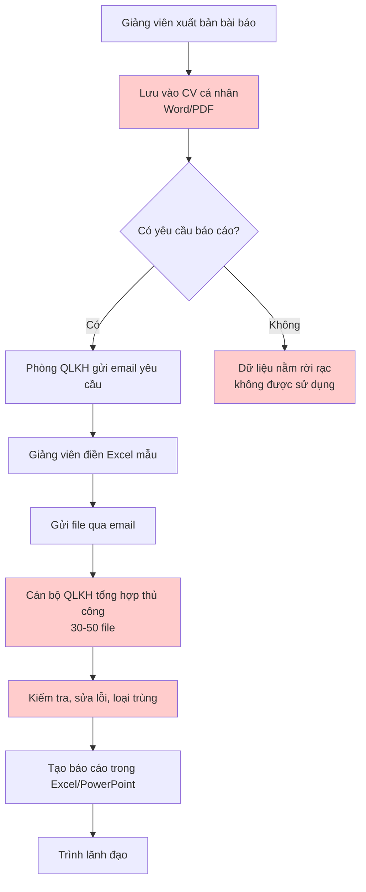

# Quy Trình Hiện Tại (As-Is Process) - Quản Lý Bài Báo Khoa Học

> 📅 **Cập nhật**: 10/02/2026  
> 🎯 **Mục đích**: Phân tích quy trình quản lý bài báo khoa học **TRƯỚC KHI** triển khai hệ thống UFPMS

---

## 1. Tổng Quan Quy Trình Hiện Tại

### 1.1. Đặc Điểm Chính

❌ **Phân tán và thủ công**
- Mỗi giảng viên tự quản lý CV/danh sách công trình riêng
- Phòng QLKH sử dụng file Excel phân tán theo từng khoa
- Không có hệ thống tập trung

❌ **Thiếu quy trình phê duyệt chính thức**
- Giảng viên tự khai báo, ít kiểm chứng
- Không có xét duyệt từ Khoa hoặc Trường
- Dễ sai sót, trùng lặp, hoặc thiếu minh bạch

❌ **Báo cáo tốn thời gian**
- Thu thập dữ liệu từ giảng viên mỗi kỳ
- Nhập liệu lại nhiều lần
- Thời gian tạo báo cáo: **2-3 ngày/báo cáo**

---

## 2. Các Giai Đoạn Trong Quy Trình Hiện Tại

### 2.1. Giai Đoạn 1: Giảng Viên Tự Quản Lý

**Người thực hiện**: Giảng viên

**Công cụ**: File Word, Excel cá nhân

**Quy trình**:

```
1. Giảng viên xuất bản bài báo
   ↓
2. Lưu thông tin vào file CV cá nhân (Word/PDF)
   ↓
3. Cập nhật danh sách bài báo trong Excel riêng (nếu có)
   ↓
4. Lưu file PDF bài báo trong thư mục cá nhân
```

**Vấn đề**:
- ❌ Không có chuẩn format thống nhất
- ❌ Thông tin không đồng bộ giữa các file
- ❌ Dễ quên cập nhật
- ❌ Khó tìm kiếm khi cần

---

### 2.2. Giai Đoạn 2: Thu Thập Dữ Liệu Định Kỳ

**Người thực hiện**: Phòng QLKH

**Tần suất**: Mỗi kỳ (6 tháng) hoặc khi có yêu cầu báo cáo

**Quy trình**:

```
1. Phòng QLKH gửi email yêu cầu cung cấp danh sách bài báo
   ↓
2. Giảng viên điền vào file Excel mẫu
   ↓
3. Gửi lại file Excel qua email
   ↓
4. Cán bộ QLKH tổng hợp từ 30-50 file Excel khác nhau
   ↓
5. Kiểm tra, sửa lỗi, loại bỏ trùng lặp (thủ công)
   ↓
6. Nhập vào file Excel tổng hợp của Phòng
```

**Vấn đề**:
- ❌ Mất thời gian chờ giảng viên phản hồi
- ❌ Một số giảng viên không gửi hoặc gửi sai format
- ❌ Dữ liệu không cập nhật liên tục (chỉ 6 tháng/lần)
- ❌ Công việc tổng hợp rất tốn thời gian

**Biểu Đồ Hoạt Động**:



---

### 2.3. Giai Đoạn 3: Tạo Báo Cáo Thống Kê

**Người thực hiện**: Cán bộ Phòng QLKH

**Công cụ**: Excel, PowerPoint

**Quy trình**:

```
1. Mở file Excel tổng hợp
   ↓
2. Lọc, sắp xếp thủ công theo yêu cầu
   ↓
3. Tạo pivot table, biểu đồ
   ↓
4. Copy/paste vào PowerPoint hoặc Word
   ↓
5. Trình lãnh đạo
```

**Thời gian ước tính**: 2-3 ngày/báo cáo

**Vấn đề**:
- ❌ Không linh hoạt (mỗi yêu cầu mới phải làm lại từ đầu)
- ❌ Dễ sai sót khi lọc và tính toán thủ công
- ❌ Không có biểu đồ động, phải vẽ lại mỗi kỳ
- ❌ Khó so sánh theo thời gian (dữ liệu cũ nằm nhiều file khác nhau)

---

### 2.4. Giai Đoạn 4: Công Bố Thông Tin (Rất Hạn Chế)

**Hiện trạng**:

❌ **Không có profile công khai**
- Thông tin giảng viên chỉ có CV đơn giản trên website khoa
- Danh sách bài báo (nếu có) không được cập nhật

❌ **Sinh viên khó tìm kiếm**
- Không có công cụ tìm kiếm giảng viên theo lĩnh vực
- Phải hỏi trực tiếp hoặc hỏi qua bạn bè

❌ **Cộng đồng nghiên cứu không biết**
- Không có cổng thông tin nghiên cứu tập trung
- Giảng viên phải tự quảng bá trên Google Scholar, ORCID

---

## 3. Sơ Đồ Tổng Quan Quy Trình As-Is



**Chú thích màu sắc**:
- 🔴 Đỏ nhạt: Các bước có vấn đề, tốn thời gian

---

## 4. Phân Tích Vấn Đề Chính

### 4.1. Vấn Đề Về Dữ Liệu

| Vấn đề | Mô tả | Hậu quả |
|--------|-------|---------|
| **Phân tán** | Dữ liệu nằm rời rạc ở 300-500 file cá nhân | Khó tổng hợp, thống kê |
| **Không đồng bộ** | Cập nhật chỉ 6 tháng/lần | Dữ liệu lỗi thời |
| **Trùng lặp** | Nhiều giảng viên cùng khai báo 1 bài (đồng tác giả) | Thống kê sai |
| **Thiếu kiểm chứng** | Không có xác minh DOI, ISSN | Dữ liệu kém chất lượng |

---

### 4.2. Vấn Đề Về Quy Trình

| Vấn đề | Tác động |
|--------|----------|
| **Không có workflow phê duyệt** | Dữ liệu không được kiểm chứng, dễ gian lận hoặc nhầm lẫn |
| **Thủ công 100%** | Tốn 2-3 ngày/báo cáo, dễ sai sót |
| **Không có audit trail** | Không biết ai sửa gì, khi nào |
| **Không có thông báo tự động** | Phải nhắc giảng viên nhiều lần |

---

### 4.3. Vấn Đề Về Khả Năng Tiếp Cận

| Vấn đề | Hậu quả |
|--------|---------|
| **Sinh viên không biết giảng viên nghiên cứu gì** | Khó tìm người hướng dẫn phù hợp |
| **Cộng đồng không biết trường có năng lực gì** | Giảm uy tín, mất cơ hội hợp tác |
| **Giảng viên không có profile đẹp** | Không tăng được uy tín cá nhân |

---

## 5. Điểm Đau (Pain Points) Của Từng Stakeholder

### 5.1. Giảng Viên

> 💬 *"Mỗi 6 tháng lại phải tìm lại danh sách bài báo, rất mất thời gian!"*

> 💬 *"Tôi có ORCID rồi, tại sao phải nhập lại ở đây?"*

> 💬 *"Không ai biết tôi đang nghiên cứu gì, sinh viên không tìm thấy tôi."*

**Pain points**:
- ❌ Nhập liệu lặp lại nhiều lần
- ❌ Không có profile công khai để khẳng định năng lực
- ❌ Không biết công trình của mình có được ghi nhận hay không

---

### 5.2. Phòng QLKH

> 💬 *"Mỗi lần làm báo cáo là cả một đợt khủng hoảng!"*

> 💬 *"Người này gửi Excel, người kia gửi Word, ai cũng format khác nhau."*

> 💬 *"Nhiều giảng viên cùng khai một bài, tôi phải kiểm tra thủ công từng dòng."*

**Pain points**:
- ❌ Mất 2-3 ngày chỉ để tổng hợp dữ liệu
- ❌ Phải nhắc nhở giảng viên nhiều lần
- ❌ Dữ liệu không đồng nhất, khó kiểm tra

---

### 5.3. Lãnh Đạo

> 💬 *"Tôi cần biết ngay số lượng bài Q1 năm nay, nhưng phải chờ 3 ngày mới có báo cáo."*

> 💬 *"Không có dữ liệu theo dõi xu hướng nghiên cứu của trường."*

**Pain points**:
- ❌ Không có dashboard thời gian thực
- ❌ Khó ra quyết định vì thiếu dữ liệu

---

### 5.4. Sinh Viên

> 💬 *"Tôi muốn tìm thầy chuyên về AI nhưng không biết tìm ở đâu."*

> 💬 *"Website chỉ có CV cũ, không biết thầy có còn nghiên cứu không."*

**Pain points**:
- ❌ Không có công cụ tìm kiếm giảng viên theo lĩnh vực
- ❌ Thông tin không cập nhật

---

## 6. Metrics Hiện Tại (Baseline để So Sánh)

| Chỉ số | Giá trị hiện tại | Ghi chú |
|--------|------------------|---------|
| **Thời gian tạo báo cáo** | 2-3 ngày | Từ lúc yêu cầu đến khi có báo cáo |
| **Tần suất cập nhật dữ liệu** | 6 tháng/lần | Chỉ khi có yêu cầu báo cáo |
| **Tỉ lệ giảng viên phản hồi đúng hạn** | ~60% | Phải nhắc nhiều lần |
| **Tỉ lệ dữ liệu trùng lặp** | ~15-20% | Đồng tác giả khai báo nhiều lần |
| **Thời gian tìm kiếm 1 bài báo cũ** | 10-15 phút | Phải mở nhiều file Excel |
| **Số báo cáo định kỳ/năm** | 4-6 báo cáo | Mất 8-18 ngày công/năm |

---

## 7. Kết Luận

### 7.1. Vấn Đề Cốt Lõi

1. **Không có hệ thống tập trung** → Dữ liệu phân tán, khó quản lý
2. **Không có quy trình phê duyệt** → Dữ liệu thiếu minh bạch, kiểm soát chất lượng kém
3. **Quy trình thủ công 100%** → Mất thời gian, dễ sai sót
4. **Không có public access** → Giảng viên, sinh viên, cộng đồng không được hưởng lợi

---

### 7.2. Nhu Cầu Cấp Thiết

✅ **Hệ thống quản lý tập trung**
- Một nguồn dữ liệu chính (Single Source of Truth)
- Cập nhật liên tục, không phải 6 tháng/lần

✅ **Quy trình phê duyệt 2 cấp**
- Khoa xét duyệt → Trường phê duyệt
- Kiểm soát chất lượng, minh bạch

✅ **Tự động hóa báo cáo**
- Dashboard thời gian thực
- Export báo cáo trong vài phút

✅ **Portfolio công khai**
- Profile giảng viên chuyên nghiệp
- Công cụ tìm kiếm cho sinh viên, cộng đồng

---

**Tài liệu liên quan**:
- [To-Be Process](./to_be_process.md) - Quy trình sau khi triển khai hệ thống
- [System Overview](../../01_System_Specification/system_overview.md) - Giải pháp đề xuất
