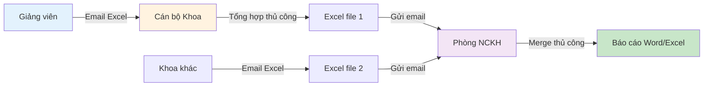

# Problem Statement

> 📋 **Document**: Problem Statement cho UFPMS  
> 📅 **Created**: 11/02/2026  
> 🎯 **Purpose**: Định nghĩa rõ ràng vấn đề cần giải quyết

---

## 🎯 Executive Summary

**Vấn đề chính**: Trường Đại học hiện không có **hệ thống quản lý tập trung** cho các công trình nghiên cứu khoa học của giảng viên, dẫn đến:
- ❌ Dữ liệu phân tán, khó quản lý
- ❌ Thiếu quy trình phê duyệt chính thức
- ❌ Mất nhiều thời gian tạo báo cáo
- ❌ Giảng viên thiếu portfolio công khai chuyên nghiệp

**Giải pháp đề xuất**: Xây dựng **University Faculty Publication Management System (UFPMS)** - hệ thống quản lý bài báo khoa học với:
- ✅ Database tập trung
- ✅ Quy trình phê duyệt 2 cấp (Khoa → Trường)
- ✅ Báo cáo tự động
- ✅ Portfolio công khai cho giảng viên

---

## 📊 Bối Cảnh (Context)

### Tình Hình Hiện Tại

Trường Đại học có **300-500 giảng viên** tích cực nghiên cứu và công bố bài báo khoa học. Mỗi năm có khoảng:
- 📚 **~200-300 bài báo** (Journal + Conference)
- 📖 **~50-100 Book Chapters**
- 📝 **~100-150 công trình khác**

**Tổng**: ~350-550 công trình/năm

### Quy Trình Hiện Tại (As-Is)

**Đặc điểm**:
- 📊 Mỗi Khoa có 1 file Excel riêng
- 📧 Trao đổi qua email
- ✋ Tổng hợp thủ công (Phòng NCKH)
- ⏱️ Mất **2-3 ngày** để tạo báo cáo toàn trường

---

## ❌ Pain Points (Vấn Đề)

### 1. Dữ Liệu Phân Tán & Khó Quản Lý

**Hiện trạng**:
- 📁 **300-500 files Excel** phân tán (1 file/giảng viên hoặc 1 file/Khoa)
- 🔍 Khó tìm kiếm: "Giảng viên X có bao nhiêu bài báo năm 2023?"
- 🔄 Trùng lặp: ~15-20% công trình bị nhập 2 lần (giảng viên chuyển Khoa, co-author,...)

**Impact**:
- ⏱️ Mất 30-60 phút tìm thông tin
- ❌ Dữ liệu không nhất quán
- 💾 Lưu trữ không hiệu quả

---

### 2. Thiếu Quy Trình Phê Duyệt Chính Thức

**Hiện trạng**:
- ❌ Không có workflow phê duyệt
- ❌ Không biết công trình đã xác thực hay chưa
- ❌ Thiếu audit trail

**Impact**:
- 🚨 Rủi ro: Công trình không chính xác được công bố
- 🤔 Tin cậy: Không chắc chắn về tính xác thực
- 📜 Minh bạch: Không theo dõi được ai phê duyệt, khi nào

---

### 3. Tạo Báo Cáo Mất Nhiều Thời Gian

**Hiện trạng**:
- ⏱️ **2-3 ngày** để tạo báo cáo toàn trường (merge Excel, pivot, chart)
- 📊 Cán bộ phải:
  1. Thu thập Excel từ các Khoa
  2. Kiểm tra format
  3. Merge data (copy/paste thủ công)
  4. Tạo pivot tables
  5. Tạo charts
  6. Viết báo cáo Word

**Impact**:
- ⏰ Deadline: Khó đáp ứng báo cáo khẩn cấp
- 😰 Stress: Cán bộ làm việc intense 2-3 ngày
- ❌ Lỗi: Copy/paste thủ công dễ sai

---

### 4. Giảng Viên Thiếu Portfolio Công Khai

**Hiện trạng**:
- ❌ Không có trang cá nhân chuyên nghiệp
- ❌ Sinh viên/công chúng không biết giảng viên nghiên cứu gì
- ❌ Giảng viên phải tự tạo CV (không nhất quán)

**Impact**:
- 📉 Uy tín: Giảng viên không được "showcase" công trình
- 🔍 SEO: Website trường thiếu nội dung về research
- 🎓 Sinh viên: Khó chọn GVHD phù hợp

---

### 5. Khó Hợp Tác & Trao Đổi

**Hiện trạng**:
- 📧 Email Excel qua lại nhiều lần (revision)
- ❓ Không rõ version nào mới nhất
- 🔄 Giảng viên chỉnh sửa → gửi lại → Khoa merge lại

**Impact**:
- ⏱️ Lãng phí thời gian communication
- 🤯 Confusion: "File nào là final?"
- 📬 Email overload

---

## 🎯 Goals & Objectives (Mục Tiêu)

### Business Goals

| Goal | Baseline | Target (6 tháng) | Measurement |
|------|----------|------------------|-------------|
| **Giảm thời gian báo cáo** | 2-3 ngày | < 5 phút | Time tracking |
| **Tăng adoption rate** | ~60% (bị động) | > 80% (chủ động) | User analytics |
| **Giảm trùng lặp** | ~15-20% | ~0% | System auto-detect |
| **Độ hài lòng người dùng** | N/A | > 85% | Survey (NPS) |
| **Public visibility** | 0 profiles | 300-500 profiles | Public page count |

---

### User Goals

**Researcher (Giảng viên)**:
- ✅ Nhập bài báo nhanh (< 5 phút)
- ✅ Theo dõi trạng thái phê duyệt
- ✅ Có portfolio công khai tự động
- ✅ Export CV dễ dàng

**Faculty Reviewer (Cán bộ Khoa)**:
- ✅ Review tập trung tại 1 nơi
- ✅ Approve/Reject với comments
- ✅ Tạo báo cáo Khoa tức thì

**University Reviewer (Phòng NCKH)**:
- ✅ Tổng hợp tự động
- ✅ Báo cáo real-time
- ✅ Export báo cáo (PDF/Excel)

**Public Visitor (Sinh viên, Công chúng)**:
- ✅ Tìm kiếm bài báo dễ dàng
- ✅ Xem profile giảng viên
- ✅ Filter theo năm, lĩnh vực

---

## ✅ Success Criteria (Tiêu Chí Thành Công)

### MVP Success (Sau 3 Tháng)

Hệ thống được coi là **thành công** nếu:

1. ✅ **Functional**:
   - [ ] Researcher tạo được publication (< 5 phút/bài)
   - [ ] Workflow 2 cấp hoạt động (DRAFT → PUBLISHED)
   - [ ] Generate báo cáo tự động (< 5 phút)
   - [ ] Public profile hiển thị đúng (chỉ PUBLISHED)

2. ✅ **Adoption**:
   - [ ] > 50% giảng viên đã nhập ít nhất 1 bài báo
   - [ ] > 80% giảng viên hài lòng (survey)

3. ✅ **Performance**:
   - [ ] Thời gian báo cáo giảm từ 2-3 ngày → < 5 phút (99% improvement)
   - [ ] Trùng lặp giảm từ 15-20% → < 5%

---

### Long-term Success (Sau 12 Tháng)

1. ✅ **Adoption**:
   - [ ] > 90% giảng viên active users
   - [ ] Hệ thống thay thế hoàn toàn Excel

2. ✅ **ROI**:
   - [ ] Tiết kiệm ~40 giờ/tháng (cán bộ không làm báo cáo thủ công)
   - [ ] Tăng 30% lượng truy cập website (SEO từ profiles)

3. ✅ **Quality**:
   - [ ] 100% công trình đã xác thực (qua workflow)
   - [ ] 0% trùng lặp

---

## 🚫 Out of Scope (Ngoài Phạm Vi MVP)

**Không làm trong Phase 1**:
- ❌ Quản lý 7 nhóm công trình (chỉ làm bài báo khoa học)
- ❌ Integration với ORCID/Scopus (P2)
- ❌ Citation tracking (P2)
- ❌ Peer collaboration features (P2)
- ❌ Mobile app (P2)
- ❌ Advanced analytics/BI (P2)

---

## 📊 ROI Analysis

### Cost Savings

**Hiện tại (yearly)**:
- Cán bộ Khoa: 12 người × 8 giờ/tháng × 12 tháng = **1,152 giờ/năm**
- Phòng NCKH: 2 người × 16 giờ/tháng × 12 tháng = **384 giờ/năm**
- **Tổng**: 1,536 giờ/năm

**Với UFPMS**:
- Automation giảm 90% công việc thủ công
- **Tiết kiệm**: ~1,382 giờ/năm (~173 ngày công)

**Giá trị**: 1,382 giờ × lương trung bình = Tiết kiệm đáng kể

---

### Intangible Benefits

- ✅ **Uy tín**: Public profiles tăng visibility
- ✅ **Minh bạch**: Quy trình phê duyệt rõ ràng
- ✅ **Data quality**: Dữ liệu chính xác, không trùng lặp
- ✅ **Morale**: Giảng viên tự hào showcase công trình

---

## 🎯 Proposed Solution Summary

**UFPMS** là **web-based system** với:

1. **Dual-Mode**:
   - **Private**: Internal workflow (LDAP auth)
   - **Public**: Portfolio (no auth, SEO-friendly)

2. **Core Features**:
   - 📝 Publication management (CRUD)
   - 🔄 2-tier approval workflow (9 states)
   - 📊 Auto reporting (real-time)
   - 👤 Public researcher profiles

3. **Tech Stack**:
   - Backend: Java Spring Boot 3.x
   - Database: MySQL 8.0+
   - Frontend: React 18 + TypeScript
   - Auth: LDAP/AD + JWT

4. **Timeline**: 3 tháng (MVP)

---

## 📚 Related Documents

- [As-Is Process Analysis](./as_is_process.md) - Chi tiết quy trình hiện tại
- [To-Be Process Design](./to_be_process.md) - Quy trình tương lai với UFPMS
- [User Groups](../User_Analysis/user_groups.md) - 5 nhóm người dùng
- [User Needs](../User_Analysis/user_needs.md) - Nhu cầu chi tiết

---

**Created**: 11/02/2026  
**Status**: ✅ Final
