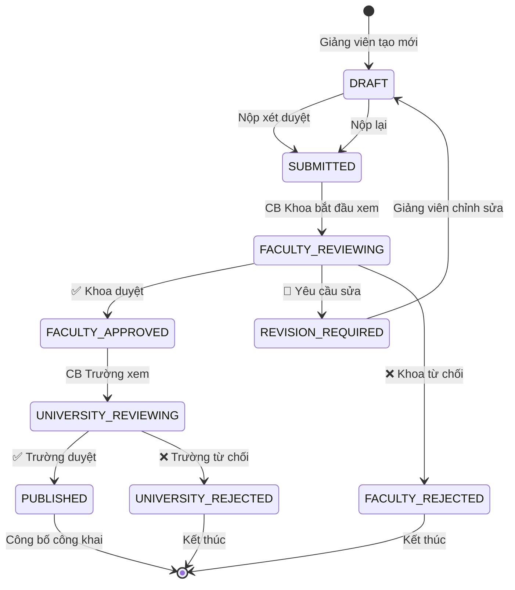
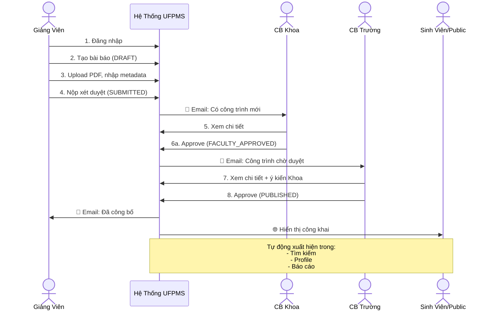
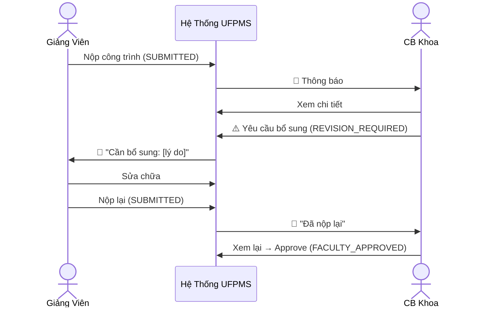

# Quy Trình Mục Tiêu (To-Be Process) - Hệ Thống UFPMS

> 📅 **Cập nhật**: 10/02/2026  
> 🎯 **Mục đích**: Mô tả quy trình quản lý bài báo khoa học **SAU KHI** triển khai hệ thống UFPMS với quy trình phê duyệt 2 cấp

---

## 1. Tổng Quan Quy Trình Mới

### 1.1. Đặc Điểm Chính

✅ **Tập trung và tự động hóa**
- Một hệ thống duy nhất cho toàn trường
- Dữ liệu được cập nhật liên tục, thời gian thực
- Báo cáo tự động trong vài phút

✅ **Quy trình phê duyệt 2 cấp chính thức** (sử dụng **tài khoản phê duyệt theo đơn vị**)
- **Trưởng đơn vị đăng nhập vào tài khoản Khoa** → Xét duyệt cấp Khoa
- **Cán bộ Phòng QLKH đăng nhập vào tài khoản Trường** → Phê duyệt cấp Trường + **Tính giờ làm**
- State machine với 9 trạng thái rõ ràng
- Audit trail đầy đủ (ghi lại tài khoản, IP, thời gian)

✅ **Dual-Mode: Private + Public**
- **Private Mode**: Workflow nội bộ (nộp, xét duyệt)
- **Public Mode**: Portfolio công khai (chỉ công trình đã duyệt)

---

## 2. Các Giai Đoạn Trong Quy Trình To-Be

### 2.1. Giai Đoạn 1: Giảng Viên Tạo và Nộp Công Trình

**Công cụ**: UFPMS Web App

**Quy trình**:

```
1. Đăng nhập hệ thống (SSO qua LDAP/AD)
   ↓
2. Tạo bài báo mới → Trạng thái: DRAFT
   - Nhập metadata: Tiêu đề, tác giả, tạp chí, DOI, ISSN...
   - Upload file PDF
   - Gắn tag từ khóa, lĩnh vực
   ↓
3. Lưu nháp (có thể sửa nhiều lần)
   ↓
4. Kiểm tra đầy đủ → Nhấn "Nộp xét duyệt"
   ↓
5. Trạng thái chuyển: DRAFT → SUBMITTED
   ↓
6. Hệ thống gửi email thông báo cho Cán bộ Khoa
```

**Thời gian ước tính**: 5-10 phút/bài báo

**Lợi ích**:
- ✅ Nhập 1 lần, dùng mãi mãi (không phải nhập lại)
- ✅ Tự động gợi ý từ DOI, ORCID
- ✅ Upload PDF ngay lập tức, không mất file
- ✅ Biết ngay trạng thái xét duyệt

---

### 2.2. Giai Đoạn 2: Xét Duyệt Cấp Khoa

**Người thực hiện**: Trưởng đơn vị/Người được ủy quyền (sử dụng **tài khoản phê duyệt của Khoa**)

**Công cụ**: Dashboard "Chờ xét duyệt cấp Khoa"

**Cơ chế mới**: Mỗi Khoa/Viện có **một tài khoản phê duyệt chung**
- Trưởng Khoa/Phó Khoa đăng nhập vào tài khoản này để duyệt bài
- Khi thay đổi nhân sự: Người cũ chuyển giao → Người mới đổi mật khẩu
- Hệ thống ghi lại tài khoản nào truy cập, IP, thời gian

**Quy trình**:

```
1. Nhận email thông báo có công trình mới
   ↓
2. **Đăng nhập vào tài khoản phê duyệt của Khoa**
   - Username: dept_cs_approval (ví dụ cho Khoa CNTT)
   - Hệ thống ghi lại: ai đăng nhập, IP, thời gian
   ↓
3. Vào dashboard "Chờ xét duyệt"
   ↓
4. Xem danh sách công trình của Khoa mình
   - Trạng thái: SUBMITTED hoặc FACULTY_REVIEWING
   ↓
5. Mở chi tiết công trình:
   - Xem metadata
   - Tải PDF về đọc
   - Kiểm tra DOI, ISSN
   ↓
6. Quyết định:
   ├─ APPROVE → Trạng thái: FACULTY_APPROVED
   ├─ REVISION → Trạng thái: REVISION_REQUIRED (yêu cầu sửa)
   └─ REJECT → Trạng thái: FACULTY_REJECTED
   ↓
7. Nhập nhận xét (bắt buộc nếu Revision/Reject)
   ↓
8. Hệ thống:
   - Lưu audit log: Tài khoản Khoa XX, thời gian, quyết định
   - Gửi email thông báo cho giảng viên
```

**Thời gian ước tính**: 10-15 phút/công trình

**Lợi ích**:
- ✅ Xem tất cả công trình của Khoa ở một chỗ
- ✅ Lọc, sắp xếp theo thời gian nộp, loại tạp chí
- ✅ Duyệt hàng loạt nếu cần
- ✅ Lịch sử xét duyệt được lưu tự động
- ✅ **Chuyển giao tài khoản dễ dàng**: Chỉ cần đổi mật khẩu khi thay nhân sự

---

### 2.3. Giai Đoạn 3: Giảng Viên Xử Lý Phản Hồi (Nếu Cần)

**Trường hợp**: Khoa yêu cầu bổ sung (REVISION_REQUIRED)

**Quy trình**:

```  
1. Nhận email: "Công trình cần bổ sung"
   ↓
2. Đăng nhập → Xem nhận xét của CB Khoa
   ↓
3. Chỉnh sửa công trình (upload lại PDF, sửa metadata...)
   ↓
4. Nhấn "Nộp lại" → Trạng thái: REVISION_REQUIRED → SUBMITTED
   ↓
5. CB Khoa xét duyệt lại
```

**Thời gian phản hồi**: Tùy yêu cầu (1-3 ngày)

---

### 2.4. Giai Đoạn 4: Phê Duyệt Cấp Trường + Tính Giờ Làm

**Người thực hiện**: Cán bộ Phòng QLKH (sử dụng **tài khoản phê duyệt cấp Trường**)

**Công cụ**: Dashboard "Chờ phê duyệt cấp Trường"

**Cơ chế mới**: Trường có **một tài khoản phê duyệt duy nhất**
- Cán bộ Phòng QLKH (hoặc người được ủy quyền) đăng nhập để duyệt
- Khi thay đổi nhân sự: Chuyển giao tài khoản, đổi mật khẩu

**Quy trình**:

```
1. Tự động nhận các công trình đã được Khoa duyệt
   - Trạng thái: FACULTY_APPROVED
   ↓
2. **Đăng nhập vào tài khoản phê duyệt cấp Trường**
   - Username: university_approval
   - Hệ thống ghi lại: ai đăng nhập, IP, thời gian
   ↓
3. Dashboard "Chờ phê duyệt Trường"
   ↓
4. Xem chi tiết công trình:
   - Metadata
   - Nhận xét của Cán bộ Khoa
   - File PDF
   ↓
5. Quyết định cuối cùng:
   ├─ APPROVE → Trạng thái: UNIVERSITY_APPROVED = PUBLISHED
   └─ REJECT → Trạng thái: UNIVERSITY_REJECTED
   ↓
6. Nhập nhận xét (bắt buộc nếu Reject)
   ↓
7. **Nếu APPROVE → Người duyệt nhập giờ làm**:
   - Nhập số giờ làm/giờ dạy cho bài báo này (thủ công)
   - Hệ thống lưu vào bảng work_hour_conversions
   - Cập nhật tổng giờ làm trong năm của giảng viên
   - Thông báo cho giảng viên qua email
   ↓
8. Công bố công khai:
   - Xuất hiện trong module Tìm kiếm
   - Xuất hiện trong Profile giảng viên
   - Được tính trong báo cáo thống kê
```

**Thời gian ước tính**: 5-10 phút/công trình (đã được Khoa lọc sơ bộ)

**Lợi ích mới**:
- ✅ **Nhập giờ làm ngay khi phê duyệt** - Tập trung, không quên
- ✅ Giảng viên thấy ngay giờ làm đã được ghi nhận  
- ✅ Dashboard theo dõi tổng giờ làm trong năm
- ✅ Linh hoạt theo chính sách của nhà trường

---

### 2.5. Giai Đoạn 5: Công Bố Công Khai

**Tự động khi có trạng thái PUBLISHED**

**Hiển thị ở đâu?**

1. **Module Tìm kiếm công khai**
   - Mọi người (kể cả không đăng nhập) có thể tìm kiếm
   - Tìm theo: Tiêu đề, tác giả, từ khóa, năm

2. **Profile giảng viên**
   - Trang cá nhân công khai
   - URL: `https://ufpms.university.edu.vn/profile/[username]`
   - Hiển thị: Danh sách bài báo, biểu đồ năng suất, lĩnh vực chuyên môn

3. **Báo cáo và thống kê**
   - Dashboard công khai: Số lượng bài báo theo năm, theo khoa
   - Top giảng viên có năng suất cao nhất

**Lợi ích**:
- ✅ Sinh viên tìm kiếm giảng viên dễ dàng
- ✅ Cộng đồng nghiên cứu biết về năng lực của trường
- ✅ Giảng viên có profile chuyên nghiệp

---

### 2.6. Giai Đoạn 6: Tạo Báo Cáo Tự Động

**Người thực hiện**: Phòng QLKH, Lãnh đạo

**Công cụ**: Module Báo cáo & Dashboard

**Quy trình**:

```
1. Đăng nhập → Vào Module "Báo cáo"
   ↓
2. Chọn loại báo cáo:
   - Báo cáo theo đơn vị (Khoa/Viện)
   - Báo cáo theo loại tạp chí (Q1/Q2/Q3/Q4)
   - Xu hướng theo năm
   - Top giảng viên
   ↓
3. Chọn bộ lọc (năm, khoa, loại tạp chí...)
   ↓
4. Nhấn "Xuất báo cáo"
   ↓
5. Tải file Excel/PDF ngay lập tức
```

**Thời gian**: **Vài giây đến vài phút** (thay vì 2-3 ngày)

**Lợi ích**:
- ✅ Báo cáo bất cứ lúc nào, không phải chờ
- ✅ Dữ liệu luôn cập nhật
- ✅ Có thể tạo nhiều loại báo cáo khác nhau
- ✅ Dashboard thời gian thực cho lãnh đạo

---

## 3. Sơ Đồ State Machine - Luồng Trạng Thái



---

## 4. Sơ Đồ Sequence - Quy Trình End-to-End



**Trường hợp có yêu cầu sửa**:



---

## 5. So Sánh As-Is vs To-Be

| Tiêu chí | As-Is (Hiện tại) | To-Be (Tương lai) | Cải thiện |
|----------|------------------|-------------------|-----------|
| **Lưu trữ dữ liệu** | 300-500 file Word/Excel riêng lẻ | 1 database tập trung | ⭐⭐⭐⭐⭐ |
| **Quy trình phê duyệt** | Không có | 2 cấp (Khoa → Trường) | ⭐⭐⭐⭐⭐ |
| **Thời gian tạo báo cáo** | 2-3 ngày | Vài phút | ⭐⭐⭐⭐⭐ |
| **Tần suất cập nhật** | 6 tháng/lần | Thời gian thực | ⭐⭐⭐⭐⭐ |
| **Trùng lặp dữ liệu** | ~15-20% | 0% (kiểm tra tự động) | ⭐⭐⭐⭐ |
| **Public access** | Không có | Profile + tìm kiếm | ⭐⭐⭐⭐⭐ |
| **Audit trail** | Không có | Có đầy đủ | ⭐⭐⭐⭐⭐ |
| **Thông báo** | Email thủ công, nhiều lần | Tự động | ⭐⭐⭐⭐ |

---

## 6. Lợi Ích Cho Từng Stakeholder

### 6.1. Giảng Viên

✅ **Tiết kiệm thời gian**
- Nhập 1 lần, không phải nhập lại mỗi kỳ
- Thời gian nhập: 5-10 phút/bài (vs 15-30 phút trước đây)

✅ **Profile chuyên nghiệp**
- Trang cá nhân công khai, URL riêng
- Tự động cập nhật, luôn mới nhất

✅ **Minh bạch**
- Biết rõ trạng thái xét duyệt
- Nhận phản hồi kịp thời

✅ **Xem giờ làm đã chuyển đổi qua Dashboard**
- Dashboard hiển thị tổng giờ làm trong năm hiện tại
- Chi tiết giờ làm từng bài báo đã được duyệt
- Theo dõi tiến độ KPI
- Xuất báo cáo giờ làm cá nhân

---

### 6.2. Cán Bộ Khoa

✅ **Dashboard tập trung**
- Xem tất cả công trình của Khoa ở một chỗ
- Lọc, sắp xếp dễ dàng

✅ **Xét duyệt nhanh**
- Thông tin đầy đủ, chuẩn hóa
- Có thể duyệt hàng loạt

✅ **Lịch sử rõ ràng**
- Biết ai duyệt gì, khi nào
- Audit trail đầy đủ

---

### 6.3. Cán Bộ Trường / Phòng QLKH

✅ **Báo cáo tự động**
- Từ 2-3 ngày → vài phút
- Có thể tạo nhiều loại báo cáo khác nhau

✅ **Kiểm soát chất lượng**
- Công trình đã được Khoa xét duyệt sơ bộ
- Thống kê chính xác, không trùng lặp

✅ **Tính giờ làm tự động**
- Không cần nhập thủ công
- Chính xác theo quy định

✅ **Dashboard quản trị**
- Theo dõi toàn trường
- Phân tích xu hướng

---

### 6.4. Lãnh Đạo

✅ **Dashboard thời gian thực**
- Biết ngay năng suất nghiên cứu hiện tại
- So sánh giữa các khoa

✅ **Hỗ trợ ra quyết định**
- Dữ liệu để xây dựng chính sách khuyến khích
- Đánh giá hiệu quả của chính sách

---

### 6.5. Sinh Viên

✅ **Tìm kiếm dễ dàng**
- Tìm giảng viên theo lĩnh vực nghiên cứu
- Xem danh sách bài báo mới nhất

✅ **Chọn người hướng dẫn phù hợp**
- Biết thầy/cô chuyên về gì
- Xem bài báo để hiểu hướng nghiên cứu

---

## 7. Metrics Kỳ Vọng (Sau 6 Tháng Triển Khai)

| Chỉ số | As-Is | To-Be | Cải thiện |
|--------|-------|-------|-----------|
| **Thời gian tạo báo cáo** | 2-3 ngày | 5-10 phút | **Giảm 99%** |
| **Tần suất cập nhật** | 6 tháng/lần | Liên tục | **∞** |
| **Tỉ lệ giảng viên tham gia** | ~60% (khi có yêu cầu) | ~80% (chủ động) | **+33%** |
| **Tỉ lệ dữ liệu trùng lặp** | ~15-20% | ~0% | **-100%** |
| **Số báo cáo định kỳ/năm** | 4-6 (mất 8-18 ngày công) | 10-20 (mất 2-4 giờ) | **Gấp 3 lần** |
| **Thời gian tìm 1 bài báo** | 10-15 phút | Vài giây | **Giảm 99%** |
| **Độ hài lòng người dùng** | Chưa có số liệu | \u003e 85% | **Mới** |

---

## 8. Kế Hoạch Triển Khai

### Phase 1: MVP (Tháng 1-3)

✅ **Module cơ bản**
- Quản lý bài báo (CRUD)
- Quy trình phê duyệt 2 cấp
- Báo cáo cơ bản

✅ **Pilot**
- 1-2 Khoa thử nghiệm
- 30-50 giảng viên

---

### Phase 2: Mở rộng (Tháng 4-6)

✅ **Toàn trường**
- Triển khai cho tất cả Khoa
- Đào tạo toàn bộ giảng viên

✅ **Tính năng nâng cao**
- Profile công khai
- Public search
- Dashboard nâng cao

---

### Phase 3: Tối ưu (Tháng 7-12)

✅ **Tích hợp**
- ORCID auto-import
- Google Scholar sync
- DOI auto-fetch metadata

✅ **AI/ML**
- Gợi ý đồng nghiệp hợp tác
- Phát hiện bài báo trùng lặp

---

## 9. Rủi Ro và Biện Pháp Giảm Thiểu

| Rủi ro | Mức độ | Biện pháp |
|--------|--------|-----------|
| **Giảng viên không sử dụng** | CAO | - Training kỹ - Khuyến khích early adopters\u003cbr\u003e- Làm rõ lợi ích |
| **Dữ liệu cũ khó nhập** | TRUNG BÌNH | - Import từ Excel - Cho phép nhập dần |
| **Phòng IT không hỗ trợ** | TRUNG BÌNH | - Tham vấn từ đầu - Hệ thống dễ vận hành |
| **Lãnh đạo mất quan tâm** | THẤP | - Demo thường xuyên - Báo cáo ROI |

---

## 10. Kết Luận

### 10.1. Điểm Khác Biệt Chính

| Khía cạnh | As-Is | To-Be |
|-----------|-------|-------|
| **Cách tiếp cận** | Phân tán, thủ công | Tập trung, tự động |
| **Kiểm soát** | Không có quy trình phê duyệt | Quy trình 2 cấp chính thức |
| **Tốc độ** | 2-3 ngày/báo cáo | Vài phút |
| **Minh bạch** | Không có audit trail | Lưu đầy đủ lịch sử |
| **Công khai** | Không có | Profile + Search |

---

### 10.2. Giá Trị Cốt Lõi

✅ **Tiết kiệm thời gian**: Từ ngày → phút  
✅ **Tăng chất lượng**: Quy trình phê duyệt 2 cấp  
✅ **Tăng minh bạch**: Audit trail đầy đủ  
✅ **Tăng tác động**: Portfolio công khai, SEO  

---

**Tài liệu liên quan**:
- [As-Is Process](./as_is_process.md) - Quy trình hiện tại
- [System Scope](../../01_System_Specification/system_scope.md) - Phạm vi hệ thống
- [State Machine](../../01_System_Specification/system_overview.md#workflow-state-machine) - Chi tiết 9 trạng thái
