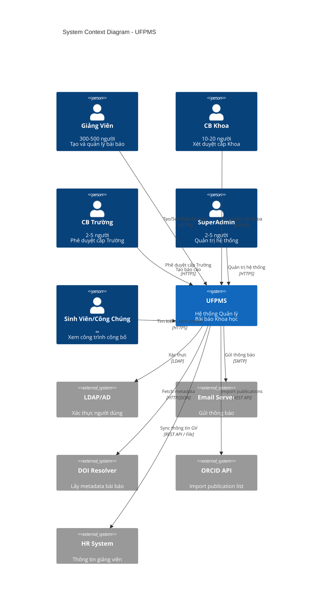
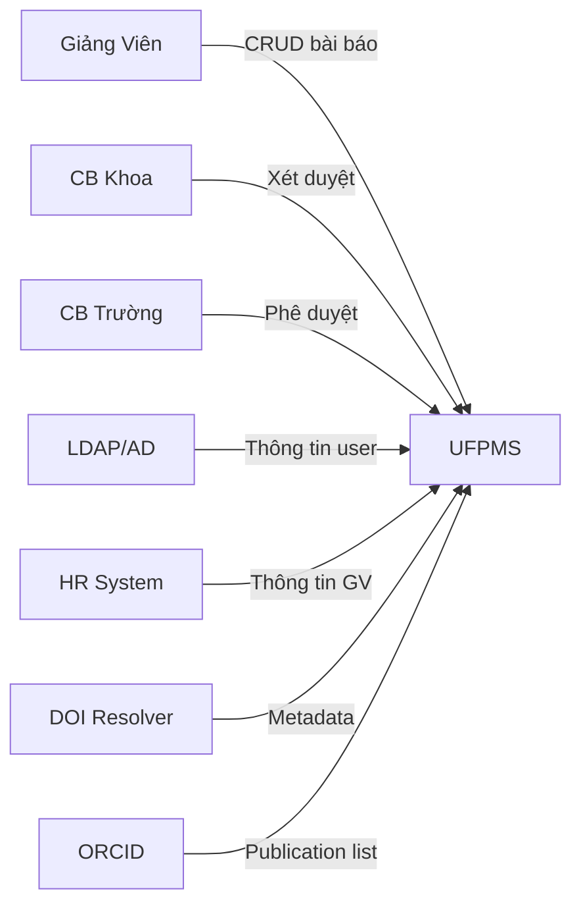
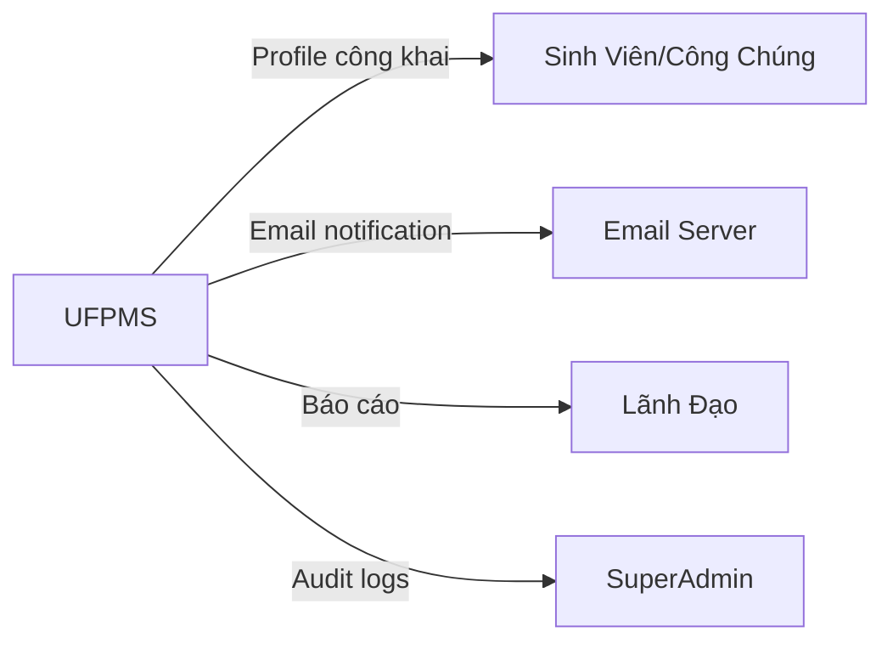
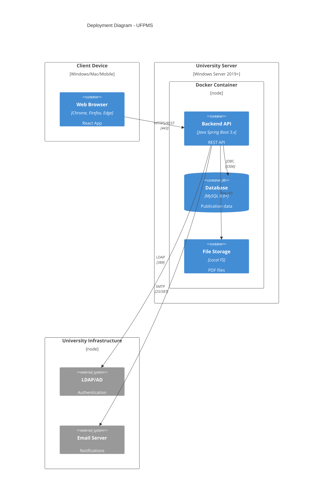
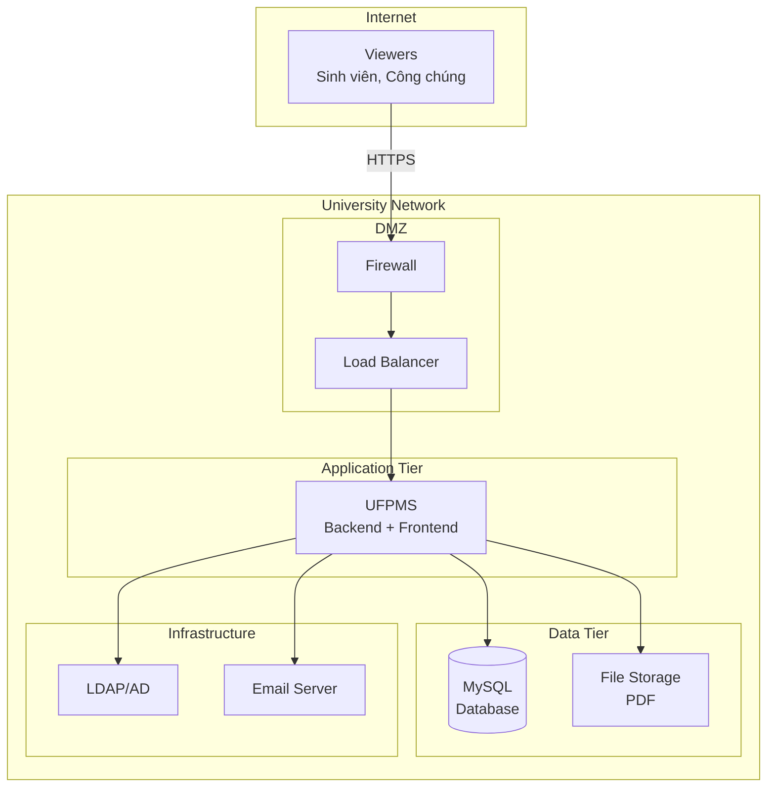

# Context Diagrams - README

> 📁 **Folder**: `02_System_Clarification/Context_Diagrams`  
> 📅 **Cập nhật**: 10/02/2026  
> 🎯 **Mục đích**: Sơ đồ ngữ cảnh hệ thống (System Context Diagram)

---

## 📐 Sơ Đồ Ngữ Cảnh (Context Diagram)

### 1. Mục Đích

Context Diagram giúp:
- ✅ Xác định ranh giới hệ thống (System Boundary)
- ✅ Hiểu rõ ai/cái gì tương tác với hệ thống  
- ✅ Phân biệt IN SCOPE vs OUT OF SCOPE

---

### 2. System Context Diagram



---

### 3. Actors (Người Dùng & Hệ Thống Bên Ngoài)

#### 3.1. Internal Users (Người Dùng Nội Bộ)

| Actor | Role | Số lượng | Tương tác chính |
|-------|------|----------|-----------------|
| **Giảng Viên** | Researcher | 300-500 | Tạo/Sửa/Nộp bài báo |
| **CB Khoa** | Faculty Reviewer | 10-20 | Xét duyệt cấp Khoa |
| **CB Trường** | University Reviewer | 2-5 | Phê duyệt, báo cáo |
| **SuperAdmin** | System Admin | 2-5 | Quản trị hệ thống |

#### 3.2. External Users (Người Dùng Bên Ngoài)

| Actor | Mô tả | Số lượng | Tương tác chính |
|-------|-------|----------|-----------------|
| **Sinh Viên** | Viewer | ∞ | Tìm kiếm, xem profile |
| **Công Chúng** | Viewer | ∞ | Xem công trình công bố |

#### 3.3. External Systems (Hệ Thống Bên Ngoài)

| System | Mục đích | Protocol | Giai đoạn |
|--------|----------|----------|-----------|
| **LDAP/AD** | Xác thực SSO | LDAP | MVP |
| **Email Server** | Gửi thông báo | SMTP | MVP |
| **DOI Resolver** | Lấy metadata từ DOI | HTTP/JSON | Phase 2 |
| **ORCID API** | Import publication list | REST API | Phase 2 |
| **HR System** | Sync thông tin giảng viên | REST/File | MVP |

---

### 4. Data Flows (Luồng Dữ Liệu)

#### 4.1. Inbound (Vào Hệ Thống)



#### 4.2. Outbound (Ra Khỏi Hệ Thống)



---

### 5. System Boundary (Ranh Giới Hệ Thống)

#### 5.1. Trong Ranh Giới (In Scope)

✅ **Owned by UFPMS**:
- Database bài báo (metadata + file PDF)
- Quy trình phê duyệt 2 cấp
- Dashboard theo vai trò
- Báo cáo và thống kê
- Profile công khai
- Audit trail

---

#### 5.2. Ngoài Ranh Giới nhưng Tích Hợp (External but Integrated)

🔗 **Integrated Systems**:
- LDAP/AD (xác thực)
- Email Server (thông báo)
- HR System (thông tin giảng viên)
- DOI Resolver (metadata)
- ORCID (publication import)

---

#### 5.3. Ngoài Ranh Giới Hoàn Toàn (Out of Scope)

❌ **Not in Scope**:
- Quản lý đề tài nghiên cứu (Research Project Management)
- Peer review system (Review bài báo chưa xuất bản)
- Quản lý giảng dạy (LMS/ERP)
- Quản lý các loại công trình khác (Sách, Sáng chế...)
- Thanh toán APC (Article Processing Charges)

---

### 6. Deployment Context



---

### 7. Network Diagram (Simplified)



---

## 🔑 Key Insights

### 1. Dual-Mode Architecture

**Private Mode** (Nội bộ):
- Chỉ Internal Users (Researcher, Reviewer, Admin)
- Xác thực qua LDAP/AD
- Xem tất cả trạng thái (DRAFT → PUBLISHED)

**Public Mode** (Công khai):
- External Users (Viewer)
- Không cần đăng nhập
- CHỈ xem công trình **PUBLISHED**

---

### 2. Integration Points (Điểm Tích Hợp)

| System | Direction | Priority | Phase |
|--------|-----------|----------|-------|
| LDAP/AD | Inbound (Auth) | 🔴 P0 - Bắt buộc | MVP |
| Email | Outbound (Notification) | 🔴 P0 - Bắt buộc | MVP |
| HR System | Inbound (User data) | 🟡 P1 - Quan trọng | MVP |
| DOI Resolver | Inbound (Metadata) | 🟢 P2 - Nice to have | Phase 2 |
| ORCID | Inbound (Auto-import) | 🟢 P2 - Nice to have | Phase 2 |

---

### 3. Security Boundaries

```
┌─────────────────────────────────────┐
│  Public Zone (No Auth)             │ → Profile, Search
├─────────────────────────────────────┤
│  Internal Zone (LDAP Auth)         │ → Workflow, Dashboard
├─────────────────────────────────────┤
│  Admin Zone (Admin Role)           │ → User Mgmt, Config
└─────────────────────────────────────┘
```

---

## 📚 Tài Liệu Liên Quan

- [System Overview](../../01_System_Specification/system_overview.md) - Tổng quan hệ thống
- [System Scope](../../01_System_Specification/system_scope.md) - Phạm vi chi tiết
- [Technology Stack](../../01_System_Specification/technology_stack.md) - Công nghệ sử dụng

---

**Lưu ý**: Để tạo sơ đồ chi tiết hơn, có thể sử dụng công cụ như:
- **Draw.io** (Desktop app hoặc web)
- **Lucidchart** (Cloud-based)
- **PlantUML** (Text-based, code as diagram)

File `context_diagram.drawio` có thể được tạo bằng Draw.io để tùy chỉnh chi tiết hơn.
