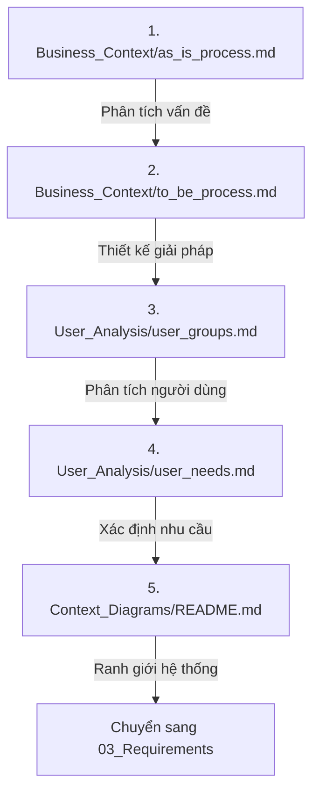

# System Clarification - README

> 📁 **Folder**: `02_System_Clarification`  
> 📅 **Cập nhật**: 10/02/2026  
> 🎯 **Mục đích**: Làm rõ hệ thống thông qua phân tích nghiệp vụ, người dùng và ngữ cảnh

---

## 📚 Cấu Trúc Folder

```
02_System_Clarification/
├── README.md                        # File này
├── Business_Context/                # Bối cảnh nghiệp vụ
│   ├── README.md
│   ├── as_is_process.md            # Quy trình hiện tại
│   └── to_be_process.md            # Quy trình tương lai
├── User_Analysis/                   # Phân tích người dùng
│   ├── README.md
│   ├── user_groups.md              # 5 nhóm người dùng
│   └── user_needs.md               # Nhu cầu người dùng
└── Context_Diagrams/                # Sơ đồ ngữ cảnh
    └── README.md                    # Context diagrams
```

---

## 🎯 Mục Đích Folder Này

**System Clarification** giúp:

1. ✅ Hiểu rõ **vấn đề hiện tại** (As-Is Process)
2. ✅ Xác định **giải pháp mong muốn** (To-Be Process)
3. ✅ Phân tích **người dùng và nhu cầu** (User Analysis)
4. ✅ Xác định **ranh giới hệ thống** (Context Diagrams)

---

## 📖 Thứ Tự Đọc Khuyến Nghị



**Khuyến nghị**:
1. Đọc `Business_Context/` trước để hiểu vấn đề và giải pháp
2. Đọc `User_Analysis/` để biết phục vụ ai, nhu cầu gì
3. Đọc `Context_Diagrams/` để thấy ranh giới và tích hợp

---

## 📊 Tổng Quan Nội Dung

### 1. Business Context - Bối Cảnh Nghiệp Vụ

**Câu hỏi trả lời**:
- ❓ Quy trình hiện tại ra sao? (As-Is)
- ❓ Vấn đề chính là gì?
- ❓ Quy trình mới sẽ như thế nào? (To-Be)
- ❓ Lợi ích gì?

**Highlights**:
- ✅ Quy trình As-Is: Phân tán, thủ công, mất 2-3 ngày/báo cáo
- ✅ Quy trình To-Be: Tập trung, tự động, **quy trình phê duyệt 2 cấp**, vài phút/báo cáo
- ✅ So sánh metrics: Thời gian, độ chính xác, public access

---

### 2. User Analysis - Phân Tích Người Dùng

**Câu hỏi trả lời**:
- ❓ Ai sẽ dùng hệ thống?
- ❓ Họ có đặc điểm gì?
- ❓ Nhu cầu của họ là gì?
- ❓ Quyền hạn từng nhóm?

**5 nhóm người dùng**:
1. **SuperAdmin** (2-5) - Quản trị hệ thống
2. **Researcher** (300-500) - Giảng viên tạo bài báo
3. **Faculty Reviewer** (10-20) - Xét duyệt cấp Khoa
4. **University Reviewer** (2-5) - Phê duyệt cấp Trường
5. **Viewer** (∞) - Sinh viên, công chúng

---

### 3. Context Diagrams - Sơ Đồ Ngữ Cảnh

**Câu hỏi trả lời**:
- ❓ Ranh giới hệ thống ở đâu?
- ❓ Tích hợp với hệ thống nào?
- ❓ Luồng dữ liệu ra/vào?

**Highlights**:
- ✅ System Context Diagram (C4 Model)
- ✅ Deployment Diagram
- ✅ Integration points: LDAP, Email, HR System, DOI, ORCID

---

## 🔑 Key Insights

### 1. Quy Trình Phê Duyệt 2 Cấp (Core Feature)

**Workflow**:
```
DRAFT → SUBMITTED → FACULTY_REVIEWING → FACULTY_APPROVED 
         → UNIVERSITY_REVIEWING → PUBLISHED
```

**Lợi ích**:
- ✅ Kiểm soát chất lượng 2 lớp
- ✅ Minh bạch, có audit trail
- ✅ Giảm tải cho cấp Trường (Khoa đã lọc)

---

### 2. Dual-Mode System

| Mode | Users | Scope | Auth |
|------|-------|-------|------|
| **Private** | Internal (GV, CB Khoa, CB Trường, Admin) | Workflow phê duyệt, tất cả trạng thái | LDAP/AD |
| **Public** | External (Sinh viên, Công chúng) | CHỈ công trình PUBLISHED | Không cần |

**Nguyên tắc**: CHỈ công trình **PUBLISHED** mới xuất hiện công khai

---

### 3. Pain Points → Solutions

| Pain Point (As-Is) | Solution (To-Be) | Impact |
|--------------------|------------------|--------|
| Mất 2-3 ngày tạo báo cáo | Tự động, vài phút | ⭐⭐⭐⭐⭐ |
| Dữ liệu phân tán 300-500 file | 1 database tập trung | ⭐⭐⭐⭐⭐ |
| Không có quy trình phê duyệt | Workflow 2 cấp chính thức | ⭐⭐⭐⭐⭐ |
| Không có profile công khai | Profile tự động, SEO | ⭐⭐⭐⭐ |
| Trùng lặp ~15-20% | Auto-detect, 0% | ⭐⭐⭐⭐ |

---

### 4. Success Metrics (Sau 6 Tháng)

| Chỉ số | Baseline | Target | Cải thiện |
|--------|----------|--------|-----------|
| **Thời gian báo cáo** | 2-3 ngày | \u003c 5 phút | Giảm 99% |
| **Tỉ lệ GV sử dụng** | ~60% (bị động) | \u003e 80% (chủ động) | +33% |
| **Tỉ lệ trùng lặp** | ~15-20% | ~0% | -100% |
| **Độ hài lòng** | N/A | \u003e 85% | Mới |

---

## 🚀 Tích Hợp Với Các Folder Khác

### Đầu Vào (Input)

Folder này dựa trên:
- **00_Problem_Context** - Big picture, 7 nhóm công trình, khung pháp lý
- **01_System_Specification** - Scope, stakeholders, công nghệ

---

### Đầu Ra (Output)

Folder này là nền tảng cho:
- **03_Requirements** - Chuyển nhu cầu thành yêu cầu chức năng/phi chức năng
- **04_User_Stories** - User stories cho 5 roles
- **05_Use_Cases** - Use case diagrams và specifications

---

## 📋 Checklist Hoàn Thiện

- [x] **Business_Context/as_is_process.md** - Quy trình hiện tại
- [x] **Business_Context/to_be_process.md** - Quy trình tương lai
- [x] **Business_Context/README.md** - Tổng quan Business Context
- [x] **User_Analysis/user_groups.md** - 5 nhóm người dùng
- [x] **User_Analysis/user_needs.md** - Nhu cầu chi tiết
- [x] **User_Analysis/README.md** - Tổng quan User Analysis
- [x] **Context_Diagrams/README.md** - Context diagrams
- [x] **README.md** (file này) - Tổng quan folder

---

## 🎯 Điểm Nổi Bật

### 1. Business Context

**As-Is Process**:
- 📊 Phân tích 4 giai đoạn quy trình hiện tại
- 📈 Pain points từng stakeholder
- 📉 Baseline metrics để so sánh

**To-Be Process**:
- 📊 Quy trình 2 cấp với 9 trạng thái
- 📈 State machine diagrams
- 📉 Sequence diagrams
- 📊 Metrics kỳ vọng

---

### 2. User Analysis

**User Groups**:
- 👥 5 personas chi tiết
- 🗺️ User journeys
- 🔐 Permissions matrix
- 📋 Prioritized feature list

**User Needs**:
- ✅ Functional needs (P0/P1/P2)
- ✅ Non-functional needs
- ✅ Pain points → Solutions
- ✅ Success metrics

---

### 3. Context Diagrams

**System Context**:
- 🎨 C4 Context Diagram
- 🔗 Integration points
- 🏗️ Deployment Diagram
- 🌐 Network Diagram

---

## 🔍 Validation Questions

Trước khi chuyển sang `03_Requirements`, hỏi:

✅ **Hiểu rõ vấn đề?**
- As-Is process có rõ ràng không?
- Pain points có đủ cụ thể không?

✅ **Giải pháp có khả thi?**
- To-Be process có giải quyết được pain points không?
- Metrics có đo lường được không?

✅ **Hiểu rõ người dùng?**
- 5 nhóm có đầy đủ không?
- Nhu cầu có ưu tiên rõ ràng không?

✅ **Ranh giới rõ ràng?**
- In/Out scope có rõ ràng không?
- Integration points có khả thi không?

---

## 🚦 Bước Tiếp Theo

Sau khi hoàn thiện `02_System_Clarification`, chuyển sang:

**📁 03_Requirements**
- Functional requirements (từ user needs)
- Non-functional requirements (performance, security, usability...)
- Business rules (quy tắc nghiệp vụ)

**📁 04_User_Stories**
- User stories cho từng role
- Acceptance criteria
- Prioritization (MoSCoW)

**📁 05_Use_Cases**
- Use case diagrams
- Detailed use case specifications
- Sequence diagrams, Activity diagrams

---

## 📚 Tài Liệu Tham Khảo

- [ISO/IEC/IEEE 29148:2018](../00_Problem_Context/international_standards.md) - Systems and software engineering
- [BABOK v3](https://www.iiba.org/) - Business Analysis Body of Knowledge
- [C4 Model](https://c4model.com/) - Context, Container, Component, Code diagrams

---

*Cập nhật lần cuối: 10/02/2026*  
*Trạng thái: ✅ Hoàn tất*
