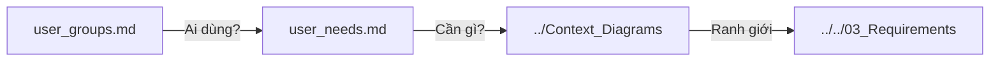

# User Analysis - README

> 📁 **Folder**: `02_System_Clarification/User_Analysis`  
> 📅 **Cập nhật**: 10/02/2026  
> 🎯 **Mục đích**: Phân tích chi tiết người dùng hệ thống UFPMS

---

## 📚 Tài Liệu Trong Folder Này

### 1. [user_groups.md](./user_groups.md) - Phân Tích Nhóm Người Dùng

**Nội dung chính**:
- 5 nhóm người dùng với đặc điểm riêng
- User personas chi tiết
- User journeys (hành trình người dùng)
- Ma trận quyền hạn (permissions matrix)

**5 nhóm**:
1. **SuperAdmin** (2-5) - Quản trị hệ thống
2. **Researcher** (300-500) - Giảng viên
3. **Faculty Reviewer** (10-20) - Cán bộ Khoa
4. **University Reviewer** (2-5) - Cán bộ Trường
5. **Viewer** (∞) - Sinh viên, công chúng

---

### 2. [user_needs.md](./user_needs.md) - Nhu Cầu Người Dùng

**Nội dung chính**:
- Functional needs (nhu cầu chức năng)
- Non-functional needs (nhu cầu phi chức năng)
- Pain points và giải pháp
- Prioritization (P0/P1/P2)
- Success metrics

**Highlight**:
- Researcher: Nhập nhanh, theo dõi trạng thái, profile công khai
- Reviewer: Dashboard mạnh, duyệt hàng loạt, lịch sử đầy đủ
- Viewer: Tìm kiếm dễ, không cần đăng nhập, mobile-friendly

---

## 🎯 Mối Quan Hệ Giữa Các Tài Liệu



**Thứ tự đọc**:
1. `user_groups.md` - Hiểu 5 nhóm người dùng
2. `user_needs.md` - Hiểu nhu cầu từng nhóm

---

## 📊 So Sánh Nhanh Các Nhóm

| Nhóm | Số lượng | Kỹ năng IT | Vai trò chính | Tính năng quan trọng nhất |
|------|----------|------------|---------------|---------------------------|
| **SuperAdmin** | 2-5 | Cao | Quản trị | User management, Monitoring |
| **Researcher** | 300-500 | Trung bình | Tạo công trình | CRUD bài báo, Nộp duyệt |
| **Faculty Reviewer** | 10-20 | Trung bình - Khá | Xét duyệt Khoa | Dashboard, Approve/Reject |
| **University Reviewer** | 2-5 | Khá | Phê duyệt Trường | Dashboard, Báo cáo |
| **Viewer** | ∞ | Cơ bản | Tìm kiếm | Search, Profile công khai |

---

## 🔑 Insights Quan Trọng

### 1. Nhóm Quan Trọng Nhất

**Researcher (Giảng viên)**
- Nếu họ không dùng → Hệ thống thất bại
- Cần UX cực kỳ đơn giản: Nhập \u003c 5 phút/bài báo
- Động lực: Profile công khai, KPI

**Faculty Reviewer**
- Lọc chất lượng cấp đầu tiên
- Cần dashboard mạnh mẽ, bulk operations
- Động lực: Giảm workload, minh bạch

**University Reviewer**
- Phê duyệt cuối, tạo báo cáo
- Cần: Báo cáo tự động (2-3 ngày → vài phút)
- Động lực: Hiệu quả công việc

---

### 2. User Journey Điển Hình

**Giảng viên nộp bài báo**:
```
Đăng nhập → Tạo bài báo (5 phút) → Nộp duyệt 
→ Chờ phản hồi (email thông báo) 
→ Sửa nếu cần → Được duyệt 
→ Xuất hiện profile công khai
```

**Sinh viên tìm người hướng dẫn**:
```
Vào trang tìm kiếm → Nhập từ khóa ("Machine Learning") 
→ Lọc theo Khoa → Xem profile thầy 
→ Đọc bài báo gần nhất → Quyết định liên hệ
```

---

### 3. Pain Points Chung

| Pain Point | As-Is | To-Be |
|------------|-------|-------|
| **Nhập lại dữ liệu** | Mỗi 6 tháng | 1 lần duy nhất |
| **Không biết trạng thái** | Không có workflow | Timeline rõ ràng |
| **Tạo báo cáo lâu** | 2-3 ngày | Vài phút |
| **Không có profile** | Chỉ CV tĩnh | Profile động, SEO |

---

## 🚀 Ưu Tiên Phát Triển

### MVP (P0 - Bắt buộc)

✅ **Core workflow**:
- CRUD bài báo
- Quy trình phê duyệt 2 cấp
- Dashboard theo vai trò
- User management

**Tại sao?** Đáp ứng nhu cầu cơ bản nhất, không có thì hệ thống không chạy

---

### Phase 2 (P1 - Quan trọng)

✅ **Public access**:
- Profile công khai
- Public search
- Advanced analytics

**Tại sao?** Tăng giá trị, thu hút người dùng

---

### Phase 3 (P2 - Nice to have)

✅ **Tích hợp**:
- ORCID auto-import
- Google Scholar sync
- AI recommendations

**Tại sao?** Nâng cao trải nghiệm, nhưng không bắt buộc

---

## 📌 Design Principles (Nguyên Tắc Thiết Kế)

### Cho Researcher
✅ **Đơn giản hóa tối đa**: Form nhập \u003c 5 phút  
✅ **Tự động hóa**: Auto-fetch từ DOI  
✅ **Minh bạch**: Timeline trạng thái rõ ràng  

### Cho Reviewer
✅ **Dashboard mạnh**: Filter, sort, bulk operations  
✅ **Context đầy đủ**: Metadata + PDF + lịch sử  
✅ **Hiệu quả**: Duyệt nhanh, không click nhiều  

### Cho Viewer
✅ **Public**: Không cần đăng nhập  
✅ **SEO**: Google indexing  
✅ **Mobile**: Responsive design  

---

## 📊 Success Metrics

| Chỉ số | Target sau 6 tháng |
|--------|--------------------|
| **Tỉ lệ giảng viên sử dụng** | \u003e 80% |
| **Thời gian nhập 1 bài báo** | \u003c 5 phút (vs 15-30 phút) |
| **Thời gian tạo báo cáo** | \u003c 5 phút (vs 2-3 ngày) |
| **Độ hài lòng người dùng** | \u003e 85% |
| **Profile views/tháng** | \u003e 1000 |

---

## 🚦 Validation Questions

Trước khi thiết kế tính năng, hỏi:

✅ **Nhóm nào cần?** → Ưu tiên Researcher, Reviewer trước  
✅ **Tần suất sử dụng?** → Hàng ngày? Hàng tuần? Hiếm?  
✅ **Thay thế được pain point nào?** → Must solve real problem  
✅ **Complexity vs Value?** → ROI có cao không?  

---

**Tài liệu liên quan**:
- [Business Context](../Business_Context/) - Quy trình As-Is vs To-Be
- [Context Diagrams](../Context_Diagrams/) - Ranh giới hệ thống
- [Stakeholders](../../01_System_Specification/stakeholders.md) - Các bên liên quan
