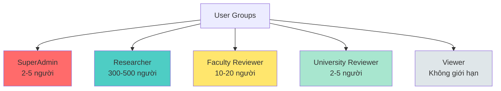
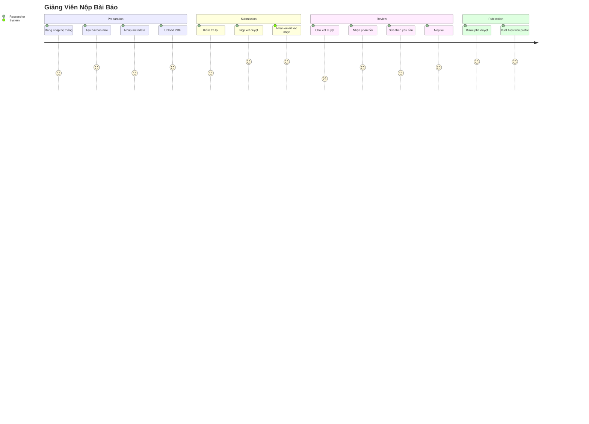
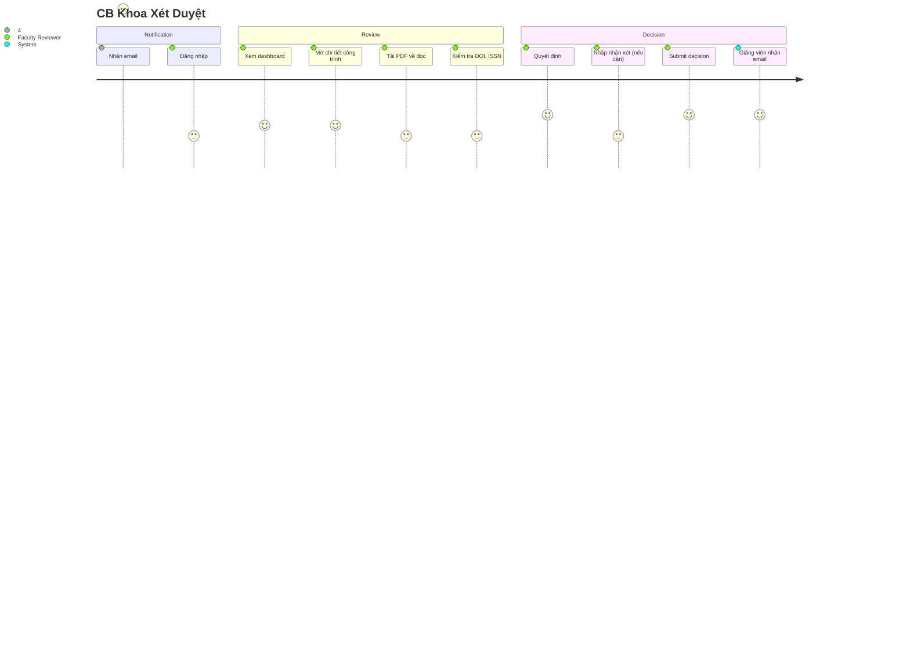
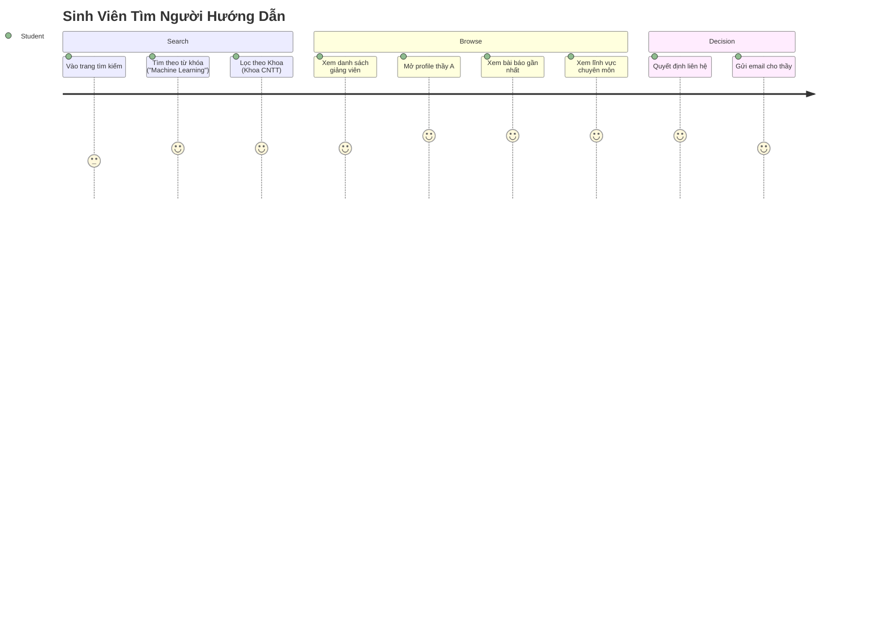

# Phân Tích Nhóm Người Dùng - UFPMS

> 📅 **Cập nhật**: 10/02/2026  
> 🎯 **Mục đích**: Phân tích chi tiết 5 nhóm người dùng chính của hệ thống

---

## 1. Tổng Quan Các Nhóm Người Dùng

Hệ thống UFPMS phục vụ **5 nhóm người dùng chính** với vai trò và quyền hạn khác nhau:

---

## 2. Nhóm 1: SuperAdmin (Quản Trị Viên Hệ Thống)

### 2.1. Thông Tin Cơ Bản

**Vai trò**: Quản trị hệ thống, cấu hình, quản lý người dùng

**Số lượng**: 2-5 người

**Đặc điểm**:
- Thuộc Phòng IT hoặc Phòng QLKH
- Tuổi: 25-45
- Kỹ năng IT: **Cao** (chuyên môn IT)
- Trách nhiệm: Vận hành hệ thống, troubleshooting

---

### 2.2. Nhiệm Vụ Chính

| Nhiệm vụ | Tần suất | Độ quan trọng |
|----------|----------|---------------|
| Quản lý người dùng (CRUD) | Hàng tuần | RẤT CAO |
| Cấu hình phân quyền (roles) | Theo yêu cầu | CAO |
| Quản lý đơn vị (Khoa/Viện) | Ít (khi tổ chức thay đổi) | CAO |
| Backup và restore dữ liệu | Hàng ngày (tự động) | RẤT CAO |
| Xem audit logs | Khi có sự cố | CAO |
| Cấu hình hệ thống (email, LDAP) | Ít (giai đoạn đầu) | RẤT CAO |

---

### 2.3. Tính Năng Cần Thiết

✅ **User Management**
- Tạo/Sửa/Xóa/Khóa tài khoản
- Gắn vai trò (Researcher, Faculty Reviewer, University Reviewer)
- Phân công giảng viên vào đơn vị

✅ **System Configuration**
- Cấu hình LDAP/AD integration
- Quản lý email templates
- Thiết lập backup schedule

✅ **Monitoring & Logging**
- Dashboard: Số người dùng online, tình trạng hệ thống
- Xem audit logs (ai làm gì, khi nào)
- Alert khi có lỗi nghiêm trọng

✅ **Data Management**
- Import dữ liệu cũ từ Excel
- Export toàn bộ database
- Xóa dữ liệu test

---

### 2.4. Pain Points Cần Giải Quyết

- ❌ Thao tác phức tạp, mất nhiều thời gian
- ❌ Không có công cụ debug khi có lỗi
- ❌ Phải SSH vào server để xem logs

**Giải pháp**:
- ✅ Admin dashboard trực quan
- ✅ Logs hiển thị ngay trên web
- ✅ Bulk operations (thêm nhiều user cùng lúc)

---

## 3. Nhóm 2: Researcher (Giảng Viên)

### 3.1. Thông Tin Cơ Bản

**Vai trò**: Tạo và quản lý bài báo khoa học của mình

**Số lượng**: 300-500 người

**Đặc điểm**:
- Tuổi: 30-65
- Trình độ: Thạc sĩ, Tiến sĩ
- Kỹ năng IT: **Trung bình** (biết dùng Word, Excel, email)
- Động lực: KPI xuất bản, thăng tiến, uy tín cá nhân

---

### 3.2. Nhiệm Vụ Chính

| Nhiệm vụ | Tần suất | Độ quan trọng |
|----------|----------|---------------|
| Thêm bài báo mới | Vài lần/năm | RẤT CAO |
| Sửa bài báo (nháp) | Thường xuyên | CAO |
| Nộp xét duyệt | Mỗi khi hoàn thành | RẤT CAO |
| Xem feedback từ CB Khoa | Khi có yêu cầu sửa | CAO |
| Chỉnh sửa theo yêu cầu | Theo feedback | CAO |
| Xem profile công khai của mình | Thỉnh thoảng | TRUNG BÌNH |
| Tải PDF bài báo | Thỉnh thoảng | THẤP |

---

### 3.3. Tính Năng Cần Thiết

✅ **Quản Lý Bài Báo**
- Thêm bài báo mới (form đơn giản, 5-10 phút)
- Sửa/Xóa bài báo (chỉ khi ở trạng thái DRAFT)
- Upload file PDF (< 10MB)
- Gắn tag từ khóa, lĩnh vực nghiên cứu
- Liên kết đồng tác giả (giảng viên khác trong trường)

✅ **Workflow Nộp Duyệt**
- Nút "Nộp xét duyệt" (DRAFT → SUBMITTED)
- Xem trạng thái xét duyệt (timeline)
- Nhận email thông báo khi có phản hồi
- Xem nhận xét từ CB Khoa, CB Trường
- Chỉnh sửa và nộp lại (nếu REVISION_REQUIRED)

✅ **Dashboard Cá Nhân**
- Danh sách bài báo của mình (theo trạng thái)
- Số lượng: Draft / Chờ duyệt / Đã công bố
- Biểu đồ thống kê cá nhân

✅ **Profile Công Khai**
- Xem trước profile công khai
- Chỉnh sửa bio, hình ảnh, thông tin liên hệ
- Xem trang profile như người khác nhìn thấy

---

### 3.4. User Journey (Typical Flow)

---

### 3.5. Pain Points Cần Giải Quyết

> 💬 *"Tôi không có thời gian nhập nhiều thông tin, cần form đơn giản!"*

> 💬 *"Tại sao phải nhập thủ công khi tôi có ORCID rồi?"*

> 💬 *"Không biết bài báo của tôi đang ở đâu trong quy trình?"*

**Giải pháp**:
- ✅ Form thông minh: Auto-fetch từ DOI, ORCID
- ✅ Timeline rõ ràng: Biết đang ở bước nào
- ✅ Email notification: Không bỏ lỡ phản hồi

---

## 4. Nhóm 3: Faculty Reviewer (Cán Bộ Khoa)

### 4.1. Thông Tin Cơ Bản

**Vai trò**: Xét duyệt công trình ở cấp Khoa

**Số lượng**: 10-20 người (1-2 người/Khoa)

**Đặc điểm**:
- Chức danh: Trưởng/Phó Khoa, hoặc CB được phân công
- Tuổi: 35-60
- Kỹ năng IT: **Trung bình đến khá**
- Trách nhiệm: Kiểm tra chất lượng công trình của Khoa

---

### 4.2. Nhiệm Vụ Chính

| Nhiệm vụ | Tần suất | Độ quan trọng |
|----------|----------|---------------|
| Xem danh sách chờ duyệt | Hàng tuần | RẤT CAO |
| Xem chi tiết công trình | Thường xuyên | CAO |
| Tải PDF về đọc | Mỗi công trình | CAO |
| Phê duyệt (Approve) | Thường xuyên | RẤT CAO |
| Yêu cầu sửa (Revision) | Thỉnh thoảng | CAO |
| Từ chối (Reject) | Hiếm | CAO |
| Nhập nhận xét | Khi cần | CAO |

---

### 4.3. Tính Năng Cần Thiết

✅ **Dashboard Xét Duyệt**
- Danh sách công trình chờ duyệt **của Khoa mình**
- Lọc theo: Trạng thái, Loại tạp chí, Giảng viên
- Sắp xếp theo: Thời gian nộp, Tên giảng viên
- Highlight: Bài nộp quá 7 ngày chưa duyệt

✅ **Chi Tiết Công Trình**
- Xem đầy đủ metadata
- Tải PDF bài báo
- Xem l ịch sử (giảng viên sửa bao nhiêu lần)
- Xem ORCID, Google Scholar (nếu có)

✅ **Actions**
- ✅ Approve → FACULTY_APPROVED
- 🔄 Revision Required → REVISION_REQUIRED (nhập nhận xét bắt buộc)
- ❌ Reject → FACULTY_REJECTED (nhập lý do bắt buộc)
- 📝 Add comment (không thay đổi trạng thái)

✅ **Bulk Operations**
- Chọn nhiều bài → Approve cùng lúc

---

### 4.4. User Journey

---

### 4.5. Pain Points Cần Giải Quyết

> 💬 *"Có quá nhiều bài chờ duyệt, không biết ưu tiên cái nào!"*

> 💬 *"Phải mở nhiều tab để kiểm tra DOI, tạp chí..."*

> 💬 *"Không nhớ bài nào đã duyệt, bài nào chưa."*

**Giải pháp**:
- ✅ Dashboard có filter, sort mạnh mẽ
- ✅ Link trực tiếp đến DOI resolver, Scopus/WoS
- ✅ Đánh dấu "Đã xem" vs "Chưa xem"

---

## 5. Nhóm 4: University Reviewer (Cán Bộ Trường)

### 5.1. Thông Tin Cơ Bản

**Vai trò**: Phê duyệt cuối cùng ở cấp Trường

**Số lượng**: 2-5 người (Phòng QLKH)

**Đặc điểm**:
- Tuổi: 30-50
- Kỹ năng IT: **Khá tốt** (quen với hệ thống quản lý)
- Trách nhiệm: Phê duyệt cuối, kiểm soát toàn trường

---

### 5.2. Nhiệm Vụ Chính

| Nhiệm vụ | Tần suất | Độ quan trọng |
|----------|----------|---------------|
| Xem danh sách đã được Khoa duyệt | Hàng tuần | RẤT CAO |
| Xem ý kiến của CB Khoa | Mỗi công trình | CAO |
| Phê duyệt cuối cùng (Approve) | Thường xuyên | RẤT CAO |
| Từ chối (Reject) | Hiếm | CAO |
| Tạo báo cáo thống kê | Hàng tháng | RẤT CAO |

---

### 5.3. Tính Năng Cần Thiết

✅ **Dashboard Phê Duyệt**
- Danh sách công trình **đã được Khoa duyệt** (FACULTY_APPROVED)
- Lọc theo: Khoa, Loại tạp chí, Năm
- Sắp xếp theo: Thời gian, Impact Factor

✅ **Chi Tiết + Context**
- Xem metadata đầy đủ
- **Xem nhận xét của CB Khoa** (rất quan trọng!)
- Xem lịch sử: Bao nhiêu lần sửa, phản hồi nào

✅ **Actions**
- ✅ Approve → PUBLISHED (công bố công khai)
- ❌ Reject → UNIVERSITY_REJECTED (nhập lý do)

✅ **Báo Cáo & Thống Kê**
- Số lượng bài báo theo Khoa, theo năm
- Tỉ lệ Q1/Q2/Q3/Q4
- Top giảng viên
- Export Excel, PDF

---

### 5.4. Điểm Khác Biệt với Faculty Reviewer

| Khía cạnh | Faculty Reviewer | University Reviewer |
|-----------|------------------|---------------------|
| **Phạm vi** | CHỈ Khoa mình | **Toàn trường** |
| **Role** | Xét duyệt sơ bộ | **Phê duyệt cuối** |
| **Options** | Approve / Revision / Reject | **Approve / Reject** (không có Revision) |
| **Context** | Biết rõ giảng viên | Dựa vào ý kiến Khoa |
| **Quyền hạn** | Yêu cầu sửa | **Quyết định công bố** |

---

### 5.5. Pain Points Cần Giải Quyết

> 💬 *"Tôi không rõ giảng viên, cần xem ý kiến Khoa để quyết định."*

> 💬 *"Cần thống kê nhanh để báo cáo lãnh đạo."*

**Giải pháp**:
- ✅ Hiển thị rõ nhận xét của CB Khoa
- ✅ Dashboard thống kê toàn trường
- ✅ Export báo cáo 1-click

---

## 6. Nhóm 5: Viewer (Người Xem)

### 6.1. Thông Tin Cơ Bản

**Vai trò**: Xem công trình đã công bố, tìm kiếm giảng viên

**Số lượng**: Không giới hạn

**Đối tượng chính**:
- Sinh viên, Nghiên cứu sinh
- Cộng đồng nghiên cứu
- Đối tác liên hệ hợp tác

**Đặc điểm**:
- **Không cần đăng nhập** (public access)
- Kỹ năng IT: Cơ bản đến trung bình

---

### 6.2. Nhiệm Vụ Chính

| Nhiệm vụ | Tần suất | Độ quan trọng |
|----------|----------|---------------|
| Tìm kiếm bài báo | Thường xuyên | CAO |
| Xem profile giảng viên | Thường xuyên | CAO |
| Tải PDF (nếu public) | Thỉnh thoảng | TRUNG BÌNH |
| Liên hệ giảng viên | Hiếm | THẤP |

---

### 6.3. Tính Năng Cần Thiết

✅ **Search & Browse**
- Tìm kiếm theo: Tiêu đề, tác giả, từ khóa, lĩnh vực
- Lọc theo: Năm, Loại tạp chí (Q1/Q2/Q3/Q4), Khoa
- Sắp xếp theo: Năm, Impact Factor, Số trích dẫn

✅ **Publication Detail**
- Xem metadata đầy đủ
- Link đến DOI (paper gốc)
- Tải PDF (nếu giảng viên cho phép)
- Xem đồng tác giả

✅ **Researcher Profile**
- Danh sách bài báo đã công bố
- Biểu đồ năng suất theo năm
- Lĩnh vực chuyên môn (word cloud từ keywords)
- Thông tin liên hệ (email, ORCID)

✅ **Statistics (Public Dashboard)**
- Số lượng bài báo của trường
- Phân bố theo Khoa, theo năm
- Top giảng viên

---

### 6.4. User Journey (Sinh Viên Tìm Người Hướng Dẫn)

---

### 6.5. Pain Points (Hiện Tại) Sẽ Được Giải Quyết

> 💬 *"Không biết thầy/cô nào chuyên về AI?"*

> 💬 *"Website chỉ có CV cũ, không biết thầy có còn nghiên cứu không."*

> 💬 *"Muốn đọc bài báo nhưng không tìm thấy PDF."*

**Giải pháp**:
- ✅ Công cụ tìm kiếm mạnh mẽ
- ✅ Profile luôn cập nhật
- ✅ Link DOI, ORCID rõ ràng

---

## 7. Ma Trận Quyền Hạn (Permissions Matrix)

| Tính năng | SuperAdmin | Researcher | Faculty Reviewer | University Reviewer | Viewer |
|-----------|-----------|------------|------------------|---------------------|--------|
| **Quản lý user** | ✅ | ❌ | ❌ | ❌ | ❌ |
| **Cấu hình hệ thống** | ✅ | ❌ | ❌ | ❌ | ❌ |
| **Tạo bài báo** | ✅ | ✅ | ❌ | ❌ | ❌ |
| **Sửa bài báo (DRAFT)** | ✅ | ✅ (chỉ của mình) | ❌ | ❌ | ❌ |
| **Nộp xét duyệt** | ✅ | ✅ | ❌ | ❌ | ❌ |
| **Xét duyệt cấp Khoa** | ✅ | ❌ | ✅ (chỉ Khoa mình) | ❌ | ❌ |
| **Phê duyệt cấp Trường** | ✅ | ❌ | ❌ | ✅ | ❌ |
| **Xem profile công khai** | ✅ | ✅ | ✅ | ✅ | ✅ |
| **Tìm kiếm bài báo công bố** | ✅ | ✅ | ✅ | ✅ | ✅ |
| **Tạo báo cáo** | ✅ | ❌ | ✅ (chỉ Khoa mình) | ✅ (toàn trường) | ❌ |
| **Xem audit logs** | ✅ | ❌ | ❌ | ✅ | ❌ |

---

## 8. Kết Luận

### 8.1. Nhóm Quan Trọng Nhất

1. **Researcher** - Nếu họ không dùng → hệ thống thất bại
2. **Faculty Reviewer** - Lọc chất lượng cấp đầu tiên
3. **University Reviewer** - Phê duyệt cuối, quản lý toàn trường

---

### 8.2. Nguyên Tắc Thiết Kế UX

✅ **Cho Researcher**: Đơn giản, nhanh, rõ ràng  
✅ **Cho Reviewer**: Dashboard mạnh mẽ, batch operations  
✅ **Cho Viewer**: Public, không cần đăng nhập, SEO tốt  
✅ **Cho SuperAdmin**: Đầy đủ công cụ, monitoring, logs  

---

**Tài liệu liên quan**:
- [User Needs](./user_needs.md) - Nhu cầu chi tiết từng nhóm
- [Stakeholders](../../01_System_Specification/stakeholders.md) - Ma trận stakeholder analysis
