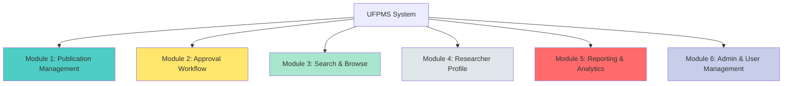

# Tổng Quan Yêu Cầu Chức Năng - UFPMS

> 📅 **Cập nhật**: 10/02/2026  
> 🎯 **Mục đích**: Tổng hợp yêu cầu chức năng cho 6 modules chính

---

## 1. Giới Thiệu

Tài liệu này tổng hợp các yêu cầu chức năng (Functional Requirements) của hệ thống UFPMS, được trích xuất từ:
- [User Needs](../../02_System_Clarification/User_Analysis/user_needs.md)
- [System Specification](../../01_System_Specification/system_overview.md)
- [To-Be Process](../../02_System_Clarification/Business_Context/to_be_process.md)

---

## 2. Cấu Trúc 6 Modules



---

## 3. Tổng Quan Modules

### Module 1: Publication Management
**Mục đích**: Quản lý bài báo khoa học (CRUD)

**Chức năng chính**:
- Tạo/Sửa/Xóa bài báo
- Upload file PDF
- Quản lý metadata (tiêu đề, tác giả, tạp chí, DOI...)
- Liên kết đồng tác giả

**Users**: Researcher, SuperAdmin

---

### Module 2: Approval Workflow
**Mục đích**: Quy trình phê duyệt 2 cấp

**Chức năng chính**:
- Nộp xét duyệt (Submit for Review)
- Xét duyệt cấp Khoa (Faculty Review)
- Phê duyệt cấp Trường (University Review)
- State machine với 9 trạng thái
- Audit trail đầy đủ

**Users**: Researcher, Faculty Reviewer, University Reviewer, SuperAdmin

---

### Module 3: Search & Browse
**Mục đích**: Tìm kiếm và tra cứu bài báo công bố

**Chức năng chính**:
- Full-text search
- Advanced filters (năm, loại tạp chí, khoa, từ khóa)
- Browse by category
- Export search results

**Users**: Tất cả (Public access)

---

### Module 4: Researcher Profile
**Mục đích**: Profile công khai cho giảng viên

**Chức năng chính**:
- Trang cá nhân công khai
- Danh sách bài báo đã công bố
- Biểu đồ năng suất nghiên cứu
- Word cloud lĩnh vực chuyên môn

**Users**: Researcher (edit), Tất cả (view)

---

### Module 5: Reporting & Analytics
**Mục đích**: Báo cáo và thống kê

**Chức năng chính**:
- Dashboard analytics
- Báo cáo theo đơn vị, loại tạp chí, năm
- Export Excel/PDF
- Trend analysis

**Users**: University Reviewer, Faculty Reviewer, SuperAdmin, Lãnh đạo

---

### Module 6: Admin & User Management
**Mục đích**: Quản trị hệ thống

**Chức năng chính**:
- User management (CRUD)
- Role assignment
- System configuration
- Audit logs
- Backup/Restore

**Users**: SuperAdmin

---

## 4. Phân Loại Requirements

### 4.1. Theo Độ Ưu Tiên

| Priority | Mô tả | Modules |
|----------|-------|---------|
| **P0 - Must Have** | Bắt buộc cho MVP | 1, 2, 6 (core features) |
| **P1 - Should Have** | Quan trọng, nên có trong MVP | 3, 4, 5 (basic features) |
| **P2 - Could Have** | Tốt nếu có, Phase 2 | 3, 4, 5 (advanced features) |
| **P3 - Won't Have** | Không trong scope hiện tại | - |

---

### 4.2. Theo Loại User

| User Group | Primary Modules | Secondary Modules |
|------------|----------------|-------------------|
| **Researcher** | 1 (Publication Mgmt), 2 (Approval) | 3 (Search), 4 (Profile) |
| **Faculty Reviewer** | 2 (Approval - Faculty) | 5 (Reporting - Khoa) |
| **University Reviewer** | 2 (Approval - University), 5 (Reporting) | 3 (Search) |
| **SuperAdmin** | 6 (Admin) | Tất cả |
| **Viewer** | 3 (Search), 4 (Profile) | - |

---

## 5. Tổng Số Requirements

| Module | Số FR | Độ ưu tiên P0 | Độ ưu tiên P1 | Độ ưu tiên P2 |
|--------|-------|---------------|---------------|---------------|
| **1. Publication Management** | ~15 | 12 | 2 | 1 |
| **2. Approval Workflow** | ~20 | 18 | 2 | 0 |
| **3. Search & Browse** | ~12 | 5 | 4 | 3 |
| **4. Researcher Profile** | ~10 | 3 | 5 | 2 |
| **5. Reporting & Analytics** | ~15 | 5 | 7 | 3 |
| **6. Admin & User Management** | ~18 | 15 | 3 | 0 |
| **TỔNG** | **~90** | **58** | **23** | **9** |

---

## 6. Traceability Matrix (Sample)

| Req ID | User Need | Module | Priority | User Story |
|--------|-----------|--------|----------|------------|
| FR-PUB-001 | Thêm bài báo nhanh | 1 | P0 | US-RES-001 |
| FR-PUB-002 | Upload PDF | 1 | P0 | US-RES-002 |
| FR-APR-001 | Nộp xét duyệt | 2 | P0 | US-RES-010 |
| FR-APR-005 | Xét duyệt cấp Khoa | 2 | P0 | US-FCR-001 |
| FR-APR-010 | Phê duyệt cấp Trường | 2 | P0 | US-UNR-001 |
| FR-SEA-001 | Tìm kiếm full-text | 3 | P1 | US-VIW-001 |
| FR-PRO-001 | Profile công khai | 4 | P1 | US-RES-020 |
| FR-REP-001 | Dashboard analytics | 5 | P1 | US-UNR-010 |
| FR-ADM-001 | User management | 6 | P0 | US-ADM-001 |

> Chi tiết đầy đủ: Xem từng file module_*.md

---

## 7. Business Rules Overview

**Core Business Rules**:

1. **State Transition Rules**
   - CHỈ Researcher có thể nộp bài báo (DRAFT → SUBMITTED)
   - CHỈ Faculty Reviewer có thể duyệt cấp Khoa
   - CHỈ University Reviewer có thể duyệt cấp Trường

2. **Visibility Rules**
   - CHỈ công trình **PUBLISHED** mới hiển thị công khai
   - Công trình DRAFT chỉ chủ sở hữu + Admin nhìn thấy
   - Công trình đang xét duyệt: Reviewer của cấp đó nhìn thấy

3. **Data Validation Rules**
   - DOI format: `10.xxxx/xxxxx`
   - ISSN format: `xxxx-xxxx`
   - ORCID format: `0000-0002-xxxx-xxxx`
   - File PDF size: < 10MB

4. **Co-author Rules**
   - Mỗi bài báo có thể có nhiều tác giả
   - CHỈ corresponding author (chủ sở hữu) có thể sửa/xóa
   - Đồng tác giả không thể sửa, chỉ xem

> Chi tiết: [business_rules.md](./business_rules.md)

---

## 8. Dependencies & Constraints

### 8.1. External Dependencies

**Must Have (P0)**:
- LDAP/AD for authentication
- Email server for notifications
- MySQL for database

**Should Have (P1)**:
- HR System for user sync

**Nice to Have (P2)**:
- DOI Resolver for auto-fetch
- ORCID API for import

---

### 8.2. Technical Constraints

- Backend: Java Spring Boot 3.x
- Frontend: React 18 + TypeScript
- Database: MySQL 8.0+
- Storage: Local File System (MVP)
- Auth: LDAP/AD + JWT

---

## 9. Acceptance Criteria Template

Mỗi requirement phải có:

✅ **Given-When-Then format**
```
GIVEN [precondition]
WHEN [action]
THEN [expected outcome]
```

✅ **Measurable criteria**
- Định lượng (số, thời gian, %)
- Có thể test được

✅ **Testable**
- Unit test, Integration test, hoặc Manual test

---

## 10. Next Steps

Sau khi đọc overview này, đọc chi tiết:

1. **[module_publication_management.md](./module_publication_management.md)** - CRUD bài báo
2. **[module_approval_workflow.md](./module_approval_workflow.md)** - Quy trình phê duyệt
3. **[module_search.md](./module_search.md)** - Tìm kiếm và tra cứu
4. **[module_profile.md](./module_profile.md)** - Profile giảng viên
5. **[module_reporting.md](./module_reporting.md)** - Báo cáo và thống kê
6. **[module_admin.md](./module_admin.md)** - Quản trị hệ thống
7. **[business_rules.md](./business_rules.md)** - Quy tắc nghiệp vụ

---

**Tài liệu liên quan**:
- [User Needs](../../02_System_Clarification/User_Analysis/user_needs.md)
- [Non-Functional Requirements](../Non_Functional/)
- [User Stories](../../04_User_Stories/)
