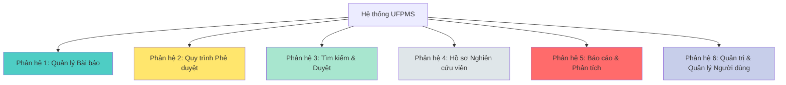

# Tổng Quan Yêu Cầu Chức Năng - UFPMS

> 📅 **Cập nhật**: 10/02/2026  
> 🎯 **Mục đích**: Tổng hợp yêu cầu chức năng cho 6 modules chính

---

## 1. Giới Thiệu

Tài liệu này tổng hợp các yêu cầu chức năng (Functional Requirements) của hệ thống UFPMS, được trích xuất từ:
- [Nhu cầu Người dùng](../../02_System_Clarification/User_Analysis/user_needs.md)
- [Đặc tả Hệ thống](../../01_System_Specification/system_overview.md)
- [Quy trình Tương lai](../../02_System_Clarification/Business_Context/to_be_process.md)

---

## 2. Cấu Trúc 6 Phân hệ



---

## 3. Tổng Quan Phân hệ

### Phân hệ 1: Quản lý Bài báo
**Mục đích**: Quản lý bài báo khoa học (Thêm/Xóa/Sửa - CRUD)

**Chức năng chính**:
- Tạo/Sửa/Xóa bài báo
- Tải lên (Upload) file PDF
- Quản lý metadata (tiêu đề, tác giả, tạp chí, DOI...)
- Liên kết đồng tác giả

**Người dùng**: Nhà nghiên cứu, Quản trị viên cấp cao

---

### Phân hệ 2: Quy trình Phê duyệt
**Mục đích**: Quy trình phê duyệt 2 cấp

**Chức năng chính**:
- Nộp xét duyệt (Submit for Review)
- Xét duyệt cấp Khoa (Faculty Review)
- Phê duyệt cấp Trường (University Review)
- Máy trạng thái (State machine) với 9 trạng thái
- Vết kiểm toán (Audit trail) đầy đủ

**Người dùng**: Nhà nghiên cứu, Người duyệt cấp Khoa, Người duyệt cấp Trường, Quản trị viên cấp cao

---

### Phân hệ 3: Tìm kiếm & Duyệt
**Mục đích**: Tìm kiếm và tra cứu bài báo công bố

**Chức năng chính**:
- Tìm kiếm toàn văn (Full-text search)
- Bộ lọc nâng cao (năm, loại tạp chí, khoa, từ khóa)
- Duyệt theo danh mục
- Xuất kết quả tìm kiếm

**Người dùng**: Tất cả (Truy cập công khai)

---

### Phân hệ 4: Hồ sơ Nghiên cứu viên
**Mục đích**: Hồ sơ công khai cho giảng viên

**Chức năng chính**:
- Trang cá nhân công khai
- Danh sách bài báo đã công bố
- Biểu đồ năng suất nghiên cứu
- Đám mây từ khóa (Word cloud) lĩnh vực chuyên môn

**Người dùng**: Nhà nghiên cứu (sửa), Tất cả (xem)

---

### Phân hệ 5: Báo cáo & Phân tích
**Mục đích**: Báo cáo và thống kê

**Chức năng chính**:
- Bảng điều khiển phân tích (Dashboard analytics)
- Báo cáo theo đơn vị, loại tạp chí, năm
- Xuất Excel/PDF
- Phân tích xu hướng (Trend analysis)

**Người dùng**: Người duyệt cấp Trường, Người duyệt cấp Khoa, Quản trị viên cấp cao, Lãnh đạo

---

### Phân hệ 6: Quản trị & Quản lý Người dùng
**Mục đích**: Quản trị hệ thống

**Chức năng chính**:
- Quản lý người dùng (Thêm/Xóa/Sửa)
- Phân quyền vai trò
- Cấu hình hệ thống
- Nhật ký kiểm toán (Audit logs)
- Sao lưu/Khôi phục (Backup/Restore)

**Người dùng**: Quản trị viên cấp cao

---

## 4. Phân Loại Yêu Cầu

### 4.1. Theo Độ Ưu Tiên

| Mức độ ưu tiên | Mô tả | Phân hệ (Modules) |
|----------|-------|---------|
| **P0 - Phải Có (Must Have)** | Bắt buộc cho MVP | 1, 2, 6 (tính năng cốt lõi) |
| **P1 - Nên Có (Should Have)** | Quan trọng, nên có trong MVP | 3, 4, 5 (tính năng cơ bản) |
| **P2 - Có Thể Có (Could Have)** | Tốt nếu có, Giai đoạn 2 | 3, 4, 5 (tính năng nâng cao) |
| **P3 - Sẽ Không Có (Won't Have)** | Không trong phạm vi hiện tại | - |

---

### 4.2. Theo Loại Người Dùng

| Nhóm Người dùng | Phân hệ Chính | Phân hệ Phụ |
|------------|----------------|-------------------|
| **Nhà nghiên cứu** | 1 (Quản lý Bài báo), 2 (Phê duyệt) | 3 (Tìm kiếm), 4 (Hồ sơ) |
| **Người duyệt cấp Khoa** | 2 (Phê duyệt - Khoa) | 5 (Báo cáo - Khoa) |
| **Người duyệt cấp Trường** | 2 (Phê duyệt - Trường), 5 (Báo cáo) | 3 (Tìm kiếm) |
| **Quản trị viên cấp cao** | 6 (Quản trị) | Tất cả |
| **Người xem (Viewer)** | 3 (Tìm kiếm), 4 (Hồ sơ) | - |

---

## 5. Tổng Số Yêu Cầu

| Phân hệ | Số lượng FR | Độ ưu tiên P0 | Độ ưu tiên P1 | Độ ưu tiên P2 |
|--------|-------|---------------|---------------|---------------|
| **1. Quản lý Bài báo** | ~15 | 12 | 2 | 1 |
| **2. Quy trình Phê duyệt** | ~20 | 18 | 2 | 0 |
| **3. Tìm kiếm & Duyệt** | ~12 | 5 | 4 | 3 |
| **4. Hồ sơ Nghiên cứu viên** | ~10 | 3 | 5 | 2 |
| **5. Báo cáo & Phân tích** | ~15 | 5 | 7 | 3 |
| **6. Quản trị & Quản lý Người dùng** | ~18 | 15 | 3 | 0 |
| **TỔNG** | **~90** | **58** | **23** | **9** |

---

## 6. Ma trận Truy xuất (Mẫu)

| ID Yêu cầu | Nhu cầu Người dùng | Phân hệ | Độ ưu tiên | User Story |
|--------|-----------|--------|----------|------------|
| FR-PUB-001 | Thêm bài báo nhanh | 1 | P0 | US-RES-001 |
| FR-PUB-002 | Link file PDF | 1 | P0 | US-RES-002 |
| FR-APR-001 | Nộp xét duyệt | 2 | P0 | US-RES-010 |
| FR-APR-005 | Xét duyệt cấp Khoa | 2 | P0 | US-FCR-001 |
| FR-APR-010 | Phê duyệt cấp Trường | 2 | P0 | US-UNR-001 |
| FR-SEA-001 | Tìm kiếm full-text | 3 | P1 | US-VIW-001 |
| FR-PRO-001 | Profile công khai | 4 | P1 | US-RES-020 |
| FR-REP-001 | Dashboard analytics | 5 | P1 | US-UNR-010 |
| FR-ADM-001 | Quản lý người dùng | 6 | P0 | US-ADM-001 |

> Chi tiết đầy đủ: Xem từng file module_*.md

---

## 7. Tổng quan Quy tắc Nghiệp vụ

**Quy tắc Nghiệp vụ Cốt lõi**:

1. **Quy tắc Chuyển đổi Trạng thái**
   - CHỈ Nhà nghiên cứu có thể nộp bài báo (NHÁP → ĐÃ NỘP)
   - CHỈ Người duyệt cấp Khoa có thể duyệt văn bản cấp Khoa
   - CHỈ Người duyệt cấp Trường có thể duyệt văn bản cấp Trường

2. **Quy tắc Hiển thị**
   - CHỈ công trình **ĐÃ XUẤT BẢN** mới hiển thị công khai
   - Công trình NHÁP chỉ chủ sở hữu + Quản trị viên nhìn thấy
   - Công trình đang xét duyệt: Người duyệt của cấp đó nhìn thấy

3. **Quy tắc Kiểm tra Dữ liệu**
   - Định dạng DOI: `10.xxxx/xxxxx`
   - Định dạng ISSN: `xxxx-xxxx`
   - Định dạng ORCID: `0000-0002-xxxx-xxxx`
   - Kích thước file PDF: < 10MB

4. **Quy tắc Đồng tác giả**
   - Mỗi bài báo có thể có nhiều tác giả
   - CHỈ tác giả liên hệ (chủ sở hữu) có thể sửa/xóa
   - Đồng tác giả không thể sửa, chỉ xem

> Chi tiết: [business_rules.md](./business_rules.md)

---

## 8. Sự Phụ Thuộc & Ràng Buộc

### 8.1. Sự Phụ Thuộc Bên Ngoài

**Phải Có (P0)**:
- LDAP/AD để xác thực
- Máy chủ Email để thông báo
- MySQL cho cơ sở dữ liệu

**Nên Có (P1)**:
- Hệ thống Nhân sự (HR System) để đồng bộ người dùng

**Có Thể Có (P2)**:
- Bộ giải quyết DOI để tự động lấy dữ liệu
- API ORCID để nhập dữ liệu

---

### 8.2. Ràng Buộc Kỹ Thuật

- Backend: Java Spring Boot 3.x
- Frontend: React 18 + TypeScript
- Cơ sở dữ liệu: MySQL 8.0+
- Lưu trữ: Hệ thống tệp cục bộ (MVP)
- Xác thực: LDAP/AD + JWT

---

## 9. Mẫu Tiêu chí Chấp nhận

Mỗi yêu cầu phải có:

✅ **Định dạng Given-When-Then**
```
GIVEN (KHI) [điều kiện tiên quyết]
WHEN (LÚC) [hành động]
THEN (THÌ) [kết quả mong đợi]
```

✅ **Tiêu chí có thể đo lường**
- Định lượng (số, thời gian, %)
- Có thể kiểm thử (testable)

✅ **Có thể kiểm thử**
- Unit test, Integration test, hoặc Kiểm thử thủ công (Manual test)

---

## 10. Các Bước Tiếp Theo

Sau khi đọc tổng quan này, đọc chi tiết:

1. **[module_publication_management.md](./module_publication_management.md)** - Quản lý bài báo
2. **[module_approval_workflow.md](./module_approval_workflow.md)** - Quy trình phê duyệt
3. **[module_search.md](./module_search.md)** - Tìm kiếm và tra cứu
4. **[module_profile.md](./module_profile.md)** - Hồ sơ giảng viên
5. **[module_reporting.md](./module_reporting.md)** - Báo cáo và thống kê
6. **[module_admin.md](./module_admin.md)** - Quản trị hệ thống
7. **[business_rules.md](./business_rules.md)** - Quy tắc nghiệp vụ

---

**Tài liệu liên quan**:
- [Nhu cầu Người dùng](../../02_System_Clarification/User_Analysis/user_needs.md)
- [Yêu cầu Phi Chức năng](../Non_Functional/)
- [User Stories](../../04_User_Stories/)
