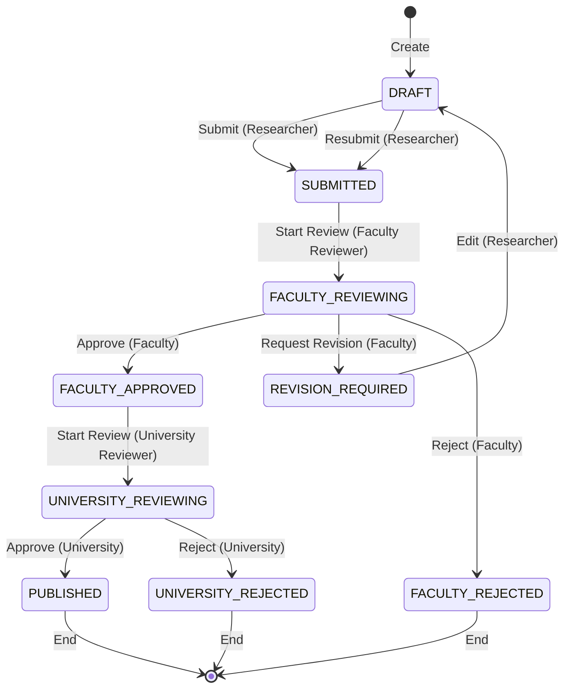

# Module 2: Approval Workflow - Yêu Cầu Chức Năng

> 📅 **Cập nhật**: 10/02/2026  
> 🎯 **Module**: Quy Trình Phê Duyệt 2 Cấp  
> 👥 **Users**: Researcher, Faculty Reviewer, University Reviewer, SuperAdmin

---

## 1. Tổng Quan Module

**Mục đích**: Quản lý quy trình phê duyệt bài báo với 2 cấp (Khoa → Trường)

**State Machine**: 9 trạng thái

```
DRAFT → SUBMITTED → FACULTY_REVIEWING → FACULTY_APPROVED
          ↓                    ↓
    (có thể sửa)      REVISION_REQUIRED / FACULTY_REJECTED
                             ↓
                   UNIVERSITY_REVIEWING
                             ↓
              PUBLISHED / UNIVERSITY_REJECTED
```

---

## 2. Functional Requirements - Researcher

### FR-APR-001: Nộp Xét Duyệt (Submit)
**Priority**: 🔴 P0 - Must Have

**Description**: Giảng viên nộp bài báo để xét duyệt

**Acceptance Criteria**:
```
GIVEN bài báo ở trạng thái DRAFT
AND đã điền đủ thông tin bắt buộc
WHEN nhấn "Nộp xét duyệt"
THEN
  - Trạng thái: DRAFT → SUBMITTED
  - Gửi email cho CB Khoa
  - Lưu audit log
  - Hiển thị "Đã nộp thành công"
```

**Business Rules**:
- Required fields: Title, Authors, Journal, Year, PDF
- Không thể sửa sau khi nộp

---

### FR-APR-002: Xem Trạng Thái Xét Duyệt
**Priority**: 🔴 P0 - Must Have

**Description**: Giảng viên theo dõi trạng thái bài báo

**Acceptance Criteria**:
```
GIVEN đã nộp bài báo
WHEN xem chi tiết
THEN hiển thị:
  - Timeline (visual): DRAFT → SUBMITTED → REVIEWING → APPROVED
  - Current status
  - Reviewer comments (nếu có)
  - Ngày chuyển trạng thái
```

---

### FR-APR-003: Chỉnh Sửa Theo Yêu Cầu (Revision)
**Priority**: 🔴 P0 - Must Have

**Description**: Giảng viên sửa bài theo feedback

**Acceptance Criteria**:
```
GIVEN trạng thái REVISION_REQUIRED
AND có comment từ reviewer
WHEN sửa và "Nộp lại"
THEN
  - Trạng thái: REVISION_REQUIRED → SUBMITTED
  - Gửi email cho CB Khoa: "Đã sửa và nộp lại"
  - Lưu audit log
```

---

## 3. Functional Requirements - Faculty Reviewer

### FR-APR-005: Dashboard Chờ Duyệt Cấp Khoa
**Priority**: 🔴 P0 - Must Have

**Description**: CB Khoa xem danh sách công trình chờ duyệt

**Acceptance Criteria**:
```
GIVEN là Faculty Reviewer
WHEN vào "Faculty Review Dashboard"
THEN hiển thị:
  - CHỈ công trình của Khoa mình
  - Trạng thái: SUBMITTED hoặc FACULTY_REVIEWING
  - Filter: All / New / In Review
  - Sort: Oldest first
  - Highlight: Quá 7 ngày chưa duyệt
```

---

### FR-APR-006: Xét Duyệt (Approve)
**Priority**: 🔴 P0 - Must Have

**Description**: CB Khoa phê duyệt công trình

**Acceptance Criteria**:
```
GIVEN công trình đang FACULTY_REVIEWING
WHEN nhấn "Approve" và nhập comment (optional)
THEN
  - Trạng thái: → FACULTY_APPROVED
  - Gửi email cho GV: "Đã được Khoa duyệt"
  - Gửi email cho CB Trường: "Có công trình mới chờ duyệt"
  - Lưu audit log (reviewer, timestamp, comment)
```

---

### FR-APR-007: Yêu Cầu Bổ Sung (Revision)
**Priority**: 🔴 P0 - Must Have

**Description**: CB Khoa yêu cầu giảng viên sửa

**Acceptance Criteria**:
```
GIVEN công trình đang FACULTY_REVIEWING
WHEN nhấn "Request Revision" và nhập comment (bắt buộc)
THEN
  - Trạng thái: → REVISION_REQUIRED
  - Gửi email cho GV kèm comment
  - Lưu audit log
```

**Validation**:
- Comment bắt buộc, min 10 characters

---

### FR-APR-008: Từ Chối (Reject)
**Priority**: 🔴 P0 - Must Have

**Description**: CB Khoa từ chối công trình

**Acceptance Criteria**:
```
GIVEN công trình đang FACULTY_REVIEWING
WHEN nhấn "Reject" và nhập lý do (bắt buộc)
THEN
  - Trạng thái: → FACULTY_REJECTED
  - Gửi email cho GV kèm lý do
  - Lưu audit log
  - Không thể revert
```

---

### FR-APR-009: Bulk Approve
**Priority**: 🟡 P1 - Should Have

**Description**: Duyệt nhiều bài cùng lúc

**Acceptance Criteria**:
```
GIVEN chọn nhiều công trình (checkbox)
WHEN nhấn "Approve Selected"
THEN
  - Chuyển tất cả → FACULTY_APPROVED
  - Gửi email cho từng GV
  - Gửi 1 email tổng hợp cho CB Trường
```

---

## 4. Functional Requirements - University Reviewer

### FR-APR-010: Dashboard Chờ Duyệt Cấp Trường
**Priority**: 🔴 P0 - Must Have

**Description**: CB Trường xem công trình toàn trường chờ duyệt

**Acceptance Criteria**:
```
GIVEN là University Reviewer
WHEN vào "University Review Dashboard"
THEN hiển thị:
  - CHỈ công trình FACULTY_APPROVED
  - Filter: By Faculty, By Journal Type, By Year
  - Sort: Oldest first
  - Columns: Title, Author, Faculty, Review Date
```

---

### FR-APR-011: Xem Ý Kiến Của CB Khoa
**Priority**: 🔴 P0 - Must Have

**Description**: CB Trường xem nhận xét từ cấp Khoa

**Acceptance Criteria**:
```
GIVEN công trình FACULTY_APPROVED
WHEN xem chi tiết
THEN hiển thị:
  - Faculty reviewer name
  - Faculty approval date
  - Faculty comment (if any)
  - Revision history (nếu có)
```

---

### FR-APR-012: Phê Duyệt Cuối (Publish)
**Priority**: 🔴 P0 - Must Have

**Description**: CB Trường phê duyệt và công bố

**Acceptance Criteria**:
```
GIVEN công trình UNIVERSITY_REVIEWING
WHEN nhấn "Approve & Publish"
THEN
  - Trạng thái: → PUBLISHED
  - Gửi email cho GV: "Đã công bố"
  - **Công trình xuất hiện công khai** (Module 3, 4)
  - Lưu audit log
```

**Business Rules**:
- PUBLISHED = cuối cùng, không thể revert
- Tự động visible trên profile và search

---

### FR-APR-013: Từ Chối Cấp Trường (Reject)
**Priority**: 🔴 P0 - Must Have

**Description**: CB Trường từ chối (hiếm xảy ra)

**Acceptance Criteria**:
```
GIVEN công trình UNIVERSITY_REVIEWING
WHEN nhấn "Reject" và nhập lý do (bắt buộc)
THEN
  - Trạng thái: → UNIVERSITY_REJECTED
  - Gửi email cho GV + CB Khoa
  - Lưu audit log
```

---

## 5. Functional Requirements - Common

### FR-APR-015: Audit Trail Đầy Đủ
**Priority**: 🔴 P0 - Must Have

**Description**: Lưu lịch sử mọi thay đổi trạng thái

**Data Model**:
```typescript
interface ApprovalHistory {
  id: UUID;
  publicationId: UUID;
  fromStatus: PublicationStatus;
  toStatus: PublicationStatus;
  reviewerUserId: UUID;
  reviewerName: string;
  reviewerRole: 'faculty' | 'university';
  comment?: string;
  timestamp: Date;
}
```

---

### FR-APR-016: Email Notifications
**Priority**: 🔴 P0 - Must Have

**Description**: Thông báo tự động khi chuyển trạng thái

**Email Templates**:

**1. Submitted (to Faculty Reviewer)**:
```
Subject: [UFPMS] New publication pending review
Dear [Reviewer Name],
[Author Name] has submitted a publication for review:
Title: [Publication Title]
Review at: [Link]
```

**2. Approved by Faculty (to Author)**:
```
Subject: [UFPMS] Your publication approved by Faculty
Dear [Author Name],
Your publication has been approved by [Faculty Name]:
Title: [Publication Title]
Next step: University review
```

**3. Published (to Author)**:
```
Subject: [UFPMS] Your publication is now published!
Dear [Author Name],
Congratulations! Your publication is now published:
Title: [Publication Title]
Public profile: [Link]
```

---

### FR-APR-017: State Transition Validation
**Priority**: 🔴 P0 - Must Have

**Description**: Validate quy tắc chuyển trạng thái

**Business Rules**:
```
Allowed Transitions:
DRAFT → SUBMITTED
SUBMITTED → FACULTY_REVIEWING
FACULTY_REVIEWING → FACULTY_APPROVED | REVISION_REQUIRED | FACULTY_REJECTED
REVISION_REQUIRED → DRAFT
FACULTY_APPROVED → UNIVERSITY_REVIEWING
UNIVERSITY_REVIEWING → PUBLISHED | UNIVERSITY_REJECTED

Not Allowed:
PUBLISHED → anything (final state)
```

---

### FR-APR-018: Reassign Reviewer
**Priority**: 🟢 P2 - Nice to Have

**Description**: Admin có thể chuyển reviewer

**Acceptance Criteria**:
```
GIVEN là SuperAdmin
WHEN nhấn "Reassign Reviewer"
THEN
  - Chọn Faculty Reviewer mới
  - Gửi email thông báo cho cả 2
  - Lưu audit log
```

---

### FR-APR-019: Withdraw Submission
**Priority**: 🟡 P1 - Should Have

**Description**: Giảng viên rút lại đơn đã nộp

**Acceptance Criteria**:
```
GIVEN trạng thái SUBMITTED hoặc FACULTY_REVIEWING
WHEN nhấn "Withdraw" và confirm
THEN
  - Trạng thái: → DRAFT
  - Gửi email cho reviewer (nếu đang review)
  - Lưu audit log
```

**Business Rules**:
- CHỈ withdraw được trước khi approved
- KHÔNG withdraw được sau khi FACULTY_APPROVED

---

### FR-APR-020: SLA Tracking
**Priority**: 🟢 P2 - Nice to Have

**Description**: Theo dõi thời gian xét duyệt

**Metrics**:
- Average time: SUBMITTED → FACULTY_APPROVED
- Average time: FACULTY_APPROVED → PUBLISHED
- % reviewed within 7 days

**Dashboard**:
- Highlight công trình quá 7 ngày chưa duyệt

---

## 6. State Machine Diagram



---

## 7. Permissions Matrix

| Action | Researcher | Faculty Reviewer | University Reviewer | Admin |
|--------|-----------|------------------|---------------------|-------|
| Submit | ✅ (own) | ❌ | ❌ | ✅ |
| Withdraw | ✅ (own) | ❌ | ❌ | ✅ |
| Faculty Approve | ❌ | ✅ (own faculty) | ❌ | ✅ |
| Faculty Reject | ❌ | ✅ (own faculty) | ❌ | ✅ |
| University Approve | ❌ | ❌ | ✅ | ✅ |
| University Reject | ❌ | ❌ | ✅ | ✅ |
| View Audit Trail | ✅ (own) | ✅ (reviewed) | ✅ (all) | ✅ (all) |

---

## 8. API Endpoints (Sample)

| Method | Endpoint | Description | Auth |
|--------|----------|-------------|------|
| POST | `/api/publications/:id/submit` | Nộp xét duyệt | Researcher |
| POST | `/api/publications/:id/withdraw` | Rút lại | Researcher |
| GET | `/api/faculty-review/pending` | Dashboard Khoa | Faculty Reviewer |
| POST | `/api/faculty-review/:id/approve` | Duyệt cấp Khoa | Faculty Reviewer |
| POST | `/api/faculty-review/:id/revision` | Yêu cầu sửa | Faculty Reviewer |
| POST | `/api/faculty-review/:id/reject` | Từ chối Khoa | Faculty Reviewer |
| GET | `/api/university-review/pending` | Dashboard Trường | University Reviewer |
| POST | `/api/university-review/:id/approve` | Phê duyệt Trường | University Reviewer |
| POST | `/api/university-review/:id/reject` | Từ chối Trường | University Reviewer |
| GET | `/api/publications/:id/history` | Audit trail | Authorized |

---

**Tài liệu liên quan**:
- [To-Be Process](../../02_System_Clarification/Business_Context/to_be_process.md) - Quy trình chi tiết
- [Business Rules](./business_rules.md) - Quy tắc chuyển trạng thái
- [Module 1: Publication Management](./module_publication_management.md)
