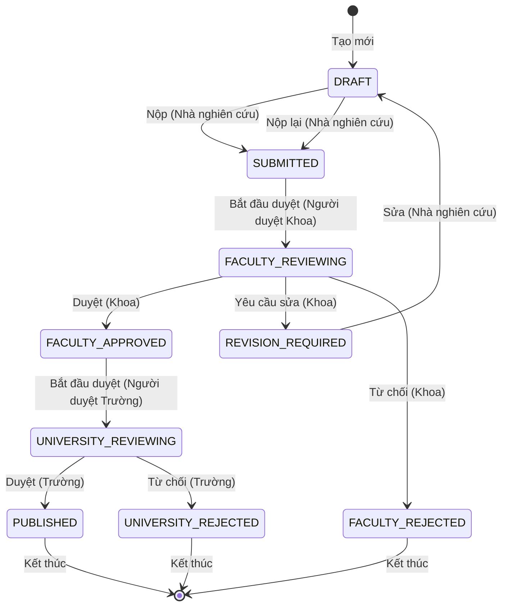

# Phân hệ 2: Quy trình Phê duyệt - Yêu Cầu Chức Năng

> 📅 **Cập nhật**: 10/02/2026  
> 🎯 **Phân hệ**: Quy Trình Phê Duyệt 2 Cấp  
> 👥 **Người dùng**: Nhà nghiên cứu, Người duyệt cấp Khoa, Người duyệt cấp Trường, Quản trị viên cấp cao

---

## 1. Tổng Quan Phân hệ

**Mục đích**: Quản lý quy trình phê duyệt bài báo với 2 cấp (Khoa → Trường)

**Máy trạng thái (State Machine)**: 9 trạng thái

```
DRAFT (Nháp) → SUBMITTED (Đã nộp) → FACULTY_REVIEWING (Khoa đang duyệt) → FACULTY_APPROVED (Khoa đã duyệt)
          ↓                    ↓
    (có thể sửa)      REVISION_REQUIRED (Yêu cầu chỉnh sửa) / FACULTY_REJECTED (Khoa từ chối)
                             ↓
                   UNIVERSITY_REVIEWING (Trường đang duyệt)
                             ↓
              PUBLISHED (Đã xuất bản) / UNIVERSITY_REJECTED (Trường từ chối)
```

---

## 2. Yêu Cầu Chức Năng - Nhà nghiên cứu (Researcher)

### FR-APR-001: Nộp Xét Duyệt (Submit)
**Độ ưu tiên**: 🔴 P0 - Phải Có

**Mô tả**: Giảng viên nộp bài báo để xét duyệt

**Tiêu chí chấp nhận**:
```
GIVEN bài báo ở trạng thái DRAFT
AND đã điền đủ thông tin bắt buộc
WHEN nhấn "Nộp xét duyệt"
THEN
  - Trạng thái: DRAFT → SUBMITTED
  - Gửi email cho CB Khoa
  - Lưu nhật ký kiểm toán (audit log)
  - Hiển thị "Đã nộp thành công"
```

**Quy tắc nghiệp vụ**:
- Các trường bắt buộc: Tiêu đề, Tác giả, Tạp chí, Năm, PDF
- Không thể sửa sau khi nộp

---

### FR-APR-002: Xem Trạng Thái Xét Duyệt
**Độ ưu tiên**: 🔴 P0 - Phải Có

**Mô tả**: Giảng viên theo dõi trạng thái bài báo

**Tiêu chí chấp nhận**:
```
GIVEN đã nộp bài báo
WHEN xem chi tiết
THEN hiển thị:
  - Dòng thời gian (trực quan): DRAFT → SUBMITTED → REVIEWING → APPROVED
  - Trạng thái hiện tại
  - Bình luận của người duyệt (nếu có)
  - Ngày chuyển trạng thái
```

---

### FR-APR-003: Chỉnh Sửa Theo Yêu Cầu (Revision)
**Độ ưu tiên**: 🔴 P0 - Phải Có

**Mô tả**: Giảng viên sửa bài theo phản hồi (feedback)

**Tiêu chí chấp nhận**:
```
GIVEN trạng thái REVISION_REQUIRED
AND có bình luận từ người duyệt
WHEN sửa và "Nộp lại"
THEN
  - Trạng thái: REVISION_REQUIRED → SUBMITTED
  - Gửi email cho CB Khoa: "Đã sửa và nộp lại"
  - Lưu nhật ký kiểm toán
```

---

## 3. Yêu Cầu Chức Năng - Người duyệt cấp Khoa (Faculty Reviewer)

### FR-APR-005: Bảng điều khiển Chờ Duyệt Cấp Khoa
**Độ ưu tiên**: 🔴 P0 - Phải Có

**Mô tả**: CB Khoa xem danh sách công trình chờ duyệt

**Tiêu chí chấp nhận**:
```
GIVEN là Người duyệt cấp Khoa
WHEN vào "Bảng điều khiển Duyệt cấp Khoa"
THEN hiển thị:
  - CHỈ công trình của Khoa mình
  - Trạng thái: SUBMITTED hoặc FACULTY_REVIEWING
  - Bộ lọc: Tất cả / Mới / Đang duyệt
  - Sắp xếp: Cũ nhất trước
  - Làm nổi bật: Quá 7 ngày chưa duyệt
```

---

### FR-APR-006: Xét Duyệt (Approve)
**Độ ưu tiên**: 🔴 P0 - Phải Có

**Mô tả**: CB Khoa phê duyệt công trình

**Tiêu chí chấp nhận**:
```
GIVEN công trình đang FACULTY_REVIEWING
WHEN nhấn "Chấp thuận" và nhập bình luận (tùy chọn)
THEN
  - Trạng thái: → FACULTY_APPROVED
  - Gửi email cho GV: "Đã được Khoa duyệt"
  - Gửi email cho CB Trường: "Có công trình mới chờ duyệt"
  - Lưu nhật ký kiểm toán (người duyệt, thời gian, bình luận)
```

---

### FR-APR-007: Yêu Cầu Bổ Sung (Revision)
**Độ ưu tiên**: 🔴 P0 - Phải Có

**Mô tả**: CB Khoa yêu cầu giảng viên sửa

**Tiêu chí chấp nhận**:
```
GIVEN công trình đang FACULTY_REVIEWING
WHEN nhấn "Yêu cầu Chỉnh sửa" và nhập bình luận (bắt buộc)
THEN
  - Trạng thái: → REVISION_REQUIRED
  - Gửi email cho GV kèm bình luận
  - Lưu nhật ký kiểm toán
```

**Kiểm tra hợp lệ**:
- Bình luận bắt buộc, tối thiểu 10 ký tự

---

### FR-APR-008: Từ Chối (Reject)
**Độ ưu tiên**: 🔴 P0 - Phải Có

**Mô tả**: CB Khoa từ chối công trình

**Tiêu chí chấp nhận**:
```
GIVEN công trình đang FACULTY_REVIEWING
WHEN nhấn "Từ chối" và nhập lý do (bắt buộc)
THEN
  - Trạng thái: → FACULTY_REJECTED
  - Gửi email cho GV kèm lý do
  - Lưu nhật ký kiểm toán
  - Không thể hoàn tác (revert)
```

---

### FR-APR-009: Duyệt Hàng Loạt (Bulk Approve)
**Độ ưu tiên**: 🟡 P1 - Nên Có

**Mô tả**: Duyệt nhiều bài cùng lúc

**Tiêu chí chấp nhận**:
```
GIVEN chọn nhiều công trình (hộp kiểm)
WHEN nhấn "Duyệt Đã chọn"
THEN
  - Chuyển tất cả → FACULTY_APPROVED
  - Gửi email cho từng GV
  - Gửi 1 email tổng hợp cho CB Trường
```

---

## 4. Yêu Cầu Chức Năng - Người duyệt cấp Trường (University Reviewer)

### FR-APR-010: Bảng điều khiển Chờ Duyệt Cấp Trường
**Độ ưu tiên**: 🔴 P0 - Phải Có

**Mô tả**: CB Trường xem công trình toàn trường chờ duyệt

**Tiêu chí chấp nhận**:
```
GIVEN là Người duyệt cấp Trường
WHEN vào "Bảng điều khiển Duyệt cấp Trường"
THEN hiển thị:
  - CHỈ công trình FACULTY_APPROVED
  - Bộ lọc: Theo Khoa, Theo Loại Tạp chí, Theo Năm
  - Sắp xếp: Cũ nhất trước
  - Cột: Tiêu đề, Tác giả, Khoa, Ngày duyệt
```

---

### FR-APR-011: Xem Ý Kiến Của CB Khoa
**Độ ưu tiên**: 🔴 P0 - Phải Có

**Mô tả**: CB Trường xem nhận xét từ cấp Khoa

**Tiêu chí chấp nhận**:
```
GIVEN công trình FACULTY_APPROVED
WHEN xem chi tiết
THEN hiển thị:
  - Tên người duyệt cấp Khoa
  - Ngày Khoa duyệt
  - Bình luận của Khoa (nếu có)
  - Lịch sử chỉnh sửa (nếu có)
```

---

### FR-APR-012: Phê Duyệt Cuối + Nhập Giờ Làm (Publish)
**Độ ưu tiên**: 🔴 P0 - Phải Có

**Mô tả**: CB Trường phê duyệt, nhập giờ làm và công bố

**Tiêu chí chấp nhận**:
```
GIVEN công trình UNIVERSITY_REVIEWING
WHEN nhấn "Duyệt & Xuất bản"
THEN hiển thị form:
  - Nhập số giờ làm/giờ dạy (bắt buộc, kiểu số, > 0)
  - Trường ghi chú (tùy chọn)
AND khi xác nhận:
  - Trạng thái: → PUBLISHED
  - Lưu giờ làm vào bảng work_hour_conversions
  - Cập nhật tổng giờ làm năm của giảng viên
  - Gửi email cho GV: "Đã công bố - Ghi nhận [X] giờ"
  - **Công trình xuất hiện công khai** (Phân hệ 3, 4)
  - Lưu nhật ký kiểm toán
```

**Quy tắc nghiệp vụ**:
- PUBLISHED = cuối cùng, không thể hoàn tác
- Giờ làm phải > 0 và <= 200 (validate hợp lý)
- Tự động hiển thị trên hồ sơ và tìm kiếm
- Dashboard giảng viên cập nhật ngay lập tức

---

### FR-APR-013: Từ Chối Cấp Trường (Reject)
**Độ ưu tiên**: 🔴 P0 - Phải Có

**Mô tả**: CB Trường từ chối (hiếm xảy ra)

**Tiêu chí chấp nhận**:
```
GIVEN công trình UNIVERSITY_REVIEWING
WHEN nhấn "Từ chối" và nhập lý do (bắt buộc)
THEN
  - Trạng thái: → UNIVERSITY_REJECTED
  - Gửi email cho GV + CB Khoa
  - Lưu nhật ký kiểm toán
```

---

## 5. Yêu Cầu Chức Năng - Chung

### FR-APR-015: Vết Kiểm Toán Đầy Đủ
**Độ ưu tiên**: 🔴 P0 - Phải Có

**Mô tả**: Lưu lịch sử mọi thay đổi trạng thái

**Mô hình Dữ liệu**:
```typescript
interface ApprovalHistory {
  id: UUID;
  publicationId: UUID;
  fromStatus: PublicationStatus;
  toStatus: PublicationStatus;
  reviewerUserId: UUID;
  reviewerName: string;
  reviewerRole: 'faculty' | 'university';
  comment?: string;
  timestamp: Date;
}
```

---

### FR-APR-016: Thông Báo Email
**Độ ưu tiên**: 🔴 P0 - Phải Có

**Mô tả**: Thông báo tự động khi chuyển trạng thái

**Mẫu Email**:

**1. Đã nộp (gửi Người duyệt cấp Khoa)**:
```
Chủ đề: [UFPMS] Bài báo mới chờ duyệt
Kính gửi [Tên Người duyệt],
[Tên Tác giả] đã nộp một bài báo để xét duyệt:
Tiêu đề: [Tiêu đề Bài báo]
Xem tại: [Liên kết]
```

**2. Khoa đã duyệt (gửi Tác giả)**:
```
Chủ đề: [UFPMS] Bài báo của bạn đã được Khoa phê duyệt
Kính gửi [Tên Tác giả],
Bài báo của bạn đã được [Tên Khoa] phê duyệt:
Tiêu đề: [Tiêu đề Bài báo]
Bước tiếp theo: Trường xét duyệt
```

**3. Đã xuất bản (gửi Tác giả)**:
```
Chủ đề: [UFPMS] Bài báo của bạn đã được xuất bản!
Kính gửi [Tên Tác giả],
Chúc mừng! Bài báo của bạn hiện đã được xuất bản:
Tiêu đề: [Tiêu đề Bài báo]
Hồ sơ công khai: [Liên kết]
```

---

### FR-APR-017: Kiểm Tra Chuyển Đổi Trạng Thái
**Độ ưu tiên**: 🔴 P0 - Phải Có

**Mô tả**: Kiểm tra quy tắc chuyển trạng thái hợp lệ

**Quy tắc nghiệp vụ**:
```
Chuyển đổi Cho phép:
DRAFT → SUBMITTED
SUBMITTED → FACULTY_REVIEWING
FACULTY_REVIEWING → FACULTY_APPROVED | REVISION_REQUIRED | FACULTY_REJECTED
REVISION_REQUIRED → DRAFT
FACULTY_APPROVED → UNIVERSITY_REVIEWING
UNIVERSITY_REVIEWING → PUBLISHED | UNIVERSITY_REJECTED

Không Cho phép:
PUBLISHED → bất kỳ (trạng thái cuối)
```

---

### FR-APR-018: Chỉ Định Lại Người Duyệt
**Độ ưu tiên**: 🟢 P2 - Có Thể Có

**Mô tả**: Admin có thể chuyển người duyệt

**Tiêu chí chấp nhận**:
```
GIVEN là Quản trị viên cấp cao
WHEN nhấn "Chỉ định lại Người duyệt"
THEN
  - Chọn Người duyệt cấp Khoa mới
  - Gửi email thông báo cho cả 2
  - Lưu nhật ký kiểm toán
```

---

### FR-APR-019: Rút Lại Đơn (Withdraw Submission)
**Độ ưu tiên**: 🟡 P1 - Nên Có

**Mô tả**: Giảng viên rút lại đơn đã nộp

**Tiêu chí chấp nhận**:
```
GIVEN trạng thái SUBMITTED hoặc FACULTY_REVIEWING
WHEN nhấn "Rút lại" và xác nhận
THEN
  - Trạng thái: → DRAFT
  - Gửi email cho người duyệt (nếu đang duyệt)
  - Lưu nhật ký kiểm toán
```

**Quy tắc nghiệp vụ**:
- CHỈ rút lại được trước khi được duyệt
- KHÔNG rút lại được sau khi FACULTY_APPROVED

---

### FR-APR-020: Theo Dõi SLA
**Độ ưu tiên**: 🟢 P2 - Có Thể Có

**Mô tả**: Theo dõi thời gian xét duyệt

**Chỉ số**:
- Thời gian trung bình: SUBMITTED → FACULTY_APPROVED
- Thời gian trung bình: FACULTY_APPROVED → PUBLISHED
- % được duyệt trong vòng 7 ngày

**Bảng điều khiển**:
- Làm nổi bật công trình quá 7 ngày chưa duyệt

---

## 6. Sơ đồ Máy trạng thái (State Machine Diagram)



---

## 7. Ma trận Quyền hạn (Permissions Matrix)

| Hành động | Nhà nghiên cứu | Người duyệt Khoa | Người duyệt Trường | Admin |
|--------|-----------|------------------|---------------------|-------|
| Nộp | ✅ (của mình) | ❌ | ❌ | ✅ |
| Rút lại | ✅ (của mình) | ❌ | ❌ | ✅ |
| Khoa Duyệt | ❌ | ✅ (cùng khoa) | ❌ | ✅ |
| Khoa Từ chối | ❌ | ✅ (cùng khoa) | ❌ | ✅ |
| Trường Duyệt | ❌ | ❌ | ✅ | ✅ |
| Trường Từ chối | ❌ | ❌ | ✅ | ✅ |
| Xem Vết Kiểm toán | ✅ (của mình) | ✅ (đã duyệt) | ✅ (tất cả) | ✅ (tất cả) |

---

## 8. API Endpoints (Mẫu)

| Phương thức | Endpoint | Mô tả | Xác thực |
|--------|----------|-------------|------|
| POST | `/api/publications/:id/submit` | Nộp xét duyệt | Researcher |
| POST | `/api/publications/:id/withdraw` | Rút lại | Researcher |
| GET | `/api/faculty-review/pending` | Dashboard Khoa | Faculty Reviewer |
| POST | `/api/faculty-review/:id/approve` | Duyệt cấp Khoa | Faculty Reviewer |
| POST | `/api/faculty-review/:id/revision` | Yêu cầu sửa | Faculty Reviewer |
| POST | `/api/faculty-review/:id/reject` | Từ chối Khoa | Faculty Reviewer |
| GET | `/api/university-review/pending` | Dashboard Trường | University Reviewer |
| POST | `/api/university-review/:id/approve` | Phê duyệt Trường | University Reviewer |
| POST | `/api/university-review/:id/reject` | Từ chối Trường | University Reviewer |
| GET | `/api/publications/:id/history` | Vết kiểm toán | Authorized |

---

**Tài liệu liên quan**:
- [Quy trình Tương lai](../../02_System_Clarification/Business_Context/to_be_process.md) - Quy trình chi tiết
- [Quy tắc Nghiệp vụ](./business_rules.md) - Quy tắc chuyển trạng thái
- [Phân hệ 1: Quản lý Bài báo](./module_publication_management.md)
