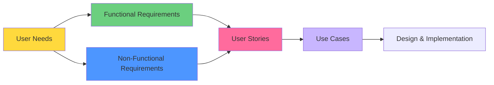

# Requirements - README

> 📁 **Folder**: `03_Requirements`  
> 📅 **Cập nhật**: 10/02/2026  
> 🎯 **Mục đích**: Tổng hợp yêu cầu hệ thống UFPMS

---

## 📁 Cấu Trúc Folder

```
03_Requirements/
├── README.md (file này)
├── Functional/
│   ├── README.md
│   ├── functional_overview.md
│   ├── module_publication_management.md (15 FRs)
│   ├── module_approval_workflow.md (20 FRs)
│   ├── module_search.md (7 FRs)
│   ├── module_profile.md (6 FRs)
│   ├── module_reporting.md (7 FRs)
│   ├── module_admin.md (10 FRs)
│   └── business_rules.md
└── Non_Functional/
    ├── README.md
    ├── performance.md
    ├── security.md
    ├── usability.md
    ├── scalability.md
    └── compatibility.md
```

---

## 🎯 Tổng Quan

**Requirements Engineering** chuyển đổi:
- **FROM**: User needs (từ System Clarification)
- **TO**: Yêu cầu hệ thống cụ thể, có thể đo lường, kiểm thử

---

## 📊 Tổng Số Requirements

### Functional Requirements (FRs)

| Module | FRs | P0 (Must Have) | P1 (Should Have) | P2 (Nice to Have) |
|--------|-----|----------------|------------------|-------------------|
| 1. Publication Management | 15 | 12 | 2 | 1 |
| 2. Approval Workflow | 20 | 18 | 2 | 0 |
| 3. Search & Browse | 7 | 2 | 4 | 1 |
| 4. Researcher Profile | 6 | 1 | 3 | 2 |
| 5. Reporting & Analytics | 7 | 1 | 4 | 2 |
| 6. Admin & User Management | 10 | 8 | 2 | 0 |
| **TỔNG** | **65** | **42** | **17** | **6** |

### Non-Functional Requirements (NFRs)

| Category | Key Metrics |
|----------|-------------|
| **Performance** | Page load < 2s, Search < 1s, 100 concurrent users |
| **Security** | LDAP SSO, HTTPS, RBAC, Audit logs |
| **Usability** | Form < 5 phút, Responsive, WCAG AA |
| **Scalability** | 20K publications, 1K users, Stateless architecture |
| **Compatibility** | Chrome 90+, MySQL 8.0+, Windows/Linux |

---

## 🗺️ Traceability Map



---

## 📖 Hướng Dẫn Đọc

### Cho Product Owner / Stakeholders
1. **[Functional Overview](./Functional/functional_overview.md)** - Tổng quan 6 modules
2. **[Business Rules](./Functional/business_rules.md)** - Quy tắc nghiệp vụ cốt lõi

### Cho Developers
1. **[Module 1: Publication Management](./Functional/module_publication_management.md)** - CRUD bài báo
2. **[Module 2: Approval Workflow](./Functional/module_approval_workflow.md)** - Quy trình phê duyệt 2 cấp
3. **[Performance](./Non_Functional/performance.md)** - Targets hiệu năng
4. **[Security](./Non_Functional/security.md)** - Yêu cầu bảo mật

### Cho Testers
1. **Functional Requirements** → Test cases
2. **Acceptance Criteria** → Validation checklist
3. **[Performance](./Non_Functional/performance.md)** → Load testing scenarios

### Cho UI/UX Designers
1. **[Usability](./Non_Functional/usability.md)** - UI/UX guidelines
2. **[User Groups](../02_System_Clarification/User_Analysis/user_groups.md)** - Personas
3. **[User Journeys](../02_System_Clarification/User_Analysis/user_groups.md#user-journeys)** - Flows

---

## 🔑 Key Highlights

### 1. Dual-Mode System
```
Private Mode (Internal):
  - LDAP/AD authentication
  - Quy trình phê duyệt 2 cấp
  - Xem tất cả trạng thái

Public Mode (External):
  - No authentication required
  - CHỈ xem PUBLISHED publications
  - Search + Profile công khai
```

---

### 2. Quy Trình Phê Duyệt 2 Cấp

```
DRAFT → SUBMITTED → FACULTY_REVIEWING → FACULTY_APPROVED
                          ↓                    ↓
                   REVISION_REQUIRED    UNIVERSITY_REVIEWING
                          ↓                    ↓
                        DRAFT              PUBLISHED
```

**State Machine**: 9 trạng thái  
**Roles**: Researcher, Faculty Reviewer, University Reviewer  
**SLA Target**: 6-14 ngày (submit → publish)

---

### 3. Core Business Rules

| Rule | Description |
|------|-------------|
| **Visibility** | CHỈ PUBLISHED hiển thị công khai |
| **Ownership** | CHỈ owner sửa/xóa được (if DRAFT) |
| **Co-authors** | View only, không sửa/xóa |
| **Validation** | DOI, ISSN, ORCID format check |
| **Audit** | Log mọi state transition |

---

### 4. MVP Scope (P0 Requirements)

**42 P0 FRs** phải có trong MVP:

**Module 1 (Publication)**: 12 FRs
- CRUD bài báo
- Upload PDF
- Metadata management

**Module 2 (Approval)**: 18 FRs
- Submit for review
- Faculty review (approve/reject/revision)
- University review (approve/reject)
- Email notifications
- Audit trail

**Module 6 (Admin)**: 8 FRs
- User management
- Role assignment
- LDAP configuration
- Audit logs

**Other modules**: Search, Profile, Reporting (basic features)

---

## ✅ Acceptance Criteria Format

Tất cả FRs đều có acceptance criteria theo format:

```
GIVEN [precondition]
WHEN [action]
THEN [expected outcome]
AND [additional outcomes]
```

**Example**:
```
FR-PUB-001: Tạo Bài Báo Mới
GIVEN giảng viên đã đăng nhập
WHEN nhấn "Thêm bài báo mới"
THEN hiển thị form với các trường bắt buộc
AND trạng thái mặc định = DRAFT
```

---

## 🔗 Dependencies & Integration Points

### External Systems
- **LDAP/AD**: Authentication (P0)
- **Email Server**: Notifications (P0)
- **HR System**: User sync (P1)
- **DOI Resolver**: Auto-fetch metadata (P2)
- **ORCID API**: Import publications (P2)

---

## 📈 Metrics & KPIs

### Process Improvement (vs As-Is)

| Metric | As-Is | To-Be | Improvement |
|--------|-------|-------|-------------|
| Thời gian nhập 1 bài báo | 15-30 phút | < 5 phút | **83-93% faster** |
| Thời gian tạo báo cáo | 2-3 ngày | < 5 phút | **99.9% faster** |
| Tỉ lệ giảng viên tham gia | ~60% | > 80% | **+33%** |
| Tỉ lệ trùng lặp | 15-20% | ~0% | **100% reduction** |

---

## 🚀 Next Steps

Sau khi Requirements đã clear:

### 📁 04_User_Stories
- Viết user stories cho 5 roles
- Format: "As a [role], I want [feature], so that [value]"
- Acceptance criteria
- Prioritization (MoSCoW)

### 📁 05_Use_Cases
- Use case diagrams
- Detailed specifications
- Normal + Alternative flows
- Sequence diagrams

### 📁 06_Diagrams
- ERD (database design)
- Class diagrams
- Sequence diagrams
- Activity diagrams

---

## 📝 Validation Checklist

Trước khi chuyển sang Design:

- [ ] Tất cả user needs đã map sang FRs
- [ ] FRs có acceptance criteria rõ ràng
- [ ] Priorities (P0/P1/P2) đã đồng thuận
- [ ] NFRs có metrics đo lường được
- [ ] Business rules đã documented
- [ ] Dependencies đã identified
- [ ] Stakeholders đã review & approve

---

**Tài liệu liên quan**:
- [System Clarification](../02_System_Clarification/)
- [User Analysis](../02_System_Clarification/User_Analysis/)
- [To-Be Process](../02_System_Clarification/Business_Context/to_be_process.md)
- [System Specification](../01_System_Specification/)

---

*Hoàn thành: 10/02/2026 22:30*
