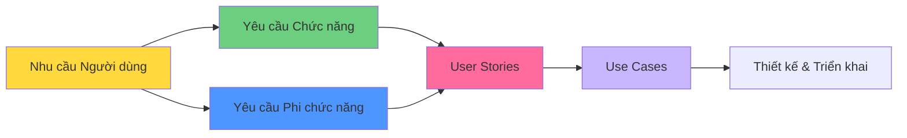

# Requirements - README (Yêu cầu hệ thống)

> 📁 **Thư mục**: `03_Requirements`  
> 📅 **Cập nhật**: 10/02/2026  
> 🎯 **Mục đích**: Tổng hợp yêu cầu hệ thống UFPMS

---

## 📁 Cấu Trúc Thư Mục

```
03_Requirements/
├── README.md (file này)
├── Functional/
│   ├── README.md
│   ├── functional_overview.md
│   ├── module_publication_management.md (15 Yêu cầu chức năng)
│   ├── module_approval_workflow.md (20 Yêu cầu chức năng)
│   ├── module_search.md (7 Yêu cầu chức năng)
│   ├── module_profile.md (6 Yêu cầu chức năng)
│   ├── module_reporting.md (7 Yêu cầu chức năng)
│   ├── module_admin.md (10 Yêu cầu chức năng)
│   └── business_rules.md
└── Non_Functional/
    ├── README.md
    ├── performance.md
    ├── security.md
    ├── usability.md
    ├── scalability.md
    └── compatibility.md
```

---

## 🎯 Tổng Quan

**Kỹ thuật yêu cầu (Requirements Engineering)** chuyển đổi:
- **TỪ**: Nhu cầu người dùng (từ Làm rõ hệ thống)
- **SANG**: Yêu cầu hệ thống cụ thể, có thể đo lường, kiểm thử

---

## 📊 Tổng Số Yêu Cầu

### Yêu Cầu Chức Năng (Functional Requirements - FRs)

| Phân hệ | Số lượng FR | P0 (Bắt buộc) | P1 (Nên có) | P2 (Có thì tốt) |
|--------|-----|----------------|------------------|-------------------|
| 1. Quản lý Bài báo | 15 | 12 | 2 | 1 |
| 2. Quy trình Phê duyệt | 20 | 18 | 2 | 0 |
| 3. Tìm kiếm & Duyệt | 7 | 2 | 4 | 1 |
| 4. Hồ sơ Nghiên cứu viên | 6 | 1 | 3 | 2 |
| 5. Báo cáo & Phân tích | 7 | 1 | 4 | 2 |
| 6. Quản trị & Quản lý Người dùng | 10 | 8 | 2 | 0 |
| **TỔNG** | **65** | **42** | **17** | **6** |

### Yêu Cầu Phi Chức Năng (Non-Functional Requirements - NFRs)

| Danh mục | Chỉ số chính |
|----------|-------------|
| **Hiệu năng** | Tải trang < 2s, Tìm kiếm < 1s, 100 người dùng đồng thời |
| **Bảo mật** | Đăng nhập một lần LDAP, HTTPS, RBAC (kiểm soát truy cập dựa trên vai trò), Nhật ký kiểm toán |
| **Tính khả dụng** | Biểu mẫu < 5 phút, Responsive, WCAG AA |
| **Khả năng mở rộng** | 20K bài báo, 1K người dùng, Kiến trúc phi trạng thái |
| **Tính tương thích** | Chrome 90+, MySQL 8.0+, Windows/Linux |

---

## 🗺️ Bản Đồ Truy Xuất Nguồn Gốc (Traceability Map)



---

## 📖 Hướng Dẫn Đọc

### Dành cho Product Owner / Các bên liên quan
1. **[Tổng quan Chức năng](./Functional/functional_overview.md)** - Tổng quan 6 phân hệ
2. **[Quy tắc Nghiệp vụ](./Functional/business_rules.md)** - Quy tắc nghiệp vụ cốt lõi

### Dành cho Lập trình viên
1. **[Phân hệ 1: Quản lý Bài báo](./Functional/module_publication_management.md)** - Thêm/Xóa/Sửa bài báo
2. **[Phân hệ 2: Quy trình Phê duyệt](./Functional/module_approval_workflow.md)** - Quy trình phê duyệt 2 cấp
3. **[Hiệu năng](./Non_Functional/performance.md)** - Mục tiêu hiệu năng
4. **[Bảo mật](./Non_Functional/security.md)** - Yêu cầu bảo mật

### Dành cho Kiểm thử viên (Testers)
1. **Yêu cầu Chức năng** → Test cases
2. **Tiêu chí Chấp nhận** → Danh sách kiểm tra xác nhận
3. **[Hiệu năng](./Non_Functional/performance.md)** → Kịch bản kiểm thử tải

### Dành cho Thiết kế UI/UX
1. **[Tính khả dụng](./Non_Functional/usability.md)** - Hướng dẫn UI/UX
2. **[Nhóm Người dùng](../02_System_Clarification/User_Analysis/user_groups.md)** - Chân dung người dùng (Personas)
3. **[Hành trình Người dùng](../02_System_Clarification/User_Analysis/user_groups.md#user-journeys)** - Luồng người dùng

---

## 🔑 Điểm Nổi Bật Chính

### 1. Hệ Thống Chế Độ Kép (Dual-Mode System)
```
Chế độ Riêng tư (Nội bộ):
  - Xác thực LDAP/AD
  - Quy trình phê duyệt 2 cấp
  - Xem tất cả trạng thái

Chế độ Công khai (Bên ngoài):
  - Không yêu cầu xác thực
  - CHỈ xem các bài báo ĐÃ XUẤT BẢN
  - Tìm kiếm + Hồ sơ công khai
```

---

### 2. Quy Trình Phê Duyệt 2 Cấp

```
DRAFT (Nháp) → SUBMITTED (Đã nộp) → FACULTY_REVIEWING (Khoa đang duyệt) → FACULTY_APPROVED (Khoa đã duyệt)
                           ↓                    ↓
                    REVISION_REQUIRED    UNIVERSITY_REVIEWING (Trường đang duyệt)
                    (Yêu cầu chỉnh sửa)          ↓
                           ↓                    ↓
                         DRAFT              PUBLISHED (Đã xuất bản)
```

**Máy trạng thái**: 9 trạng thái  
**Vai trò**: Nhà nghiên cứu, Người duyệt cấp Khoa, Người duyệt cấp Trường  
**Mục tiêu SLA**: 6-14 ngày (nộp → xuất bản)

---

### 3. Quy Tắc Nghiệp Vụ Cốt Lõi

| Quy tắc | Mô tả |
|------|-------------|
| **Hiển thị** | CHỈ bài báo ĐÃ XUẤT BẢN hiển thị công khai |
| **Quyền sở hữu** | CHỈ chủ sở hữu sửa/xóa được (nếu là NHÁP) |
| **Đồng tác giả** | Chỉ xem, không sửa/xóa |
| **Kiểm tra hợp lệ** | Kiểm tra định dạng DOI, ISSN, ORCID |
| **Kiểm toán** | Ghi nhật ký mọi chuyển đổi trạng thái |

---

### 4. Phạm vi MVP (Yêu cầu P0)

**42 Yêu cầu chức năng P0** phải có trong MVP:

**Phân hệ 1 (Bài báo)**: 12 Yêu cầu
- Thêm/Xóa/Sửa bài báo
- Tải lên PDF
- Quản lý siêu dữ liệu

**Phân hệ 2 (Phê duyệt)**: 18 Yêu cầu
- Nộp để xem xét
- Khoa xem xét (phê duyệt/từ chối/yêu cầu chỉnh sửa)
- Trường xem xét (phê duyệt/từ chối)
- Thông báo qua Email
- Lịch sử kiểm toán

**Phân hệ 6 (Quản trị)**: 8 Yêu cầu
- Quản lý người dùng
- Phân quyền vai trò
- Cấu hình LDAP
- Nhật ký kiểm toán

**Các phân hệ khác**: Tìm kiếm, Hồ sơ, Báo cáo (tính năng cơ bản)

---

## ✅ Định Dạng Tiêu Chí Chấp Nhận

Tất cả Yêu cầu chức năng đều có tiêu chí chấp nhận theo định dạng:

```
GIVEN (KHI) [điều kiện tiên quyết]
WHEN (LÚC) [hành động]
THEN (THÌ) [kết quả mong đợi]
AND (VÀ) [kết quả bổ sung]
```

**Ví dụ**:
```
FR-PUB-001: Tạo Bài Báo Mới
GIVEN giảng viên đã đăng nhập
WHEN nhấn "Thêm bài báo mới"
THEN hiển thị form với các trường bắt buộc
AND trạng thái mặc định = DRAFT
```

---

## 🔗 Sự Phụ Thuộc & Điểm Tích Hợp

### Hệ Thống Bên Ngoài
- **LDAP/AD**: Xác thực (P0)
- **Máy chủ Email**: Thông báo (P0)
- **Hệ thống Nhân sự**: Đồng bộ người dùng (P1)
- **Bộ giải quyết DOI**: Tự động lấy siêu dữ liệu (P2)
- **API ORCID**: Nhập bài báo (P2)

---

## 📈 Chỉ Số & KPI

### Cải Tiến Quy Trình (so với Hiện tại)

| Chỉ số | Hiện tại | Tương lai | Cải thiện |
|--------|-------|-------|-------------|
| Thời gian nhập 1 bài báo | 15-30 phút | < 5 phút | **nhanh hơn 83-93%** |
| Thời gian tạo báo cáo | 2-3 ngày | < 5 phút | **nhanh hơn 99.9%** |
| Tỉ lệ giảng viên tham gia | ~60% | > 80% | **+33%** |
| Tỉ lệ trùng lặp | 15-20% | ~0% | **giảm 100%** |

---

## 🚀 Các Bước Tiếp Theo

Sau khi Yêu cầu đã rõ ràng:

### 📁 04_User_Stories
- Viết user stories cho 5 vai trò
- Định dạng: "Là một [vai trò], tôi muốn [tính năng], để [giá trị]"
- Tiêu chí chấp nhận
- Ưu tiên (MoSCoW)

### 📁 05_Use_Cases
- Sơ đồ Use case
- Đặc tả chi tiết
- Luồng bình thường + Ngoại lệ
- Sơ đồ tuần tự

### 📁 06_Diagrams (Sơ đồ)
- ERD (thiết kế cơ sở dữ liệu)
- Sơ đồ lớp (Class diagrams)
- Sơ đồ tuần tự (Sequence diagrams)
- Sơ đồ hoạt động (Activity diagrams)

---

## 📝 Danh Sách Kiểm Tra Xác Nhận

Trước khi chuyển sang Thiết kế:

- [ ] Tất cả nhu cầu người dùng đã ánh xạ sang Yêu cầu chức năng
- [ ] Yêu cầu chức năng có tiêu chí chấp nhận rõ ràng
- [ ] Độ ưu tiên (P0/P1/P2) đã được đồng thuận
- [ ] Yêu cầu phi chức năng có các chỉ số đo lường được
- [ ] Quy tắc nghiệp vụ đã được tài liệu hóa
- [ ] Các sự phụ thuộc đã được xác định
- [ ] Các bên liên quan đã xem xét & phê duyệt

---

**Tài liệu liên quan**:
- [Làm rõ Hệ thống](../02_System_Clarification/)
- [Phân tích Người dùng](../02_System_Clarification/User_Analysis/)
- [Quy trình Tương lai](../02_System_Clarification/Business_Context/to_be_process.md)
- [Đặc tả Hệ thống](../01_System_Specification/)

---

*Hoàn thành: 10/02/2026 22:30*
