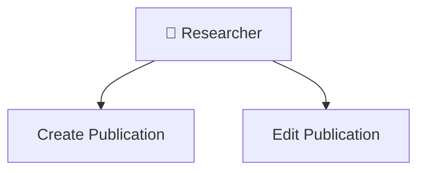

# Use Case Diagrams - README

> 📁 **Folder**: Diagrams  
> 📅 **Cập nhật**: 10/02/2026  
> 🎯 **Mục đích**: Use case diagrams trực quan hóa actors và use cases

---

## 📊 Tổng Quan

Folder này chứa các use case diagrams được tạo bằng Mermaid để minh họa tương tác giữa actors và hệ thống.

---

## 📋 Danh Sách Diagrams

### 1. Overall System Diagram
**File**: `overall_system_diagram.md`  
**Mô tả**: Diagram tổng quan toàn hệ thống
- Tất cả 5 actors
- Tất cả 6 high-level use cases
- Mối quan hệ giữa actors và use cases

> **Note**: Diagram này đã được nhúng trong [Main README](../README.md#use-case-diagram---tổng-quan-hệ-thống)

---

### 2. Module-Specific Diagrams

Các diagrams chi tiết cho từng module:

| Module | File | Mô Tả |
|--------|------|-------|
| Module 1 | `module_01_publication_management.md` | Researcher với Publication Management |
| Module 2 | `module_02_approval_workflow.md` | 3 actors trong approval workflow |
| Module 3 | `module_03_search_browse.md` | Public Visitor với search features |
| Module 4 | `module_04_researcher_profile.md` | researcher và public viewing profiles |
| Module 5 | `module_05_reporting_analytics.md` | Reviewers với reporting |
| Module 6 | `module_06_admin_management.md` | SuperAdmin với all admin features |

---

### 3. Actor Relationship Diagram
**File**: `actor_relationships.md`  
**Mô tả**: Hiển thị actors nào tương tác với modules nào

---

## 🎨 Mermaid Syntax

Tất cả diagrams sử dụng Mermaid syntax để dễ dàng render trong Markdown viewers.

Example:

---

## 🚧 Trạng Thái

> [!IMPORTANT]
> **Diagrams được nhúng trong các README files**
> 
> Thay vì tạo các file diagram riêng, chúng tôi đã nhúng diagrams trực tiếp vào:
> - ✅ Main README: Overall system diagram
> - ✅ High-Level README: 6-module overview diagram
> - ✅ High-Level UCs: Individual module interactions
>
> Cách tiếp cận này giúp:
> - Diagrams luôn ở đúng context
> - Dễ maintain (không duplicate)
> - Render tốt trong GitHub/GitLab

---

## 📐 Diagrams Bổ Sung (Phase 2)

Các diagrams sau sẽ được tạo khi cần:

1. **Sequence Diagrams**: Chi tiết interaction flows
   - Approval workflow sequences
   - Email notification sequences
   - LDAP authentication sequence

2. **Activity Diagrams**: Business process flows
   - Full approval workflow
   - Report generation process
   - Backup/restore process

3. **State Diagrams**: Publication state machine
   - 9 states và transitions
   - Đã có trong [UC-HL-002](../High_Level/uc_hl_02_approval_workflow.md#workflow-state-machine)

---

**Tài liệu liên quan**:
- [Main README with Overall Diagram](../README.md)
- [High-Level Use Cases](../High_Level/)
- [Sequence Diagrams Folder](../Sequence_Diagrams/) (Phase 2)
- [Activity Diagrams Folder](../Activity_Diagrams/) (Phase 2)
