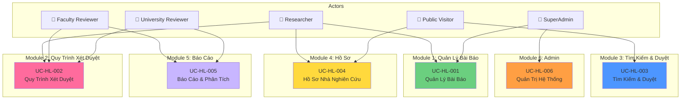

# High-Level Use Cases - README

> 📁 **Cấp Độ**: High-Level Use Cases (Use Case Cấp Cao)  
> 📅 **Cập nhật**: 10/02/2026  
> 🎯 **Mục đích**: Tổng quan 6 modules chính của UFPMS

---

## 📊 Tổng Quan

High-level use cases cung cấp cái nhìn tổng quan về các chức năng chính của hệ thống, mỗi use case tương ứng với 1 module.

### 6 Use Cases Cấp Cao

| ID UC | Tên Use Case | Tác Nhân | User Stories | Module |
|-------|--------------|--------|--------------|--------|
| UC-HL-001 | Quản Lý Bài Báo | Researcher, SuperAdmin | 9 stories | Module 1 |
| UC-HL-002 | Quy Trình Xét Duyệt | Researcher, FCR, UNR | 26 stories | Module 2 |
| UC-HL-003 | Tìm Kiếm & Duyệt Bài Báo | Khách, Tất cả | 8 stories | Module 3 |
| UC-HL-004 | Quản Lý Hồ Sơ Nhà Nghiên Cứu | Researcher, Khách | 6 stories | Module 4 |
| UC-HL-005 | Báo Cáo & Phân Tích | FCR, UNR, SuperAdmin | 7 stories | Module 5 |
| UC-HL-006 | Quản Trị Hệ Thống | SuperAdmin | 10 stories | Module 6 |

---

## 🗺️ Biểu Đồ Use Case Cấp Cao

---

## 📖 Nội Dung

### [UC-HL-001: Quản Lý Bài Báo](./uc_hl_01_manage_publications.md)
**Tác Nhân**: Researcher, SuperAdmin  
**Mô tả**: Quản lý vòng đời bài báo từ tạo mới, chỉnh sửa, đến xóa. Bao gồm upload PDF và quản lý metadata.

---

### [UC-HL-002: Quy Trình Xét Duyệt](./uc_hl_02_approval_workflow.md)
**Tác Nhân**: Researcher, Faculty Reviewer, University Reviewer  
**Mô tả**: Quy trình phê duyệt 2 cấp (Khoa → Trường) với các hành động: nộp, phê duyệt, từ chối, yêu cầu chỉnh sửa.

---

### [UC-HL-003: Tìm Kiếm & Duyệt Bài Báo](./uc_hl_03_search_browse.md)
**Tác Nhân**: Khách, Researcher, SuperAdmin  
**Mô tả**: Tìm kiếm và duyệt bài báo công khai với bộ lọc (filtering), sắp xếp (sorting), và phân trang (pagination).

---

### [UC-HL-004: Quản Lý Hồ Sơ Nhà Nghiên Cứu](./uc_hl_04_researcher_profile.md)
**Tác Nhân**: Researcher, Khách  
**Mô tả**: Xem và chỉnh sửa hồ sơ giảng viên với danh sách công trình và thông số phân tích.

---

### [UC-HL-005: Báo Cáo & Phân Tích](./uc_hl_05_reporting_analytics.md)
**Tác Nhân**: Faculty Reviewer, University Reviewer, SuperAdmin  
**Mô tả**: Tạo báo cáo và xem phân tích về năng suất nghiên cứu cấp Khoa và Trường.

---

### [UC-HL-006: Quản Trị Hệ Thống](./uc_hl_06_admin_management.md)
**Tác Nhân**: SuperAdmin  
**Mô tả**: Quản trị người dùng, cấu hình hệ thống, sao lưu (backup), và giám sát nhật ký kiểm toán (audit logs).

---

**Tài liệu liên quan**:
- [README Chính](../README.md)
- [Use Cases Cấp Trung (Medium-Level)](../Medium_Level/)
- [Biểu Đồ Use Case](../Diagrams/)
