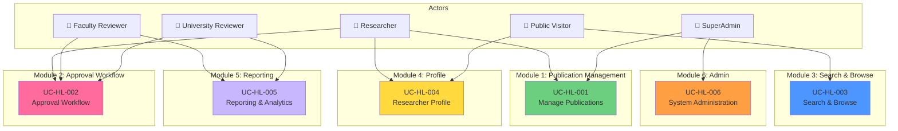

# High-Level Use Cases - README

> 📁 **Level**: High-Level Use Cases  
> 📅 **Cập nhật**: 10/02/2026  
> 🎯 **Mục đích**: Tổng quan 6 modules chính của UFPMS

---

## 📊 Tổng Quan

High-level use cases cung cấp cái nhìn tổng quan về các chức năng chính của hệ thống, mỗi use case tương ứng với 1 module.

### 6 High-Level Use Cases

| UC ID | Tên Use Case | Actors | User Stories | Module |
|-------|--------------|--------|--------------|--------|
| UC-HL-001 | Manage Publications | Researcher, SuperAdmin | 9 stories | Module 1 |
| UC-HL-002 | Approval Workflow | Researcher, FCR, UNR | 26 stories | Module 2 |
| UC-HL-003 | Search & Browse Publications | Public Visitor, All | 8 stories | Module 3 |
| UC-HL-004 | Researcher Profile Management | Researcher, Public Visitor | 6 stories | Module 4 |
| UC-HL-005 | Reporting & Analytics | FCR, UNR, SuperAdmin | 7 stories | Module 5 |
| UC-HL-006 | System Administration | SuperAdmin | 10 stories | Module 6 |

---

## 🗺️ High-Level Use Case Diagram

---

## 📖 Nội Dung

### [UC-HL-001: Manage Publications](./uc_hl_01_manage_publications.md)
**Actors**: Researcher, SuperAdmin  
**Mô tả**: Quản lý vòng đời bài báo từ tạo mới, chỉnh sửa, đến xóa. Bao gồm upload PDF và quản lý metadata.

---

### [UC-HL-002: Approval Workflow](./uc_hl_02_approval_workflow.md)
**Actors**: Researcher, Faculty Reviewer, University Reviewer  
**Mô tả**: Quy trình phê duyệt 2 cấp (Faculty → University) với các hành động: submit, approve, reject, request revision.

---

### [UC-HL-003: Search & Browse Publications](./uc_hl_03_search_browse.md)
**Actors**: Public Visitor, Researcher, SuperAdmin  
**Mô tả**: Tìm kiếm và duyệt bài báo công khai với filtering, sorting, và pagination.

---

### [UC-HL-004: Researcher Profile Management](./uc_hl_04_researcher_profile.md)
**Actors**: Researcher, Public Visitor  
**Mô tả**: Xem và chỉnh sửa profile giảng viên với danh sách công trình và analytics.

---

### [UC-HL-005: Reporting & Analytics](./uc_hl_05_reporting_analytics.md)
**Actors**: Faculty Reviewer, University Reviewer, SuperAdmin  
**Mô tả**: Tạo báo cáo và xem analytics về năng suất nghiên cứu cấp Khoa và Trường.

---

### [UC-HL-006: System Administration](./uc_hl_06_admin_management.md)
**Actors**: SuperAdmin  
**Mô tả**: Quản trị người dùng, cấu hình hệ thống, backup, và monitor audit logs.

---

**Tài liệu liên quan**:
- [Main README](../README.md)
- [Medium-Level Use Cases](../Medium_Level/)
- [Use Case Diagrams](../Diagrams/)
