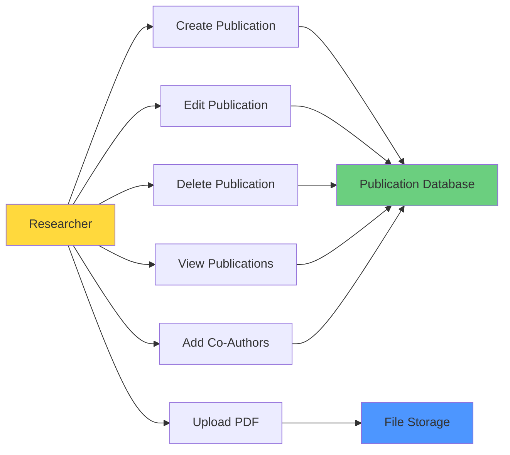

# UC-HL-001: Manage Publications

> **Module**: 1 - Publication Management  
> **Priority**: 🔴 P0 - Must Have  
> **Actors**: Researcher, SuperAdmin

---

## 📋 Use Case Overview

**ID**: UC-HL-001  
**Name**: Manage Publications  
**Description**: Giảng viên và Admin quản lý toàn bộ vòng đời của bài báo khoa học, bao gồm tạo mới, chỉnh sửa, xóa, upload PDF, và quản lý metadata.

---

## 👥 Actors

### Primary Actors
- **Researcher (Giảng viên)**: Tạo và quản lý bài báo của mình
- **SuperAdmin**: Quản lý tất cả bài báo trong hệ thống

### Secondary Actors  
- **System**: Tự động validate, lưu trữ files

---

## 🎯 Goals

- Researcher có thể dễ dàng nhập bài báo vào hệ thống
- Metadata được quản lý đầy đủ và chính xác
- Files PDF được lưu trữ an toàn
- Hỗ trợ co-authors và validation

---

## 🔗 Related Artifacts

**User Stories** (9 stories):
- US-RES-001: Tạo Bài Báo Mới
- US-RES-002: Upload File PDF
- US-RES-003: Sửa Bài Báo Nháp
- US-RES-004: Xóa Bài Báo Nháp
- US-RES-005: Xem Danh Sách Bài Báo
- US-RES-006: Thêm Đồng Tác Giả
- US-RES-007: Gắn Tags/Keywords
- US-RES-008: Xem Chi Tiết Bài Báo
- US-RES-009: Download File PDF

**Functional Requirements**:
- FR-PUB-001 to FR-PUB-015

---

## 📊 Main Capabilities

---

## 🔄 Main Flow (High-Level)

### 1. Create Publication
1. Researcher clicks "Add New Publication"
2. System displays form with required and optional fields
3. Researcher enters metadata
4. System validates input (DOI, ISSN format)
5. System saves with status = DRAFT
6. System shows success message

### 2. Upload PDF
1. Researcher selects publication
2. Researcher chooses PDF file (< 10MB)
3. System validates file type and size
4. System uploads to storage
5. System saves file path to database

### 3. Edit Publication
1. Researcher selects DRAFT or REVISION_REQUIRED publication
2. Researcher modifies information
3. System validates changes
4. System updates database
5. System logs audit trail

### 4. Delete Publication
1. Researcher selects DRAFT publication
2. Researcher confirms deletion
3. System soft deletes (sets deleted_at timestamp)
4. System removes PDF from storage
5. System redirects to publication list

### 5. View Publications
1. Researcher accesses "My Publications"
2. System displays publications list
3. Researcher can filter by status
4. Researcher can sort by date
5. System shows actions based on status

---

## ✅ Preconditions

- User is authenticated (LDAP/AD login)
- User has Researcher or SuperAdmin role
- System database is accessible

---

## 📝 Postconditions

**Success**:
- Publication is created/updated/deleted in database
- Files are stored securely
- Audit logs are created
- User sees confirmation message

**Failure**:
- No data is changed
- Error message is displayed
- System state is unchanged

---

## 🔒 Business Rules

### BR-PUB-001: Ownership
- CHỈ owner (tác giả chính) mới được sửa/xóa bài báo
- Co-authors có quyền xem nhưng không sửa/xóa

### BR-PUB-002: Status-Based Permissions
- Sửa được KHI: status = DRAFT hoặc REVISION_REQUIRED
- Xóa được KHI: status = DRAFT only
- KHÔNG sửa/xóa KHI: SUBMITTED, REVIEWING, PUBLISHED

### BR-PUB-003: File Management
- PDF file type only
- Max size: 10MB
- Files are stored outside web root
- File names are sanitized

### BR-PUB-004: Validation
- DOI format: `10.xxxx/xxxxx`
- ISSN format: `xxxx-xxxx`
- Required fields: Title, Authors, Year, Journal
- Year: 1900 ≤ year ≤ current year + 1

### BR-PUB-005: Default Values
- New publication status = DRAFT
- Created_by = current user
- Created_at = current timestamp

---

## 📐 Sub Use Cases (Medium-Level)

This high-level use case breaks down into:

- [UC-M1-001: Create Publication](../Medium_Level/module_01_publication_management.md#uc-m1-001)
- [UC-M1-002: Edit Publication](../Medium_Level/module_01_publication_management.md#uc-m1-002)
- [UC-M1-003: Delete Publication](../Medium_Level/module_01_publication_management.md#uc-m1-003)
- [UC-M1-004: View Publication List](../Medium_Level/module_01_publication_management.md#uc-m1-004)
- [UC-M1-005: View Publication Details](../Medium_Level/module_01_publication_management.md#uc-m1-005)
- [UC-M1-006: Upload PDF File](../Medium_Level/module_01_publication_management.md#uc-m1-006)
- [UC-M1-007: Download PDF File](../Medium_Level/module_01_publication_management.md#uc-m1-007)
- [UC-M1-008: Add Co-Authors](../Medium_Level/module_01_publication_management.md#uc-m1-008)
- [UC-M1-009: Validate DOI/ISSN](../Medium_Level/module_01_publication_management.md#uc-m1-009)

---

## 📊 Key Metrics

- **Performance**: Create publication < 3 seconds
- **Usability**: Form completion time < 5 minutes
- **Storage**: Support up to 20,000 publications
- **Reliability**: 99.9% file upload success rate

---

## 🚨 Exceptions & Error Handling

| Error | Condition | System Response |
|-------|-----------|-----------------|
| Invalid DOI | DOI format incorrect | Show error message with format hint |
| File too large | PDF > 10MB | Reject upload, show size limit |
| Duplicate DOI | DOI already exists | Warn user, suggest add as co-author |
| Unauthorized edit | User not owner | Display "Access denied" message |
| Network error | Upload failed | Show retry option |

---

**Tài liệu liên quan**:
- [User Stories - Researcher](../../04_User_Stories/By_Role/researcher_stories.md)
- [Requirements - Publication Management](../../03_Requirements/Functional/module_publication_management.md)
- [Medium-Level Use Cases](../Medium_Level/module_01_publication_management.md)
