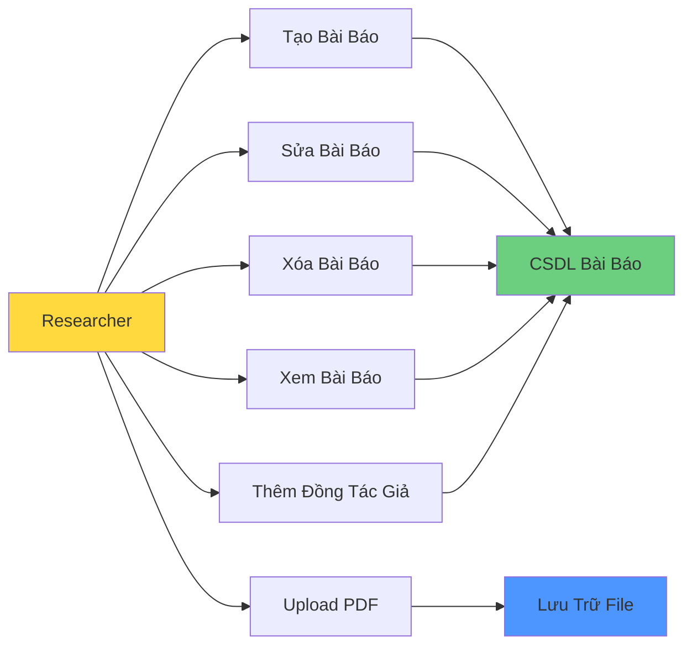

# UC-HL-001: Quản Lý Bài Báo (Manage Publications)

> **Module**: 1 - Quản Lý Bài Báo  
> **Độ Ưu Tiên**: 🔴 P0 - Phải Có  
> **Tác Nhân**: Researcher, SuperAdmin

---

## 📋 Tổng Quan Use Case

**ID**: UC-HL-001  
**Tên**: Quản Lý Bài Báo  
**Mô Tả**: Giảng viên và Admin quản lý toàn bộ vòng đời của bài báo khoa học, bao gồm tạo mới, chỉnh sửa, xóa, tải lên PDF, và quản lý siêu dữ liệu (metadata).

---

## 👥 Tác Nhân

### Tác Nhân Chính
- **Researcher (Giảng viên)**: Tạo và quản lý bài báo của mình
- **SuperAdmin**: Quản lý tất cả bài báo trong hệ thống

### Tác Nhân Phụ
- **Hệ Thống**: Tự động xác thực, lưu trữ tập tin

---

## 🎯 Mục Tiêu

- Researcher có thể dễ dàng nhập bài báo vào hệ thống
- Metadata được quản lý đầy đủ và chính xác
- Files PDF được lưu trữ an toàn
- Hỗ trợ đồng tác giả (co-authors) và xác thực (validation)

---

## 🔗 Tài Liệu Liên Quan

**User Stories** (9 stories):
- US-RES-001: Tạo Bài Báo Mới
- US-RES-002: Upload File PDF
- US-RES-003: Sửa Bài Báo Nháp
- US-RES-004: Xóa Bài Báo Nháp
- US-RES-005: Xem Danh Sách Bài Báo
- US-RES-006: Thêm Đồng Tác Giả
- US-RES-007: Gắn Tags/Keywords
- US-RES-008: Xem Chi Tiết Bài Báo
- US-RES-009: Download File PDF

**Yêu Cầu Chức Năng**:
- FR-PUB-001 đến FR-PUB-015

---

## 📊 Chức Năng Chính

---

## 🔄 Luồng Chính (Cấp Cao)

### 1. Tạo Bài Báo
1. Researcher nhấn "Thêm Bài Báo Mới"
2. Hệ thống hiển thị biểu mẫu với các trường bắt buộc và tùy chọn
3. Researcher nhập metadata
4. Hệ thống xác thực đầu vào (định dạng DOI, ISSN)
5. Hệ thống lưu với trạng thái = DRAFT (Nháp)
6. Hệ thống hiển thị thông báo thành công

### 2. Upload PDF
1. Researcher chọn bài báo
2. Researcher chọn file PDF (< 10MB)
3. Hệ thống xác thực loại file và kích thước
4. Hệ thống tải lên kho lưu trữ
5. Hệ thống lưu đường dẫn file vào cơ sở dữ liệu

### 3. Sửa Bài Báo
1. Researcher chọn bài báo trạng thái DRAFT hoặc REVISION_REQUIRED
2. Researcher chỉnh sửa thông tin
3. Hệ thống xác thực thay đổi
4. Hệ thống cập nhật cơ sở dữ liệu
5. Hệ thống ghi nhật ký kiểm toán (audit trail)

### 4. Xóa Bài Báo
1. Researcher chọn bài báo trạng thái DRAFT
2. Researcher xác nhận xóa
3. Hệ thống xóa mềm (đặt timestamp deleted_at)
4. Hệ thống xóa file PDF khỏi kho lưu trữ
5. Hệ thống chuyển hướng về danh sách bài báo

### 5. Xem Bài Báo
1. Researcher truy cập "Bài Báo Của Tôi"
2. Hệ thống hiển thị danh sách bài báo
3. Researcher có thể lọc theo trạng thái
4. Researcher có thể sắp xếp theo ngày
5. Hệ thống hiển thị các hành động dựa trên trạng thái

---

## ✅ Điều Kiện Tiên Quyết

- Người dùng đã xác thực (đăng nhập LDAP/AD)
- Người dùng có vai trò Researcher hoặc SuperAdmin
- Cơ sở dữ liệu hệ thống có thể truy cập được

---

## 📝 Điều Kiện Hậu Quyết

**Thành Công**:
- Bài báo được tạo/cập nhật/xóa trong cơ sở dữ liệu
- File được lưu trữ an toàn
- Nhật ký kiểm toán được tạo
- Người dùng thấy thông báo xác nhận

**Thất Bại**:
- Không có dữ liệu nào bị thay đổi
- Thông báo lỗi được hiển thị
- Trạng thái hệ thống không đổi

---

## 🔒 Quy Tắc Nghiệp Vụ

### BR-PUB-001: Quyền Sở Hữu
- CHỈ owner (tác giả chính) mới được sửa/xóa bài báo
- Co-authors có quyền xem nhưng không sửa/xóa

### BR-PUB-002: Quyền Dựa Trên Trạng Thái
- Sửa được KHI: status = DRAFT hoặc REVISION_REQUIRED
- Xóa được KHI: status = DRAFT only
- KHÔNG sửa/xóa KHI: SUBMITTED, REVIEWING, PUBLISHED

### BR-PUB-003: Quản Lý File
- Chỉ chấp nhận loại file PDF
- Kích thước tối đa: 10MB
- File được lưu trữ ngoài thư mục web root
- Tên file được làm sạch (sanitized)

### BR-PUB-004: Xác Thực (Validation)
- Định dạng DOI: `10.xxxx/xxxxx`
- Định dạng ISSN: `xxxx-xxxx`
- Các trường bắt buộc: Tiêu đề, Tác giả, Năm, Tạp chí
- Năm: 1900 ≤ năm ≤ năm hiện tại + 1

### BR-PUB-005: Giá Trị Mặc Định
- Trạng thái bài báo mới = DRAFT
- Created_by = người dùng hiện tại
- Created_at = timestamp hiện tại

---

## 📐 Use Cases Con (Cấp Trung)

Use case cấp cao này phân rã thành:

- [UC-M1-001: Tạo Bài Báo](../Medium_Level/module_01_publication_management.md#uc-m1-001)
- [UC-M1-002: Sửa Bài Báo](../Medium_Level/module_01_publication_management.md#uc-m1-002)
- [UC-M1-003: Xóa Bài Báo](../Medium_Level/module_01_publication_management.md#uc-m1-003)
- [UC-M1-004: Xem Danh Sách Bài Báo](../Medium_Level/module_01_publication_management.md#uc-m1-004)
- [UC-M1-005: Xem Chi Tiết Bài Báo](../Medium_Level/module_01_publication_management.md#uc-m1-005)
- [UC-M1-006: Upload File PDF](../Medium_Level/module_01_publication_management.md#uc-m1-006)
- [UC-M1-007: Download File PDF](../Medium_Level/module_01_publication_management.md#uc-m1-007)
- [UC-M1-008: Thêm Đồng Tác Giả](../Medium_Level/module_01_publication_management.md#uc-m1-008)
- [UC-M1-009: Xác Thực DOI/ISSN](../Medium_Level/module_01_publication_management.md#uc-m1-009)

---

## 📊 Chỉ Số Chính

- **Hiệu năng**: Tạo bài báo < 3 giây
- **Khả năng sử dụng**: Thời gian hoàn thành biểu mẫu < 5 phút
- **Lưu trữ**: Hỗ trợ lên đến 20,000 bài báo
- **Độ tin cậy**: Tỷ lệ upload file thành công 99.9%

---

## 🚨 Ngoại Lệ & Xử Lý Lỗi

| Lỗi | Điều Kiện | Phản Hồi Hệ Thống |
|-------|-----------|-----------------|
| DOI không hợp lệ | Định dạng DOI sai | Hiện thông báo lỗi với gợi ý định dạng |
| File quá lớn | PDF > 10MB | Từ chối upload, hiện giới hạn kích thước |
| Trùng DOI | DOI đã tồn tại | Cảnh báo người dùng, gợi ý thêm với tư cách đồng tác giả |
| Sửa không hợp lệ | Người dùng không phải owner | Hiển thị thông báo "Truy cập bị từ chối" |
| Lỗi mạng | Upload thất bại | Hiển thị tùy chọn thử lại |

---

**Tài liệu liên quan**:
- [User Stories - Researcher](../../04_User_Stories/By_Role/researcher_stories.md)
- [Yêu Cầu - Quản Lý Bài Báo](../../03_Requirements/Functional/module_publication_management.md)
- [Use Cases Cấp Trung](../Medium_Level/module_01_publication_management.md)
