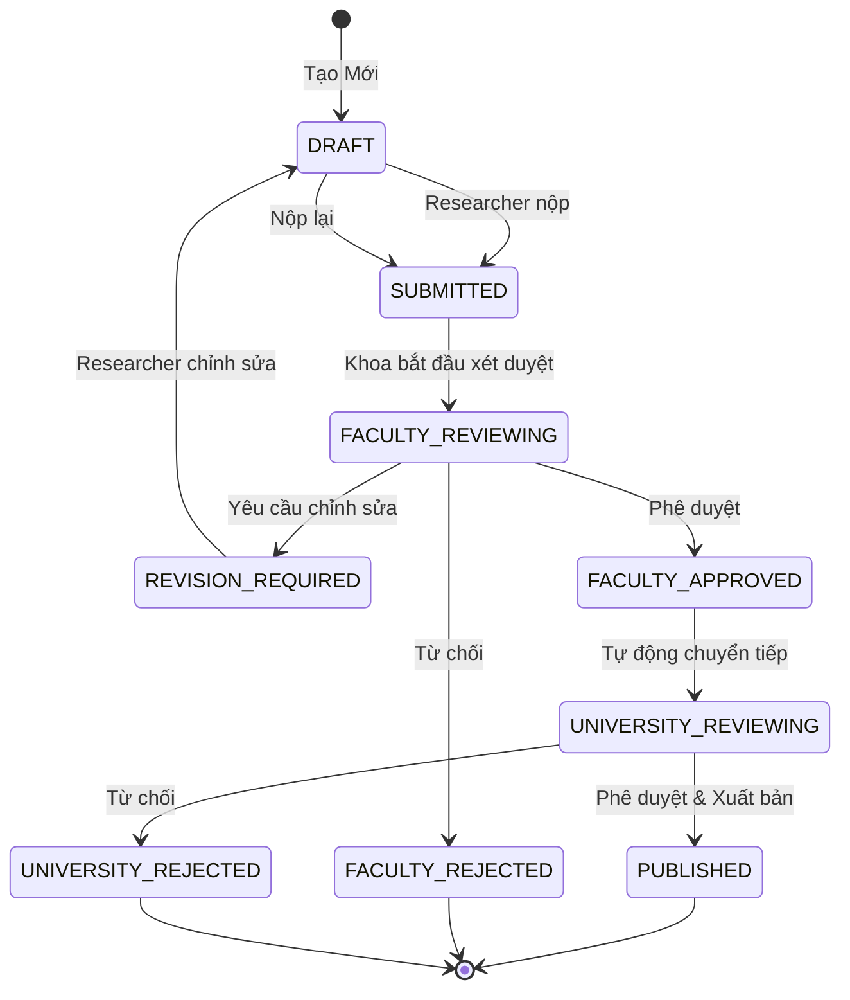

# UC-HL-002: Quy Trình Xét Duyệt (Approval Workflow)

> **Module**: 2 - Quy Trình Xét Duyệt  
> **Độ Ưu Tiên**: 🔴 P0 - Phải Có  
> **Tác Nhân**: Researcher, Faculty Reviewer, University Reviewer

---

## 📋 Tổng Quan Use Case

**ID**: UC-HL-002  
**Tên**: Quy Trình Xét Duyệt  
**Mô Tả**: Quy trình phê duyệt bài báo 2 cấp (Khoa → Trường) với các trạng thái và hành động: nộp, phê duyệt, từ chối, yêu cầu chỉnh sửa, rút lại, xuất bản.

---

## 👥 Tác Nhân

### Tác Nhân Chính
- **Researcher**: Nộp (Submit) và chỉnh sửa (Revise) bài báo
- **Faculty Reviewer**: Xét duyệt cấp Khoa
- **University Reviewer**: Phê duyệt cuối và xuất bản (Publish)

### Tác Nhân Phụ
- **Hệ Thống Email**: Gửi thông báo
- **Hệ Thống Audit**: Ghi nhật ký mọi chuyển đổi trạng thái

---

## 🔄 Máy Trạng Thái (Workflow State Machine)

---

## 🎯 Mục Tiêu

- Đảm bảo chất lượng bài báo qua 2 cấp xét duyệt
- Minh bạch quy trình với nhật ký kiểm toán (audit trail) đầy đủ
- Thông báo kịp thời cho các bên liên quan
- Quản lý SLA (6-14 ngày từ khi nộp → xuất bản)

---

## 🔗 Tài Liệu Liên Quan

**User Stories** (26 stories):
- Researcher: US-RES-010 đến US-RES-013 (4 stories)
- Faculty Reviewer: US-FCR-001 đến US-FCR-007 (7 stories)
- University Reviewer: US-UNR-001 đến US-UNR-006 (6 stories)  
- Nâng cao: US-FCR-009, US-UNR-007, v.v.

**Yêu Cầu Chức Năng**: FR-APR-001 đến FR-APR-020

---

## 🔄 Luồng Chính (Main Flows)

### Flow 1: Researcher Nộp Bài Báo

1. Researcher hoàn thiện bài báo (trạng thái = DRAFT)
2. Researcher nhấn "Gửi Xét Duyệt" (Submit for Review)
3. Hệ thống xác thực tất cả các trường bắt buộc
4. Hệ thống đổi trạng thái: DRAFT → SUBMITTED
5. Hệ thống gửi email cho Faculty Reviewer
6. Hệ thống ghi nhật ký kiểm toán

---

### Flow 2: Khoa Xét Duyệt và Phê Duyệt

1. Faculty Reviewer nhận email thông báo
2. Reviewer truy cập Dashboard Khoa
3. Reviewer xem chi tiết bài báo
4. Reviewer nhấn "Phê Duyệt" (Approve) và thêm bình luận tùy chọn
5. Hệ thống đổi trạng thái: FACULTY_REVIEWING → FACULTY_APPROVED
6. Hệ thống gửi email cho:
   - Researcher: "Đã được Khoa phê duyệt"
   - University Reviewer: "Chờ bạn xét duyệt"
7. Hệ thống ghi nhật ký kiểm toán

**Luồng Thay Thế**: Yêu Cầu Chỉnh Sửa
- Reviewer nhấn "Yêu Cầu Chỉnh Sửa" với bình luận bắt buộc
- Trạng thái → REVISION_REQUIRED
- Email gửi Researcher kèm phản hồi
- Researcher chỉnh sửa và nộp lại

**Luồng Thay Thế**: Từ Chối
- Reviewer nhấn "Từ Chối" với lý do bắt buộc
- Trạng thái → FACULTY_REJECTED (kết thúc)
- Email gửi Researcher
- Quy trình kết thúc

---

### Flow 3: Trường Phê Duyệt Cuối

1. University Reviewer nhận email
2. Reviewer xem bài báo và các bình luận của Khoa
3. Reviewer nhấn "Phê Duyệt & Xuất Bản"
4. Hệ thống đổi trạng thái: UNIVERSITY_REVIEWING → PUBLISHED
5. Hệ thống công khai bài báo (hiển thị trong tìm kiếm)
6. Hệ thống gửi email cho Researcher: "Đã Xuất Bản!"
7. Hệ thống ghi nhật ký kiểm toán

**Luồng Thay Thế**: Từ Chối cấp Trường
- Trạng thái → UNIVERSITY_REJECTED
- Email gửi Researcher và Faculty Reviewer
- Quy trình kết thúc

---

### Flow 4: Researcher Theo Dõi Trạng Thái

1. Researcher truy cập "Bài Báo Của Tôi"
2. Hệ thống hiển thị bài báo với trạng thái hiện tại
3. Researcher nhấn vào bài báo
4. Hệ thống hiển thị:
   - Dòng thời gian trạng thái (timeline)
   - Bình luận của người xét duyệt
   - Ngày chuyển đổi trạng thái
   - Hành động tiếp theo dự kiến

---

## ✅ Điều Kiện Tiên Quyết

- Bài báo tồn tại với metadata đầy đủ
- Người dùng đã xác thực với vai trò phù hợp
- Hệ thống Email đã được cấu hình
- Ghi nhật ký Audit đã được kích hoạt

---

## 📝 Điều Kiện Hậu Quyết

**Thành Công**:
- Bài báo đạt trạng thái PUBLISHED
- Hiển thị công khai trong tìm kiếm
- Nhật ký kiểm toán đầy đủ
- Tất cả các bên đều nhận được thông báo

**Thất Bại**:
- Bài báo bị TỪ CHỐI (REJECTED) ở cấp độ nào đó
- Bị kẹt ở REVISION_REQUIRED
- Nhật ký kiểm toán hiển thị tất cả các quyết định

---

## 🔒 Quy Tắc Nghiệp Vụ

### BR-APR-001: Chuyển Đổi Trạng Thái
- CHỈ Researcher mới được submit/resubmit/withdraw
- CHỈ Faculty Reviewer xét duyệt cấp Khoa
- CHỈ University Reviewer phê duyệt cuối

### BR-APR-002: Xét Duyệt Tuần Tự
- PHẢI qua phê duyệt của Khoa trước khi đến Trường
- KHÔNG thể bỏ qua bất kỳ cấp nào

### BR-APR-003: Tính Chung Thẩm Của Quyết Định
- FACULTY_REJECTED: Không thể nộp lại (phải tạo mới)
- UNIVERSITY_REJECTED: Không thể nộp lại

### BR-APR-004: Thông Báo
- Email GỬI ngay khi trạng thái thay đổi
- Email PHẢI có link trực tiếp đến bài báo

### BR-APR-005: Bình Luận
- Yêu Cầu Chỉnh Sửa: Bình luận bắt buộc (tối thiểu 10 ký tự)
- Từ Chối: Lý do bắt buộc (tối thiểu 20 ký tự)
- Phê Duyệt: Bình luận tùy chọn

### BR-APR-006: Mục Tiêu SLA
- Xét duyệt Khoa: Mục tiêu 7 ngày
- Xét duyệt Trường: Mục tiêu 7 ngày
- Tổng cộng: 6-14 ngày (từ tốt nhất đến xấu nhất)

---

## 📐 Use Cases Con (Cấp Trung)

### Hành Động Của Researcher
- [UC-M2-001: Gửi Xét Duyệt](../Medium_Level/module_02_approval_workflow.md)
- [UC-M2-002: Theo Dõi Trạng Thái](../Medium_Level/module_02_approval_workflow.md)
- [UC-M2-003: Chỉnh Sửa Bài Báo](../Medium_Level/module_02_approval_workflow.md)
- [UC-M2-004: Rút Bài Báo](../Medium_Level/module_02_approval_workflow.md)

### Hành Động Của Faculty Reviewer
- [UC-M2-005: Khoa Phê Duyệt](../Medium_Level/module_02_approval_workflow.md)
- [UC-M2-006: Khoa Yêu Cầu Chỉnh Sửa](../Medium_Level/module_02_approval_workflow.md)
- [UC-M2-007: Khoa Từ Chối](../Medium_Level/module_02_approval_workflow.md)
- [UC-M2-010: Xem Lịch Sử Xét Duyệt](../Medium_Level/module_02_approval_workflow.md)
- UC-M2-012: Phê Duyệt Hàng Loạt (P1)

### Hành Động Của University Reviewer
- [UC-M2-008: Trường Phê Duyệt & Xuất Bản](../Medium_Level/module_02_approval_workflow.md)
- [UC-M2-009: Trường Từ Chối](../Medium_Level/module_02_approval_workflow.md)
- [UC-M2-010: Xem Lịch Sử Xét Duyệt](../Medium_Level/module_02_approval_workflow.md)
- UC-M2-013: Phê Duyệt Hàng Loạt (P1)

### Hành Động Hệ Thống
- [UC-M2-011: Gửi Email Thông Báo](../Medium_Level/module_02_approval_workflow.md)
- UC-M2-015: Giám Sát SLA (P2)

---

## 📊 Chỉ Số Chính

- **SLA**: 90% được phê duyệt trong vòng 14 ngày
- **Thời Gian Phản Hồi**: Email được gửi < 1 phút sau hành động
- **Độ Phủ Audit**: 100% chuyển đổi trạng thái được ghi lại
- **Thông Lượng**: Hỗ trợ 50 xét duyệt đồng thời

---

## 🚨 Ngoại Lệ

| Lỗi | Điều Kiện | Phản Hồi Hệ Thống |
|-------|-----------|-----------------|
| Thiếu trường bắt buộc | Nộp với dữ liệu không đầy đủ | Chặn nộp, hiển thị các trường còn thiếu |
| Hành động không hợp lệ | Người không phải reviewer cố gắng phê duyệt | Hiển thị "Truy cập bị từ chối" |
| Lỗi Email | Lỗi SMTP | Ghi lỗi, thử lại 3 lần, cảnh báo admin |
| Đã phê duyệt | Cố gắng phê duyệt lại | Hiển thị "Đã được xử lý" |
| Rút lại trong khi xét duyệt | Researcher rút bài | Thông báo cho reviewer, xóa khỏi hàng chờ |

---

**Tài liệu liên quan**:
- [User Stories - Researcher](../../04_User_Stories/By_Role/researcher_stories.md)
- [User Stories - Faculty Reviewer](../../04_User_Stories/By_Role/faculty_reviewer_stories.md)
- [User Stories - University Reviewer](../../04_User_Stories/By_Role/university_reviewer_stories.md)
- [Yêu Cầu - Quy Trình Xét Duyệt](../../03_Requirements/Functional/module_approval_workflow.md)
