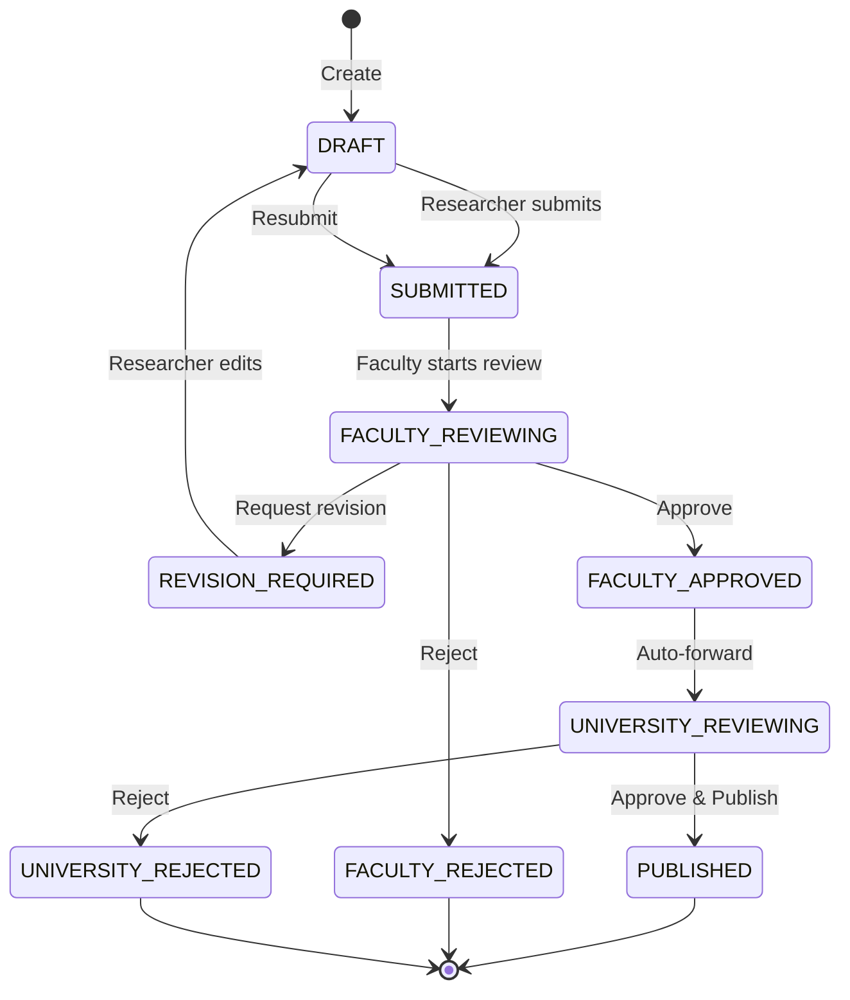

# UC-HL-002: Approval Workflow

> **Module**: 2 - Approval Workflow  
> **Priority**: 🔴 P0 - Must Have  
> **Actors**: Researcher, Faculty Reviewer, University Reviewer

---

## 📋 Use Case Overview

**ID**: UC-HL-002  
**Name**: Approval Workflow  
**Description**: Quy trình phê duyệt bài báo 2 cấp (Faculty → University) với các trạng thái và hành động: submit, approve, reject, request revision, withdraw, publish.

---

## 👥 Actors

### Primary Actors
- **Researcher**: Submit và revise bài báo
- **Faculty Reviewer**: Xét duyệt cấp Khoa
- **University Reviewer**: Phê duyệt cuối và publish

### Secondary Actors
- **Email System**: Gửi notifications
- **Audit System**: Log mọi state transitions

---

## 🔄 Workflow State Machine

---

## 🎯 Goals

- Đảm bảo chất lượng bài báo qua 2 cấp review
- Minh bạch quy trình với audit trail đầy đủ
- Thông báo kịp thời cho các bên liên quan
- Quản lý SLA (6-14 ngày từ submit → publish)

---

## 🔗 Related Artifacts

**User Stories** (26 stories):
- Researcher: US-RES-010 to US-RES-013 (4 stories)
- Faculty Reviewer: US-FCR-001 to US-FCR-007 (7 stories)
- University Reviewer: US-UNR-001 to US-UNR-006 (6 stories)  
- Advanced: US-FCR-009, US-UNR-007, etc.

**Functional Requirements**: FR-APR-001 to FR-APR-020

---

## 🔄 Main Flows

### Flow 1: Researcher Submits Publication

1. Researcher completes publication (status = DRAFT)
2. Researcher clicks "Submit for Review"
3. System validates all required fields
4. System changes status: DRAFT → SUBMITTED
5. System sends email to Faculty Reviewer
6. System logs audit trail

---

### Flow 2: Faculty Reviews and Approves

1. Faculty Reviewer receives email notification
2. Reviewer accesses Faculty Dashboard
3. Reviewer views publication details
4. Reviewer clicks "Approve" and adds optional comment
5. System changes status: FACULTY_REVIEWING → FACULTY_APPROVED
6. System sends email to:
   - Researcher: "Approved by Faculty"
   - University Reviewer: "Pending your review"
7. System logs audit trail

**Alternative**: Request Revision
- Reviewer clicks "Request Revision" with required comment
- Status → REVISION_REQUIRED
- Email to Researcher with feedback
- Researcher edits and resubmits

**Alternative**: Reject
- Reviewer clicks "Reject" with required reason
- Status → FACULTY_REJECTED (final)
- Email to Researcher
- Process ends

---

### Flow 3: University Final Approval

1. University Reviewer receives email
2. Reviewer views publication and faculty comments
3. Reviewer clicks "Approve & Publish"
4. System changes status: UNIVERSITY_REVIEWING → PUBLISHED
5. System makes publication public (visible in search)
6. System sends email to Researcher: "Published!"
7. System logs audit trail

**Alternative**: Reject at University Level
- Status → UNIVERSITY_REJECTED
- Emails to Researcher and Faculty Reviewer
- Process ends

---

### Flow 4: Researcher Tracks Status

1. Researcher accesses "My Publications"
2. System shows publication with current status
3. Researcher clicks publication
4. System displays:
   - Status timeline
   - Reviewer comments
   - State transition dates
   - Next expected action

---

## ✅ Preconditions

- Publication exists with complete metadata
- Users are authenticated with appropriate roles
- Email system is configured
- Audit logging is enabled

---

## 📝 Postconditions

**Success**:
- Publication reaches PUBLISHED status
- Visible publicly in search
- Audit trail is complete
- All parties are notified

**Failure**:
- Publication is REJECTED at some level
- Stuck in REVISION_REQUIRED
- Audit trail shows all decisions

---

## 🔒 Business Rules

### BR-APR-001: State Transitions
- CHỈ researcher mới submit/resubmit/withdraw
- CHỈ Faculty Reviewer xét duyệt cấp Khoa
- CHỈ University Reviewer phê duyệt cuối

### BR-APR-002: Sequential Approval
- PHẢI qua Faculty approval trước University
- KHÔNG thể bỏ qua bất kỳ cấp nào

### BR-APR-003: Finality of Decisions
- FACULTY_REJECTED: Cannot resubmit (must create new)
- UNIVERSITY_REJECTED: Cannot resubmit

### BR-APR-004: Notifications
- Email GỬI ngay khi status thay đổi
- Email PHẢI có link trực tiếp đến publication

### BR-APR-005: Comments
- Request Revision: Comment bắt buộc (min 10 chars)
- Reject: Reason bắt buộc (min 20 chars)
- Approve: Comment tùy chọn

### BR-APR-006: SLA Targets
- Faculty review: Target 7 days
- University review: Target 7 days
- Total: 6-14 days (best to worst case)

---

## 📐 Sub Use Cases (Medium-Level)

### Researcher Actions
- UC-M2-001: Submit for Review
- UC-M2-002: Track Review Status
- UC-M2-003: Revise Publication
- UC-M2-004: Withdraw Submission

### Faculty Reviewer Actions
- UC-M2-005: Faculty Review - Approve
- UC-M2-006: Faculty Review - Request Revision
- UC-M2-007: Faculty Review - Reject
- UC-M2-010: View Review History
- UC-M2-012: Bulk Approve (P1)

### University Reviewer Actions
- UC-M2-008: University Review - Approve & Publish
- UC-M2-009: University Review - Reject
- UC-M2-010: View Review History
- UC-M2-013: Bulk Approve (P1)

### System Actions
- UC-M2-011: Send Email Notifications
- UC-M2-015: SLA Monitoring (P2)

---

## 📊 Key Metrics

- **SLA**: 90% approved within 14 days
- **Response Time**: Email sent < 1 minute after action
- **Audit Coverage**: 100% of state transitions logged
- **Throughput**: Support 50 concurrent reviews

---

## 🚨 Exceptions

| Error | Condition | System Response |
|-------|-----------|-----------------|
| Missing required fields | Submit with incomplete data | Block submission, show missing fields |
| Unauthorized action | Non-reviewer tries to approve | Show "Access denied" |
| Email failure | SMTP error | Log error, retry 3 times, alert admin |
| Already approved | Try to re-approve | Show "Already processed" |
| Withdrawn during review | Researcher withdraws | Notify reviewer, remove from queue |

---

**Tài liệu liên quan**:
- [User Stories - Researcher](../../04_User_Stories/By_Role/researcher_stories.md)
- [User Stories - Faculty Reviewer](../../04_User_Stories/By_Role/faculty_reviewer_stories.md)
- [User Stories - University Reviewer](../../04_User_Stories/By_Role/university_reviewer_stories.md)
- [Requirements - Approval Workflow](../../03_Requirements/Functional/module_approval_workflow.md)
