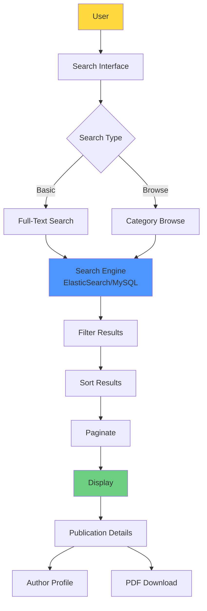

# UC-HL-003: Search & Browse Publications

> **Module**: 3 - Search & Browse  
> **Priority**: 🟡 P1 - Should Have  
> **Actors**: Public Visitor, Researcher, SuperAdmin

---

## 📋 Use Case Overview

**ID**: UC-HL-003  
**Name**: Search & Browse Publications  
**Description**: Tìm kiếm và duyệt bài báo công khai (PUBLISHED only) với full-text search, filtering, sorting, và pagination. NO authentication required.

---

## 👥 Actors

### Primary Actors
- **Public Visitor**: Tìm kiếm bài báo không cần đăng nhập
- **Researcher**: Tìm kiếm để tham khảo
- **SuperAdmin**: Tìm kiếm để quản lý

---

## 🎯 Goals

- Công khai thông tin nghiên cứu của trường
- Hỗ trợ cộng đồng học thuật tìm kiếm
- Tăng visibility cho giảng viên
- SEO-friendly để Google index được

---

## 🔗 Related Artifacts

**User Stories** (8 stories):
- US-VIW-001: Tìm Kiếm Full-Text (P1)
- US-VIW-002: Lọc Kết Quả Nâng Cao (P1)
- US-VIW-003: Duyệt Theo Danh Mục (P1)
- US-VIW-004: Sắp Xếp Kết Quả (P1)
- US-VIW-005: Phân Trang Kết Quả (P0)
- US-VIW-006: Xem Chi Tiết Công Trình (P0)
- US-VIW-007: Export Kết Quả (P2)
- US-VIW-008: Xem Profile Giảng Viên (P2)

**Functional Requirements**: FR-SEA-001 to FR-SEA-007

---

## 🔍 Search Architecture

---

## 🔄 Main Flows

### Flow 1: Basic Search

1. User enters keywords in search box
2. User clicks "Search" (no login required)
3. System searches in:
   - Title
   - Abstract
   - Keywords
   - Author names
4. System returns ONLY PUBLISHED publications
5. System highlights matching keywords
6. System sorts by relevance (default)
7. System paginates (20 per page)

---

### Flow 2: Advanced Filtering

1. User performs basic search
2. User applies filters:
   - Year range (from-to)
   - Faculty/Department
   - Journal Quartile (Q1/Q2/Q3/Q4)
   - Publication Type (Journal/Conference)
   - Research Field
3. System updates results dynamically (AJAX)
4. System shows result count
5. User can clear filters

---

### Flow 3: Browse by Category

1. User clicks "Browse" (no search keywords)
2. System shows category options:
   - By Faculty
   - By Year
   - By Research Field
   - By Quartile
3. User selects a category
4. System shows publications in that category
5. System allows drilling down (e.g., Faculty → Researcher)

---

### Flow 4: Sort Results

1. User has search results
2. User selects sort option:
   - Newest first (default)
   - Oldest first
   - Most cited (if available)
   - Impact Factor (high to low)
3. System re-sorts results
4. Pagination resets to page 1

---

### Flow 5: View Publication Details

1. User clicks on a publication from results
2. System shows detail page with:
   - Full metadata
   - DOI link (external)
   - Author profile links
   - Download PDF button
   - Citation info
3. User can download PDF (if allowed)
4. User can click author name → profile

---

### Flow 6: Export Results (P2)

1. User has search results
2. User clicks "Export"
3. User selects format:
   - BibTeX  
   - RIS (EndNote/Mendeley/Zotero)
   - CSV
   - JSON
4. System generates file
5. System downloads to user's computer

---

## ✅ Preconditions

- PUBLISHED publications exist in system
- Search index is up-to-date
- No authentication required

---

## 📝 Postconditions

**Success**:
- User finds relevant publications
- Results are accurate and current
- User can access publication details

---

## 🔒 Business Rules

### BR-SEA-001: Visibility
- CHỈ hiển thị PUBLISHED publications
- KHÔNG hiển thị: DRAFT, SUBMITTED, REVIEWING, REJECTED

### BR-SEA-002: Anonymous Access
- NO login required for search
- PDF download: Depends on publication settings (P2 feature)

### BR-SEA-003: Search Scope
- Full-text search: Title, Abstract, Keywords, Author names
- Case-insensitive
- Support Vietnamese characters

### BR-SEA-004: Result Limits
- Default: 20 results per page
- Options: 10, 20, 50, 100 per page
- Max: 1000 results per query (pagination)

### BR-SEA-005: Performance
- Search response < 1 second (90th percentile)
- Support 100 concurrent searches

### BR-SEA-006: SEO
- Each publication detail page has unique URL
- Meta tags for title, description, keywords
- Open Graph tags for social sharing

---

## 📐 Sub Use Cases (Medium-Level)

- UC-M3-001: Basic Search
- UC-M3-002: Advanced Search  
- UC-M3-003: Filter Results
- UC-M3-004: Sort Results
- UC-M3-005: View Publication Details (Public)
- UC-M3-006: Browse by Faculty
- UC-M3-007: Browse by Year/Quartile

---

## 📊 Key Metrics

- **Performance**: < 1s search response (p90)
- **Coverage**: Index 100% of PUBLISHED publications
- **Usage**: Track top keywords, popular publications
- **Conversion**: % users who view details after search

---

## 🚨 Exceptions

| Error | Condition | System Response |
|-------|-----------|-----------------|
| No results | Query returns 0 matches | Show "No results, try different keywords" |
| Invalid query | Special chars cause error | Sanitize input, retry |
| Search timeout | Query takes > 5s | Show "Search taking too long, try simpler query" |
| Index unavailable | Search service down | Fall back to database search (slower) |

---

**Tài liệu liên quan**:
- [User Stories - Public Visitor](../../04_User_Stories/By_Role/public_visitor_stories.md)
- [Requirements - Search & Browse](../../03_Requirements/Functional/module_search.md)
