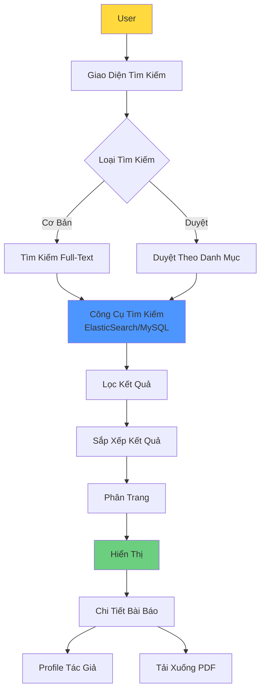

# UC-HL-003: Tìm Kiếm & Duyệt Bài Báo (Search & Browse Publications)

> **Module**: 3 - Tìm Kiếm & Duyệt  
> **Độ Ưu Tiên**: 🟡 P1 - Nên Có  
> **Tác Nhân**: Public Visitor, Researcher, SuperAdmin

---

## 📋 Tổng Quan Use Case

**ID**: UC-HL-003  
**Tên**: Tìm Kiếm & Duyệt Bài Báo  
**Mô Tả**: Tìm kiếm và duyệt bài báo công khai (chỉ PUBLISHED) với tìm kiếm toàn văn (full-text search), bộ lọc (filtering), sắp xếp (sorting), và phân trang (pagination). KHÔNG yêu cầu xác thực.

---

## 👥 Tác Nhân

### Tác Nhân Chính
- **Public Visitor**: Tìm kiếm bài báo không cần đăng nhập
- **Researcher**: Tìm kiếm để tham khảo
- **SuperAdmin**: Tìm kiếm để quản lý

---

## 🎯 Mục Tiêu

- Công khai thông tin nghiên cứu của trường
- Hỗ trợ cộng đồng học thuật tìm kiếm
- Tăng độ hiển thị (visibility) cho giảng viên
- Tối ưu SEO để Google lập chỉ mục (index) được

---

## 🔗 Tài Liệu Liên Quan

**User Stories** (8 stories):
- US-VIW-001: Tìm Kiếm Full-Text (P1)
- US-VIW-002: Lọc Kết Quả Nâng Cao (P1)
- US-VIW-003: Duyệt Theo Danh Mục (P1)
- US-VIW-004: Sắp Xếp Kết Quả (P1)
- US-VIW-005: Phân Trang Kết Quả (P0)
- US-VIW-006: Xem Chi Tiết Công Trình (P0)
- US-VIW-007: Export Kết Quả (P2)
- US-VIW-008: Xem Profile Giảng Viên (P2)

**Yêu Cầu Chức Năng**: FR-SEA-001 đến FR-SEA-007

---

## 🔍 Kiến Trúc Tìm Kiếm

---

## 🔄 Luồng Chính (Main Flows)

### Flow 1: Tìm Kiếm Cơ Bản

1. User nhập từ khó vào ô tìm kiếm
2. User nhấn "Tìm Kiếm" (không cần đăng nhập)
3. Hệ thống tìm kiếm trong:
   - Tiêu đề
   - Tóm tắt (Abstract)
   - Từ khóa
   - Tên tác giả
4. Hệ thống trả về CHỈ các bài báo ĐÃ XUẤT BẢN (PUBLISHED)
5. Hệ thống làm nổi bật từ khóa khớp
6. Hệ thống sắp xếp theo độ liên quan (mặc định)
7. Hệ thống phân trang (20 kết quả/trang)

---

### Flow 2: Lọc Nâng Cao

1. User thực hiện tìm kiếm cơ bản
2. User áp dụng bộ lọc:
   - Khoảng năm (từ năm - đến năm)
   - Khoa/Phòng
   - Xếp hạng tạp chí (Q1/Q2/Q3/Q4)
   - Loại bài báo (Tạp chí/Hội nghị)
   - Lĩnh vực nghiên cứu
3. Hệ thống cập nhật kết quả động (AJAX)
4. Hệ thống hiển thị số lượng kết quả
5. User có thể xóa bộ lọc

---

### Flow 3: Duyệt Theo Danh Mục

1. User nhấn "Duyệt" (không nhập từ khóa)
2. Hệ thống hiển thị các tùy chọn danh mục:
   - Theo Khoa
   - Theo Năm
   - Theo Lĩnh Vực Nghiên Cứu
   - Theo Xếp Hạng (Quartile)
3. User chọn một danh mục
4. Hệ thống hiển thị các bài báo trong danh mục đó
5. Hệ thống cho phép đi sâu vào chi tiết (VD: Khoa → Giảng viên)

---

### Flow 4: Sắp Xếp Kết Quả

1. User có kết quả tìm kiếm
2. User chọn tùy chọn sắp xếp:
   - Mới nhất (mặc định)
   - Cũ nhất
   - Được trích dẫn nhiều nhất (nếu có)
   - Chỉ số ảnh hưởng (từ cao xuống thấp)
3. Hệ thống sắp xếp lại kết quả
4. Phân trang reset về trang 1

---

### Flow 5: Xem Chi Tiết Bài Báo

1. User nhấn vào một bài báo từ kết quả
2. Hệ thống hiển thị trang chi tiết với:
   - Metadata đầy đủ
   - Link DOI (bên ngoài)
   - Link profile tác giả
   - Nút tải xuống PDF
   - Thông tin trích dẫn
3. User có thể tải PDF (nếu được phép)
4. User có thể nhấn tên tác giả → profile

---

### Flow 6: Xuất Kết Quả (P2)

1. User có kết quả tìm kiếm
2. User nhấn "Export"
3. User chọn định dạng:
   - BibTeX  
   - RIS (EndNote/Mendeley/Zotero)
   - CSV
   - JSON
4. Hệ thống tạo file
5. Hệ thống tải xuống máy người dùng

---

## ✅ Điều Kiện Tiên Quyết

- Bài báo PUBLISHED tồn tại trong hệ thống
- Chỉ mục tìm kiếm (search index) được cập nhật
- Không yêu cầu xác thực

---

## 📝 Điều Kiện Hậu Quyết

**Thành Công**:
- User tìm thấy bài báo liên quan
- Kết quả chính xác và cập nhật
- User có thể truy cập chi tiết bài báo

---

## 🔒 Quy Tắc Nghiệp Vụ

### BR-SEA-001: Tính Hiển Thị
- CHỈ hiển thị bài báo PUBLISHED
- KHÔNG hiển thị: DRAFT, SUBMITTED, REVIEWING, REJECTED

### BR-SEA-002: Truy Cập Ẩn Danh
- KHÔNG yêu cầu đăng nhập để tìm kiếm
- Tải PDF: Phụ thuộc vào cài đặt của bài báo (tính năng P2)

### BR-SEA-003: Phạm Vi Tìm Kiếm
- Tìm kiếm toàn văn: Tiêu đề, Tóm tắt, Từ khóa, Tên tác giả
- Không phân biệt hoa thường
- Hỗ trợ ký tự tiếng Việt có dấu

### BR-SEA-004: Giới Hạn Kết Quả
- Mặc định: 20 kết quả/trang
- Tùy chọn: 10, 20, 50, 100 kết quả/trang
- Tối đa: 1000 kết quả mỗi truy vấn (phân trang)

### BR-SEA-005: Hiệu Năng
- Phản hồi tìm kiếm < 1 giây (90th percentile)
- Hỗ trợ 100 lượt tìm kiếm đồng thời

### BR-SEA-006: SEO
- Mỗi trang chi tiết bài báo có URL duy nhất
- Thẻ Meta cho tiêu đề, mô tả, từ khóa
- Thẻ Open Graph để chia sẻ mạng xã hội

---

## 📐 Use Cases Con (Cấp Trung)

- [UC-M3-001: Tìm Kiếm Cơ Bản](../Medium_Level/module_03_search_browse.md)
- [UC-M3-002: Tìm Kiếm Nâng Cao](../Medium_Level/module_03_search_browse.md)
- [UC-M3-003: Lọc Kết Quả](../Medium_Level/module_03_search_browse.md)
- [UC-M3-004: Sắp Xếp Kết Quả](../Medium_Level/module_03_search_browse.md)
- [UC-M3-005: Xem Chi Tiết Bài Báo (Public)](../Medium_Level/module_03_search_browse.md)
- [UC-M3-006: Duyệt Theo Khoa](../Medium_Level/module_03_search_browse.md)
- [UC-M3-007: Duyệt Theo Năm/Xếp Hạng](../Medium_Level/module_03_search_browse.md)

---

## 📊 Chỉ Số Chính

- **Hiệu năng**: < 1s phản hồi tìm kiếm (p90)
- **Độ bao phủ**: Index 100% bài báo PUBLISHED
- **Sử dụng**: Theo dõi từ khóa top, bài báo phổ biến
- **Chuyển đổi**: % người dùng xem chi tiết sau khi tìm kiếm

---

## 🚨 Ngoại Lệ

| Lỗi | Điều Kiện | Phản Hồi Hệ Thống |
|-------|-----------|-----------------|
| Không có kết quả | Truy vấn trả về 0 kết quả | Hiển thị "Không tìm thấy kết quả, thử từ khóa khác" |
| Truy vấn không hợp lệ | Ký tự đặc biệt gây lỗi | Làm sạch đầu vào (sanitize), thử lại |
| Hết thời gian tìm kiếm | Truy vấn mất > 5s | Hiển thị "Tìm kiếm quá lâu, hãy thử truy vấn đơn giản hơn" |
| Index không khả dụng | Dịch vụ tìm kiếm bị lỗi | Chuyển sang tìm kiếm cơ sở dữ liệu (chậm hơn) |

---

**Tài liệu liên quan**:
- [User Stories - Public Visitor](../../04_User_Stories/By_Role/public_visitor_stories.md)
- [Yêu Cầu - Tìm Kiếm & Duyệt](../../03_Requirements/Functional/module_search.md)
