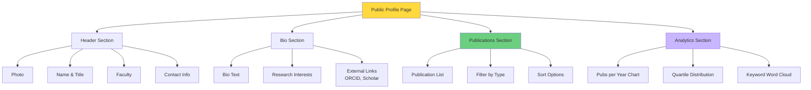

# UC-HL-004: Researcher Profile Management

> **Module**: 4 - Researcher Profile  
> **Priority**: 🟡 P1 - Should Have  
> **Actors**: Researcher, Public Visitor

---

## 📋 Use Case Overview

**ID**: UC-HL-004  
**Name**: Researcher Profile Management  
**Description**: Giảng viên quản lý profile công khai của mình, hiển thị thông tin cá nhân, danh sách công trình PUBLISHED, và các analytics. Public visitors có thể xem profile để tìm hiểu về giảng viên.

---

## 👥 Actors

### Primary Actors
- **Researcher**: Edit profile và view analytics
- **Public Visitor**: View public profiles (no login)

---

## 🎯 Goals

- Tăng visibility và impact của giảng viên
- Tạo portfolio nghiên cứu chuyên nghiệp
- Hỗ trợ networking học thuật
- SEO-friendly cho Google Scholar

---

## 🔗 Related Artifacts

**User Stories** (6 stories):
- US-RES-014: Xem Profile Công Khai Của Mình (P1)
- US-RES-015: Chỉnh Sửa Profile (P1)
- US-RES-016: Xem Danh Sách Bài Báo Trên Profile (P1)
- US-RES-022: Xem Biểu Đồ Năng Suất (P2)
- US-RES-023: Xem Word Cloud Lĩnh Vực (P2)
- US-VIW-008: Xem Profile Giảng Viên (P2)

**Functional Requirements**: FR-PRO-001 to FR-PRO-006

---

## 📊 Profile Structure

---

## 🔄 Main Flows

### Flow 1: View Public Profile (Anyone)

1. User accesses `/profile/[username]` (no login required)
2. System fetches researcher data
3. System shows profile page with:
   - Header: Photo, name, title, faculty
   - Bio: Research interests, contact
   - Publications: PUBLISHED only, sorted by year
   - Analytics: Charts and word cloud
4. User can click publications to view details
5. User can click external links (ORCID, Scholar)

---

### Flow 2: Edit Profile (Researcher Only)

1. Researcher logs in
2. Researcher clicks "Edit Profile"
3. System shows editable form:
   - Upload profile photo
   - Edit bio (max 500 chars)
   - Edit research interests
   - Add ORCID, Google Scholar link
   - Add personal website
4. Researcher makes changes
5. Researcher clicks "Save"
6. System validates input
7. System updates database
8. System shows "Saved successfully"

---

### Flow 3: View Publication List on Profile

1. Anyone views researcher profile
2. System displays publications section
3. Shows: Title, Journal, Year, DOI, Type
4. User can filter by:
   - Publication Type (Journal/Conference)
   - Year range
5. User can sort by:
   - Year (newest first - default)
   - Impact factor
6. Clicking publication → detail page

---

### Flow 4: View Analytics (P2)

1. User views profile with analytics enabled
2. System generates:
   - **Bar Chart**: Publications per year
   - **Pie Chart**: Distribution by quartile (Q1/Q2/Q3/Q4)
   - **Word Cloud**: Top keywords from all publications
3. Charts are interactive (hover for details)
4. Data updates when new publications are published

---

## ✅ Preconditions

- Researcher account exists in system
- For public viewing: At least 1 PUBLISHED publication (recommended)
- For editing: User is authenticated

---

## 📝 Postconditions

**Success**:
- Profile is visible at `/profile/[username]`
- Updates are saved to database
- Analytics reflect current publications

---

## 🔒 Business Rules

### BR-PRO-001: Visibility
- Profile is PUBLIC (no login required to view)
- CHỈ hiển thị PUBLISHED publications
- KHÔNG hiển thị: DRAFT, SUBMITTED, REVIEWING

### BR-PRO-002: Editing Rights
- CHỈ owner mới edit được profile
- Admin có thể view nhưng không edit (privacy)

### BR-PRO-003: Data Sources
- Basic info: From LDAP/AD (name, email, faculty)
- Optional info: User-editable (bio, interests, links)
- Publications: Auto-populated from publications table

### BR-PRO-004: Photo Upload
- Allowed formats: JPG, PNG
- Max size: 2MB
- Auto-resize to 300x300px
- Default: University logo or initials

### BR-PRO-005: SEO
- Unique URL per researcher
- Meta tags with researcher name
- Open Graph for social sharing

---

## 📐 Sub Use Cases (Medium-Level)

- UC-M4-001: View Public Profile
- UC-M4-002: Edit Profile
- UC-M4-003: Update Profile Photo
- UC-M4-004: Link ORCID
- UC-M4-005: View Publication Analytics
- UC-M4-006: Generate Word Cloud

---

## 📊 Key Metrics

- **Adoption**: % researchers with complete profiles
- **Visibility**: Profile page views
- **Engagement**: Clicks to external links (ORCID, Scholar)
- **Performance**: Page load < 2 seconds

---

## 🚨 Exceptions

| Error | Condition | System Response |
|-------|-----------|-----------------|
| Profile not found | Username doesn't exist | Show 404 page |
| No publications | Researcher has 0 PUBLISHED | Show empty state with message |
| Photo upload failed | File too large/wrong format | Show error with requirements |
| Invalid ORCID | ORCID format wrong | Validate format, show error |

---

**Tài liệu liên quan**:
- [User Stories - Researcher](../../04_User_Stories/By_Role/researcher_stories.md#module-4-researcher-profile)
- [Requirements - Researcher Profile](../../03_Requirements/Functional/module_profile.md)
