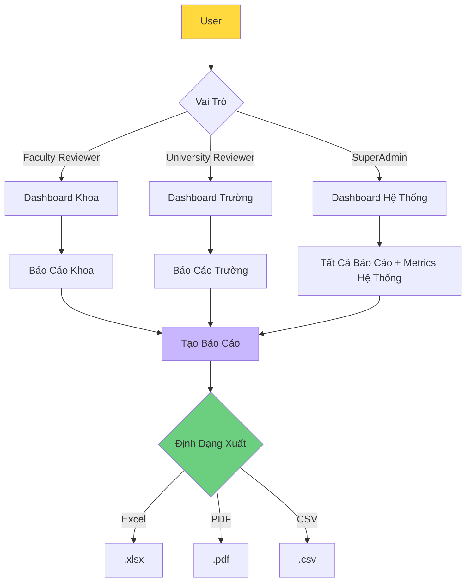

# UC-HL-005: Báo Cáo & Phân Tích (Reporting & Analytics)

> **Module**: 5 - Báo Cáo & Phân Tích  
> **Độ Ưu Tiên**: 🟡 P1 - Nên Có  
> **Tác Nhân**: Faculty Reviewer, University Reviewer, SuperAdmin

---

## 📋 Tổng Quan Use Case

**ID**: UC-HL-005  
**Tên**: Báo Cáo & Phân Tích  
**Mô Tả**: Tạo báo cáo và xem phân tích về năng suất nghiên cứu cấp Khoa và Trường. Hỗ trợ xuất ra Excel/PDF cho ban giám hiệu.

---

## 👥 Tác Nhân

### Tác Nhân Chính
- **Faculty Reviewer**: Xem báo cáo cấp Khoa
- **University Reviewer**: Xem báo cáo toàn trường
- **SuperAdmin**: Xem tất cả báo cáo, phân tích hệ thống

---

## 🎯 Mục Tiêu

- Theo dõi năng suất nghiên cứu theo đơn vị
- Hỗ trợ ra quyết định quản lý
- Cung cấp dữ liệu cho báo cáo hàng năm
- Đối sánh (Benchmark) giữa các khoa

---

## 🔗 Tài Liệu Liên Quan

**User Stories** (7 stories):
- US-FCR-008: Xem Báo Cáo Khoa (P1)
- US-FCR-009: Theo Dõi SLA Xét Duyệt (P2)
- US-UNR-007: Xem Dashboard Phân Tích Toàn Trường (P1)
- US-UNR-008: Tạo Báo Cáo Toàn Trường (P1)
- US-UNR-009: Xem Báo Cáo Theo Xếp Hạng (Quartile) (P1)
- US-UNR-010: Xem Xu Hướng Phát Triển (P2)

**Yêu Cầu Chức Năng**: FR-REP-001 đến FR-REP-007

---

## 📊 Kiến Trúc Báo Cáo

---

## 🔄 Luồng Chính (Main Flows)

### Flow 1: Báo Cáo Khoa (Faculty Reviewer)

1. Faculty Reviewer đăng nhập
2. Reviewer nhấn "Báo Cáo"
3. Hệ thống hiển thị Dashboard Khoa với:
   - Tổng số bài báo năm nay (tự động lọc theo khoa của họ)
   - Phân bố theo xếp hạng (quartile)
   - Các nhà nghiên cứu hàng đầu trong khoa
   - Biểu đồ xu hướng (5 năm gần nhất)
4. Reviewer chọn khoảng thời gian và tùy chọn
5. Reviewer nhấn "Tạo Báo Cáo Chi Tiết"
6. Hệ thống tạo báo cáo với:
   - Tất cả bài báo theo khoa
   - Nhóm theo nhà nghiên cứu
   - Thống kê tóm tắt
7. Reviewer xuất ra Excel/PDF

**Nội Dung Báo Cáo**:
- Tên khoa và khoảng thời gian
- Tóm tắt: Tổng số bài báo, theo xếp hạng, theo loại
- Chi tiết theo nhà nghiên cứu: Tên, số lượng bài báo, phân bố xếp hạng
- Danh sách bài báo chi tiết

---

### Flow 2: Báo Cáo Trường (University Reviewer)

1. University Reviewer đăng nhập
2. Reviewer nhấn "Phân Tích" (Analytics)
3. Hệ thống hiển thị Dashboard Trường với:
   - Tổng số bài báo (tất cả các khoa)
   - Phân bố theo khoa
   - Phân bố theo xếp hạng
   - Top 10 nhà nghiên cứu toàn trường
   - Tăng trưởng theo năm (Year-over-year)
4. Reviewer có thể lọc theo khoa, khoảng thời gian
5. Hệ thống cập nhật biểu đồ động

**Các Chỉ Số Hiển Thị**:
- Tổng bài báo: Mọi thời đại, năm nay, năm ngoái
- Theo Khoa: Biểu đồ cột so sánh các khoa
- Theo Xếp Hạng: Biểu đồ tròn Q1/Q2/Q3/Q4
- Theo Năm: Biểu đồ đường thể hiện xu hướng

---

### Flow 3: Tạo Báo Cáo Tổng Hợp

1. Reviewer chọn tham số:
   - Khoảng thời gian (từ - đến)
   - Lọc theo khoa (tất cả hoặc cụ thể)
   - Bao gồm/loại trừ các trường thông tin
2. Reviewer nhấn "Tạo Báo Cáo"
3. Hệ thống truy vấn cơ sở dữ liệu (có thể mất 30s - 5phút với dữ liệu lớn)
4. Hệ thống hiển thị chỉ báo tiến trình
5. Hệ thống tạo báo cáo
6. Reviewer chọn định dạng xuất
7. Hệ thống tải xuống tập tin

**Định Dạng Xuất**:
- **Excel (.xlsx)**: Nhiều sheet (Tóm tắt, Theo Khoa, Theo Researcher, Chi tiết)
- **PDF (.pdf)**: Báo cáo định dạng sẵn với biểu đồ
- **CSV (.csv)**: Dữ liệu thô để phân tích thêm

---

### Flow 4: Phân Tích Xếp Hạng (P1)

1. University Reviewer truy cập Báo Cáo Xếp Hạng (Quartile Report)
2. Reviewer chọn khoảng thời gian
3. Hệ thống hiển thị chi tiết:
   - Bài báo Q1: Số lượng + danh sách
   - Bài báo Q2: Số lượng + danh sách
   - Bài báo Q3/Q4: Số lượng + danh sách
   - Bài báo Hội nghị: Số lượng + danh sách
4. Hệ thống so sánh với năm trước:
   - Q1: +15% so với năm ngoái
   - Tổng cộng: +8% so với năm ngoái
5. Reviewer có thể đi sâu (drill down) để xem từng bài báo

---

### Flow 5: Phân Tích Xu Hướng (P2)

1. University Reviewer xem Phân Tích Xu Hướng
2. Hệ thống hiển thị:
   - Tỷ lệ tăng trưởng theo năm (%)
   - Các khoa tăng trưởng nhanh nhất
   - Các lĩnh vực nghiên cứu mới nổi (từ tần suất từ khóa)
   - Các nhà nghiên cứu năng suất nhất năm nay
3. Trực quan hóa:
   - Biểu đồ đường: Quỹ đạo tăng trưởng
   - Word cloud: Chủ đề nghiên cứu nóng
   - Bảng xếp hạng: Những người đóng góp hàng đầu

---

### Flow 6: Theo Dõi SLA (Faculty/University, P2)

1. Reviewer xem dashboard SLA
2. Hệ thống hiển thị các bài báo nhóm theo trạng thái:
   - Đang chờ xét duyệt (bao nhiêu ngày)
   - Quá hạn (> 7 ngày ở cấp hiện tại)
   - Thời gian xét duyệt trung bình
3. Các bài báo quá hạn được tô đỏ
4. Reviewer có thể nhấn vào để xét duyệt ngay

**Chỉ Số**:
- Thời gian xét duyệt trung bình cấp Khoa: X ngày
- Thời gian xét duyệt trung bình cấp Trường: Y ngày
- % xét duyệt trong SLA (7 ngày): Z%

---

## ✅ Điều Kiện Tiên Quyết

- Người dùng có vai trò Reviewer hoặc Admin
- Có dữ liệu bài báo trong hệ thống
- Người dùng đã xác thực

---

## 📝 Điều Kiện Hậu Quyết

**Thành Công**:
- Người dùng có cái nhìn sâu sắc về năng suất nghiên cứu
- Báo cáo có thể được chia sẻ với ban lãnh đạo
- Tập tin xuất ra có thể sử dụng trong Excel/PowerPoint

---

## 🔒 Quy Tắc Nghiệp Vụ

### BR-REP-001: Kiểm Soát Truy Cập
- Faculty Reviewer: CHỈ xem được khoa của mình
- University Reviewer: Xem được tất cả các khoa
- SuperAdmin: Xem tất cả + metrics hệ thống

### BR-REP-002: Phạm Vi Dữ Liệu
- CHỈ bao gồm các bài báo ĐÃ XUẤT BẢN (PUBLISHED)
- KHÔNG bao gồm: DRAFT, SUBMITTED, REJECTED

### BR-REP-003: Tần Suất Làm Mới
- Dashboard: Real-time (cập nhật khi tải trang)
- Báo cáo: Tạo theo yêu cầu (on-demand)
- Biểu đồ: Cache 1 giờ

### BR-REP-004: Hiệu Năng
- Tải Dashboard: < 3 giây
- Tạo báo cáo: < 5 phút (cho dữ liệu 10 năm)
- Tải xuất file: Ngay lập tức (file được chuẩn bị trong nền)

### BR-REP-005: Lưu Trữ Dữ Liệu
- Báo cáo đã tạo được lưu 30 ngày
- Người dùng có thể tải lại trong thời gian lưu trữ

---

## 📐 Use Cases Con (Cấp Trung)

- [UC-M5-001: Tạo Báo Cáo Khoa](../Medium_Level/module_05_reporting_analytics.md)
- [UC-M5-002: Tạo Báo Cáo Trường](../Medium_Level/module_05_reporting_analytics.md)
- [UC-M5-003: Xuất Excel](../Medium_Level/module_05_reporting_analytics.md)
- [UC-M5-004: Xuất PDF](../Medium_Level/module_05_reporting_analytics.md)
- [UC-M5-005: Xem Thống Kê Dashboard](../Medium_Level/module_05_reporting_analytics.md)
- [UC-M5-006: Theo Dõi Xu Hướng Năng Suất](../Medium_Level/module_05_reporting_analytics.md)
- [UC-M5-007: Đối Sánh Các Khoa](../Medium_Level/module_05_reporting_analytics.md)

---

## 📊 Chỉ Số Chính

- **Sử dụng**: % reviewers sử dụng báo cáo hàng tháng
- **Kích thước báo cáo**: Số dòng trung bình mỗi lần xuất
- **Hiệu năng**: Thời gian tạo báo cáo (mục tiêu < 2 phút)
- **Tải xuống**: Các định dạng xuất phổ biến nhất

---

## 🚨 Ngoại Lệ

| Lỗi | Điều Kiện | Phản Hồi Hệ Thống |
|-------|-----------|-----------------|
| Không có dữ liệu | Khoảng thời gian có 0 bài báo | Hiển thị "Không có dữ liệu cho giai đoạn này" |
| Timeout | Tạo báo cáo > 5 phút | Hủy, gợi ý chọn khoảng thời gian nhỏ hơn |
| Xuất lỗi | Lỗi tạo file | Thử lại, cảnh báo người dùng |
| Không được phép | Faculty reviewer thử xem báo cáo trường | Hiển thị "Truy cập bị từ chối" |

---

**Tài liệu liên quan**:
- [User Stories - Faculty Reviewer](../../04_User_Stories/By_Role/faculty_reviewer_stories.md)
- [User Stories - University Reviewer](../../04_User_Stories/By_Role/university_reviewer_stories.md)
- [Yêu Cầu - Báo Cáo & Phân Tích](../../03_Requirements/Functional/module_reporting.md)
