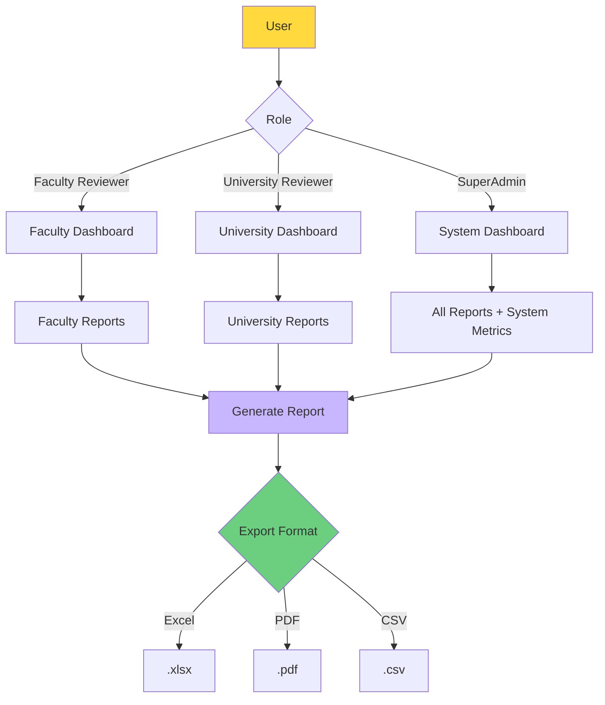

# UC-HL-005: Reporting & Analytics

> **Module**: 5 - Reporting & Analytics  
> **Priority**: 🟡 P1 - Should Have  
> **Actors**: Faculty Reviewer, University Reviewer, SuperAdmin

---

## 📋 Use Case Overview

**ID**: UC-HL-005  
**Name**: Reporting & Analytics  
**Description**: Tạo báo cáo và xem analytics về năng suất nghiên cứu cấp Khoa và Trường. Hỗ trợ export Excel/PDF cho ban giám hiệu.

---

## 👥 Actors

### Primary Actors
- **Faculty Reviewer**: View faculty-level reports
- **University Reviewer**: View university-wide reports
- **SuperAdmin**: View all reports, system analytics

---

## 🎯 Goals

- Theo dõi năng suất nghiên cứu theo đơn vị
- Hỗ trợ ra quyết định quản lý
- Cung cấp dữ liệu cho báo cáo hàng năm
- Benchmark giữa các khoa

---

## 🔗 Related Artifacts

**User Stories** (7 stories):
- US-FCR-008: Xem Báo Cáo Khoa (P1)
- US-FCR-009: Theo Dõi SLA Xét Duyệt (P2)
- US-UNR-007: Xem Dashboard Analytics Toàn Trường (P1)
- US-UNR-008: Tạo Báo Cáo Toàn Trường (P1)
- US-UNR-009: Xem Báo Cáo Theo Quartile (P1)
- US-UNR-010: Xem Xu Hướng Phát Triển (P2)

**Functional Requirements**: FR-REP-001 to FR-REP-007

---

## 📊 Reporting Architecture

---

## 🔄 Main Flows

### Flow 1: Faculty Report (Faculty Reviewer)

1. Faculty Reviewer logs in
2. Reviewer clicks "Reports"
3. System shows Faculty Dashboard with:
   - Total publications this year (auto-filtered to their faculty)
   - Distribution by quartile
   - Top researchers in faculty
   - Trend chart (last 5 years)
4. Reviewer selects year range and options
5. Reviewer clicks "Generate Detail Report"
6. System generates report with:
   - All publications by faculty
   - Grouped by researcher
   - Summary statistics
7. Reviewer exports to Excel/PDF

**Report Content**:
- Faculty name and year range
- Summary: Total pubs, by quartile, by type
- Researcher breakdown: Name, pubs count, quartile distribution
- Detailed publication list

---

### Flow 2: University Report (University Reviewer)

1. University Reviewer logs in
2. Reviewer clicks "Analytics"
3. System shows University Dashboard with:
   - Total publications (all faculties)
   - Distribution by faculty
   - Distribution by quartile
   - Top 10 researchers university-wide
   - Year-over-year growth
4. Reviewer can filter by faculty, year range
5. System updates visualizations dynamically

**Metrics Displayed**:
- Total publications: All time, this year, last year
- By Faculty: Bar chart comparing faculties
- By Quartile: Pie chart Q1/Q2/Q3/Q4
- By Year: Line chart showing trend

---

### Flow 3: Generate Comprehensive Report

1. Reviewer selects parameters:
   - Year range (from - to)
   - Faculty filter (all or specific)
   - Include/exclude fields
2. Reviewer clicks "Generate Report"
3. System queries database (may take 30s - 5min for large datasets)
4. System shows progress indicator  
5. System generates report
6. Reviewer chooses export format
7. System downloads file

**Export Formats**:
- **Excel (.xlsx)**: Multiple sheets (Summary, by Faculty, by Researcher, Detail)
- **PDF (.pdf)**: Formatted report with charts
- **CSV (.csv)**: Raw data for further analysis

---

### Flow 4: Quartile Analysis (P1)

1. University Reviewer accesses Quartile Report
2. Reviewer selects year range
3. System shows breakdown:
   - Q1 publications: Count + list
   - Q2 publications: Count + list  
   - Q3/Q4 publications: Count + list
   - Conference papers: Count + list
4. System compares to previous year:
   - Q1: +15% from last year
   - Total: +8% from last year
5. Reviewer can drill down to see individual publications

---

### Flow 5: Trend Analysis (P2)

1. University Reviewer views Trend Analysis
2. System shows:
   - Year-over-year growth rate (%)
   - Top growing faculties
   - Emerging research fields (from keywords frequency)
   - Most productive researchers this year
3. Visualizations:
   - Line chart: Growth trajectory
   - Word cloud: Hot research topics
   - Leaderboard: Top contributors

---

### Flow 6: SLA Monitoring (Faculty/University, P2)

1. Reviewer views SLA dashboard
2. System shows publications grouped by status:
   - Pending review (how many days)
   - Overdue (> 7 days at current level)
   - Average review time
3. Overdue publications highlighted in red
4. Reviewer can click to review immediately

**Metrics**:
- Average Faculty review time: X days
- Average University review time: Y days
- % reviewed within SLA (7 days): Z%

---

## ✅ Preconditions

- User has Reviewer or Admin role
- Publications exist in system
- User is authenticated

---

## 📝 Postconditions

**Success**:
- User has insights into research productivity
- Reports can be shared with management
- Exported files are usable in Excel/PowerPoint

---

## 🔒 Business Rules

### BR-REP-001: Access Control
- Faculty Reviewer: CHỈ xem faculty của mình
- University Reviewer: Xem tất cả faculties
- SuperAdmin: Xem all + system metrics

### BR-REP-002: Data Scope
- CHỈ bao gồm PUBLISHED publications
- KHÔNG bao gồm: DRAFT, SUBMITTED, REJECTED

### BR-REP-003: Refresh Rate
- Dashboard: Real-time (updated on page load)
- Reports: Generated on-demand
- Charts: Cached 1 hour

### BR-REP-004: Performance
- Dashboard load: < 3 seconds
- Report generation: < 5 minutes (for 10 years data)
- Export download: Immediate (file prepared in background)

### BR-REP-005: Data Retention
- Generated reports stored 30 days
- User can re-download within retention period

---

## 📐 Sub Use Cases (Medium-Level)

- UC-M5-001: Generate Faculty Report
- UC-M5-002: Generate University Report
- UC-M5-003: Export to Excel
- UC-M5-004: Export to PDF
- UC-M5-005: View Dashboard Statistics
- UC-M5-006: Track Productivity Trends
- UC-M5-007: Benchmark Faculties

---

## 📊 Key Metrics

- **Usage**: % reviewers who use reports monthly
- **Report Size**: Average rows per export
- **Performance**: Generation time (target < 2 min)
- **Downlo ads**: Top exported formats

---

## 🚨 Exceptions

| Error | Condition | System Response |
|-------|-----------|-----------------|
| No data | Year range has 0 publications | Show "No data for this period" |
| Timeout | Report generation > 5 min | Cancel, suggest smaller range |
| Export failed | File generation error | Retry, alert user |
| Unauthorized | Faculty reviewer tries university report | Show "Access denied" |

---

**Tài liệu liên quan**:
- [User Stories - Faculty Reviewer](../../04_User_Stories/By_Role/faculty_reviewer_stories.md)
- [User Stories - University Reviewer](../../04_User_Stories/By_Role/university_reviewer_stories.md)
- [Requirements - Reporting](../../03_Requirements/Functional/module_reporting.md)
