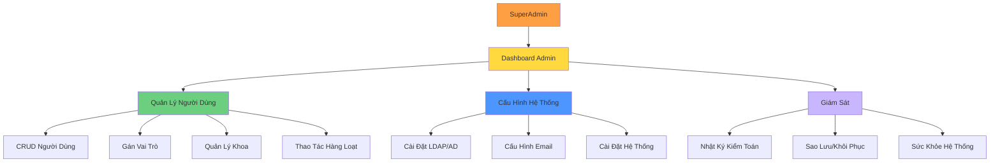

# UC-HL-006: Quản Trị Hệ Thống (System Administration)

> **Module**: 6 - Quản Trị Hệ Thống & Người Dùng  
> **Độ Ưu Tiên**: 🔴 P0 - Phải Có  
> **Tác Nhân**: SuperAdmin

---

## 📋 Tổng Quan Use Case

**ID**: UC-HL-006  
**Tên**: Quản Trị Hệ Thống  
**Mô Tả**: SuperAdmin quản trị toàn bộ hệ thống: quản lý người dùng (user management), phân quyền (role assignment), cấu hình hệ thống (LDAP, Email), sao lưu/khôi phục (backup/restore), và nhật ký kiểm toán (audit logs).

---

## 👥 Tác Nhân

### Tác Nhân Chính
- **SuperAdmin**: Quản trị viên hệ thống

---

## 🎯 Mục Tiêu

- Quản lý người dùng và phân quyền
- Cấu hình tích hợp LDAP/AD
- Đảm bảo sao lưu (backup) và phục hồi (recovery)
- Giám sát hệ thống và nhật ký kiểm toán
- Hỗ trợ người dùng mới (onboarding) hàng loạt

---

## 🔗 Tài Liệu Liên Quan

**User Stories** (10 stories):
- US-ADM-001: Quản Lý Người Dùng (CRUD) (P0)
- US-ADM-002: Gán Vai Trò Người Dùng (P0)
- US-ADM-003: Quản Lý Khoa/Đơn Vị (P0)
- US-ADM-004: Cấu Hình LDAP/AD (P0)
- US-ADM-005: Cấu Hình Email (P0)
- US-ADM-006: Xem Audit Logs (P0)
- US-ADM-007: Backup và Restore (P0)
- US-ADM-008: Xem Dashboard Hệ Thống (P1)
- US-ADM-009: Import Người Dùng từ Excel (P1)
- US-ADM-010: Thao Tác Hàng Loạt (P0)

**Yêu Cầu Chức Năng**: FR-ADM-001 đến FR-ADM-010

---

## 🔧 Kiến Trúc Quản Trị

---

## 🔄 Luồng Chính (Main Flows)

### Flow 1: Quản Lý Người Dùng (CRUD)

**Tạo Người Dùng**:
1. Admin nhấn "Thêm Người Dùng"
2. Hệ thống hiển thị form (Tên, Email, Khoa, Vai trò)
3. Admin nhập thông tin
4. Hệ thống xác thực:
   - Định dạng email và tính duy nhất
   - Khoa tồn tại
   - Vai trò hợp lệ
5. Hệ thống tạo người dùng
6. Hệ thống gửi email chào mừng (tùy chọn)

**Sửa Người Dùng**:
1. Admin chọn người dùng từ danh sách
2. Admin chỉnh sửa: Tên, Email, Khoa, Vai trò
3. Hệ thống xác thực và cập nhật
4. Hệ thống ghi nhận thay đổi vào nhật ký kiểm toán

**Xóa Người Dùng**:
1. Admin nhấn "Xóa"
2. Hệ thống xác nhận: "Bạn có chắc chắn không?"
3. Nếu xác nhận: Xóa mềm (đặt deleted_at)
4. Người dùng không còn có thể đăng nhập

**Khóa/Mở Khóa**:
- Admin có thể khóa tài khoản (vô hiệu hóa tạm thời)
- Người dùng bị khóa sẽ nhận thông báo "Tài khoản bị khóa" khi đăng nhập

---

### Flow 2: Gán Vai Trò

1. Admin xem chi tiết người dùng
2. Admin xem các vai trò hiện tại
3. Admin gán/gỡ bỏ vai trò:
   - SuperAdmin
   - Researcher (mặc định cho tất cả)
   - Faculty Reviewer
   - University Reviewer
   - Viewer
4. Người dùng có thể có NHIỀU vai trò
5. Hệ thống cập nhật quyền hạn ngay lập tức
6. Hệ thống ghi nhận thay đổi vai trò

---

### Flow 3: Quản Lý Khoa/Phòng Ban

1. Admin nhấn "Quản Lý Khoa"
2. Hệ thống hiển thị danh sách khoa
3. Admin có thể:
   - Thêm khoa mới (tên, mã)
   - Sửa thông tin khoa
   - Xóa khoa (nếu không có người dùng được gán)
   - Gán Faculty Reviewer cho từng khoa
4. Thay đổi được lưu
5. Các danh sách thả xuống (dropdown) tự động cập nhật

---

### Flow 4: Cấu Hình Xác Thực LDAP/AD

1. Admin nhấn "Cấu Hình Hệ Thống" → "LDAP"
2. Hệ thống hiển thị form cấu hình:
   - LDAP Server URL (VD: ldap://domain.edu)
   - Base DN (VD: dc=university,dc=edu)
   - Bind DN và Mật khẩu
   - Bộ lọc tìm kiếm người dùng
3. Admin nhập giá trị
4. Admin nhấn "Kiểm Tra Kết Nối"
5. Hệ thống thử kết nối LDAP (bind)
6. Nếu thành công: "Kết nối thành công ✓"
7. Nếu thất bại: Hiển thị thông báo lỗi
8. Admin lưu cấu hình

**Kết Quả**: Người dùng có thể đăng nhập bằng tài khoản trường

---

### Flow 5: Cấu Hình Máy Chủ Email

1. Admin nhấn "Cấu Hình Hệ Thống" → "Email"
2. Hệ thống hiển thị cài đặt SMTP:
   - SMTP Host (VD: smtp.gmail.com)
   - SMTP Port (465, 587, v.v.)
   - Username và Password
   - Địa chỉ gửi đi (From Address)
   - Sử dụng TLS: Có/Không
3. Admin nhập giá trị
4. Admin nhấn "Gửi Email Thử"
5. Hệ thống gửi email thử đến địa chỉ của admin
6. Nếu nhận được: "Email thử đã gửi ✓"
7. Admin lưu cấu hình

**Kết Quả**: Thông báo duyệt bài sẽ hoạt động

---

### Flow 6: Xem Nhật Ký Kiểm Toán (Audit Logs)

1. Admin nhấn "Nhật Ký Kiểm Toán"
2. Hệ thống hiển thị nhật ký sự kiện có thể lọc:
   - Người dùng đăng nhập/đăng xuất
   - Thay đổi trạng thái bài báo
   - Thay đổi vai trò người dùng
   - Thay đổi cấu hình hệ thống
3. Admin có thể lọc theo:
   - Khoảng thời gian
   - Người dùng
   - Loại hành động (đăng nhập, sửa, xóa, v.v.)
4. Admin có thể xuất ra CSV
5. Các mục nhật ký hiển thị:
   - Timestamp
   - Người dùng
   - Hành động
   - Địa chỉ IP
   - Chi tiết

---

### Flow 7: Sao Lưu và Khôi Phục

**Sao Lưu (Backup)**:
1. Admin nhấn "Sao Lưu"
2. Hệ thống nhắc: "Thao tác này có thể mất vài phút"
3. Hệ thống sao lưu:
   - Cơ sở dữ liệu (SQL dump)
   - Tập tin tải lên (PDFs, ảnh)
4. Hệ thống tạo file .zip
5. Hệ thống hiển thị liên kết tải xuống
6. Admin có thể lên lịch sao lưu tự động hàng ngày

**Khôi Phục (Restore)**:
1. Admin tải lên file backup .zip
2. Hệ thống xác thực file backup
3. Hệ thống cảnh báo: "Thao tác này sẽ ghi đè dữ liệu hiện tại"
4. Admin xác nhận
5. Hệ thống khôi phục cơ sở dữ liệu và tập tin
6. Hệ thống khởi động lại ứng dụng
7. Admin đăng nhập lại

---

### Flow 8: Dashboard Hệ Thống (P1)

1. Admin xem dashboard
2. Hệ thống hiển thị:
   - Tổng số người dùng (theo vai trò)
   - Tổng số bài báo (theo trạng thái)
   - Dung lượng lưu trữ đã dùng/còn trống
   - Sức khỏe hệ thống:
     - Sử dụng CPU
     - Sử dụng Bộ nhớ
     - Sử dụng Ổ đĩa
   - Người dùng đang online
3. Biểu đồ và đồng hồ đo trực quan hóa các chỉ số
4. Chỉ báo Xanh/Vàng/Đỏ cho sức khỏe hệ thống

---

### Flow 9: Import Người Dùng từ Excel (P1)

1. Admin nhấn "Import Người Dùng"
2. Hệ thống hiển thị liên kết tải mẫu
3. Admin tải mẫu: `user_import_template.xlsx`
4. Admin điền Excel: Tên, Email, Khoa, Vai trò
5. Admin tải lên file đã điền
6. Hệ thống xác thực từng dòng:
   - Định dạng Email
   - Khoa tồn tại
   - Vai trò hợp lệ
7. Hệ thống hiển thị bản xem trước với lỗi (nếu có)
8. Admin xác nhận import
9. Hệ thống tạo người dùng
10. Hệ thống hiển thị tóm tắt: "Đã tạo 50, thất bại 3"

---

### Flow 10: Thao Tác Hàng Loạt (P0)

1. Admin chọn nhiều người dùng (checkboxes)
2. Admin chọn hành động hàng loạt:
   - Gán vai trò cho tất cả
   - Chuyển sang khoa khác
   - Khóa/Mở khóa tài khoản
   - Xóa tất cả
3. Hệ thống xác nhận: "Áp dụng cho 15 người dùng?"
4. Admin xác nhận
5. Hệ thống thực thi thao tác
6. Hệ thống hiển thị kết quả: "Đã cập nhật 15 người dùng"

---

## ✅ Điều Kiện Tiên Quyết

- Người dùng đã xác thực với vai trò SuperAdmin
- Hệ thống đang hoạt động

---

## 📝 Điều Kiện Hậu Quyết

**Thành Công**:
- Người dùng được quản lý chính xác
- Hệ thống được cấu hình đúng
- Bản sao lưu được tạo và lưu trữ
- Tất cả thay đổi được ghi nhật ký

---

## 🔒 Quy Tắc Nghiệp Vụ

### BR-ADM-001: Quyền SuperAdmin
- CHỈ SuperAdmin mới được truy cập tính năng admin
- SuperAdmin có TẤT CẢ quyền

### BR-ADM-002: Tự Quản Lý
- Admin KHÔNG thể xóa chính mình
- Admin KHÔNG thể tự gỡ bỏ vai trò SuperAdmin của mình
- Phải có ít nhất 1 SuperAdmin trong hệ thống

### BR-ADM-003: Phân Cấp Vai Trò
- SuperAdmin > University Reviewer > Faculty Reviewer > Researcher

### BR-ADM-004: Kiểm Toán Mọi Thứ
- TẤT CẢ hành động admin đều được ghi log
- Logs là BẤT BIẾN (không thể xóa)
- Thời gian lưu trữ: Tối thiểu 2 năm

### BR-ADM-005: Chiến Lược Sao Lưu
- Sao lưu tự động hàng ngày
- Giữ lại 30 ngày gần nhất
- Khuyến nghị lưu trữ offsite (ngoài server)

### BR-ADM-006: Xác Thực Email
- Email phải là duy nhất
- Định dạng Email: Tuân thủ RFC 5322

---

## 📐 Use Cases Con (Cấp Trung)

- [UC-M6-001: Tạo Người Dùng](../Medium_Level/module_06_admin_management.md)
- [UC-M6-002: Sửa Người Dùng](../Medium_Level/module_06_admin_management.md)
- [UC-M6-003: Xóa Người Dùng](../Medium_Level/module_06_admin_management.md)
- [UC-M6-004: Gán Vai Trò](../Medium_Level/module_06_admin_management.md)
- [UC-M6-005: Quản Lý Khoa](../Medium_Level/module_06_admin_management.md)
- [UC-M6-006: Cấu Hình LDAP](../Medium_Level/module_06_admin_management.md)
- [UC-M6-007: Cấu Hình Email](../Medium_Level/module_06_admin_management.md)
- [UC-M6-008: Xem Audit Logs](../Medium_Level/module_06_admin_management.md)
- [UC-M6-009: Sao Lưu Hệ Thống](../Medium_Level/module_06_admin_management.md)
- [UC-M6-010: Import Người Dùng từ Excel](../Medium_Level/module_06_admin_management.md)

---

## 📊 Chỉ Số Chính

- **Tăng Trưởng Người Dùng**: Số người dùng mới mỗi tháng
- **Thành Công Sao Lưu**: 100% sao lưu hàng ngày
- **Độ Bao Phủ Audit**: 100% các thao tác quan trọng được ghi log
- **Thời Gian Hoạt Động (Uptime)**: Mục tiêu 99.9%

---

## 🚨 Ngoại Lệ

| Lỗi | Điều Kiện | Phản Hồi Hệ Thống |
|-------|-----------|-----------------|
| Trùng email | Email đã tồn tại | Hiển thị "Email đã được sử dụng" |
| Kết nối LDAP thất bại | Cấu hình sai | Hiển thị lỗi chi tiết, không lưu |
| Sao lưu thất bại | Ổ đĩa đầy | Cảnh báo admin, gửi email thông báo |
| Import validation thất bại | Excel có lỗi | Hiển thị lỗi, cho phép sửa và tải lên lại |
| Admin cuối cùng | Cố gắng xóa SuperAdmin cuối cùng | Chặn xóa: "Phải có ít nhất 1 admin" |

---

**Tài liệu liên quan**:
- [User Stories - SuperAdmin](../../04_User_Stories/By_Role/admin_stories.md)
- [Yêu Cầu - Quản Trị Hệ Thống](../../03_Requirements/Functional/module_admin.md)
