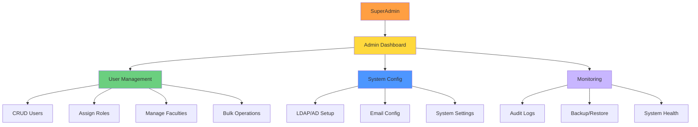

# UC-HL-006: System Administration

> **Module**: 6 - Admin & User Management  
> **Priority**: 🔴 P0 - Must Have  
> **Actors**: SuperAdmin

---

## 📋 Use Case Overview

**ID**: UC-HL-006  
**Name**: System Administration  
**Description**: SuperAdmin quản trị toàn bộ hệ thống: user management, role assignment, system configuration (LDAP, Email), backup/restore, và audit logs.

---

## 👥 Actors

### Primary Actor
- **SuperAdmin**: Quản trị viên hệ thống

---

## 🎯 Goals

- Quản lý người dùng và phân quyền
- Cấu hình tích hợp LDAP/AD
- Đảm bảo backup và recovery
- Monitor hệ thống và audit trails
- Onboarding users hàng loạt

---

## 🔗 Related Artifacts

**User Stories** (10 stories):
- US-ADM-001: Quản Lý Người Dùng (CRUD) (P0)
- US-ADM-002: Gán Vai Trò Người Dùng (P0)
- US-ADM-003: Quản Lý Khoa/Đơn Vị (P0)
- US-ADM-004: Cấu Hình LDAP/AD (P0)
- US-ADM-005: Cấu Hình Email (P0)
- US-ADM-006: Xem Audit Logs (P0)
- US-ADM-007: Backup và Restore (P0)
- US-ADM-008: Xem System Dashboard (P1)
- US-ADM-009: Import Người Dùng từ Excel (P1)
- US-ADM-010: Thao Tác Hàng Loạt (P0)

**Functional Requirements**: FR-ADM-001 to FR-ADM-010

---

## 🔧 Admin Architecture

---

## 🔄 Main Flows

### Flow 1: User Management (CRUD)

**Create User**:
1. Admin clicks "Add User"
2. System shows form (Name, Email, Faculty, Role)
3. Admin enters info
4. System validates:
   - Email format and uniqueness
   - Faculty exists
   - Role is valid
5. System creates user
6. System sends welcome email (optional)

**Edit User**:
1. Admin selects user from list
2. Admin edits: Name, Email, Faculty, Role
3. System validates and updates
4. System logs change in audit trail

**Delete User**:
1. Admin clicks "Delete"
2. System confirms: "Are you sure?"
3. If confirmed: Soft delete (set deleted_at)
4. User can no longer login

**Lock/Unlock**:
- Admin can lock account (temporary disable)
- Locked user gets "Account locked" message on login

---

### Flow 2: Role Assignment

1. Admin views user details
2. Admin sees current roles
3. Admin assigns/removes roles:
   - SuperAdmin
   - Researcher (default for all)
   - Faculty Reviewer
   - University Reviewer
   - Viewer
4. User can have MULTIPLE roles
5. System updates permissions immediately
6. System logs role changes

---

### Flow 3: Manage Faculties/Departments

1. Admin clicks "Manage Faculties"
2. System shows list of faculties
3. Admin can:
   - Add new faculty (name, code)
   - Edit faculty info
   - Delete faculty (if no users assigned)
   - Assign Faculty Reviewer to each faculty
4. Changes are saved
5. Dropdown lists update automatically

---

### Flow 4: Configure LDAP/AD Authentication

1. Admin clicks "System Config" → "LDAP"
2. System shows configuration form:
   - LDAP Server URL (e.g., ldap://domain.edu)
   - Base DN (e.g., dc=university,dc=edu)
   - Bind DN and Password
   - User search filter
3. Admin enters values
4. Admin clicks "Test Connection"
5. System attempts LDAP bind
6. If success: "Connection successful ✓"
7. If fail: Show error message
8. Admin saves configuration

**Effect**: Users can now login with university credentials

---

### Flow 5: Configure Email Server

1. Admin clicks "System Config" → "Email"
2. System shows SMTP settings:
   - SMTP Host (e.g., smtp.gmail.com)
   - SMTP Port (465, 587, etc.)
   - Username and Password
   - From Address
   - Use TLS: Yes/No
3. Admin enters values
4. Admin clicks "Send Test Email"
5. System sends test email to admin's address
6. If received: "Test email sent ✓"
7. Admin saves configuration

**Effect**: Approval notifications now work

---

### Flow 6: View Audit Logs

1. Admin clicks "Audit Logs"
2. System shows filterable event log:
   - User login/logout
   - Publication state changes
   - User role changes
   - System config changes
3. Admin can filter by:
   - Date range
   - User
   - Action type (login, edit, delete, etc.)
4. Admin can export to CSV
5. Log entries show:
   - Timestamp
   - User
   - Action
   - IP address
   - Details

---

### Flow 7: Backup and Restore

**Backup**:
1. Admin clicks "Backup"
2. System prompts: "This may take several minutes"
3. System backs up:
   - Database (SQL dump)
   - Uploaded files (PDFs, photos)
4. System creates .zip file
5. System shows download link
6. Admin can schedule automatic daily backups

**Restore**:
1. Admin uploads backup .zip file
2. System validates backup file
3. System shows warning: "This will overwrite current data"
4. Admin confirms
5. System restores database and files
6. System restarts application
7. Admin logs back in

---

### Flow 8: System Dashboard (P1)

1. Admin views dashboard
2. System shows:
   - Total users (by role)
   - Total publications (by status)
   - Storage used/available
   - System health:
     - CPU usage
     - Memory usage
     - Disk usage
   - Users currently online
3. Charts and gauges visualize metrics
4. Red/yellow/green indicators for health

---

### Flow 9: Import Users from Excel (P1)

1. Admin clicks "Import Users"
2. System shows template link
3. Admin downloads template: `user_import_template.xlsx`
4. Admin fills Excel: Name, Email, Faculty, Role
5. Admin uploads filled file
6. System validates each row:
   - Email format
   - Faculty exists
   - Role is valid
7. System shows preview with errors (if any)
8. Admin confirms import
9. System creates users
10. System shows summary: "50 created, 3 failed"

---

### Flow 10: Bulk Operations (P0)

1. Admin selects multiple users (checkboxes)
2. Admin chooses bulk action:
   - Assign role to all
   - Move to different faculty
   - Lock/Unlock accounts
   - Delete all
3. System confirms: "Apply to 15 users?"
4. Admin confirms
5. System executes operation
6. System shows results: "15 users updated"

---

## ✅ Preconditions

- User is authenticated with SuperAdmin role
- System is operational

---

## 📝 Postconditions

**Success**:
- Users are managed correctly
- System is configured properly
- Backups are created and stored
- All changes are logged

---

## 🔒 Business Rules

### BR-ADM-001: SuperAdmin Rights
- ONLY SuperAdmin can access admin features
- SuperAdmin có ALL permissions

### BR-ADM-002: Self-Management
- Admin KHÔNG thể xóa chính mình
- Admin KHÔNG thể revoke own SuperAdmin role
- Must have at least 1 SuperAdmin in system

### BR-ADM-003: Role Hierarchy
- SuperAdmin > University Reviewer > Faculty Reviewer > Researcher

### BR-ADM-004: Audit Everything
- ALL admin actions are logged
- Logs are IMMUTABLE (cannot be deleted)
- Retention: 2 years minimum

### BR-ADM-005: Backup Strategy
- Daily automatic backups
- Keep last 30 days
- Offsite storage recommended

### BR-ADM-006: Email Validation
- Email must be unique
- Email format: RFC 5322 compliant

---

## 📐 Sub Use Cases (Medium-Level)

- UC-M6-001: Create User
- UC-M6-002: Edit User
- UC-M6-003: Delete User
- UC-M6-004: Assign Roles
- UC-M6-005: Manage Faculties
- UC-M6-006: Configure LDAP
- UC-M6-007: Configure Email 
- UC-M6-008: View Audit Logs
- UC-M6-009: Backup System
- UC-M6-010: Import Users from Excel

---

## 📊 Key Metrics

- **User Growth**: New users per month
- **Backup Success**: 100% daily backups
- **Audit Coverage**: 100% critical operations logged
- **System Uptime**: 99.9% target

---

## 🚨 Exceptions

| Error | Condition | System Response |
|-------|-----------|-----------------|
| Duplicate email | Email already exists | Show "Email already in use" |
| LDAP connection failed | Invalid config | Show detailed error, don't save |
| Backup failed | Disk full | Alert admin, send email notification |
| Import validation failed | Excel has errors | Show errors, allow fix and re-upload |
| Last admin | Try to delete last SuperAdmin | Block deletion: "Must have 1 admin" |

---

**Tài liệu liên quan**:
- [User Stories - SuperAdmin](../../04_User_Stories/By_Role/admin_stories.md)
- [Requirements - Admin & User Management](../../03_Requirements/Functional/module_admin.md)
