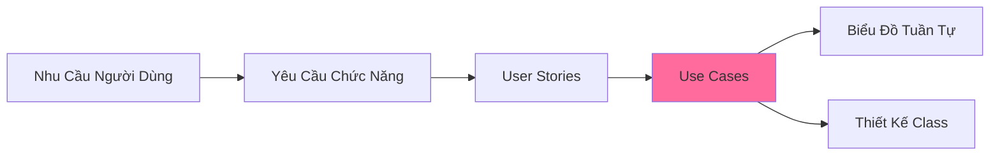
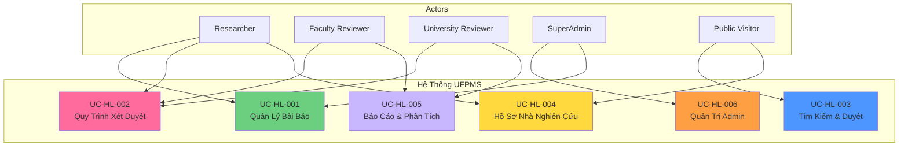

# Use Cases - README

> 📁 **Thư mục**: `05_Use_Cases`  
> 📅 **Cập nhật**: 10/02/2026  
> 🎯 **Mục đích**: Mô tả chi tiết các tương tác giữa actors và hệ thống UFPMS

---

## 📁 Cấu Trúc Thư Mục

```
05_Use_Cases/
├── README.md (tài liệu này)
├── High_Level/              # 6 use cases tổng quan theo module
│   ├── README.md
│   ├── uc_hl_01_manage_publications.md
│   ├── uc_hl_02_approval_workflow.md
│   ├── uc_hl_03_search_browse.md
│   ├── uc_hl_04_researcher_profile.md
│   ├── uc_hl_05_reporting_analytics.md
│   └── uc_hl_06_admin_management.md
├── Medium_Level/            # ~45 use cases chi tiết theo chức năng
│   ├── README.md
│   ├── module_01_publication_management.md
│   ├── module_02_approval_workflow.md
│   ├── module_03_search_browse.md
│   ├── module_04_researcher_profile.md
│   ├── module_05_reporting_analytics.md
│   └── module_06_admin_management.md
├── Detailed_Level/          # ~20 use cases P0 với các luồng đầy đủ
│   ├── README.md
│   ├── uc_d1_01_create_publication.md
│   ├── uc_d2_01_submit_for_review.md
│   └── ... (18 tài liệu chi tiết khác)
└── Diagrams/                # Biểu đồ Use case
    ├── README.md
    ├── overall_system_diagram.md
    └── ... (biểu đồ theo module)
```

---

## 🎯 Tổng Quan

**Use Cases** mô tả cách thức tương tác giữa **tác nhân** (người dùng) và **hệ thống** để đạt được mục tiêu cụ thể. Use cases là cầu nối giữa User Stories và Thiết kế Hệ thống (System Design).

### Mối Quan Hệ



---

## 👥 Tác Nhân (5 Vai Trò)

| Tác Nhân | Số Lượng UC | Mô Tả | Module Chính |
|-------|-------------|-------|--------------|
| **Researcher** | 28 | Giảng viên quản lý bài báo | 1, 2, 4 |
| **Faculty Reviewer** | 9 | Cán bộ Khoa xét duyệt | 2, 5 |
| **University Reviewer** | 10 | Cán bộ Trường phê duyệt cuối | 2, 5 |
| **SuperAdmin** | 10 | Quản trị hệ thống | 6 |
| **Public Visitor** | 8 | Khách truy cập công khai | 3, 4 |

---

## 📊 Thống Kê Use Cases

### Theo Cấp Độ

| Cấp Độ | Số Lượng | Mô Tả |
|-------|----------|-------|
| **High-Level** | 6 | Tổng quan 6 modules |
| **Medium-Level** | 54 | Chi tiết từng chức năng |
| **Detailed-Level** | 20 | Đặc tả đầy đủ cho use cases P0 |
| **TỔNG** | **80** | |

### Theo Module

| Module | High | Medium | Detailed | Tổng |
|--------|------|--------|----------|------|
| 1. Quản Lý Bài Báo | 1 | 9 | 5 | 15 |
| 2. Quy Trình Xét Duyệt | 1 | 15 | 7 | 23 |
| 3. Tìm Kiếm & Duyệt | 1 | 7 | 3 | 11 |
| 4. Hồ Sơ Nhà Nghiên Cứu | 1 | 6 | 0 | 7 |
| 5. Báo Cáo & Phân Tích | 1 | 7 | 0 | 8 |
| 6. Quản Trị & Người Dùng | 1 | 10 | 5 | 16 |

### Theo Độ Ưu Tiên

| Độ Ưu Tiên | Use Cases | % |
|----------|-----------|---|
| 🔴 P0 - Phải Có | 42 | 52% |
| 🟡 P1 - Nên Có | 25 | 31% |
| 🟢 P2 - Có Thì Tốt | 13 | 16% |

---

## 🗺️ Biểu Đồ Use Case - Tổng Quan Hệ Thống



---

## 📖 Hướng Dẫn Đọc

### Dành cho Product Owner / Stakeholders
1. **[High-Level Use Cases](./High_Level/)** - Tổng quan 6 modules
2. **[Biểu Đồ Use Case](./Diagrams/)** - Hình ảnh hóa

### Dành cho Business Analysts
1. **[Medium-Level Use Cases](./Medium_Level/)** - Chi tiết 54 chức năng
2. Truy xuất nguồn gốc (Traceability) với User Stories và Yêu cầu

### Dành cho Developers & Architects
1. **[Detailed-Level Use Cases](./Detailed_Level/)** - 20 đặc tả P0 với luồng đầy đủ
2. Điều kiện tiên quyết, Luồng chính, Luồng thay thế, Ngoại lệ
3. Quy tắc nghiệp vụ và xác thực

### Dành cho Testers
1. **Đặc tả chi tiết** → Kịch bản kiểm thử (Test scenarios)
2. **Luồng thay thế** → Test cases cho các trường hợp biên
3. **Luồng ngoại lệ** → Test cases cho các lỗi (Negative test cases)

---

## 🔑 Quy Tắc Đặt Tên Use Case

### High-Level (Cấp Cao)
- Định dạng: `UC-HL-0X: [Tên Module]`
- Ví dụ: `UC-HL-001: Quản Lý Bài Báo`

### Medium-Level (Cấp Trung)
- Định dạng: `UC-MX-XXX: [Tên Tính Năng]`
- Ví dụ: `UC-M1-001: Tạo Bài Báo`
- X = Số thứ tự Module (1-6)

### Detailed-Level (Cấp Chi Tiết)
- Định dạng: `UC-DX-XX: [Tên Tính Năng]`
- Ví dụ: `UC-D1-01: Tạo Bài Báo`
- Chỉ dành cho các use cases quan trọng (P0)

---

## 📋 Mẫu Use Case

### Định Dạng Medium-Level

```
## UC-MX-XXX: [Tên Use Case]

**ID**: UC-MX-XXX  
**Độ Ưu Tiên**: P0/P1/P2  
**Tác Nhân**: [Tên các tác nhân]  
**User Stories Liên Quan**: US-XXX-XXX  
**Yêu Cầu Chức Năng Liên Quan**: FR-XXX-XXX

### Mục Tiêu
Mô tả ngắn gọn về những gì tác nhân muốn đạt được.

### Điều Kiện Tiên Quyết
- Tác nhân đã đăng nhập (nếu yêu cầu)
- Yêu cầu về trạng thái hệ thống

### Luồng Chính
1. Tác nhân thực hiện ...
2. Hệ thống phản hồi ...
3. ...

### Điều Kiện Hậu Quyết
- Thành công: Trạng thái hệ thống sau khi hoàn thành thành công
- Thất bại: Trạng thái hệ thống nếu thao tác thất bại

### Quy Tắc Nghiệp Vụ
- Quy tắc 1
- Quy tắc 2
```

### Định Dạng Detailed-Level (bổ sung)

```
### Luồng Thay Thế
**Alt 1: [Tên kịch bản]**
- Khi: ...
- Thì: ...

**Alt 2: [Kịch bản khác]**
- ...

### Luồng Ngoại Lệ
**Exc 1: [Kịch bản lỗi]**
- Khi: ...
- Hệ thống: ...
```

---

## 🔗 Bản Đồ Truy Xuất (Traceability Map)

### Module 1: Quản Lý Bài Báo

| ID Use Case | User Stories | FRs | Độ Ưu Tiên |
|-------------|--------------|-----|----------|
| UC-M1-001 | US-RES-001 | FR-PUB-001 | P0 |
| UC-M1-002 | US-RES-003 | FR-PUB-004 | P0 |
| UC-M1-003 | US-RES-004 | FR-PUB-005 | P0 |
| ... | ... | ... | ... |

> **Xem chi tiết**: [Medium_Level/module_01_publication_management.md](./Medium_Level/module_01_publication_management.md)

### Module 2: Quy Trình Xét Duyệt

| ID Use Case | User Stories | FRs | Độ Ưu Tiên |
|-------------|--------------|-----|----------|
| UC-M2-001 | US-RES-010 | FR-APR-001 | P0 |
| UC-M2-005 | US-FCR-002 | FR-APR-006 | P0 |
| UC-M2-008 | US-UNR-003 | FR-APR-012 | P0 |
| ... | ... | ... | ... |

> **Xem chi tiết**: [Medium_Level/module_02_approval_workflow.md](./Medium_Level/module_02_approval_workflow.md)

---

## 🚀 Lộ Trình Triển Khai (Implementation Roadmap)

### Sprint 1: Quản Lý Bài Báo Cốt Lõi + Xét Duyệt (P0)
**Use Cases**: UC-M1-001 đến UC-M1-005, UC-M2-001 đến UC-M2-007  
**Mục Tiêu**: CRUD cơ bản + Quy trình xét duyệt cấp Khoa

### Sprint 2: Xét Duyệt Cấp Trường + Admin (P0)
**Use Cases**: UC-M2-008 đến UC-M2-010, UC-M6-001 đến UC-M6-007  
**Mục Tiêu**: Hoàn thiện quy trình xét duyệt + Quản lý người dùng

### Sprint 3: Tìm Kiếm + Hồ Sơ (P1)
**Use Cases**: UC-M3-001 đến UC-M3-005, UC-M4-001 đến UC-M4-004  
**Mục Tiêu**: Tìm kiếm công khai và hồ sơ nhà nghiên cứu

### Sprint 4: Báo Cáo + Nâng Cao (P1/P2)
**Use Cases**: UC-M5-001 đến UC-M5-005, các P1 và P2 còn lại  
**Mục Tiêu**: Phân tích và các tính năng bổ sung

---

## 📐 Các Biểu Đồ Liên Quan

### Trong Thư Mục Này
- [Diagrams/overall_system_diagram.md](./Diagrams/overall_system_diagram.md) - Tất cả tác nhân và modules
- [Diagrams/module_XX_diagram.md](./Diagrams/) - Tương tác cụ thể theo module

### Trong Các Thư Mục Khác
- **Biểu Đồ Tuần Tự**: `05_Use_Cases/Sequence_Diagrams/`
- **Biểu Đồ Hoạt Động**: `05_Use_Cases/Activity_Diagrams/`
- **ERD**: `06_Diagrams/erd.md`

---

## ✅ Danh Sách Kiểm Tra Xác Thực

Trước khi tiến hành thiết kế:

- [ ] Tất cả 65 user stories đều được bao phủ bởi use cases
- [ ] Tất cả các tác nhân đều được đại diện
- [ ] Truy xuất nguồn gốc đến FRs đã hoàn tất
- [ ] Các use cases P0 đều có đặc tả chi tiết
- [ ] Các biểu đồ chính xác và rõ ràng
- [ ] Các bên liên quan (Stakeholders) đã xem xét và phê duyệt

---

**Tài liệu liên quan**:
- [User Stories](../04_User_Stories/)
- [Yêu Cầu Chức Năng](../03_Requirements/Functional/)
- [Đặc Tả Hệ Thống](../01_System_Specification/)

---

*Hoàn thành: 10/02/2026 23:30*
