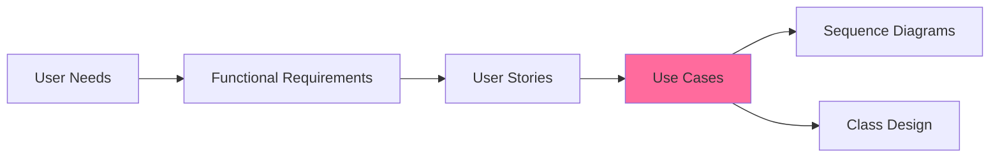
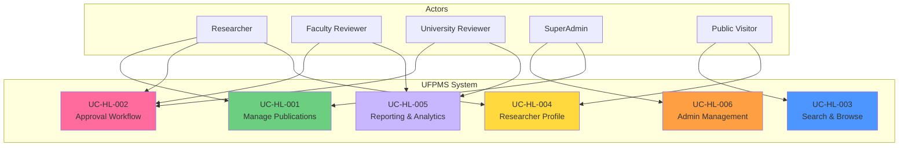

# Use Cases - README

> 📁 **Folder**: `05_Use_Cases`  
> 📅 **Cập nhật**: 10/02/2026  
> 🎯 **Mục đích**: Mô tả chi tiết các tương tác giữa actors và hệ thống UFPMS

---

## 📁 Cấu Trúc Folder

```
05_Use_Cases/
├── README.md (file này)
├── High_Level/              # 6 use cases tổng quan theo module
│   ├── README.md
│   ├── uc_hl_01_manage_publications.md
│   ├── uc_hl_02_approval_workflow.md
│   ├── uc_hl_03_search_browse.md
│   ├── uc_hl_04_researcher_profile.md
│   ├── uc_hl_05_reporting_analytics.md
│   └── uc_hl_06_admin_management.md
├── Medium_Level/            # ~45 use cases chi tiết theo chức năng
│   ├── README.md
│   ├── module_01_publication_management.md
│   ├── module_02_approval_workflow.md
│   ├── module_03_search_browse.md
│   ├── module_04_researcher_profile.md
│   ├── module_05_reporting_analytics.md
│   └── module_06_admin_management.md
├── Detailed_Level/          # ~20 use cases P0 với flows đầy đủ
│   ├── README.md
│   ├── uc_d1_01_create_publication.md
│   ├── uc_d2_01_submit_for_review.md
│   └── ... (18 more detailed specs)
└── Diagrams/                # Use case diagrams
    ├── README.md
    ├── overall_system_diagram.md
    └── ... (module-specific diagrams)
```

---

## 🎯 Tổng Quan

**Use Cases** mô tả cách thức tương tác giữa **actors** (người dùng) và **hệ thống** để đạt được mục tiêu cụ thể. Use cases là cầu nối giữa User Stories và System Design.

### Mối Quan Hệ



---

## 👥 Actors (5 Roles)

| Actor | Số Lượng UC | Mô Tả | Module Chính |
|-------|-------------|-------|--------------|
| **Researcher** | 28 | Giảng viên quản lý bài báo | 1, 2, 4 |
| **Faculty Reviewer** | 9 | Cán bộ Khoa xét duyệt | 2, 5 |
| **University Reviewer** | 10 | Cán bộ Trường phê duyệt cuối | 2, 5 |
| **SuperAdmin** | 10 | Quản trị hệ thống | 6 |
| **Public Visitor** | 8 | Khách truy cập công khai | 3, 4 |

---

## 📊 Thống Kê Use Cases

### Theo Cấp Độ

| Level | Số Lượng | Mô Tả |
|-------|----------|-------|
| **High-Level** | 6 | Tổng quan 6 modules |
| **Medium-Level** | 54 | Chi tiết từng chức năng |
| **Detailed-Level** | 20 | Specs đầy đủ cho P0 use cases |
| **TỔNG** | **80** | |

### Theo Module

| Module | High | Medium | Detailed | Tổng |
|--------|------|--------|----------|------|
| 1. Publication Management | 1 | 9 | 5 | 15 |
| 2. Approval Workflow | 1 | 15 | 7 | 23 |
| 3. Search & Browse | 1 | 7 | 3 | 11 |
| 4. Researcher Profile | 1 | 6 | 0 | 7 |
| 5. Reporting & Analytics | 1 | 7 | 0 | 8 |
| 6. Admin & User Management | 1 | 10 | 5 | 16 |

### Theo Priority

| Priority | Use Cases | % |
|----------|-----------|---|
| 🔴 P0 - Must Have | 42 | 52% |
| 🟡 P1 - Should Have | 25 | 31% |
| 🟢 P2 - Nice to Have | 13 | 16% |

---

## 🗺️ Use Case Diagram - Tổng Quan Hệ Thống



---

## 📖 Hướng Dẫn Đọc

### Cho Product Owner / Stakeholders
1. **[High-Level Use Cases](./High_Level/)** - Tổng quan 6 modules
2. **[Use Case Diagrams](./Diagrams/)** - Visualizations

### Cho Business Analysts
1. **[Medium-Level Use Cases](./Medium_Level/)** - Chi tiết 54 chức năng
2. Traceability với User Stories và Requirements

### Cho Developers & Architects
1. **[Detailed-Level Use Cases](./Detailed_Level/)** - 20 P0 specs với flows đầy đủ
2. Preconditions, Main Flow, Alternative Flows, Exceptions
3. Business Rules và validations

### Cho Testers
1. **Detailed specs** → Test scenarios
2. **Alternative flows** → Test cases for edge cases
3. **Exception flows** → Negative test cases

---

## 🔑 Use Case Naming Convention

### High-Level
- Format: `UC-HL-0X: [Module Name]`
- Example: `UC-HL-001: Manage Publications`

### Medium-Level
- Format: `UC-MX-XXX: [Feature Name]`
- Example: `UC-M1-001: Create Publication`
- X = Module number (1-6)

### Detailed-Level
- Format: `UC-DX-XX: [Feature Name]`
- Example: `UC-D1-01: Create Publication`
- Only for P0 critical use cases

---

## 📋 Use Case Template

### Medium-Level Format

```
## UC-MX-XXX: [Use Case Name]

**ID**: UC-MX-XXX  
**Priority**: P0/P1/P2  
**Actor(s)**: [Actor name(s)]  
**Related User Stories**: US-XXX-XXX  
**Related FR**: FR-XXX-XXX

### Goal
Brief description of what the actor wants to achieve.

### Preconditions
- Actor is logged in (if required)
- System state requirements

### Main Flow
1. Actor does ...
2. System responds ...
3. ...

### Postconditions
- Success: System state after successful completion
- Failure: System state if operation fails

### Business Rules
- Rule 1
- Rule 2
```

### Detailed-Level Format (adds)

```
### Alternative Flows
**Alt 1: [Scenario name]**
- When: ...
- Then: ...

**Alt 2: [Another scenario]**
- ...

### Exception Flows
**Exc 1: [Error scenario]**
- When: ...
- System: ...
```

---

## 🔗 Traceability Map

### Module 1: Publication Management

| Use Case ID | User Stories | FRs | Priority |
|-------------|--------------|-----|----------|
| UC-M1-001 | US-RES-001 | FR-PUB-001 | P0 |
| UC-M1-002 | US-RES-003 | FR-PUB-004 | P0 |
| UC-M1-003 | US-RES-004 | FR-PUB-005 | P0 |
| ... | ... | ... | ... |

> **Xem chi tiết**: [Medium_Level/module_01_publication_management.md](./Medium_Level/module_01_publication_management.md)

### Module 2: Approval Workflow

| Use Case ID | User Stories | FRs | Priority |
|-------------|--------------|-----|----------|
| UC-M2-001 | US-RES-010 | FR-APR-001 | P0 |
| UC-M2-005 | US-FCR-002 | FR-APR-006 | P0 |
| UC-M2-008 | US-UNR-003 | FR-APR-012 | P0 |
| ... | ... | ... | ... |

> **Xem chi tiết**: [Medium_Level/module_02_approval_workflow.md](./Medium_Level/module_02_approval_workflow.md)

---

## 🚀 Implementation Roadmap

### Sprint 1: Core Publication + Approval (P0)
**Use Cases**: UC-M1-001 to UC-M1-005, UC-M2-001 to UC-M2-007  
**Goal**: Basic CRUD + Faculty approval workflow

### Sprint 2: University Approval + Admin (P0)
**Use Cases**: UC-M2-008 to UC-M2-010, UC-M6-001 to UC-M6-007  
**Goal**: Complete approval workflow + User management

### Sprint 3: Search + Profile (P1)
**Use Cases**: UC-M3-001 to UC-M3-005, UC-M4-001 to UC-M4-004  
**Goal**: Public search and researcher profiles

### Sprint 4: Reporting + Enhancements (P1/P2)
**Use Cases**: UC-M5-001 to UC-M5-005, remaining P1 and P2  
**Goal**: Analytics and nice-to-have features

---

## 📐 Related Diagrams

### In This Folder
- [Diagrams/overall_system_diagram.md](./Diagrams/overall_system_diagram.md) - All actors and modules
- [Diagrams/module_XX_diagram.md](./Diagrams/) - Module-specific interactions

### In Other Folders
- **Sequence Diagrams**: `05_Use_Cases/Sequence_Diagrams/`
- **Activity Diagrams**: `05_Use_Cases/Activity_Diagrams/`
- **ERD**: `06_Diagrams/erd.md`

---

## ✅ Validation Checklist

Before proceeding to design:

- [ ] All 65 user stories are covered by use cases
- [ ] All actors are represented
- [ ] Traceability to FRs is complete
- [ ] P0 use cases have detailed specs
- [ ] Diagrams are accurate and clear
- [ ] Stakeholders have reviewed and approved

---

**Tài liệu liên quan**:
- [User Stories](../04_User_Stories/)
- [Functional Requirements](../03_Requirements/Functional/)
- [System Specification](../01_System_Specification/)

---

*Hoàn thành: 10/02/2026 23:30*
