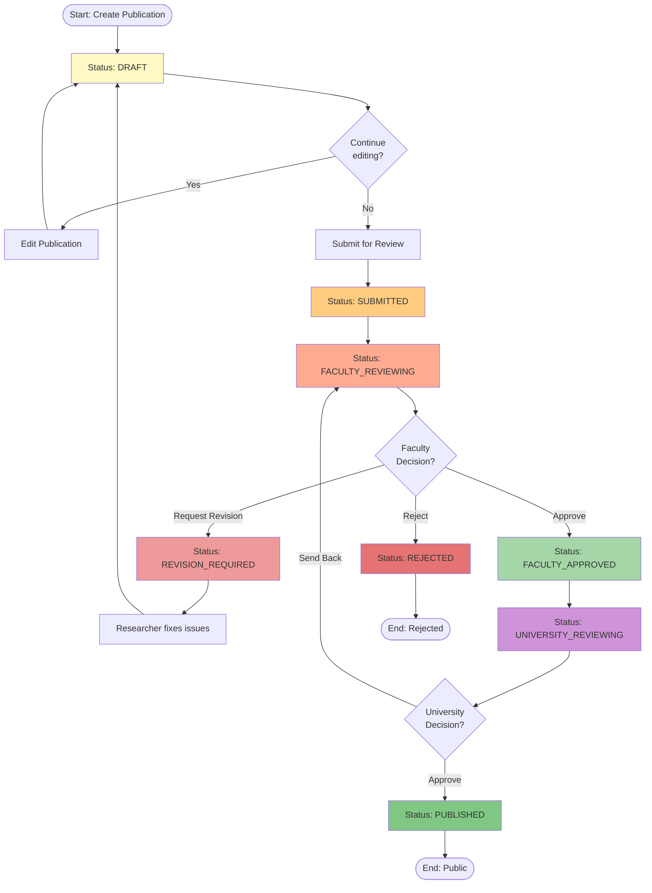

# Complete Approval Workflow - Activity Diagram

> 📊 **Diagram**: Complete Approval Workflow  
> ⚙️ **States**: 9 states với decision points  
> 👥 **Swimlanes**: Researcher, Faculty Reviewer, University Reviewer

---

## 📊 Activity Diagram

---

## 📋 Workflow States

1. **DRAFT** - Researcher editing
2. **SUBMITTED** - Acknowledged
3. **FACULTY_REVIEWING** - At faculty level
4. **FACULTY_APPROVED** - Faculty approved
5. **UNIVERSITY_REVIEWING** - At university level
6. **PUBLISHED** - Final, public
7. **REVISION_REQUIRED** - Needs changes
8. **REJECTED** - Final rejection
9. **WITHDRAWN** - Researcher withdrew (not shown)

---

## 🎯 Decision Points

### Faculty Decision
- ✅ **Approve** → UNIVERSITY_REVIEWING
- 📝 **Request Revision** → REVISION_REQUIRED (Researcher can re-edit)
- ❌ **Reject** → REJECTED (final, cannot resubmit)

### University Decision
- ✅ **Approve** → PUBLISHED (public!)
- 🔄 **Send Back** → FACULTY_REVIEWING (re-review)

---

## ⏱️ Average Timeline

- DRAFT → SUBMITTED: Variable (researcher)
- FACULTY_REVIEWING: 3-7 days
- UNIVERSITY_REVIEWING: 3-7 days
- **Total SLA**: 6-14 days (submit → publish)

---

**Related**: UC-M2 (Approval Workflow), seq_faculty_review.md, seq_university_approval.md  
**Created**: 10/02/2026
