# Quy Trình Tạo Báo Cáo - Biểu đồ Hoạt động

> 📊 **Biểu đồ**: Tạo Báo cáo  
> 🎯 **Phạm vi**: Tạo báo cáo cấp Khoa/Trường  
> 👤 **Tác nhân**: Người đánh giá cấp Khoa, Người đánh giá cấp Trường, Quản trị viên cấp cao

---

## 📊 Biểu đồ Hoạt động

```mermaid
flowchart TD
    Start(["Người dùng nhấn Tạo Báo cáo"]) --> SelectType{"Loại báo cáo?"}
    
    SelectType -->|"Báo cáo Khoa"| SetScopeFac["Phạm vi: Chỉ Khoa hiện tại"]
    SetScopeFac --> SelectPeriod
    
    SelectType -->|"Báo cáo Trường"| CheckRole{"Vai trò?"}
    CheckRole -->|"Không phải ĐG Trường/Admin"| ShowError["Hiển thị: Từ chối truy cập"]
    ShowError --> End1(["Kết thúc"])
    
    CheckRole -->|"Được phép"| SetScopeUni["Phạm vi: Tất cả các Khoa"]
    SetScopeUni --> SelectPeriod
    
    SelectPeriod["Chọn khoảng thời gian"] --> PeriodOptions{"Loại thời gian?"}
    
    PeriodOptions -->|"Theo Năm"| SelectYear["Chọn năm: 2020-hiện tại"]
    SelectYear --> SelectMetrics
    
    PeriodOptions -->|"Theo Khoảng Ngày"| SelectStart["Chọn ngày bắt đầu"]
    SelectStart --> SelectEnd["Chọn ngày kết thúc"]
    SelectEnd --> ValidateRange{"Khoảng hợp lệ?"}
    
    ValidateRange -->|"Kết thúc < Bắt đầu"| ShowError2["Hiển thị: Khoảng không hợp lệ"]
    ShowError2 --> SelectStart
    
    ValidateRange -->|"> 5 năm"| ShowWarning["Hiển thị: Khoảng lớn, có thể chậm"]
    ShowWarning --> SelectMetrics
    
    ValidateRange -->|"Hợp lệ"| SelectMetrics
    
    SelectMetrics["Chọn chỉ số"] --> MetricOptions{"Bao gồm?"}
    
    MetricOptions --> CheckTotal["☑ Tổng số ấn phẩm"]
    CheckTotal --> CheckByType["☑ Phân loại theo loại"]
    CheckByType --> CheckByFaculty["☑ Theo Khoa P1"]
    CheckByFaculty --> CheckTopAuthors["☑ Tác giác hàng đầu"]
    CheckTopAuthors --> SelectFormat
    
    SelectFormat{"Định dạng đầu ra?"}
    
    SelectFormat -->|"Xem trên màn hình"| ClickGenerate["Nhấn Tạo"]
    SelectFormat -->|"Xuất"| SelectExport{"Định dạng xuất?"}
    
    SelectExport -->|"PDF"| SetFormatPDF["Định dạng: PDF"]
    SelectExport -->|"Excel"| SetFormatExcel["Định dạng: Excel"]
    SetFormatPDF --> ClickGenerate
    SetFormatExcel --> ClickGenerate
    
    ClickGenerate --> ShowLoading["Hiển thị biểu tượng tải"]
    
    ShowLoading --> QueryDB["Truy vấn cơ sở dữ liệu"]
    QueryDB --> FilterData["Lọc theo: Phạm vi, Thời gian, Trạng thái = PUBLISHED"]
    
    FilterData --> AggregateData["Tổng hợp dữ liệu: Đếm theo loại, năm, tác giả"]
    
    AggregateData --> CheckData{"Tìm thấy dữ liệu?"}
    
    CheckData -->|"Không có dữ liệu"| ShowEmpty["Hiển thị: Không có ấn phẩm trong giai đoạn này"]
    ShowEmpty --> End2(["Kết thúc"])
    
    CheckData -->|"Có dữ liệu"| GenerateCharts["Tạo biểu đồ: Cột, Đường, Tròn"]
    
    GenerateCharts --> FormatOutput{"Loại đầu ra?"}
    
    FormatOutput -->|"Màn hình"| RenderHTML["Kết xuất báo cáo HTML"]
    RenderHTML --> DisplayReport["Hiển thị trên trang"]
    DisplayReport --> UserAction{"Hành động người dùng?"}
    
    UserAction -->|"Lưu"| SaveReport["Lưu cấu hình báo cáo cho tương lai"]
    SaveReport --> End3(["Kết thúc"])
    
    UserAction -->|"Xuất ngay"| SelectExport
    UserAction -->|"Đóng"| End3
    
    FormatOutput -->|"PDF"| GeneratePDF["Tạo PDF với biểu đồ + bảng"]
    GeneratePDF --> DownloadPDF["Kích hoạt tải xuống"]
    DownloadPDF --> End4(["Đã tải xuống"])
    
    FormatOutput -->|"Excel"| GenerateExcel["Tạo Excel với dữ liệu + pivot"]
    GenerateExcel --> DownloadExcel["Kích hoạt tải xuống"]
    DownloadExcel --> End5(["Đã tải xuống"])
    
    style Start fill:#e3f2fd
    style End1 fill:#ffcdd2
    style End2 fill:#fff9c4
    style End3 fill:#c8e6c9
    style End4 fill:#c8e6c9
    style End5 fill:#c8e6c9
    style DisplayReport fill:#fff9c4
```



---

## 📋 Các Loại Báo Cáo

### 1. Báo Cáo Khoa
**Phạm vi**: Ấn phẩm từ một khoa duy nhất

**Quyền truy cập**:
- Người đánh giá cấp Khoa (khoa của mình)
- Người đánh giá cấp Trường (tất cả các khoa)
- Quản trị viên cấp cao (tất cả các khoa)

**Khoảng thời gian mặc định**: Năm hiện tại

---

### 2. Báo Cáo Trường
**Phạm vi**: Tất cả các khoa kết hợp

**Quyền truy cập**:
- Người đánh giá cấp Trường (chỉ quyền này)
- Quản trị viên cấp cao (chỉ quyền này)

**Khoảng thời gian mặc định**: Năm hiện tại

---

## 📊 Các Chỉ Số Được Bao Gồm

### Chỉ Số Cơ Bản
1. **Tổng số ấn phẩm** (chỉ PUBLISHED)
2. **Theo loại ấn phẩm**:
   - Bài báo tạp chí
   - Bài báo hội nghị
   - Chương sách
   - Khác

3. **Theo năm** (biểu đồ đường xu hướng)

### Chỉ Số Nâng Cao (P1)
4. **Theo Khoa** (cho báo cáo cấp trường)
5. **Tác giả hàng đầu** (top 10 theo số lượng ấn phẩm)
6. **Trung bình ấn phẩm mỗi nhà nghiên cứu**
7. **Phân bố tứ phân vị** (Q1, Q2, Q3, Q4 - P2)

---

## 📥 Định Dạng Xuất

### Định Dạng PDF
**Nội dung**:
- Trang bìa (logo, tiêu đề, ngày)
- Thống kê tóm tắt (số liệu)
- Biểu đồ (nhúng PNG)
- Bảng (chi tiết)
- Chân trang (số trang)

**Thư viện**: jsPDF + Chart.js

---

### Định Dạng Excel
**Các Sheet**:
1. **Tóm tắt** - Các chỉ số chính
2. **Theo Loại** - Bảng phân loại
3. **Theo Năm** - Dữ liệu xu hướng
4. **Theo Khoa** - So sánh khoa (nếu có)
5. **Dữ liệu Thô** - Danh sách ấn phẩm đầy đủ

**Thư viện**: SheetJS (xlsx)

---

## 🔒 Kiểm Soát Truy Cập

| Vai Trò | Báo Cáo Khoa | Báo Cáo Trường |
|---------|--------------|-----------------|
| Nhà nghiên cứu | ❌ | ❌ |
| Người đánh giá cấp Khoa | ✅ (khoa của mình) | ❌ |
| Người đánh giá cấp Trường | ✅ (tất cả các khoa) | ✅ |
| Quản trị viên cấp cao | ✅ (tất cả các khoa) | ✅ |

---

## ⏱️ Hiệu Năng

**Mục tiêu**: 
- Trên màn hình: < 3 giây
- Xuất PDF: < 10 giây
- Xuất Excel: < 5 giây

**Tối ưu hóa**:
- Truy vấn tổng hợp cơ sở dữ liệu (GROUP BY)
- Bộ nhớ đệm cho báo cáo năm hiện tại (P1)
- Tác vụ nền cho báo cáo lớn (>1000 ấn phẩm) (P2)

---

## 📊 Truy Vấn SQL Mẫu

```sql
-- Faculty report, year 2024
SELECT 
    publication_type,
    COUNT(*) as count
FROM publications p
JOIN publication_authors pa ON p.id = pa.publication_id
JOIN users u ON pa.user_id = u.id
WHERE u.faculty_id = ?
  AND YEAR(p.published_at) = 2024
  AND p.status = 'PUBLISHED'
GROUP BY publication_type
ORDER BY count DESC;
```

---

**Liên quan**: UC-M5-001 đến UC-M5-007, FR-REP-001 đến FR-REP-010  
**Ngày tạo**: 11/02/2026
