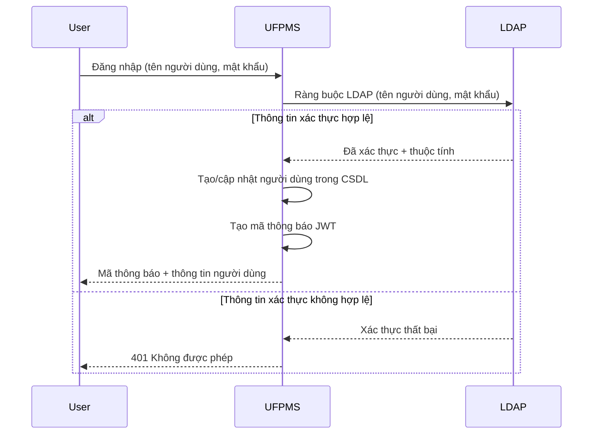
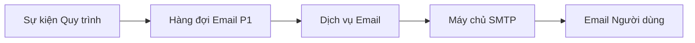
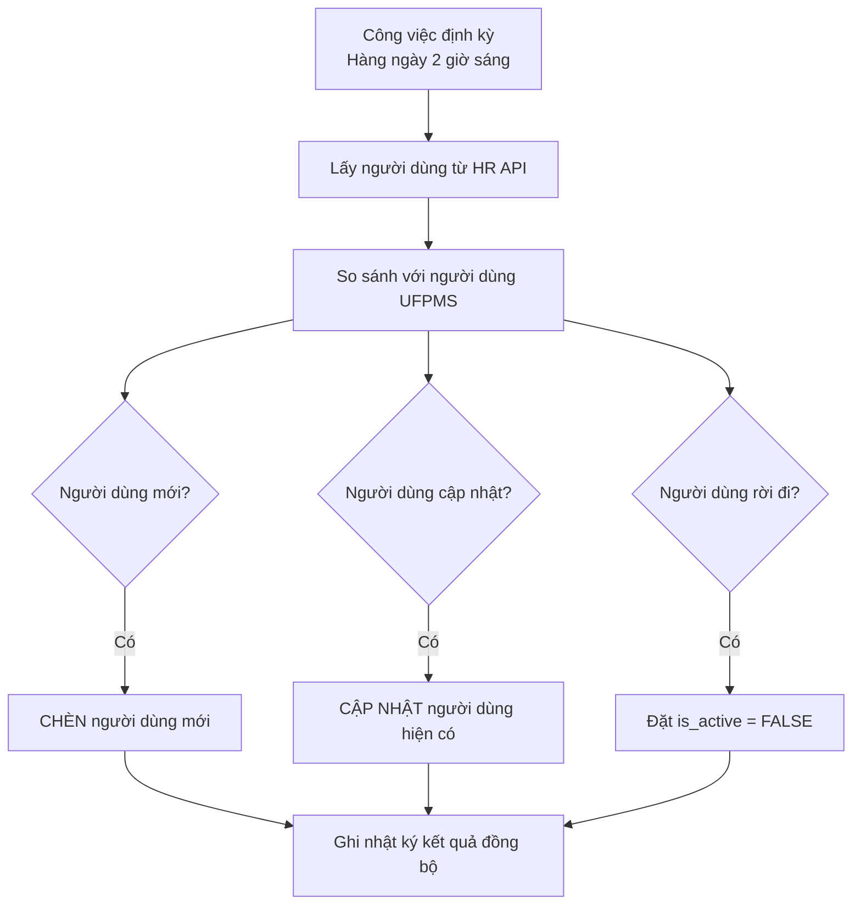
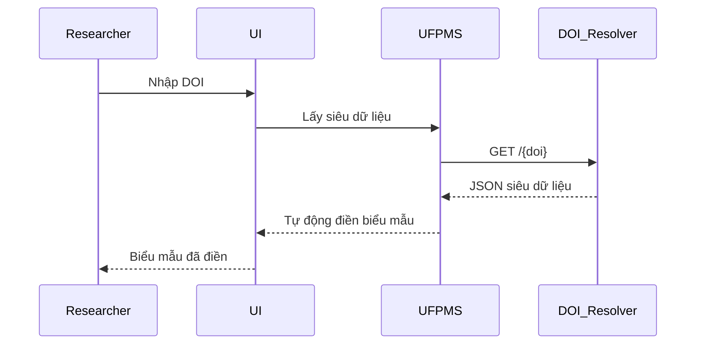
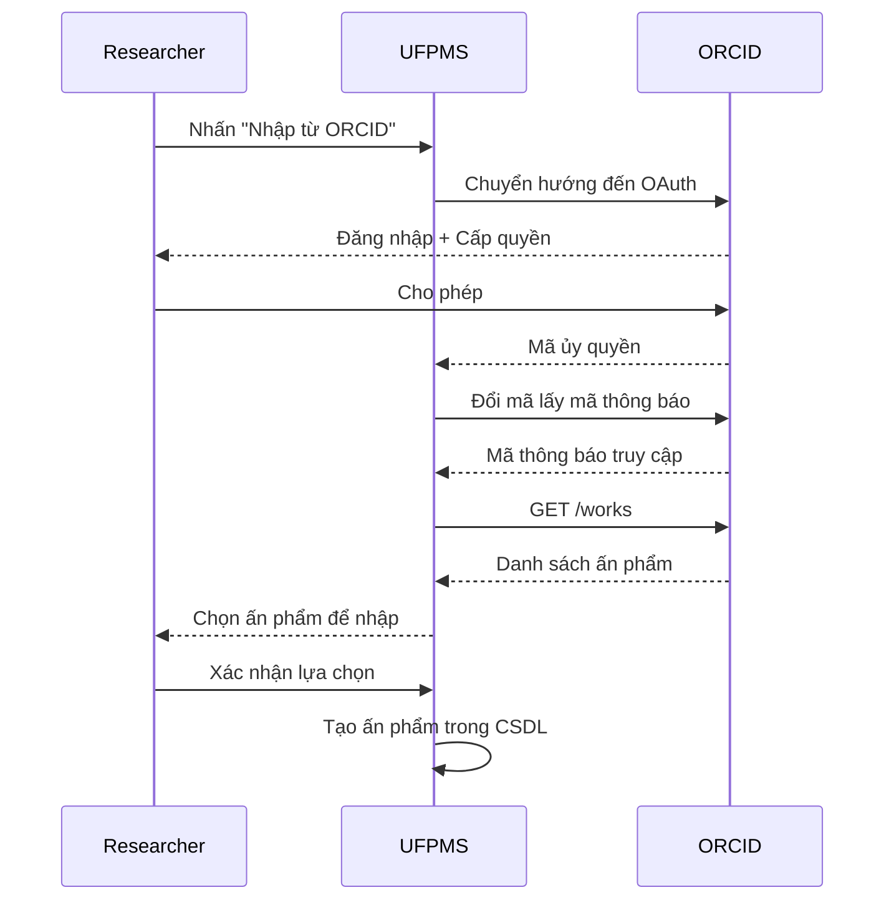

# Tích Hợp Hệ Thống Bên Ngoài

> 📊 **Phạm vi**: Tích hợp UFPMS với các hệ thống bên ngoài  
> 🔌 **Hệ thống**: 5 hệ thống bên ngoài  
> 📅 **Ngày tạo**: 11/02/2026

---

## 🔌 Tổng Quan Hệ Thống Bên Ngoài

| Hệ thống | Mục đích | Ưu tiên | Giao thức | Trạng thái |
|----------|----------|----------|-----------|------------|
| Máy chủ LDAP/AD | Xác thực | P0 | LDAP | Bắt buộc |
| Máy chủ Email | Thông báo | P0 | SMTP | Bắt buộc |
| Hệ thống Nhân sự (HR) | Đồng bộ người dùng | P1 | REST/LDAP | Tùy chọn |
| Trình phân giải DOI | Lấy siêu dữ liệu | P2 | HTTPS | Tùy chọn |
| API ORCID | Nhập ấn phẩm | P2 | OAuth 2.0 | Tùy chọn |

---

## 1. Máy chủ LDAP/AD (P0)

### Mục đích
Xác thực người dùng - KHÔNG lưu mật khẩu trong cơ sở dữ liệu

### Luồng Tích Hợp



### Cấu hình
```properties
# application.properties
ldap.url=ldap://ldap.university.edu.vn:389
ldap.base.dn=dc=university,dc=edu,dc=vn
ldap.user.dn=ou=users
ldap.bind.username=cn=admin,dc=university,dc=edu,dc=vn
ldap.bind.password=${LDAP_PASSWORD}
```

### Luồng Dữ Liệu

**RA** (UFPMS → LDAP):
- Tên người dùng
- Mật khẩu

**VÀO** (LDAP → UFPMS):
- Họ và tên
- Email
- Phòng ban
- Mã nhân viên

### Xử Lý Lỗi
- **LDAP không khả dụng**: Hiển thị lỗi "Dịch vụ xác thực không khả dụng"
- **Thông tin xác thực không hợp lệ**: Hiển thị "Tên người dùng hoặc mật khẩu không hợp lệ"
- **Hết thời gian**: Thử lại 3 lần, sau đó báo lỗi

### Bảo Mật
- Sử dụng LDAPS (LDAP qua SSL) trong môi trường sản xuất
- Không bao giờ ghi nhật ký mật khẩu
- Mã hóa mật khẩu ràng buộc trong cấu hình

---

## 2. Máy chủ Email (P0)

### Mục đích
Gửi email thông báo cho các sự kiện quy trình làm việc

### Luồng Tích Hợp



### Cấu hình
```properties
# application.properties
mail.smtp.host=smtp.university.edu.vn
mail.smtp.port=587
mail.smtp.auth=true
mail.smtp.starttls.enable=true
mail.username=${SMTP_USERNAME}
mail.password=${SMTP_PASSWORD}
mail.from=no-reply@ufpms.university.edu.vn
```

### Các Sự Kiện Email

| Sự kiện | Người nhận | Mẫu |
|---------|------------|-----|
| Ấn phẩm đã gửi | Người đánh giá cấp Khoa | submit_notification.html |
| Đánh giá đã phê duyệt | Nhà nghiên cứu (chủ sở hữu) | approval_notification.html |
| Yêu cầu chỉnh sửa | Nhà nghiên cứu | revision_request.html |
| Ấn phẩm bị từ chối | Nhà nghiên cứu | rejection_notification.html |
| Xuất bản cuối cùng | Nhà nghiên cứu + Đồng tác giả | published_notification.html |

### Mẫu Email Ví Dụ
```html
<!-- submit_notification.html -->
Chủ đề: Ấn phẩm mới cần đánh giá - {title}

Thân gửi {reviewer_name},

Một ấn phẩm mới đã được gửi để bạn xem xét:

Tiêu đề: {title}
Tác giả: {authors}
Người gửi: {researcher_name}
Ngày: {submitted_date}

Vui lòng xem xét tại: {review_url}

Trân trọng,
UFPMS
```

### Xử Lý Lỗi
- **SMTP không khả dụng**: Xếp hàng email, thử lại sau
- **Địa chỉ email không hợp lệ**: Ghi nhật ký lỗi, bỏ qua người nhận
- **Gửi thất bại**: Thử lại 3 lần, sau đó ghi nhật ký thất bại

### Tính Năng (P1)
- Hàng đợi email (gửi không đồng bộ)
- Thông báo hàng loạt
- Mẫu HTML với các biến
- Liên kết hủy đăng ký (cho các email không quan trọng)

---

## 3. Hệ Thống Nhân Sự (HR) (P1)

### Mục đích
Đồng bộ dữ liệu người dùng từ hệ thống HR (công việc hàng đêm)

### Luồng Tích Hợp



### Điểm Cuối API
```
GET https://hr.university.edu.vn/api/v1/employees

Headers:
  Authorization: Bearer {API_KEY}
  
Response:
[
  {
    "employee_id": "EMP001",
    "username": "nguyen.van.a",
    "full_name": "Nguyễn Văn A",
    "email": "nguyen.van.a@university.edu.vn",
    "department_code": "CNTT",
    "status": "ACTIVE"
  }
]
```

### Logic Đồng Bộ
```sql
-- Người dùng mới: CHÈN
INSERT INTO users (username, name, email, department_id)
VALUES (...) WHERE NOT EXISTS (SELECT 1 FROM users WHERE username = ?);

-- Người dùng cập nhật: CẬP NHẬT
UPDATE users SET name = ?, email = ?, department_id = ? WHERE username = ?;

-- Người dùng rời đi: VÔ HIỆU HÓA
UPDATE users SET is_active = FALSE WHERE username NOT IN (danh sách người dùng HR);
```

### Cấu hình
```properties
hr.api.url=https://hr.university.edu.vn/api/v1
hr.api.key=${HR_API_KEY}
hr.sync.cron=0 0 2 * * ?  # Hàng ngày lúc 2 giờ sáng
```

---

## 4. Trình Phân Giải DOI (P2)

### Mục đích
Tự động lấy siêu dữ liệu ấn phẩm khi nhà nghiên cứu nhập DOI

### Luồng Tích Hợp



### Điểm Cuối API
```
GET https://doi.org/{doi}

Headers:
  Accept: application/json

Response:
{
  "title": "Machine Learning for Healthcare",
  "authors": ["Nguyen Van A", "Tran Thi B"],
  "year": 2024,
  "journal": "IEEE Transactions",
  "issn": "1234-5678",
  "abstract": "..."
}
```

### Lợi Ích
- Giảm nhập liệu thủ công
- Đảm bảo độ chính xác (từ nguồn chính thống)
- Tạo ấn phẩm nhanh hơn

---

## 5. API ORCID (P2)

### Mục đích
Nhập các ấn phẩm của nhà nghiên cứu từ hồ sơ ORCID

### Luồng Tích Hợp



### Cấu Hình OAuth 2.0
```properties
orcid.client.id=${ORCID_CLIENT_ID}
orcid.client.secret=${ORCID_CLIENT_SECRET}
orcid.redirect.uri=https://ufpms.university.edu.vn/orcid/callback
orcid.scope=/read-limited
```

### Điểm Cuối API
```
GET https://pub.orcid.org/v3.0/{orcid-id}/works

Headers:
  Authorization: Bearer {access_token}
  
Response:
{
  "group": [
    {
      "work-summary": [{
        "title": "...",
        "type": "JOURNAL_ARTICLE",
        "publication-date": {"year": "2024"},
        ...
      }]
    }
  ]
}
```

### Lợi Ích
- Nhập hàng loạt (nhiều ấn phẩm cùng lúc)
- Dữ liệu đã xác minh (từ ORCID)
- Tiết kiệm thời gian cho nhà nghiên cứu

---

## 🔒 Cân Nhắc Bảo Mật

### Khóa API
- Lưu trong biến môi trường (KHÔNG viết cứng)
- Xoay vòng khóa định kỳ (mỗi 90 ngày)
- Sử dụng khóa khác nhau cho dev/staging/production

### Chỉ HTTPS
- Tất cả các cuộc gọi API bên ngoài qua HTTPS
- Xác thực chứng chỉ SSL

### Giới Hạn Tốc Độ
- Tuân thủ giới hạn tốc độ API bên ngoài
- Thực hiện thoái lui theo cấp số nhân khi thất bại

### Ghi Nhật Ký Lỗi
- Ghi nhật ký tất cả các lỗi tích hợp
- KHÔNG ghi nhật ký dữ liệu nhạy cảm (mật khẩu, mã thông báo)
- Giám sát sức khỏe tích hợp

---

## 📊 Giám Sát (P1)

### Các Chỉ Số Cần Theo Dõi
- Tỷ lệ thành công xác thực LDAP
- Tỷ lệ gửi email
- Hoàn thành công việc đồng bộ HR
- Thời gian phản hồi trình phân giải DOI
- Tỷ lệ thành công nhập ORCID

### Cảnh Báo
- LDAP không khả dụng > 5 phút
- Hàng đợi email > 100 tin nhắn
- Công việc đồng bộ HR thất bại
- Lỗi API bên ngoài > tỷ lệ 10%

---

**Liên quan**: system_context.md, NFR-Security  
**Ngày tạo**: 11/02/2026
