```mermaid
flowchart TD
    Cron[Cron Job<br/>Daily 2 AM] --> Fetch[Fetch users from HR API]
    Fetch --> Compare[Compare với UFPMS users table]
    
    Compare --> NewUsers{New users?}
    NewUsers -->|Yes| Insert[INSERT new users]
    
    Compare --> UpdatedUsers{Updated users?}
    UpdatedUsers -->|Yes| Update[UPDATE existing users]
    
    Compare --> LeftUsers{Left users?}
    LeftUsers -->|Yes| Deactivate[Set is_active = FALSE]
    
    Insert --> Log[Log sync results]
    Update --> Log
    Deactivate --> Log
```

# External System Integrations

> 📊 **Scope**: UFPMS integrations với external systems  
> 🔌 **Systems**: 5 external systems  
> 📅 **Created**: 11/02/2026

---

## 🔌 External Systems Overview

| System | Purpose | Priority | Protocol | Status |
|--------|---------|----------|----------|--------|
| LDAP/AD Server | Authentication | P0 | LDAP | Required |
| Email Server | Notifications | P0 | SMTP | Required |
| HR System | User sync | P1 | REST/LDAP | Optional |
| DOI Resolver | Metadata fetch| P2 | HTTPS | Optional |
| ORCID API | Import pubs | P2 | OAuth 2.0 | Optional |

---

## 1. LDAP/AD Server (P0)

### Purpose
User authentication - KHÔNG lưu password trong database

### Integration Flow


### Configuration
```properties
# application.properties
ldap.url=ldap://ldap.university.edu.vn:389
ldap.base.dn=dc=university,dc=edu,dc=vn
ldap.user.dn=ou=users
ldap.bind.username=cn=admin,dc=university,dc=edu,dc=vn
ldap.bind.password=${LDAP_PASSWORD}
```

### Data Flow

**OUT** (UFPMS → LDAP):
- Username
- Password

**IN** (LDAP → UFPMS):
- Full name
- Email
- Department
- Employee ID

### Error Handling
- **LDAP unavailable**: Show error "Authentication service unavailable"
- **Invalid credentials**: Show "Invalid username or password"
- **Timeout**: Retry 3 times, then fail

### Security
- Use LDAPS (LDAP over SSL) in production
- Never log passwords
- Encrypt bind password in config

---

## 2. Email Server (P0)

### Purpose
Send notification emails cho workflow events

### Integration Flow


### Configuration
```properties
# application.properties
mail.smtp.host=smtp.university.edu.vn
mail.smtp.port=587
mail.smtp.auth=true
mail.smtp.starttls.enable=true
mail.username=${SMTP_USERNAME}
mail.password=${SMTP_PASSWORD}
mail.from=no-reply@ufpms.university.edu.vn
```

### Email Events

| Event | Recipient | Template |
|-------|-----------|----------|
| Publication submitted | Faculty Reviewers | submit_notification.html |
| Review approved | Researcher (owner) | approval_notification.html |
| Revision requested | Researcher | revision_request.html |
| Publication rejected | Researcher | rejection_notification.html |
| Final published | Researcher + Co-authors | published_notification.html |

### Sample Email Template
```html
<!-- submit_notification.html -->
Subject: New publication for review - {title}

Dear {reviewer_name},

A new publication has been submitted for your review:

Title: {title}
Authors: {authors}
Submitted by: {researcher_name}
Date: {submitted_date}

Please review at: {review_url}

Best regards,
UFPMS
```

### Error Handling
- **SMTP unavailable**: Queue email, retry later
- **Invalid email address**: Log error, skip recipient
- **Send failed**: Retry 3 times, then log failure

### Features (P1)
- Email queue (async sending)
- Batch notifications
- HTML templates với variables
- Unsubscribe link (for non-critical emails)

---

## 3. HR System (P1)

### Purpose
Sync user data từ HR system (nightly batch job)

### Integration Flow



### API Endpoint
```
GET https://hr.university.edu.vn/api/v1/employees

Headers:
  Authorization: Bearer {API_KEY}
  
Response:
[
  {
    "employee_id": "EMP001",
    "username": "nguyen.van.a",
    "full_name": "Nguyễn Văn A",
    "email": "nguyen.van.a@university.edu.vn",
    "department_code": "CNTT",
    "status": "ACTIVE"
  }
]
```

### Sync Logic
```sql
-- New users: INSERT
INSERT INTO users (username, name, email, department_id)
VALUES (...) WHERE NOT EXISTS (SELECT 1 FROM users WHERE username = ?);

-- Updated users: UPDATE
UPDATE users SET name = ?, email = ?, department_id = ? WHERE username = ?;

-- Left users: DEACTIVATE
UPDATE users SET is_active = FALSE WHERE username NOT IN (HR user list);
```

### Configuration
```properties
hr.api.url=https://hr.university.edu.vn/api/v1
hr.api.key=${HR_API_KEY}
hr.sync.cron=0 0 2 * * ?  # Daily at 2 AM
```

---

## 4. DOI Resolver (P2)

### Purpose
Auto-fetch publication metadata khi researcher nhập DOI

### Integration Flow


### API Endpoint
```
GET https://doi.org/{doi}

Headers:
  Accept: application/json

Response:
{
  "title": "Machine Learning for Healthcare",
  "authors": ["Nguyen Van A", "Tran Thi B"],
  "year": 2024,
  "journal": "IEEE Transactions",
  "issn": "1234-5678",
  "abstract": "..."
}
```

### Benefits
- Giảm manual data entry
- Đảm bảo accuracy (từ authoritative source)
- Faster publication creation

---

## 5. ORCID API (P2)

### Purpose
Import researcher's publications từ ORCID profile

### Integration Flow


### OAuth 2.0 Configuration
```properties
orcid.client.id=${ORCID_CLIENT_ID}
orcid.client.secret=${ORCID_CLIENT_SECRET}
orcid.redirect.uri=https://ufpms.university.edu.vn/orcid/callback
orcid.scope=/read-limited
```

### API Endpoint
```
GET https://pub.orcid.org/v3.0/{orcid-id}/works

Headers:
  Authorization: Bearer {access_token}
  
Response:
{
  "group": [
    {
      "work-summary": [{
        "title": "...",
        "type": "JOURNAL_ARTICLE",
        "publication-date": {"year": "2024"},
        ...
      }]
    }
  ]
}
```

### Benefits
- Bulk import (multiple publications at once)
- Verified data (from ORCID)
- Saves time for researchers

---

## 🔒 Security Considerations

### API Keys
- Store trong environment variables (NOT hardcoded)
- Rotate keys periodically (every 90 days)
- Use different keys for dev/staging/production

### HTTPS Only
- All external API calls over HTTPS
- Validate SSL certificates

### Rate Limiting
- Respect external API rate limits
- Implement exponential backoff on failures

### Error Logging
- Log all integration errors
- Do NOT log sensitive data (passwords, tokens)
- Monitor integration health

---

## 📊 Monitoring (P1)

### Metrics to Track
- LDAP authentication success rate
- Email delivery rate
- HR sync job completion
- DOI resolver response time
- ORCID import success rate

### Alerts
- LDAP unavailable > 5 minutes
- Email queue > 100 messages
- HR sync job failed
- External API errors > 10% rate

---

**Related**: system_context.md, NFR-Security  
**Created**: 11/02/2026
