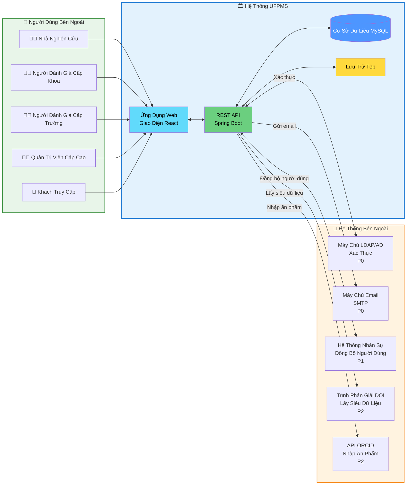

# Biểu đồ Ngữ Cảnh Hệ Thống

> 📊 **Biểu đồ**: Ngữ Cảnh Hệ Thống UFPMS  
> 🎯 **Mục đích**: Hiển thị phạm vi hệ thống và các tương tác bên ngoài

---

## 📊 Biểu đồ Ngữ Cảnh

---

## 🏛️ Các Thành Phần Hệ Thống UFPMS

### Ứng Dụng Web (Giao Diện React)
- Cổng thông tin công cộng
- Bảng điều khiển đã xác thực
- Thiết kế đáp ứng (responsive)

### REST API (Spring Boot)
- Logic nghiệp vụ
- Xác thực & ủy quyền
- Công cụ quy trình làm việc

### Cơ Sở Dữ Liệu (MySQL)
- Kho lưu trữ dữ liệu bền vững
- 10 bảng
- ~200MB (năm 1)

### Lưu Trữ Tệp
- Tệp PDF
- Người dùng tải lên
- Hệ thống tệp cục bộ (MVP)

---

## 🔌 Tích Hợp Hệ Thống Bên Ngoài

### 1. Máy chủ LDAP/AD (P0)
**Mục đích**: Xác thực người dùng  
**Giao thức**: LDAP  
**Luồng Dữ Liệu**:
- VÀO: tên người dùng, mật khẩu → Xác thực
- RA: thuộc tính người dùng (tên, email, phòng ban)

**Cấu hình**: `ldap://ldap.university.edu.vn:389`

---

### 2. Máy chủ Email (P0)
**Mục đích**: Thông báo  
**Giao thức**: SMTP  
**Luồng Dữ Liệu**:
- RA: Email thông báo cho các sự kiện quy trình làm việc

**Sự kiện**:
- Đã nhận bài gửi
- Phê duyệt/từ chối
- Yêu cầu chỉnh sửa
- Đã xuất bản

---

### 3. Hệ Thống Nhân Sự (HR) (P1)
**Mục đích**: Đồng bộ hóa người dùng  
**Giao thức**: REST API hoặc LDAP  
**Luồng Dữ Liệu**:
- VÀO: Danh sách người dùng → Đồng bộ vào bảng người dùng UFPMS

**Lịch trình**: Đồng bộ hàng đêm (công việc định kỳ)

---

### 4. Trình Phân Giải DOI (P2)
**Mục đích**: Tự động lấy siêu dữ liệu ấn phẩm  
**Giao thức**: HTTPS/REST  
**Luồng Dữ Liệu**:
- VÀO: DOI → RA: Tiêu đề, tác giả, tạp chí, năm

**Ca Sử Dụng**: Nhà nghiên cứu nhập DOI, hệ thống tự động điền biểu mẫu

---

### 5. API ORCID (P2)
**Mục đích**: Nhập các ấn phẩm của nhà nghiên cứu  
**Giao thức**: OAuth 2.0 + REST API  
**Luồng Dữ Liệu**:
- Nhà nghiên cứu ủy quyền ORCID
- Hệ thống lấy danh sách ấn phẩm
- Nhà nghiên cứu chọn ấn phẩm để nhập

---

## 👥 Tương Tác Người Dùng

| Tác nhân | Hành động |
|----------|-----------|
| Nhà nghiên cứu | Tạo, gửi, theo dõi ấn phẩm |
| Người đánh giá cấp Khoa | Đánh giá bài gửi ở cấp khoa |
| Người đánh giá cấp Trường | Phê duyệt cuối cùng |
| Quản trị viên cấp cao | Quản lý người dùng, cấu hình hệ thống |
| Khách truy cập | Tìm kiếm, duyệt các ấn phẩm ĐÃ XUẤT BẢN |

---

## 🔒 Ranh Giới Bảo Mật

**Nội bộ** (yêu cầu xác thực):
- Quản lý ấn phẩm
- Quy trình phê duyệt
- Chức năng quản trị

**Công khai** (không cần xác thực):
- Tìm kiếm ấn phẩm ĐÃ XUẤT BẢN
- Xem hồ sơ công khai

**Dữ liệu Được Bảo Vệ**:
- Thông tin xác thực người dùng (không bao giờ được lưu trữ, chỉ LDAP)
- Ấn phẩm DRAFT/REVIEWING (không công khai)
- Bình luận của người đánh giá (chỉ hiển thị cho các bên liên quan)

---

**Liên quan**: system_overview.md, technology_stack.md  
**Ngày tạo**: 10/02/2026
