# System Context Diagram

> 📊 **Diagram**: UFPMS System Context  
> 🎯 **Purpose**: Show system boundaries và external interactions

---

## 📊 Context Diagram

```mermaid
graph LR
    subgraph External_Users["👥 External Users"]
        RES[👨‍🔬 Researcher]
        FCR[👨‍💼 Faculty Reviewer]
        UNR[👨‍💼 University Reviewer]
        ADM[👨‍💻 SuperAdmin]
        VIW[👤 Public Visitor]
    end
    
    subgraph UFPMS_System["🏛️ UFPMS System"]
        direction TB
        WEB[Web Application<br/>React UI]
        API[REST API<br/>Spring Boot]
        DB[(MySQL Database)]
        FILE[File Storage]
        
        WEB <--> API
        API <--> DB
        API <--> FILE
    end
    
    subgraph External_Systems["🔌 External Systems"]
        LDAP[LDAP/AD Server<br/>Authentication<br/>P0]
        EMAIL[Email Server<br/>SMTP<br/>P0]
        HR[HR System<br/>User Sync<br/>P1]
        DOI[DOI Resolver<br/>Metadata Fetch<br/>P2]
        ORCID[ORCID API<br/>Import Pubs<br/>P2]
    end
    
    %% User interactions
    RES --> WEB
    FCR --> WEB
    UNR --> WEB
    ADM --> WEB
    VIW --> WEB
    
    %% External system integrations
    API <-->|Authenticate| LDAP
    API -->|Send emails| EMAIL
    API <-->|Sync users| HR
    API -->|Fetch metadata| DOI
    API -->|Import publications| ORCID
    
    %% Styling
    style UFPMS_System fill:#e3f2fd,stroke:#1976d2,stroke-width:3px
    style External_Systems fill:#fff3e0,stroke:#f57c00,stroke-width:2px
    style External_Users fill:#e8f5e9,stroke:#388e3c,stroke-width:2px
    
    style WEB fill:#61dafb,color:#000
    style API fill:#6bcf7f,color:#000
    style DB fill:#4d96ff,color:#fff
    style FILE fill:#ffd93d,color:#000
```

---

## 🏛️ UFPMS System Components

### Web Application (React UI)
- Public portal
- Authenticated dashboard
- Responsive design

### REST API (Spring Boot)
- Business logic
- Authentication & authorization
- Workflow engine

### Database (MySQL)
- Persistent datastore
- 10 tables
- ~200MB (year 1)

### File Storage
- PDF files
- User uploads
- Local file system (MVP)

---

## 🔌 External System Integrations

### 1. LDAP/AD Server (P0)
**Purpose**: User authentication  
**Protocol**: LDAP  
**Data Flow**:
- IN: username, password → Authenticate
- OUT: user attributes (name, email, department)

**Configuration**: `ldap://ldap.university.edu.vn:389`

---

### 2. Email Server (P0)
**Purpose**: Notifications  
**Protocol**: SMTP  
**Data Flow**:
- OUT: Email notifications for workflow events

**Events**:
- Submission received
- Approval/rejection
- Revision requested
- Published

---

### 3. HR System (P1)
**Purpose**: User synchronization  
**Protocol**: REST API hoặc LDAP  
**Data Flow**:
- IN: User list → Sync to UFPMS users table

**Schedule**: Nightly sync (cron job)

---

### 4. DOI Resolver (P2)
**Purpose**: Auto-fetch publication metadata  
**Protocol**: HTTPS/REST  
**Data Flow**:
- IN: DOI → OUT: Title, authors, journal, year

**Use Case**: Researcher enters DOI, system auto-fills form

---

### 5. ORCID API (P2)
**Purpose**: Import researcher's publications  
**Protocol**: OAuth 2.0 + REST API  
**Data Flow**:
- Researcher authorizes ORCID
- System fetches publication list
- Researcher selects which to import

---

## 👥 User Interactions

| Actor | Actions |
|-------|---------|
| Researcher | Create, submit, track publications |
| Faculty Reviewer | Review submissions at faculty level |
| University Reviewer | Final approval |
| SuperAdmin | User management, system config |
| Public Visitor | Search, browse PUBLISHED publications |

---

## 🔒 Security Boundaries

**Internal** (requires authentication):
- Publication management
- Approval workflow
- Admin functions

**Public** (no authentication):
- Search PUBLISHED publications
- View public profiles

**Protected Data**:
- User credentials (never stored, LDAP only)
- DRAFT/REVIEWING publications (not public)
- Reviewer comments (visible only to stakeholders)

---

**Related**: system_overview.md, technology_stack.md  
**Created**: 10/02/2026
