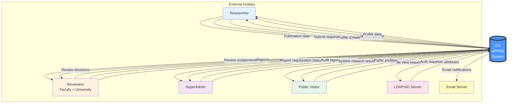

# DFD Level 0 - System Context

> 📊 **Level**: 0 (Context Level)  
> 🎯 **Scope**: UFPMS as single process  
> 📅 **Created**: 11/02/2026

---

## 📊 Data Flow Diagram Level 0

---

## 📋 External Entities

### Human Actors

#### 1. Researcher
**Provides**:
- Publication data (title, authors, DOI, PDF, etc.)
- Submit requests
- Profile updates

**Receives**:
- Created publication confirmations
- Status update notifications
- Profile data (own + others)

---

#### 2. Reviewers (Faculty + University)
**Provides**:
- Review decisions (Approve/Reject/Revision)
- Review comments
- Report generation requests

**Receives**:
- Review assignments (new submissions)
- Generated reports (faculty/university stats)

---

#### 3. SuperAdmin
**Provides**:
- User management commands (CRUD users, assign roles)
- System configuration

**Receives**:
- System status (health, errors)
- Audit logs (all actions)

---

#### 4. Public Visitor
**Provides**:
- Search queries (keywords, filters)
- Profile view requests

**Receives**:
- Search results (PUBLISHED publications only)
- Public researcher profiles

---

### External Systems

#### 5. LDAP/AD Server
**Provides to UFPMS**:
- User authentication results
- User attributes (name, email, department)

**Receives from UFPMS**:
- Authentication requests (username + password)

---

#### 6. Email Server
**Receives from UFPMS**:
- Email notifications for workflow events

---

## 🔄 Data Flows

### Inbound Data Flows

| Flow | From | To | Description |
|------|------|-----|-------------|
| Publication data | Researcher | UFPMS | Create/update publication info |
| Submit request | Researcher | UFPMS | Submit DRAFT for review |
| Review decision | Reviewers | UFPMS | Approve/Reject/Revision |
| Search query | Public | UFPMS | Search published publications |
| User attributes | LDAP | UFPMS | User info after auth |
| User management | Admin | UFPMS | CRUD users, assign roles |

---

### Outbound Data Flows

| Flow | From | To | Description |
|------|------|-----|-------------|
| Status updates | UFPMS | Researcher | Workflow notifications |
| Search results | UFPMS | Public | List of publications |
| Review assignments | UFPMS | Reviewers | New submissions |
| Reports | UFPMS | Reviewers/Admin | Statistics |
| Email notifications | UFPMS | Email Server | Workflow events |
| Auth requests | UFPMS | LDAP | Username + password |
| Audit logs | UFPMS | Admin | System activity |

---

## 📊 System Boundary

**Inside UFPMS** (single process at Level 0):
- Publication Management
- Approval Workflow
- Search & Browse
- Researcher Profiles
- Reporting & Analytics
- Admin & User Management
- Database (internal data store)

**Outside UFPMS**:
- All actors (users)
- External systems (LDAP, Email)

---

## 🎯 Key Characteristics

### Data Transformation
UFPMS transforms:
- Raw publication data → Structured database records
- Review decisions → Status updates + notifications
- Search queries → Filtered, ranked results
- Raw data → Statistical reports

### Data Storage
- Internal database (not shown at Level 0)
- File storage for PDFs
- Audit logs

### Business Logic
- Validation rules
- Workflow state machine
- Access control
- Reporting calculations

---

## 🔗 Next Level

See [dfd_level_1.md](./dfd_level_1.md) for decomposition into 6 modules

---

**Related**: system_context.md, dfd_level_1.md  
**Created**: 11/02/2026
