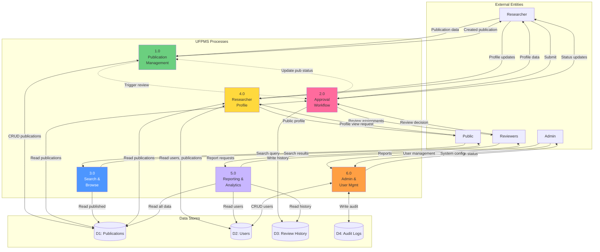

# DFD Level 1 - UFPMS Modules

> 📊 **Level**: 1  
> 🎯 **Scope**: 6 modules decomposition

---

## 📊 Data Flow Diagram Level 1

---

## 📋 Processes

### 1.0 Publication Management
**Inputs**: Publication data (from Researcher)  
**Outputs**: Created/updated publications  
**Data Stores**: D1 (Publications)

### 2.0 Approval Workflow
**Inputs**: Submit requests, Review decisions  
**Outputs**: Status updates, Notifications  
**Data Stores**: D1 (Publications), D3 (Review History)

### 3.0 Search & Browse
**Inputs**: Search queries (from Public)  
**Outputs**: Search results  
**Data Stores**: D1 (Publications - READ ONLY, PUBLISHED only)

### 4.0 Researcher Profile
**Inputs**: Profile updates, View requests  
**Outputs**: Profile data  
**Data Stores**: D1 (Publications), D2 (Users)

### 5.0 Reporting & Analytics
**Inputs**: Report requests  
**Outputs**: Reports  
**Data Stores**: D1, D2, D3 (READ ONLY)

### 6.0 Admin & User Management
**Inputs**: User CRUD, System config  
**Outputs**: System status  
**Data Stores**: D2 (Users), D4 (Audit Logs)

---

## 💾 Data Stores

### D1: Publications
- publications table
- publication_authors table
- publication_types lookup

### D2: Users
- users table
- user_roles table
- departments, faculties tables

### D3: Review History
- review_history table
- review_comments table

### D4: Audit Logs
- audit_logs table

---

**Related**: dfd_level_0.md, dfd_level_2_approval.md  
**Created**: 10/02/2026
