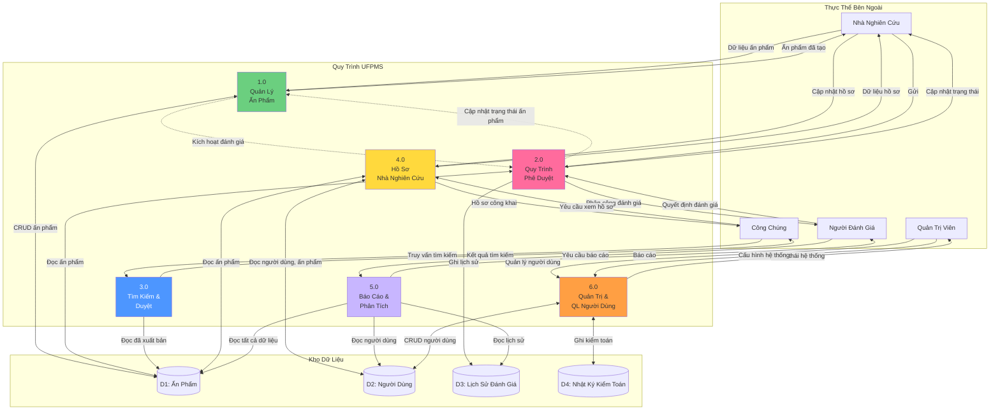

# DFD Cấp 1 - Các Mô-đun UFPMS

> 📊 **Cấp**: 1  
> 🎯 **Phạm vi**: Phân rã thành 6 mô-đun

---

## 📊 Biểu đồ Luồng Dữ Liệu Cấp 1

---

## 📋 Các Quy Trình

### 1.0 Quản Lý Ấn Phẩm
**Đầu vào**: Dữ liệu ấn phẩm (từ Nhà nghiên cứu)  
**Đầu ra**: Ấn phẩm đã tạo/cập nhật  
**Kho Dữ Liệu**: D1 (Ấn Phẩm)

### 2.0 Quy Trình Phê Duyệt
**Đầu vào**: Yêu cầu gửi, Quyết định đánh giá  
**Đầu ra**: Cập nhật trạng thái, Thông báo  
**Kho Dữ Liệu**: D1 (Ấn Phẩm), D3 (Lịch Sử Đánh Giá)

### 3.0 Tìm Kiếm & Duyệt
**Đầu vào**: Truy vấn tìm kiếm (từ Công chúng)  
**Đầu ra**: Kết quả tìm kiếm  
**Kho Dữ Liệu**: D1 (Ấn Phẩm - CHỈ ĐỌC, CHỈ ĐÃ XUẤT BẢN)

### 4.0 Hồ Sơ Nhà Nghiên Cứu
**Đầu vào**: Cập nhật hồ sơ, Yêu cầu xem  
**Đầu ra**: Dữ liệu hồ sơ  
**Kho Dữ Liệu**: D1 (Ấn Phẩm), D2 (Người Dùng)

### 5.0 Báo Cáo & Phân Tích
**Đầu vào**: Yêu cầu báo cáo  
**Đầu ra**: Báo cáo  
**Kho Dữ Liệu**: D1, D2, D3 (CHỈ ĐỌC)

### 6.0 Quản Trị & Quản Lý Người Dùng
**Đầu vào**: CRUD Người dùng, Cấu hình hệ thống  
**Đầu ra**: Trạng thái hệ thống  
**Kho Dữ Liệu**: D2 (Người Dùng), D4 (Nhật Ký Kiểm Toán)

---

## 💾 Kho Dữ Liệu

### D1: Ấn Phẩm
- bảng publications
- bảng publication_authors
- tra cứu publication_types

### D2: Người Dùng
- bảng users
- bảng user_roles
- bảng departments, faculties

### D3: Lịch Sử Đánh Giá
- bảng review_history
- bảng review_comments

### D4: Nhật Ký Kiểm Toán
- bảng audit_logs

---

**Liên quan**: dfd_level_0.md, dfd_level_2_approval.md  
**Ngày tạo**: 10/02/2026
