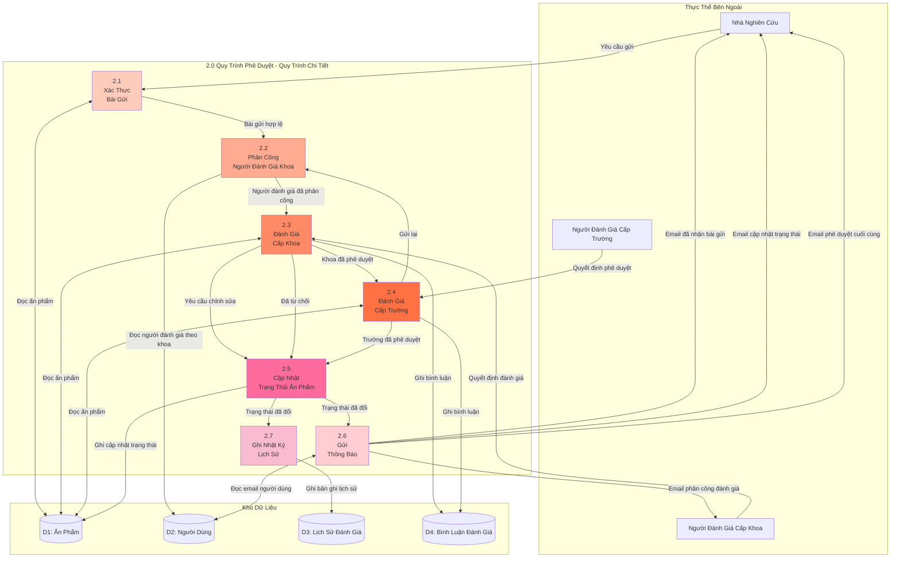
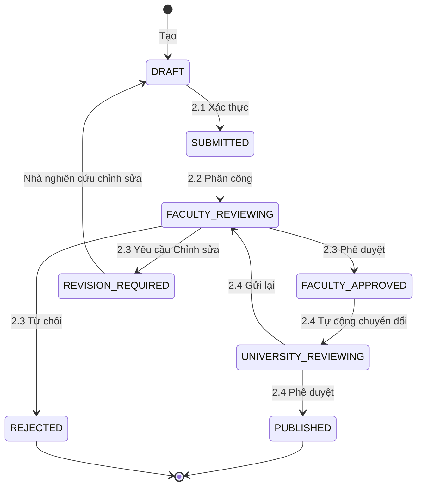

# DFD Cấp 2 - Chi Tiết Quy Trình Phê Duyệt

> 📊 **Cấp**: 2 (Phân rã Quy trình Chi tiết)  
> 🎯 **Phạm vi**: Phân rã mô-đun Quy trình Phê duyệt  
> 📅 **Ngày tạo**: 11/02/2026

---

## 📊 Biểu đồ Luồng Dữ Liệu Cấp 2

---

## 📋 Đặc Tả Quy Trình Chi Tiết

### 2.1 Xác Thực Bài Gửi

**Đầu vào**:
- Yêu cầu gửi (từ Nhà nghiên cứu)
- Dữ liệu ấn phẩm (từ D1)

**Quy trình**:
1. Kiểm tra trạng thái ấn phẩm = DRAFT
2. Kiểm tra quyền sở hữu (người gửi = chủ sở hữu)
3. Xác thực các trường bắt buộc:
   - Tiêu đề đã điền
   - Ít nhất 1 tác giả
   - PDF đã tải lên
4. Kiểm tra trùng lặp DOI (nếu được cung cấp)

**Đầu ra**:
- Bài gửi hợp lệ → đến 2.2
- Bài gửi không hợp lệ → thông báo lỗi cho Nhà nghiên cứu

**Truy Cập Kho Dữ Liệu**:
- ĐỌC: D1 (Ấn Phẩm)

---

### 2.2 Phân Công Người Đánh Giá Cấp Khoa

**Đầu vào**:
- Bài gửi hợp lệ (từ 2.1)

**Quy trình**:
1. Lấy khoa của nhà nghiên cứu
2. Truy vấn người đánh giá khoa đang hoạt động
3. Chọn người đánh giá (quay vòng P2, thủ công P0)
4. Cập nhật ấn phẩm với phân công người đánh giá

**Đầu ra**:
- Thông tin người đánh giá được phân công → đến 2.3
- Kích hoạt thông báo người đánh giá → đến 2.6

**Truy Cập Kho Dữ Liệu**:
- ĐỌC: D2 (Người dùng - lấy người đánh giá)
- GHI: D1 (Ấn phẩm - phân công người đánh giá)

**Quy Tắc Nghiệp Vụ**:
- Người đánh giá phải thuộc cùng khoa
- Người đánh giá không thể đánh giá ấn phẩm của chính mình

---

### 2.3 Đánh Giá Cấp Khoa

**Đầu vào**:
- Quyết định đánh giá (từ Người Đánh Giá Cấp Khoa)
- Dữ liệu ấn phẩm (từ D1)

**Quy trình**:
1. Xác thực ủy quyền người đánh giá
2. Xử lý quyết định:
   - **Phê duyệt**: Đặt trạng thái = FACULTY_APPROVED → đến 2.4
   - **Yêu cầu Chỉnh sửa**: Đặt trạng thái = REVISION_REQUIRED → đến 2.5
   - **Từ chối**: Đặt trạng thái = REJECTED → đến 2.5
3. Lưu bình luận (nếu có)

**Đầu ra**:
- Đã phê duyệt → đến 2.4 (Đánh Giá Cấp Trường)
- Chỉnh sửa/Từ chối → đến 2.5 (Cập Nhật Trạng Thái)

**Truy Cập Kho Dữ Liệu**:
- ĐỌC: D1 (Ấn Phẩm)
- GHI: D4 (Bình Luận Đánh Giá)

---

### 2.4 Đánh Giá Cấp Trường

**Đầu vào**:
- Quyết định phê duyệt (từ Người Đánh Giá Cấp Trường)
- Dữ liệu ấn phẩm (từ D1)

**Quy trình**:
1. Xác thực ủy quyền người đánh giá (vai trò Người Đánh Giá Cấp Trường)
2. Xử lý quyết định:
   - **Phê duyệt**: Đặt trạng thái = PUBLISHED → đến 2.5
   - **Gửi Lại**: Đặt trạng thái = FACULTY_REVIEWING → đến 2.2

**Đầu ra**:
- Phê duyệt/Gửi Lại → đến 2.5 (Cập Nhật Trạng Thái)

**Truy Cập Kho Dữ Liệu**:
- ĐỌC: D1 (Ấn Phẩm)
- GHI: D4 (Bình Luận Đánh Giá)

**Quy Tắc Nghiệp Vụ**:
- Chỉ Người Đánh Giá Cấp Trường mới có thể xuất bản
- Ấn phẩm đã xuất bản không thể được chỉnh sửa bởi nhà nghiên cứu

---

### 2.5 Cập Nhật Trạng Thái Ấn Phẩm

**Đầu vào**:
- Thay đổi trạng thái (từ 2.3 hoặc 2.4)
- Giá trị trạng thái mới
- Giá trị trạng thái cũ

**Quy trình**:
1. Cập nhật bảng publications (đặt trạng thái, dấu thời gian)
2. Nếu PUBLISHED: đặt published_at = NOW()

**Đầu ra**:
- Trạng thái đã cập nhật → kích hoạt đến 2.6, 2.7

**Truy Cập Kho Dữ Liệu**:
- GHI: D1 (Ấn Phẩm)

**Giao dịch**: Phải nguyên tử (atomic)

---

### 2.6 Gửi Thông Báo

**Đầu vào**:
- Sự kiện thay đổi trạng thái (từ 2.5)
- Dữ liệu người dùng (từ D2)

**Quy trình**:
1. Xác định người nhận dựa trên sự kiện:
   - SUBMITTED → Người đánh giá khoa
   - FACULTY_APPROVED → Nhà nghiên cứu (chủ sở hữu)
   - REVISION_REQUIRED → Nhà nghiên cứu
   - REJECTED → Nhà nghiên cứu
   - PUBLISHED → Nhà nghiên cứu + đồng tác giả
2. Soạn email từ mẫu
3. Gửi qua Máy chủ Email (bên ngoài)

**Đầu ra**:
- Email đã gửi đến người nhận

**Truy Cập Kho Dữ Liệu**:
- ĐỌC: D2 (Người dùng - lấy email)

**Không đồng bộ**: Gửi email nên không đồng bộ (hàng đợi)

---

### 2.7 Ghi Nhật Ký Lịch Sử

**Đầu vào**:
- Sự kiện thay đổi trạng thái (từ 2.5)
- Tác nhân (người đánh giá/nhà nghiên cứu)
- Bình luận (nếu có)

**Quy trình**:
1. Tạo bản ghi lịch sử:
   - từ_trạng_thái
   - đến_trạng_thái
   - id_tác_nhân
   - hành_động
   - dấu_thời_gian

**Đầu ra**:
- Bản ghi lịch sử đã lưu

**Truy Cập Kho Dữ Liệu**:
- GHI: D3 (Lịch Sử Đánh Giá)

**Kiểm toán**: Bản ghi bất biến để tuân thủ

---

## 🔄 Chuyển Đổi Trạng Thái Quy Trình

---

## 📊 Chi Tiết Kho Dữ Liệu

### D1: Ấn Phẩm
**Được truy cập bởi**: 2.1, 2.2, 2.3, 2.4, 2.5  
**Thao tác**: ĐỌC, GHI (cập nhật trạng thái)

### D2: Người Dùng
**Được truy cập bởi**: 2.2, 2.6  
**Thao tác**: CHỈ ĐỌC (lấy người đánh giá, lấy email)

### D3: Lịch Sử Đánh Giá
**Được truy cập bởi**: 2.7  
**Thao tác**: CHỈ GHI (nhật ký kiểm toán chỉ thêm)

### D4: Bình Luận Đánh Giá
**Được truy cập bởi**: 2.3, 2.4  
**Thao tác**: GHI (chèn bình luận)

---

## ⏱️ Thời Gian Quy Trình

| Quy Trình | Thời Lượng TB | Loại |
|-----------|---------------|------|
| 2.1 Xác thực | < 1 giây | Đồng bộ |
| 2.2 Phân công | < 2 giây | Đồng bộ |
| 2.3 Đánh Giá Cấp Khoa | 3-7 ngày | Quyết định con người |
| 2.4 Đánh Giá Cấp Trường | 3-7 ngày | Quyết định con người |
| 2.5 Cập Nhật Trạng Thái | < 1 giây | Đồng bộ |
| 2.6 Thông báo | 2-5 giây | Không đồng bộ |
| 2.7 Ghi Lịch Sử | < 1 giây | Đồng bộ |

**Tổng SLA**: 6-14 ngày (DRAFT → PUBLISHED)

---

**Liên quan**: act_approval_workflow.md, seq_faculty_review.md, seq_university_approval.md  
**Ngày tạo**: 11/02/2026
