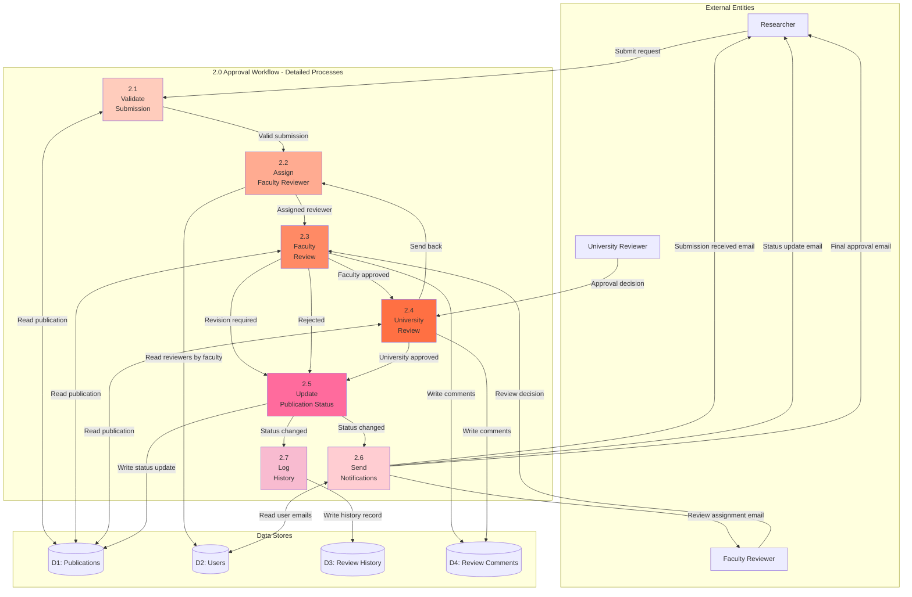
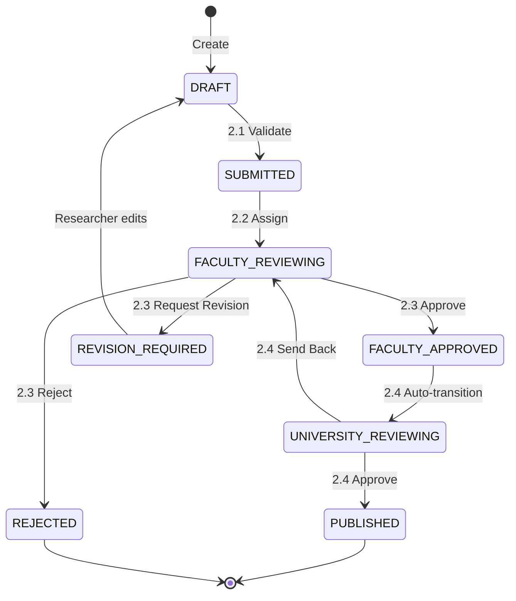

# DFD Level 2 - Approval Workflow Detail

> 📊 **Level**: 2 (Detailed Process Decomposition)  
> 🎯 **Scope**: Approval Workflow module decomposition  
> 📅 **Created**: 11/02/2026

---

## 📊 Data Flow Diagram Level 2

---

## 📋 Detailed Process Specifications

### 2.1 Validate Submission

**Input**:
- Submit request (from Researcher)
- Publication data (from D1)

**Process**:
1. Check publication status = DRAFT
2. Check ownership (submitter = owner)
3. Validate required fields:
   - Title filled
   - At least 1 author
   - PDF uploaded
4. Check duplicate DOI (if provided)

**Output**:
- Valid submission → to 2.2
- Invalid submission → error message to Researcher

**Data Store Access**:
- READ: D1 (Publications)

---

### 2.2 Assign Faculty Reviewer

**Input**:
- Valid submission (from 2.1)

**Process**:
1. Get researcher's faculty
2. Query active faculty reviewers
3. Select reviewer (round-robin P2, manual P0)
4. Update publication with reviewer assignment

**Output**:
- Assigned reviewer info → to 2.3
- Reviewer notification trigger → to 2.6

**Data Store Access**:
- READ: D2 (Users - get reviewers)
- WRITE: D1 (Publications - assign reviewer)

**Business Rule**:
- Reviewer must be from same faculty
- Reviewer cannot review own publications

---

### 2.3 Faculty Review

**Input**:
- Review decision (from Faculty Reviewer)
- Publication data (from D1)

**Process**:
1. Validate reviewer authorization
2. Process decision:
   - **Approve**: Set status = FACULTY_APPROVED → to 2.4
   - **Request Revision**: Set status = REVISION_REQUIRED → to 2.5
   - **Reject**: Set status = REJECTED → to 2.5
3. Save comments (if provided)

**Output**:
- Approved → to 2.4 (University Review)
- Revision/Rejected → to 2.5 (Update Status)

**Data Store Access**:
- READ: D1 (Publications)
- WRITE: D4 (Review Comments)

---

### 2.4 University Review

**Input**:
- Approval decision (from University Reviewer)
- Publication data (from D1)

**Process**:
1. Validate reviewer authorization (University Reviewer role)
2. Process decision:
   - **Approve**: Set status = PUBLISHED → to 2.5
   - **Send Back**: Set status = FACULTY_REVIEWING → to 2.2

**Output**:
- Approved/Sent Back → to 2.5 (Update Status)

**Data Store Access**:
- READ: D1 (Publications)
- WRITE: D4 (Review Comments)

**Business Rule**:
- Only University Reviewers can publish
- Published publications cannot be edited by researcher

---

### 2.5 Update Publication Status

**Input**:
- Status change (from 2.3 or 2.4)
- New status value
- Old status value

**Process**:
1. Update publications table (set status, timestamps)
2. If PUBLISHED: set published_at = NOW()

**Output**:
- Status updated → trigger to 2.6, 2.7

**Data Store Access**:
- WRITE: D1 (Publications)

**Transaction**: Must be atomic

---

### 2.6 Send Notifications

**Input**:
- Status change event (from 2.5)
- User data (from D2)

**Process**:
1. Determine recipients based on event:
   - SUBMITTED → Faculty reviewers
   - FACULTY_APPROVED → Researcher (owner)
   - REVISION_REQUIRED → Researcher
   - REJECTED → Researcher
   - PUBLISHED → Researcher + co-authors
2. Compose email from template
3. Send via Email Server (external)

**Output**:
- Emails sent to recipients

**Data Store Access**:
- READ: D2 (Users - get emails)

**Async**: Email sending should be asynchronous (queue)

---

### 2.7 Log History

**Input**:
- Status change event (from 2.5)
- Actor (reviewer/researcher)
- Comments (if any)

**Process**:
1. Create history record:
   - from_status
   - to_status
   - actor_id
   - action
   - timestamp

**Output**:
- History record saved

**Data Store Access**:
- WRITE: D3 (Review History)

**Audit**: Immutable records for compliance

---

## 🔄 Workflow State Transitions

---

## 📊 Data Store Details

### D1: Publications
**Accessed by**: 2.1, 2.2, 2.3, 2.4, 2.5  
**Operations**: READ, WRITE (status updates)

### D2: Users
**Accessed by**: 2.2, 2.6  
**Operations**: READ only (get reviewers, get emails)

### D3: Review History
**Accessed by**: 2.7  
**Operations**: WRITE only (append-only audit log)

### D4: Review Comments
**Accessed by**: 2.3, 2.4  
**Operations**: WRITE (insert comments)

---

## ⏱️ Process Timing

| Process | Avg Duration | Type |
|---------|-------------|------|
| 2.1 Validate | < 1 second | Synchronous |
| 2.2 Assign | < 2 seconds | Synchronous |
| 2.3 Faculty Review | 3-7 days | Human decision |
| 2.4 University Review | 3-7 days | Human decision |
| 2.5 Update Status | < 1 second | Synchronous |
| 2.6 Notifications | 2-5 seconds | Asynchronous |
| 2.7 Log History | < 1 second | Synchronous |

**Total SLA**: 6-14 days (DRAFT → PUBLISHED)

---

**Related**: act_approval_workflow.md, seq_faculty_review.md, seq_university_approval.md  
**Created**: 11/02/2026
