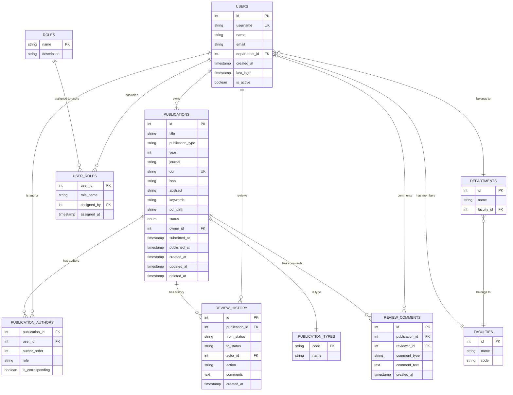

# ERD Đầy Đủ - Lược Đồ Cơ Sở Dữ Liệu UFPMS

> 📊 **Cơ sở dữ liệu**: MySQL 8.0+  
> 🎯 **Chuẩn hóa**: 3NF  
> 📅 **Ngày tạo**: 10/02/2026

---

## 📊 Biểu đồ Quan hệ Thực thể



---

## 📋 Các Thực Thể Cốt Lõi (10 bảng)

### 1. users
**Mục đích**: Tất cả người dùng hệ thống  
**Khóa**: `id` (PK), `username` (UK)  
**Khối lượng**: 300-500 bản ghi

### 2. publications
**Mục đích**: Các ấn phẩm nghiên cứu  
**Khóa**: `id` (PK), `doi` (UK)  
**Khối lượng**: 5K-10K bản ghi  
**Trạng thái**: DRAFT, SUBMITTED, FACULTY_REVIEWING, FACULTY_APPROVED, UNIVERSITY_REVIEWING, PUBLISHED, REVISION_REQUIRED, REJECTED, WITHDRAWN

### 3. publication_authors
**Mục đích**: Bảng liên kết (N:M giữa người dùng và ấn phẩm)  
**Khóa**: Tổng hợp (publication_id, user_id)  
**Khối lượng**: 15K-30K bản ghi (trung bình 3 tác giả/ấn phẩm)

### 4. review_history
**Mục đích**: Dấu vết kiểm toán của quy trình phê duyệt  
**Khóa**: `id` (PK)  
**Khối lượng**: 50K+ bản ghi (nhiều chuyển đổi cho mỗi ấn phẩm)

### 5. review_comments
**Mục đích**: Bình luận từ người đánh giá  
**Khóa**: `id` (PK)  
**Khối lượng**: 20K+ bản ghi

### 6. user_roles
**Mục đích**: Phân công vai trò người dùng  
**Khóa**: Tổng hợp (user_id, role_name)  
**Khối lượng**: 500-1K bản ghi

### 7. departments
**Mục đích**: Các bộ môn  
**Khóa**: `id` (PK)  
**Khối lượng**: 20-50 bản ghi

### 8. faculties
**Mục đích**: Các đơn vị (Khoa/Viện/Phòng/Ban)  
**Khóa**: `id` (PK)  
**Khối lượng**: 5-15 bản ghi

### 9. publication_types
**Mục đích**: Bảng tra cứu loại ấn phẩm  
**Khóa**: `code` (PK)  
**Khối lượng**: 10 bản ghi (tĩnh)

### 10. roles
**Mục đích**: Định nghĩa vai trò hệ thống  
**Khóa**: `name` (PK)  
**Khối lượng**: 4 bản ghi (tĩnh)

---

## 🔗 Mối Quan Hệ Chính

### 1. users → publications (1:N)
- **FK**: `publications.owner_id` → `users.id`
- **Ý nghĩa**: Mỗi ấn phẩm có một chủ sở hữu (nhà nghiên cứu đã tạo nó)

### 2. users ↔ publications (N:M qua publication_authors)
- **Liên kết**: `publication_authors`
- **Ý nghĩa**: Một ấn phẩm có thể có nhiều tác giả, một người dùng có thể là tác giả của nhiều ấn phẩm

### 3. users → review_history (1:N)
- **FK**: `review_history.actor_id` → `users.id`
- **Ý nghĩa**: Mỗi hành động đánh giá được thực hiện bởi một người dùng (người đánh giá)

### 4. departments → faculties (N:1)
- **FK**: `departments.faculty_id` → `faculties.id`
- **Ý nghĩa**: Các bộ môn thuộc về các đơn vị

### 5. users → departments (N:1)
- **FK**: `users.department_id` → `departments.id`
- **Ý nghĩa**: Người dùng thuộc về các bộ môn

---

## 📊 Thống Kê Cơ Sở Dữ Liệu

| Bảng | Số Hàng Ước Tính | Tốc Độ Tăng Trưởng | Lưu Trữ |
|-------|----------------|-------------|---------|
| publications | 5K-10K | +500/năm | ~50MB |
| users | 300-500 | +20/năm | ~1MB |
| publication_authors | 15K-30K | +1.5K/năm | ~5MB |
| review_history | 50K+ | +5K/năm | ~20MB |
| review_comments | 20K+ | +2K/năm | ~100MB (văn bản) |

**Tổng cộng**: ~200MB (năm đầu tiên)

---

## 🔐 Ràng Buộc & Quy Tắc

### Ràng Buộc Duy Nhất
- `users.username`: Duy nhất
- `publications.doi`: Duy nhất (nếu được cung cấp)
- `faculties.code`: Duy nhất

### Ràng Buộc Kiểm Tra (Check Constraints)
- `publications.year`: GIỮA 1900 VÀ NĂM_HIỆN_TẠI
- `publications.status`: Giá trị enum hợp lệ
- `publication_authors.author_order`: > 0

### Khóa Ngoại
- Tất cả các FK đều có `ON DELETE RESTRICT` (ngăn chặn xóa nhầm)
- Ngoại lệ: `publications.deleted_at` (xóa mềm)

---

## 📈 Chỉ Mục (Indexes)

### Chỉ Mục Chính (tự động tạo)
- Tất cả các cột `id`

### Chỉ Mục Duy Nhất
- `users.username`
- `publications.doi`

### Chỉ Mục Hiệu Năng
```sql
-- Tìm Kiếm & Lọc
CREATE INDEX idx_pub_status_year ON publications(status, year);
CREATE INDEX idx_pub_type ON publications(publication_type);
CREATE FULLTEXT INDEX idx_pub_search ON publications(title, abstract, keywords);

-- Truy Vấn
CREATE INDEX idx_pub_owner ON publications(owner_id);
CREATE INDEX idx_authors_user ON publication_authors(user_id);
CREATE INDEX idx_history_pub ON review_history(publication_id);
CREATE INDEX idx_comments_pub ON review_comments(publication_id);

-- Tra cứu Bộ môn/Đơn vị
CREATE INDEX idx_users_dept ON users(department_id);
CREATE INDEX idx_dept_fac ON departments(faculty_id);
```

---

## 🔗 Tài Liệu Liên Quan

- **Đặc Tả Thực Thể**: [entity_specifications.md](./entity_specifications.md)
- **Ca Sử Dụng**: [../../05_Use_Cases/](../../05_Use_Cases/)
- **Yêu Cầu**: [../../03_Requirements/](../../03_Requirements/)

---

**Ngày tạo**: 10/02/2026  
**Phiên bản**: 1.0
