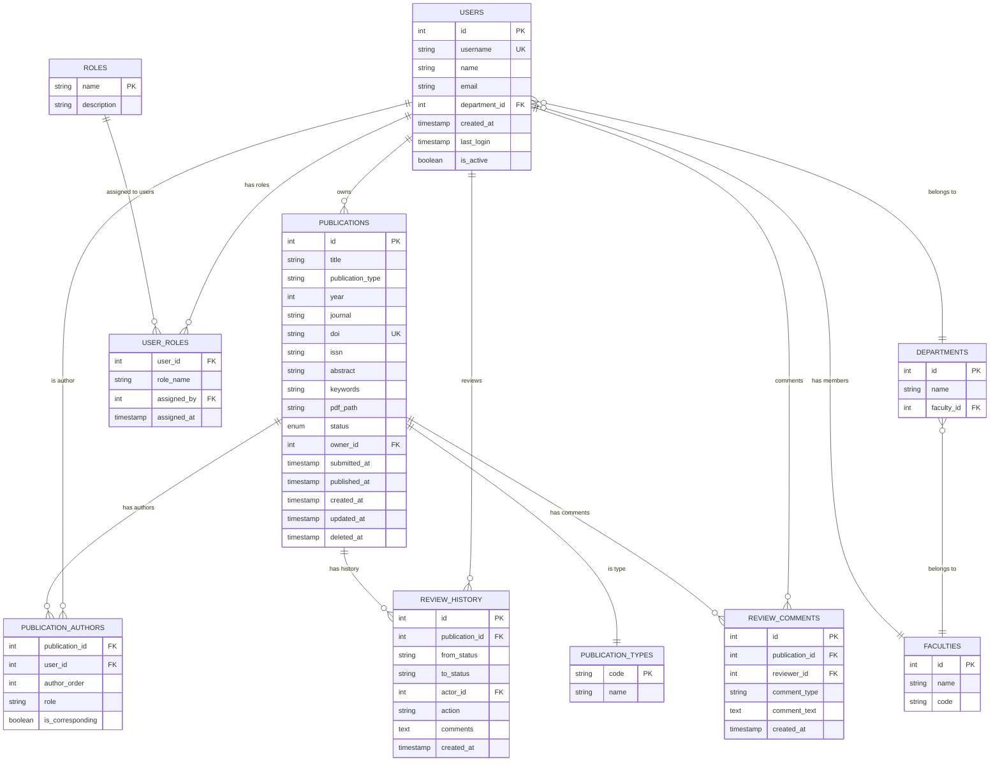

# Complete ERD - UFPMS Database Schema

> 📊 **Database**: MySQL 8.0+  
> 🎯 **Normalization**: 3NF  
> 📅 **Created**: 10/02/2026

---

## 📊 Entity Relationship Diagram



---

## 📋 Core Entities (10 tables)

### 1. users
**Purpose**: All system users  
**Key**: `id` (PK), `username` (UK)  
**Volume**: 300-500 records

### 2. publications
**Purpose**: Research publications  
**Key**: `id` (PK), `doi` (UK)  
**Volume**: 5K-10K records  
**Status**: DRAFT, SUBMITTED, FACULTY_REVIEWING, FACULTY_APPROVED, UNIVERSITY_REVIEWING, PUBLISHED, REVISION_REQUIRED, REJECTED, WITHDRAWN

### 3. publication_authors
**Purpose**: Junction table (N:M between users and publications)  
**Key**: Composite (publication_id, user_id)  
**Volume**: 15K-30K records (avg 3 authors/publication)

### 4. review_history
**Purpose**: Audit trail of approval workflow  
**Key**: `id` (PK)  
**Volume**: 50K+ records (multiple transitions per publication)

### 5. review_comments
**Purpose**: Comments from reviewers  
**Key**: `id` (PK)  
**Volume**: 20K+ records

### 6. user_roles
**Purpose**: User role assignments  
**Key**: Composite (user_id, role_name)  
**Volume**: 500-1K records

### 7. departments
**Purpose**: Academic departments  
**Key**: `id` (PK)  
**Volume**: 20-50 records

### 8. faculties
**Purpose**: Academic faculties  
**Key**: `id` (PK)  
**Volume**: 5-15 records

### 9. publication_types
**Purpose**: Lookup table for publication types  
**Key**: `code` (PK)  
**Volume**: 10 records (static)

### 10. roles
**Purpose**: System roles definition  
**Key**: `name` (PK)  
**Volume**: 4 records (static)

---

## 🔗 Key Relationships

### 1. users → publications (1:N)
- **FK**: `publications.owner_id` → `users.id`
- **Meaning**: Each publication has one owner (researcher who created it)

### 2. users ↔ publications (N:M via publication_authors)
- **Junction**: `publication_authors`
- **Meaning**: A publication can have multiple authors, a user can author multiple publications

### 3. users → review_history (1:N)
- **FK**: `review_history.actor_id` → `users.id`
- **Meaning**: Each review action is performed by a user (reviewer)

### 4. departments → faculties (N:1)
- **FK**: `departments.faculty_id` → `faculties.id`
- **Meaning**: Departments belong to faculties

### 5. users → departments (N:1)
- **FK**: `users.department_id` → `departments.id`
- **Meaning**: Users belong to departments

---

## 📊 Database Statistics

| Table | Estimated Rows | Growth Rate | Storage |
|-------|----------------|-------------|---------|
| publications | 5K-10K | +500/year | ~50MB |
| users | 300-500 | +20/year | ~1MB |
| publication_authors | 15K-30K | +1.5K/year | ~5MB |
| review_history | 50K+ | +5K/year | ~20MB |
| review_comments | 20K+ | +2K/year | ~100MB (text) |

**Total**: ~200MB (first year)

---

## 🔐 Constraints & Rules

### Unique Constraints
- `users.username`: Unique
- `publications.doi`: Unique (if provided)
- `faculties.code`: Unique

### Check Constraints
- `publications.year`: BETWEEN 1900 AND CURRENT_YEAR
- `publications.status`: Valid enum value
- `publication_authors.author_order`: > 0

### Foreign Keys
- All FKs have `ON DELETE RESTRICT` (prevent accidental deletion)
- Exception: `publications.deleted_at` (soft delete)

---

## 📈 Indexes

### Primary Indexes (auto-created)
- All `id` columns

### Unique Indexes
- `users.username`
- `publications.doi`

### Performance Indexes
```sql
-- Search & Filter
CREATE INDEX idx_pub_status_year ON publications(status, year);
CREATE INDEX idx_pub_type ON publications(publication_type);
CREATE FULLTEXT INDEX idx_pub_search ON publications(title, abstract, keywords);

-- Queries
CREATE INDEX idx_pub_owner ON publications(owner_id);
CREATE INDEX idx_authors_user ON publication_authors(user_id);
CREATE INDEX idx_history_pub ON review_history(publication_id);
CREATE INDEX idx_comments_pub ON review_comments(publication_id);

-- Department/Faculty lookups
CREATE INDEX idx_users_dept ON users(department_id);
CREATE INDEX idx_dept_fac ON departments(faculty_id);
```

---

## 🔗 Related Documentation

- **Entity Specifications**: [entity_specifications.md](./entity_specifications.md)
- **Use Cases**: [../../05_Use_Cases/](../../05_Use_Cases/)
- **Requirements**: [../../03_Requirements/](../../03_Requirements/)

---

**Created**: 10/02/2026  
**Version**: 1.0
