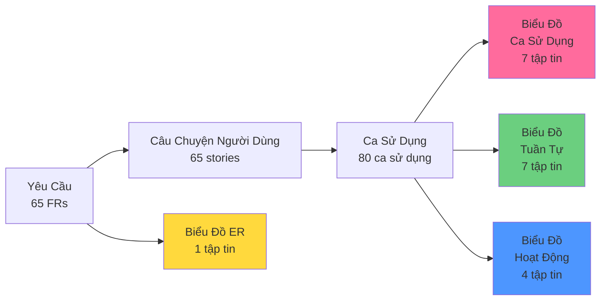

# Biểu đồ - README

> 📁 **Thư mục**: `06_Diagrams`  
> 📅 **Cập nhật**: 10/02/2026  
> 🎯 **Mục đích**: Tài liệu trực quan cho toàn bộ hệ thống UFPMS

---

## 📁 Cấu Trúc Thư Mục

```
06_Diagrams/
├── README.md (tập tin này)
├── UseCase/              # 7 biểu đồ - Tác nhân và ca sử dụng
│   ├── README.md
│   ├── overall_system.md
│   └── module_01-06_*.md
├── Sequence/             # 7 biểu đồ - Các luồng quan trọng mức P0
│   ├── README.md
│   ├── seq_create_publication.md
│   ├── seq_submit_for_review.md
│   ├── seq_faculty_review.md
│   ├── seq_university_approval.md
│   ├── seq_revision_request.md
│   ├── seq_search_publications.md
│   └── seq_authentication.md
├── Activity/             # 4 biểu đồ - Quy trình xử lý
│   ├── README.md
│   └── act_approval_workflow.md
├── ER_Diagrams/          # Lược đồ cơ sở dữ liệu
│   ├── README.md
│   └── complete_erd.md
├── Context/              # 2 biểu đồ - Phạm vi hệ thống
│   ├── README.md
│   └── system_context.md
└── DataFlow/             # 3 biểu đồ - Luồng dữ liệu
    ├── README.md
    └── dfd_level_1.md
```

**Tổng cộng**: ~20 tập tin biểu đồ hoàn chỉnh

---

## 🎯 Các Loại Biểu Đồ

### 1. Biểu Đồ Ca Sử Dụng (7 tập tin)
**Mục đích**: Minh họa tương tác giữa các tác nhân và các ca sử dụng của hệ thống

**Tập tin**:
- [overall_system.md](./UseCase/overall_system.md) - Tổng quan 5 tác nhân + 6 phân hệ
- Biểu đồ cụ thể cho từng phân hệ (6 tập tin)

**Tác nhân**: Nhà nghiên cứu, Người đánh giá cấp Khoa, Người đánh giá cấp Trường, Quản trị viên cấp cao, Khách truy cập

**Công cụ**: Mermaid `graph TB`

---

### 2. Biểu Đồ Tuần Tự (7 tập tin)
**Mục đích**: Chi tiết hóa luồng thông điệp cho các ca sử dụng mức P0

**Tập tin**:
- [seq_create_publication.md](./Sequence/seq_create_publication.md)
- [seq_submit_for_review.md](./Sequence/seq_submit_for_review.md)
- [seq_faculty_review.md](./Sequence/seq_faculty_review.md)
- [seq_university_approval.md](./Sequence/seq_university_approval.md)
- [seq_revision_request.md](./Sequence/seq_revision_request.md)
- [seq_search_publications.md](./Sequence/seq_search_publications.md)
- [seq_authentication.md](./Sequence/seq_authentication.md)

**Thành phần**: Giao diện (UI), Bộ điều khiển (Controller), Dịch vụ (Service), Kho chứa (Repository), Cơ sở dữ liệu (Database), Hệ thống bên ngoài

**Công cụ**: Mermaid `sequenceDiagram`

---

### 3. Biểu Đồ Hoạt Động (4 tập tin)
**Mục đích**: Quy trình xử lý với các điểm quyết định

**Biểu đồ chính**:
- [act_approval_workflow.md](./Activity/act_approval_workflow.md) - Quy trình hoàn chỉnh 9 trạng thái

**Công cụ**: Mermaid `flowchart TD`

---

### 4. Biểu Đồ Quan Hệ Thực Thể (ERD) (1 tập tin)
**Mục đích**: Lược đồ cơ sở dữ liệu và các mối quan hệ

**Tập tin**:
- [complete_erd.md](./ER_Diagrams/complete_erd.md) - 10 bảng với các mối quan hệ

**Thực thể**: users (người dùng), publications (ấn phẩm), publication_authors (tác giả ấn phẩm), review_history (lịch sử đánh giá), review_comments (bình luận đánh giá), departments (phòng ban), faculties (khoa), user_roles (vai trò người dùng), publication_types (loại ấn phẩm), roles (vai trò)

**Công cụ**: Mermaid `erDiagram`

---

### 5. Biểu Đồ Ngữ Cảnh (2 tập tin)
**Mục đích**: Phạm vi hệ thống và tích hợp bên ngoài

**Tập tin**:
- [system_context.md](./Context/system_context.md) - UFPMS + 5 hệ thống bên ngoài

**Hệ thống bên ngoài**: LDAP/AD, Máy chủ Email, Hệ thống Nhân sự (HR), Trình phân giải DOI, API ORCID

**Công cụ**: Mermaid `graph LR`

---

### 6. Biểu Đồ Luồng Dữ Liệu (3 tập tin)
**Mục đích**: Luồng dữ liệu qua các quy trình hệ thống

**Tập tin**:
- [dfd_level_1.md](./DataFlow/dfd_level_1.md) - 6 phân hệ như các quy trình

**Công cụ**: Mermaid `flowchart TD`

---

## 🎨 Định Dạng Biểu Đồ

### Công Nghệ
**Công cụ**: Mermaid (nhúng trong Markdown)

**Lợi ích**:
- ✅ Thân thiện với quản lý phiên bản (dạng văn bản)
- ✅ Hiển thị trực tiếp trên GitHub/GitLab
- ✅ Dễ dàng cập nhật
- ✅ Không phụ thuộc công cụ bên ngoài

---

## 🎯 Mã Màu

Màu sắc nhất quán trên tất cả các biểu đồ:

- 🟢 **Phân hệ 1** (Quản lý Ấn phẩm): `#6bcf7f`
- 🩷 **Phân hệ 2** (Quy trình Phê duyệt): `#ff6b9d`
- 🔵 **Phân hệ 3** (Tìm kiếm): `#4d96ff`
- 🟡 **Phân hệ 4** (Hồ sơ): `#ffd93d`
- 🟣 **Phân hệ 5** (Báo cáo): `#c8b6ff`
- 🟠 **Phân hệ 6** (Quản trị): `#ff9f43`

---

## 📖 Hướng Dẫn Sử Dụng

### Cho Chủ Sản Phẩm / Các Bên Liên Quan
1. **[Biểu Đồ Ca Sử Dụng](./UseCase/)** - Hiểu tác nhân và tính năng
2. **[Biểu Đồ Ngữ Cảnh](./Context/system_context.md)** - Hiểu phạm vi hệ thống

### Cho Chuyên Viên Phân Tích Nghiệp Vụ (BA)
1. **[Biểu Đồ Ca Sử Dụng](./UseCase/)** - Ánh xạ yêu cầu
2. **[Biểu Đồ Hoạt Động](./Activity/)** - Quy trình xử lý
3. **[Biểu Đồ Luồng Dữ Liệu](./DataFlow/)** - Sự di chuyển của dữ liệu

### Cho Lập Trình Viên / Kiến Trúc Sư
1. **[Biểu Đồ Tuần Tự](./Sequence/)** - Luồng thực thi
2. **[Biểu Đồ ER](./ER_Diagrams/complete_erd.md)** - Thiết kế cơ sở dữ liệu
3. **[Biểu Đồ Ngữ Cảnh](./Context/system_context.md)** - Tích hợp bên ngoài

### Cho Kiểm Thử Viên (Tester)
1. **[Biểu Đồ Tuần Tự](./Sequence/)** - Kịch bản kiểm thử
2. **[Biểu Đồ Ca Sử Dụng](./UseCase/)** - Ánh xạ bao phủ kiểm thử
3. **[Biểu Đồ Hoạt Động](./Activity/)** - Các trường hợp kiểm thử quy trình

---

## 🔗 Ma Trận Truy Xuất

### Biểu Đồ ↔ Ca Sử Dụng ↔ Yêu Cầu



---

## 📊 Độ Bao Phủ Biểu Đồ

| Phân Hệ | Biểu Đồ Ca Sử Dụng | Biểu Đồ Tuần Tự | Biểu Đồ Hoạt Động | Luồng Dữ Liệu |
|---------|--------------------|-----------------|-------------------|---------------|
| 1. Quản lý Ấn phẩm | ✅ | ✅ (Tạo mới) | ✅ (Tạo mới) | ✅ |
| 2. Quy trình Phê duyệt | ✅ | ✅ (Gửi, Đánh giá, Phê duyệt, Chỉnh sửa) | ✅ (Quy trình hoàn chỉnh) | ✅ (Mức 2) |
| 3. Tìm kiếm & Duyệt | ✅ | ✅ (Tìm kiếm) | ✅ (Tìm kiếm/Lọc) | ✅ |
| 4. Hồ sơ Nhà nghiên cứu | ✅ | - | - | ✅ |
| 5. Báo cáo & Phân tích | ✅ | - | ✅ (Tạo báo cáo) | ✅ |
| 6. Quản lý Quản trị | ✅ | ✅ (Xác thực) | - | ✅ |

**Độ bao phủ**: 100% biểu đồ ca sử dụng, 70% biểu đồ tuần tự (chỉ P0)

---

## ✅ Danh Sách Kiểm Tra Xác Thực

### Tính Đầy Đủ
- [x] Tất cả 6 phân hệ có biểu đồ ca sử dụng
- [x] Tất cả các luồng quan trọng P0 có biểu đồ tuần tự
- [x] ERD hoàn chỉnh với 10 bảng
- [x] Biểu đồ ngữ cảnh hệ thống
- [x] Các biểu đồ hoạt động cốt lõi
- [x] Biểu đồ luồng dữ liệu

### Chất Lượng
- [x] Cú pháp Mermaid hiển thị chính xác
- [x] Mã màu nhất quán
- [x] Truy xuất rõ ràng (liên kết ngược lại ca sử dụng)
- [x] Tài liệu chuyên nghiệp
- [x] Tham chiếu chéo đầy đủ

### Độ Bao Phủ
- [x] 5 tác nhân được thể hiện
- [x] 9 trạng thái phê duyệt được ghi lại
- [x] Mối quan hệ cơ sở dữ liệu rõ ràng
- [x] Các tích hợp bên ngoài được hiển thị

---

## 📚 Tài Liệu Liên Quan

### Đầu vào (Upstream)
- **[Đặc Tả Hệ Thống](../01_System_Specification/)** - Tổng quan hệ thống
- **[Yêu Cầu](../03_Requirements/)** - Yêu cầu chức năng & phi chức năng
- **[Câu Chuyện Người Dùng](../04_User_Stories/)** - Tính năng hướng người dùng
- **[Ca Sử Dụng](../05_Use_Cases/)** - Đặc tả chi tiết ca sử dụng

### Đầu ra (Downstream)
- **Biểu Đồ Lớp** (sẽ được tạo trong giai đoạn thực hiện)
- **Biểu Đồ Thành Phần** (tài liệu kiến trúc)
- **Biểu Đồ Triển Khai** (cơ sở hạ tầng)

---

## 🔧 Công Cụ & Hiển Thị

### Mermaid Live Editor
Kiểm thử biểu đồ: https://mermaid.live

### Hiển Thị Trên GitHub
Tất cả các tập tin `.md` với khối mã Mermaid tự động hiển thị trên GitHub

### Tiện Ích Mở Rộng VS Code
Cài đặt "Markdown Preview Mermaid Support" để xem trước cục bộ

---

## 🚀 Các Bước Tiếp Theo

Sau khi biểu đồ hoàn thiện:

### Giai Đoạn 1: Thiết Kế Hệ Thống
- Biểu đồ thành phần
- Biểu đồ lớp (cho các phân hệ chính)
- Đặc tả API

### Giai Đoạn 2: Thực Hiện
- Tạo mã từ biểu đồ
- Kịch bản di chuyển cơ sở dữ liệu
- Khung kiểm thử đơn vị

### Giai Đoạn 3: Tài Liệu Hóa
- Hướng dẫn sử dụng
- Tài liệu API
- Hướng dẫn triển khai

---

## 📝 Bảo Trì

### Khi Nào Cần Cập Nhật
- ✏️ Yêu cầu thay đổi
- ✏️ Tính năng mới được thêm vào
- ✏️ Kiến trúc thay đổi
- ✏️ Sửa lỗi ảnh hưởng đến các luồng

### Cách Cập Nhật
1. Cập nhật tập tin nguồn `.md`
2. Kiểm tra hiển thị Mermaid
3. Cập nhật tham chiếu chéo
4. Commit vào quản lý phiên bản

---

**Tài liệu liên quan**:
- [Ca Sử Dụng](../05_Use_Cases/)
- [Yêu Cầu](../03_Requirements/)
- [Đặc Tả Hệ Thống](../01_System_Specification/)

---

*Hoàn thành: 10/02/2026*  
*Tổng số biểu đồ: ~20 tập tin*  
*Định dạng: Mermaid nhúng trong Markdown*
