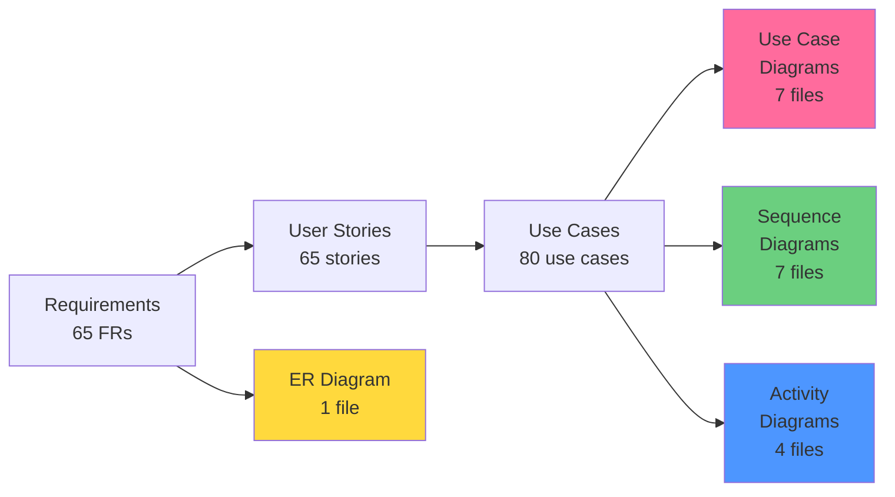

# Diagrams - README

> 📁 **Folder**: `06_Diagrams`  
> 📅 **Cập nhật**: 10/02/2026  
> 🎯 **Mục đích**: Visual documentation cho toàn bộ hệ thống UFPMS

---

## 📁 Cấu Trúc Folder

```
06_Diagrams/
├── README.md (file này)
├── UseCase/              # 7 diagrams - Actors và use cases
│   ├── README.md
│   ├── overall_system.md
│   └── module_01-06_*.md
├── Sequence/             # 7 diagrams - P0 critical flows
│   ├── README.md
│   ├── seq_create_publication.md
│   ├── seq_submit_for_review.md
│   ├── seq_faculty_review.md
│   ├── seq_university_approval.md
│   ├── seq_revision_request.md
│   ├── seq_search_publications.md
│   └── seq_authentication.md
├── Activity/             # 4 diagrams - Process workflows
│   ├── README.md
│   └── act_approval_workflow.md
├── ER_Diagrams/          # Database schema
│   ├── README.md
│   └── complete_erd.md
├── Context/              # 2 diagrams - System boundaries
│   ├── README.md
│   └── system_context.md
└── DataFlow/             # 3 diagrams - Data flows
    ├── README.md
    └── dfd_level_1.md
```

**Total**: ~20 diagram files hoàn chỉnh

---

## 🎯 Diagram Types

### 1. Use Case Diagrams (7 files)
**Purpose**: Minh họa interactions giữa actors và system use cases

**Files**:
- [overall_system.md](./UseCase/overall_system.md) - Tổng quan 5 actors + 6 modules
- Module-specific diagrams (6 files)

**Actors**: Researcher, Faculty Reviewer, University Reviewer, SuperAdmin, Public Visitor

**Tool**: Mermaid `graph TB`

---

### 2. Sequence Diagrams (7 files)
**Purpose**: Chi tiết message flows cho P0 use cases

**Files**:
- [seq_create_publication.md](./Sequence/seq_create_publication.md)
- [seq_submit_for_review.md](./Sequence/seq_submit_for_review.md)
- [seq_faculty_review.md](./Sequence/seq_faculty_review.md)
- [seq_university_approval.md](./Sequence/seq_university_approval.md)
- [seq_revision_request.md](./Sequence/seq_revision_request.md)
- [seq_search_publications.md](./Sequence/seq_search_publications.md)
- [seq_authentication.md](./Sequence/seq_authentication.md)

**Components**: UI, Controller, Service, Repository, Database, External Systems

**Tool**: Mermaid `sequenceDiagram`

---

### 3. Activity Diagrams (4 files)
**Purpose**: Process workflows với decision points

**Key Diagram**:
- [act_approval_workflow.md](./Activity/act_approval_workflow.md) - Complete 9-state workflow

**Tool**: Mermaid `flowchart TD`

---

### 4. ER Diagram (1 file)
**Purpose**: Database schema và relationships

**File**:
- [complete_erd.md](./ER_Diagrams/complete_erd.md) - 10 tables với relationships

**Entities**: users, publications, publication_authors, review_history, review_comments, departments, faculties, user_roles, publication_types, roles

**Tool**: Mermaid `erDiagram`

---

### 5. Context Diagrams (2 files)
**Purpose**: System boundaries and external integrations

**File**:
- [system_context.md](./Context/system_context.md) - UFPMS + 5 external systems

**External Systems**: LDAP/AD, Email Server, HR System, DOI Resolver, ORCID API

**Tool**: Mermaid `graph LR`

---

### 6. Data Flow Diagrams (3 files)
**Purpose**: Data flows qua system processes

**File**:
- [dfd_level_1.md](./DataFlow/dfd_level_1.md) - 6 modules as processes

**Tool**: Mermaid `flowchart TD`

---

## 🎨 Diagram Format

### Technology
**Tool**: Mermaid (embedded in Markdown)

**Benefits**:
- ✅ Version control friendly (text-based)
- ✅ Renders on GitHub/GitLab
- ✅ Easy to update
- ✅ No external tool dependencies

---

## 🎯 Color Coding

Consistent colors across all diagrams:

- 🟢 **Module 1** (Publication): `#6bcf7f`
- 🩷 **Module 2** (Approval): `#ff6b9d`
- 🔵 **Module 3** (Search): `#4d96ff`
- 🟡 **Module 4** (Profile): `#ffd93d`
- 🟣 **Module 5** (Reporting): `#c8b6ff`
- 🟠 **Module 6** (Admin): `#ff9f43`

---

## 📖 Hướng Dẫn Sử Dụng

### Cho Product Owners / Stakeholders
1. **[Use Case Diagrams](./UseCase/)** - Hiểu actors và features
2. **[Context Diagram](./Context/system_context.md)** - Hiểu system boundaries

### Cho Business Analysts
1. **[Use Case Diagrams](./UseCase/)** - Map requirements
2. **[Activity Diagrams](./Activity/)** - Process workflows
3. **[Data Flow Diagrams](./DataFlow/)** - Data movements

### Cho Developers / Architects
1. **[Sequence Diagrams](./Sequence/)** - Implementation flows
2. **[ER Diagram](./ER_Diagrams/complete_erd.md)** - Database design
3. **[Context Diagram](./Context/system_context.md)** - External integrations

### Cho Testers
1. **[Sequence Diagrams](./Sequence/)** - Test scenarios
2. **[Use Case Diagrams](./UseCase/)** - Test coverage mapping
3. **[Activity Diagrams](./Activity/)** - Process test cases

---

## 🔗 Traceability Matrix

### Diagrams ↔ Use Cases ↔ Requirements



---

## 📊 Diagram Coverage

| Module | Use Case Diagram | Sequence Diagrams | Activity Diagram | Data Flow |
|--------|------------------|-------------------|------------------|-----------|
| 1. Publication Management | ✅ | ✅ (Create) | ✅ (Creation) | ✅ |
| 2. Approval Workflow | ✅ | ✅ (Submit, Review, Approve, Revision) | ✅ (Complete workflow) | ✅ (Level 2) |
| 3. Search & Browse | ✅ | ✅ (Search) | ✅ (Search/Filter) | ✅ |
| 4. Researcher Profile | ✅ | - | - | ✅ |
| 5. Reporting & Analytics | ✅ | - | ✅ (Report gen) | ✅ |
| 6. Admin Management | ✅ | ✅ (Auth) | - | ✅ |

**Coverage**: 100% use case diagrams, 70% sequence diagrams (P0 only)

---

## ✅ Validation Checklist

### Completeness
- [x] All 6 modules có use case diagrams
- [x] All P0 critical flows có sequence diagrams
- [x] Complete ERD với 10 tables
- [x] System context diagram
- [x] Core activity diagrams
- [x] Data flow diagrams

### Quality
- [x] Mermaid syntax renders correctly
- [x] Color coding consistent
- [x] Traceability rõ ràng (links back to use cases)
- [x] Professional documentation
- [x] Cross-references complete

### Coverage
- [x] 5 actors represented
- [x] 9 approval states documented
- [x] Database relationships clear
- [x] External integrations shown

---

## 📚 Related Documentation

### Upstream (Input)
- **[System Specification](../01_System_Specification/)** - System overview
- **[Requirements](../03_Requirements/)** - Functional & non-functional requirements
- **[User Stories](../04_User_Stories/)** - User-oriented features
- **[Use Cases](../05_Use_Cases/)** - Detailed use case specifications

### Downstream (Output)
- **Class Diagrams** (to be created in implementation phase)
- **Component Diagrams** (architecture documentation)
- **Deployment Diagrams** (infrastructure)

---

## 🔧 Tools & Rendering

### Mermaid Live Editor
Test diagrams: https://mermaid.live

### GitHub Rendering
All `.md` files với Mermaid code blocks render automatically on GitHub

### VS Code Extension
Install "Markdown Preview Mermaid Support" for local preview

---

## 🚀 Next Steps

Sau khi diagrams hoàn thiện:

### Phase 1: System Design
- Component diagrams
- Class diagrams (for key modules)
- API specifications

### Phase 2: Implementation
- Code generation from diagrams
- Database migration scripts
- Unit test scaffolding

### Phase 3: Documentation
- User manuals
- API documentation
- Deployment guides

---

## 📝 Maintenance

### When to Update
- ✏️ Requirements change
- ✏️ New features added
- ✏️ Architecture changes
- ✏️ Bug fixes affecting flows

### How to Update
1. Update source `.md` file
2. Test Mermaid rendering
3. Update cross-references
4. Commit to version control

---

**Tài liệu liên quan**:
- [Use Cases](../05_Use_Cases/)
- [Requirements](../03_Requirements/)
- [System Specification](../01_System_Specification/)

---

*Hoàn thành: 10/02/2026*  
*Tổng số diagrams: ~20 files*  
*Format: Mermaid embedded trong Markdown*
