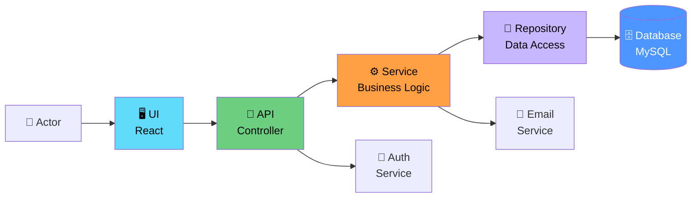
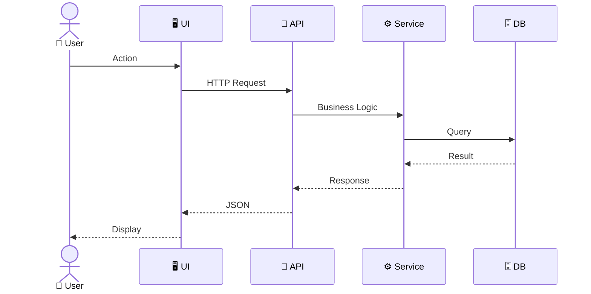

# Sequence Diagrams - README

> 📁 **Folder**: `06_Diagrams/Sequence`  
> 📅 **Cập nhật**: 10/02/2026  
> 🎯 **Mục đích**: Minh họa flows và interactions cho P0 use cases

---

## 📊 Tổng Quan

Sequence Diagrams hiển thị:
- **Actors**: Users và external systems
- **Components**: UI, Controller, Service, Repository, Database
- **Messages**: Method calls và responses
- **Time**: Flow từ trên xuống dưới

---

## 🏗️ System Architecture (Simplified)



---

## 📁 Sequence Diagrams

### P0 Critical Flows

#### [seq_create_publication.md](./seq_create_publication.md)
**Use Case**: UC-D1-01 - Create Publication  
**Actors**: Researcher  
**Components**: UI → Controller → Service → Repository → DB  
**Key Actions**:
- Validate input
- Save publication (status = DRAFT)
- Return publication ID

---

#### [seq_submit_for_review.md](./seq_submit_for_review.md)
**Use Case**: UC-D2-01 - Submit for Review  
**Actors**: Researcher  
**Key Actions**:
- Validate completion (all required fields, PDF uploaded)
- State transition: DRAFT → SUBMITTED → FACULTY_REVIEWING
- Trigger email notification to Faculty Reviewers
- Log to review_history

---

#### [seq_faculty_review.md](./seq_faculty_review.md)
**Use Case**: UC-D2-05 - Faculty Review Process  
**Actors**: Faculty Reviewer  
**Key Actions**:
- View submission details
- Add review comments
- Choose action: Approve / Request Revision / Reject
- State transition based on action
- Send notification to Researcher

---

#### [seq_university_approval.md](./seq_university_approval.md)
**Use Case**: UC-D2-08 - University Final Approval  
**Actors**: University Reviewer  
**Key Actions**:
- Review at university level
- Final approval: UNIVERSITY_REVIEWING → PUBLISHED
- Notification to Researcher + co-authors
- Create audit log

---

#### [seq_revision_request.md](./seq_revision_request.md)
**Use Case**: Alternative flow - Request Revision  
**Actors**: Faculty/University Reviewer  
**Key Actions**:
- Add revision comments
- State transition: REVIEWING → REVISION_REQUIRED
- Notification with comments to Researcher
- Researcher can re-edit (back to DRAFT)

---

#### [seq_search_publications.md](./seq_search_publications.md)
**Use Case**: UC-D3-01 - Search Publications  
**Actors**: Public Visitor  
**Key Actions**:
- Submit search query
- Filter by status = PUBLISHED (visibility rule)
- Return paginated results
- Display metadata

---

#### [seq_authentication.md](./seq_authentication.md)
**Use Case**: System Authentication  
**Actors**: All internal users  
**Key Actions**:
- User login with credentials
- Authenticate via LDAP/AD
- Generate JWT token
- Fetch user roles
- Return token + user info

---

## 🎨 Diagram Conventions

### Participants

```
Actor (stick figure)
UI Component (box)
Backend Service (box)
Database (cylinder in participant list)
External System (box with dashed border)
```

### Message Types

```
→  : Synchronous call
--→ : Asynchronous call
--→ : Return message (dashed)
-x : Failed call
```

### Activation Boxes
- Vertical bars show when component is processing

---

## 📋 Template



---

## 🔗 Traceability

### với Use Cases

| Sequence Diagram | Use Case | Module | Priority |
|------------------|----------|--------|----------|
| seq_create_publication | UC-D1-01 | Publication | P0 |
| seq_submit_for_review | UC-D2-01 | Approval | P0 |
| seq_faculty_review | UC-D2-05 | Approval | P0 |
| seq_university_approval | UC-D2-08, UC-D2-11 | Approval | P0 |
| seq_revision_request | UC-D2-07 | Approval | P0 |
| seq_search_publications | UC-D3-01 | Search | P0 |
| seq_authentication | System | - | P0 |

---

## 💡 How to Read

### For Developers
1. Identify components you're implementing
2. Follow message flow top to bottom
3. Note validation points
4. Check error handling

### For Testers
1. Map flow to test steps
2. Identify validation points → assertions
3. Note alternative flows → test cases
4. Check error scenarios

### For Business Analysts
1. Verify business logic sequence
2. Check notifications are sent
3. Validate state transitions

---

## 📚 Related Documentation

- **Use Cases**: [05_Use_Cases/Detailed_Level/](../../05_Use_Cases/Detailed_Level/)
- **Use Case Diagrams**: [../UseCase/](../UseCase/)
- **Activity Diagrams**: [../Activity/](../Activity/)
- **Requirements**: [03_Requirements/Functional/](../../03_Requirements/Functional/)

---

**Created**: 10/02/2026  
**Version**: 1.0
