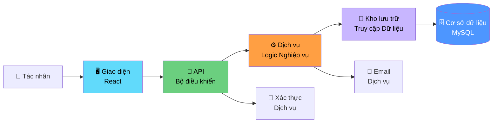
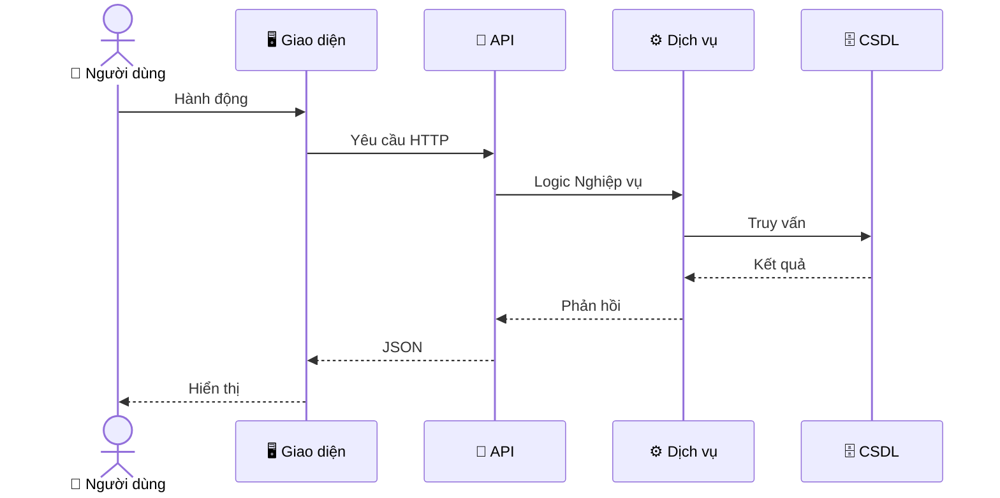

# Biểu đồ Tuần tự - README

> 📁 **Thư mục**: `06_Diagrams/Sequence`  
> 📅 **Cập nhật**: 10/02/2026  
> 🎯 **Mục đích**: Minh họa luồng và tương tác cho các ca sử dụng P0

---

## 📊 Tổng Quan

Biểu đồ Tuần tự hiển thị:
- **Tác nhân**: Người dùng và hệ thống bên ngoài
- **Thành phần**: Giao diện, Bộ điều khiển, Dịch vụ, Kho lưu trữ, Cơ sở dữ liệu
- **Thông điệp**: Các cuộc gọi phương thức và phản hồi
- **Thời gian**: Luồng từ trên xuống dưới

---

## 🏗️ Kiến trúc Hệ thống (Đơn giản hóa)



---

## 📁 Biểu đồ Tuần tự

### Các Luồng Quan Trọng P0

#### [seq_create_publication.md](./seq_create_publication.md)
**Ca Sử Dụng**: UC-D1-01 - Tạo Ấn phẩm  
**Tác nhân**: Nhà nghiên cứu  
**Thành phần**: Giao diện → Bộ điều khiển → Dịch vụ → Kho lưu trữ → CSDL  
**Hành động Chính**:
- Xác thực đầu vào
- Lưu ấn phẩm (trạng thái = DRAFT)
- Trả về ID ấn phẩm

---

#### [seq_submit_for_review.md](./seq_submit_for_review.md)
**Ca Sử Dụng**: UC-D2-01 - Gửi để Đánh giá  
**Tác nhân**: Nhà nghiên cứu  
**Hành động Chính**:
- Xác thực hoàn thành (tất cả các trường bắt buộc, PDF đã tải lên)
- Chuyển đổi trạng thái: DRAFT → SUBMITTED → FACULTY_REVIEWING
- Kích hoạt email thông báo cho Người đánh giá Khoa
- Ghi vào lịch sử đánh giá

---

#### [seq_faculty_review.md](./seq_faculty_review.md)
**Ca Sử Dụng**: UC-D2-05 - Quy trình Đánh giá Khoa  
**Tác nhân**: Người đánh giá Khoa  
**Hành động Chính**:
- Xem chi tiết bài gửi
- Thêm bình luận đánh giá
- Chọn hành động: Phê duyệt / Yêu cầu Chỉnh sửa / Từ chối
- Chuyển đổi trạng thái dựa trên hành động
- Gửi thông báo cho Nhà nghiên cứu

---

#### [seq_university_approval.md](./seq_university_approval.md)
**Ca Sử Dụng**: UC-D2-08 - Phê duyệt Cuối cùng của Trường  
**Tác nhân**: Người đánh giá Trường  
**Hành động Chính**:
- Đánh giá ở cấp trường
- Phê duyệt cuối cùng: UNIVERSITY_REVIEWING → PUBLISHED
- Thông báo cho Nhà nghiên cứu + đồng tác giả
- Tạo nhật ký kiểm toán

---

#### [seq_revision_request.md](./seq_revision_request.md)
**Ca Sử Dụng**: Luồng thay thế - Yêu cầu Chỉnh sửa  
**Tác nhân**: Người đánh giá Khoa/Trường  
**Hành động Chính**:
- Thêm bình luận chỉnh sửa
- Chuyển đổi trạng thái: REVIEWING → REVISION_REQUIRED
- Thông báo với các bình luận cho Nhà nghiên cứu
- Nhà nghiên cứu có thể chỉnh sửa lại (quay lại DRAFT)

---

#### [seq_search_publications.md](./seq_search_publications.md)
**Ca Sử Dụng**: UC-D3-01 - Tìm kiếm Ấn phẩm  
**Tác nhân**: Khách truy cập  
**Hành động Chính**:
- Gửi truy vấn tìm kiếm
- Lọc theo trạng thái = PUBLISHED (quy tắc hiển thị)
- Trả về kết quả phân trang
- Hiển thị siêu dữ liệu

---

#### [seq_authentication.md](./seq_authentication.md)
**Ca Sử Dụng**: Xác thực Hệ thống  
**Tác nhân**: Tất cả người dùng nội bộ  
**Hành động Chính**:
- Người dùng đăng nhập với thông tin đăng nhập
- Xác thực qua LDAP/AD
- Tạo token JWT
- Lấy vai trò người dùng
- Trả về token + thông tin người dùng

---

## 🎨 Quy ước Biểu đồ

### Các Bên Tham Gia

```
Tác nhân (hình người)
Thành phần Giao diện (hộp)
Dịch vụ Backend (hộp)
Cơ sở dữ liệu (hình trụ trong danh sách tham gia)
Hệ thống Bên ngoài (hộp với viền nét đứt)
```

### Các Loại Thông Điệp

```
→  : Gọi đồng bộ
--→ : Gọi bất đồng bộ
--→ : Tin nhắn trả về (nét đứt)
-x : Gọi thất bại
```

### Hộp Kích Hoạt
- Các thanh dọc hiển thị khi thành phần đang xử lý

---

## 📋 Mẫu



---

## 🔗 Truy Xuất

### với Ca Sử Dụng

| Biểu đồ Tuần tự | Ca Sử Dụng | Mô-đun | Ưu tiên |
|------------------|----------|--------|----------|
| seq_create_publication | UC-D1-01 | Ấn phẩm | P0 |
| seq_submit_for_review | UC-D2-01 | Phê duyệt | P0 |
| seq_faculty_review | UC-D2-05 | Phê duyệt | P0 |
| seq_university_approval | UC-D2-08, UC-D2-11 | Phê duyệt | P0 |
| seq_revision_request | UC-D2-07 | Phê duyệt | P0 |
| seq_search_publications | UC-D3-01 | Tìm kiếm | P0 |
| seq_authentication | Hệ thống | - | P0 |

---

## 💡 Cách Đọc

### Cho Nhà Phát Triển
1. Xác định các thành phần bạn đang triển khai
2. Theo dõi luồng thông điệp từ trên xuống dưới
3. Lưu ý các điểm xác thực
4. Kiểm tra xử lý lỗi

### Cho Người Kiểm Thử
1. Ánh xạ luồng tới các bước kiểm thử
2. Xác định các điểm xác thực → khẳng định
3. Lưu ý các luồng thay thế → trường hợp kiểm thử
4. Kiểm tra các kịch bản lỗi

### Cho Chuyên Viên Phân Tích Nghiệp Vụ
1. Xác minh trình tự logic nghiệp vụ
2. Kiểm tra thông báo được gửi
3. Xác thực chuyển đổi trạng thái

---

## 📚 Tài Liệu Liên Quan

- **Ca Sử Dụng**: [05_Use_Cases/Detailed_Level/](../../05_Use_Cases/Detailed_Level/)
- **Biểu đồ Ca Sử Dụng**: [../UseCase/](../UseCase/)
- **Biểu đồ Hoạt động**: [../Activity/](../Activity/)
- **Yêu Cầu**: [03_Requirements/Functional/](../../03_Requirements/Functional/)

---

**Ngày tạo**: 10/02/2026  
**Phiên bản**: 1.0
