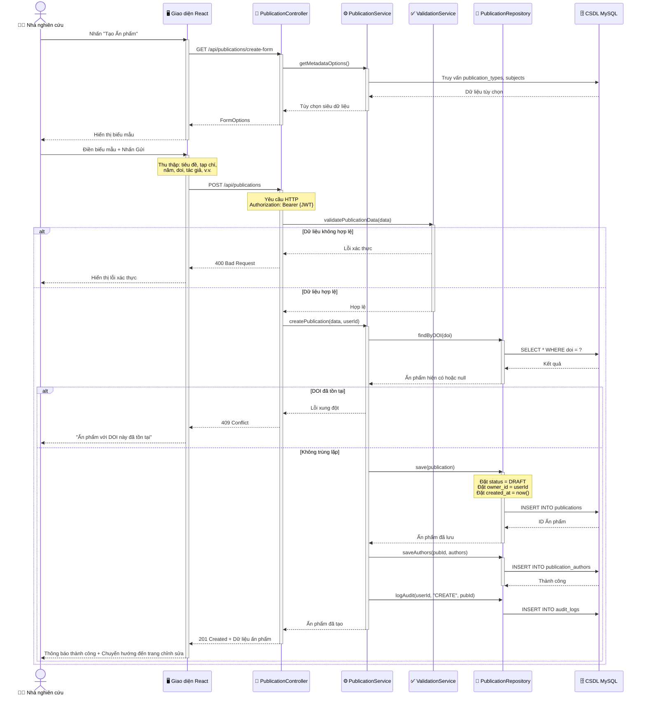

# Biểu đồ Tuần tự: Tạo Ấn phẩm

> 📊 **ID Biểu đồ**: SEQ-01  
> 🎯 **Ca Sử Dụng**: UC-D1-01 - Tạo Ấn phẩm  
> 👤 **Tác nhân**: Nhà nghiên cứu  
> ⚙️ **Thành phần**: Giao diện, Bộ điều khiển, Dịch vụ, Kho lưu trữ, Cơ sở dữ liệu

---

## 🎯 Kịch bản

Nhà nghiên cứu tạo mới một ấn phẩm với siêu dữ liệu cơ bản và trạng thái = DRAFT.

---

## 📊 Biểu đồ Tuần tự



---

## 📋 Các Bước Luồng

### 1. Mở Biểu mẫu Tạo
- Người dùng nhấn "Tạo Ấn phẩm"
- Giao diện yêu cầu các tùy chọn biểu mẫu (loại ấn phẩm, chủ đề)
- Hệ thống trả về các tùy chọn danh sách thả xuống
- Giao diện hiển thị biểu mẫu trống

### 2. Điền và Gửi
- Người dùng điền các trường bắt buộc:
  - Tiêu đề *
  - Loại ấn phẩm *
  - Năm *
  - Tên Tạp chí/Hội nghị
  - DOI (tùy chọn nhưng khuyến nghị)
  - Tác giả * (ít nhất 1)
- Người dùng nhấn Gửi

### 3. Xác thực (Client-side + Server-side)
**Client-side** (Giao diện):
- Kiểm tra các trường bắt buộc
- Xác thực định dạng (DOI, năm)

**Server-side** (ValidationService):
- Các trường bắt buộc
- Định dạng DOI (nếu được cung cấp)
- Phạm vi năm (1900 - hiện tại)
- Danh sách tác giả không được trống

### 4. Kiểm tra Trùng lặp
- Truy vấn cơ sở dữ liệu theo DOI
- Nếu tồn tại → trả về 409 Conflict
- Ngăn chặn các mục nhập trùng lặp

### 5. Lưu Ấn phẩm
**Bản ghi Ấn phẩm**:
```sql
INSERT INTO publications (
    title, publication_type, year, journal, 
    doi, abstract, keywords, status, 
    owner_id, created_at
) VALUES (?, ?, ?, ?, ?, ?, ?, 'DRAFT', ?, NOW())
```

**Tác giả** (bảng liên kết):
```sql
INSERT INTO publication_authors (
    publication_id, user_id, author_order, role
) VALUES (?, ?, ?, ?)
```

**Nhật ký Kiểm toán**:
```sql
INSERT INTO audit_logs (
    user_id, action, entity_type, entity_id, timestamp
) VALUES (?, 'CREATE', 'PUBLICATION', ?, NOW())
```

### 6. Trả về Thành công
- Mã trạng thái: 201 Created
- Phần thân: Đối tượng ấn phẩm đầy đủ với ID
- Giao diện chuyển hướng đến trang chỉnh sửa hoặc hiển thị thông báo thành công

---

## ✅ Xác thực

### Các Trường Bắt Buộc
- `title`: không để trống, tối đa 500 ký tự
- `publication_type`: enum hợp lệ
- `year`: số nguyên, 1900 <= năm <= năm_hiện_tại
- `authors`: mảng, độ dài >= 1

### Tùy Chọn nhưng Được Xác Thực
- `doi`: định dạng `10.xxxx/xxxxx`
- `issn`: định dạng `xxxx-xxxx`
- `volume`, `issue`: số nguyên dương
- `pages`: định dạng `xxx-yyy`

---

## 🚨 Các Kịch Bản Lỗi

### 400 Bad Request
**Nguyên nhân**: Xác thực thất bại  
**Phản hồi**:
```json
{
  "error": "Lỗi Xác thực",
  "details": [
    "Tiêu đề là bắt buộc",
    "Năm phải nằm trong khoảng từ 1900 đến 2026"
  ]
}
```

### 401 Unauthorized
**Nguyên nhân**: Không có token JWT hoặc token không hợp lệ  
**Phản hồi**:
```json
{
  "error": "Không được phép",
  "message": "Vui lòng đăng nhập"
}
```

### 409 Conflict
**Nguyên nhân**: DOI đã tồn tại  
**Phản hồi**:
```json
{
  "error": "Xung đột",
  "message": "Ấn phẩm với DOI 10.1234/example đã tồn tại",
  "existingPublicationId": 123
}
```

### 500 Internal Server Error
**Nguyên nhân**: Kết nối cơ sở dữ liệu thất bại, ngoại lệ không mong muốn  
**Phản hồi**:
```json
{
  "error": "Lỗi Máy chủ Nội bộ",
  "message": "Đã xảy ra lỗi không mong muốn"
}
```

---

## 🗄️ Thay Đổi Cơ Sở Dữ Liệu

### Các Bảng Bị Ảnh Hưởng

1. **publications**
   - 1 INSERT: hàng mới với status = DRAFT

2. **publication_authors**
   - N INSERTs: 1 cho mỗi tác giả

3. **audit_logs**
   - 1 INSERT: ghi lại hành động tạo

---

## 🔗 Biểu đồ Liên Quan

- **Biểu đồ Ca Sử Dụng**: [../UseCase/module_01_publication.md](../UseCase/module_01_publication.md#uc-m1-001-create-publication)
- **Luồng Tiếp Theo**: [seq_submit_for_review.md](./seq_submit_for_review.md) - Gửi ấn phẩm
- **Biểu đồ Hoạt động**: [../Activity/act_publication_creation.md](../Activity/act_publication_creation.md)

---

## 📚 Tài Liệu Liên Quan

- **Ca Sử Dụng**: [05_Use_Cases/Detailed_Level/uc_d1_01_create_publication.md](../../05_Use_Cases/Detailed_Level/uc_d1_01_create_publication.md)
- **Yêu Cầu Chức Năng**: FR-PUB-001, FR-PUB-002
- **Câu Chuyện Người Dùng**: US-RES-001

---

**Ngày tạo**: 10/02/2026  
**Phiên bản**: 1.0
