# Sequence Diagram: Create Publication

> 📊 **Diagram ID**: SEQ-01  
> 🎯 **Use Case**: UC-D1-01 - Create Publication  
> 👤 **Actor**: Researcher  
> ⚙️ **Components**: UI, Controller, Service, Repository, Database

---

## 🎯 Scenario

Researcher tạo mới một publication với metadata cơ bản và status = DRAFT.

---

## 📊 Sequence Diagram

```mermaid
sequenceDiagram
    actor Researcher as 👨‍🔬 Researcher
    participant UI as 🖥️ React UI
    participant API as 🔌 PublicationController
    participant Service as ⚙️ PublicationService
    participant Validator as ✅ ValidationService
    participant Repo as 💾 PublicationRepository
    participant DB as 🗄️ MySQL Database
    
    %% Step 1: Open create form
    Researcher->>UI: Click "Create Publication"
    activate UI
    UI->>API: GET /api/publications/create-form
    activate API
    API->>Service: getMetadataOptions()
    activate Service
    Service->>DB: Query publication_types, subjects
    DB-->>Service: Options data
    Service-->>API: Metadata options
    deactivate Service
    API-->>UI: FormOptions
    deactivate API
    UI-->>Researcher: Display form
    deactivate UI
    
    %% Step 2: Fill and submit
    Researcher->>UI: Fill form + Click Submit
    activate UI
    Note over UI: Collect: title, journal,<br/>year, doi, authors, etc.
    
    UI->>API: POST /api/publications
    activate API
    Note over API: HTTP Request<br/>Authorization: Bearer {JWT}
    
    %% Step 3: Validate
    API->>Validator: validatePublicationData(data)
    activate Validator
    
    alt Invalid data
        Validator-->>API: ValidationError
        API-->>UI: 400 Bad Request
        UI-->>Researcher: Show validation errors
    else Valid data
        Validator-->>API: Valid
        deactivate Validator
        
        %% Step 4: Create publication
        API->>Service: createPublication(data, userId)
        activate Service
        
        %% Check duplicate
        Service->>Repo: findByDOI(doi)
        activate Repo
        Repo->>DB: SELECT * WHERE doi = ?
        DB-->>Repo: Result
        Repo-->>Service: Existing publication or null
        deactivate Repo
        
        alt DOI exists
            Service-->>API: ConflictError
            API-->>UI: 409 Conflict
            UI-->>Researcher: "Publication with this DOI exists"
        else No duplicate
            %% Save publication
            Service->>Repo: save(publication)
            activate Repo
            Note over Repo: Set status = DRAFT<br/>Set owner_id = userId<br/>Set created_at = now()
            
            Repo->>DB: INSERT INTO publications
            DB-->>Repo: Publication ID
            Repo-->>Service: Saved publication
            deactivate Repo
            
            %% Save authors
            Service->>Repo: saveAuthors(pubId, authors)
            activate Repo
            Repo->>DB: INSERT INTO publication_authors
            DB-->>Repo: Success
            deactivate Repo
            
            %% Log action
            Service->>Repo: logAudit(userId, "CREATE", pubId)
            Repo->>DB: INSERT INTO audit_logs
            
            Service-->>API: Created publication
            deactivate Service
            
            API-->>UI: 201 Created + Publication data
            deactivate API
            
            UI-->>Researcher: Success message + Redirect to edit page
            deactivate UI
        end
    end
```



---

## 📋 Flow Steps

### 1. Open Create Form
- User clicks "Create Publication"
- UI requests form options (publication types, subjects)
- System returns dropdown options
- UI displays empty form

### 2. Fill and Submit
- User fills required fields:
  - Title *
  - Publication type *
  - Year *
  - Journal/Conference name
  - DOI (optional but recommended)
  - Authors * (at least 1)
- User clicks Submit

### 3. Validation (Client-side + Server-side)
**Client-side** (UI):
- Required fields check
- Format validation (DOI, year)

**Server-side** (ValidationService):
- Required fields
- DOI format (if provided)
- Year range (1900 - current)
- Authors list not empty

### 4. Duplicate Check
- Query database by DOI
- If exists → return 409 Conflict
- Prevent duplicate entries

### 5. Save Publication
**Publication record**:
```sql
INSERT INTO publications (
    title, publication_type, year, journal, 
    doi, abstract, keywords, status, 
    owner_id, created_at
) VALUES (?, ?, ?, ?, ?, ?, ?, 'DRAFT', ?, NOW())
```

**Authors** (junction table):
```sql
INSERT INTO publication_authors (
    publication_id, user_id, author_order, role
) VALUES (?, ?, ?, ?)
```

**Audit Log**:
```sql
INSERT INTO audit_logs (
    user_id, action, entity_type, entity_id, timestamp
) VALUES (?, 'CREATE', 'PUBLICATION', ?, NOW())
```

### 6. Return Success
- Status code: 201 Created
- Body: Full publication object with ID
- UI redirects to edit page or shows success

---

## ✅ Validations

### Required Fields
- `title`: not empty, max 500 chars
- `publication_type`: valid enum
- `year`: integer, 1900 <= year <= current_year
- `authors`: array, length >= 1

### Optional but Validated
- `doi`: format `10.xxxx/xxxxx`
- `issn`: format `xxxx-xxxx`
- `volume`, `issue`: positive integers
- `pages`: format `xxx-yyy`

---

## 🚨 Error Scenarios

### 400 Bad Request
**Cause**: Validation failed  
**Response**:
```json
{
  "error": "Validation Error",
  "details": [
    "Title is required",
    "Year must be between 1900 and 2026"
  ]
}
```

### 401 Unauthorized
**Cause**: No JWT token or invalid token  
**Response**:
```json
{
  "error": "Unauthorized",
  "message": "Please login"
}
```

### 409 Conflict
**Cause**: DOI already exists  
**Response**:
```json
{
  "error": "Conflict",
  "message": "Publication with DOI 10.1234/example already exists",
  "existingPublicationId": 123
}
```

### 500 Internal Server Error
**Cause**: Database connection failed, unexpected exception  
**Response**:
```json
{
  "error": "Internal Server Error",
  "message": "An unexpected error occurred"
}
```

---

## 🗄️ Database Changes

### Tables Affected

1. **publications**
   - 1 INSERT: new row with status = DRAFT

2. **publication_authors**
   - N INSERTs: 1 per author

3. **audit_logs**
   - 1 INSERT: log creation action

---

## 🔗 Related Diagrams

- **Use Case Diagram**: [../UseCase/module_01_publication.md](../UseCase/module_01_publication.md#uc-m1-001-create-publication)
- **Next Flow**: [seq_submit_for_review.md](./seq_submit_for_review.md) - Submit publication
- **Activity Diagram**: [../Activity/act_publication_creation.md](../Activity/act_publication_creation.md)

---

## 📚 Related Documentation

- **Use Case**: [05_Use_Cases/Detailed_Level/uc_d1_01_create_publication.md](../../05_Use_Cases/Detailed_Level/uc_d1_01_create_publication.md)
- **Functional Requirement**: FR-PUB-001, FR-PUB-002
- **User Story**: US-RES-001

---

**Created**: 10/02/2026  
**Version**: 1.0
